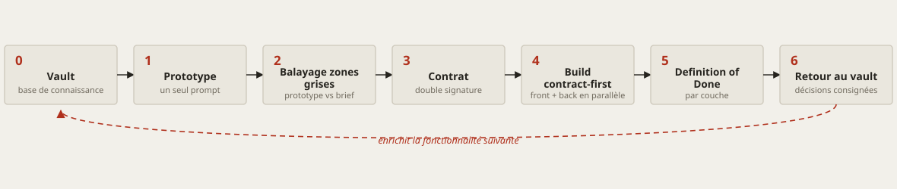

<div align="center">

# Mainstay

**Transformer la puissance brute d'un modèle en logiciel livré — sans tâtonner.**

Une méthode de livraison logicielle pilotée par agents : la mémoire, les
contrats et les garde-fous qui tiennent debout la production d'un agent IA.
Éprouvée sur le terrain avant d'être écrite.

[](LICENSE)
[](CONTRIBUTING.md)
[](docs/fr/README.md)
[](#ce-que-mainstay-est--et-nest-pas)

[English](README.md) · **Français**

</div>

---

## Pourquoi cela existe

Tout le monde observe le modèle. La partie se joue ailleurs.

Un modèle, c'est un cerveau. Un agent, c'est ce cerveau auquel on a donné des
mains — il peut agir, et plus seulement répondre. Mais un cerveau brillant doté
de mains, privé de mémoire et de règles, fait n'importe quoi : vite, et avec
assurance. Ce qui transforme cette puissance en logiciel livré, ce n'est pas le
cerveau. C'est tout ce que l'on bâtit autour — son infrastructure. **Mainstay
est cette infrastructure**, décrite avec assez de détail pour la cloner.

Mainstay n'est pas une théorie mise en pratique ; c'est une pratique mise en
théorie. Le protocole a été exécuté sur un lot réel avant que ce dépôt ne soit
publié, et le canon a continué d'absorber ce que le terrain prouvait. Trois
faits, parmi ceux que le corpus porte :

- Sur **un e-commerce hérité en production**, cinq jours séparent le premier
  commit sous la méthode de la bascule de l'ensemble des boutiques du client en
  production. Ce terrain tient depuis un registre sous la règle « aucune mise
  en production sans entrée, aucune entrée sans mise en production » : 239
  entrées et 193 tags de version en trois mois, avec le go humain consigné
  jusqu'au verbatim — y compris ses deux absences, qui ont fondé la règle.
- La discipline de preuve y a rattrapé de l'argent réel : une TVA absente sur
  des frais de port — 146 commandes, 2 655,70 € en agrégat — corrigée avec une
  sonde mesurant le vrai chemin de code, 44 cas vérifiés, zéro changement du
  prix payé par le client.
- Sur **une fintech**, trois passes de recette produit avaient rendu GO ; les
  relecteurs adversariaux ont refusé le commit deux fois, sur quatre défauts
  qu'aucune recette n'avait vus. La méthode ne compte pas ses findings : elle
  les réfute.

**Statut de ces preuves :** elles viennent d'un corpus privé — des faits datés,
des compteurs obtenus par commande, vérifiés par un audit interne en trois
passes contradictoires — et ne sont pas rejouables par le lecteur. Aucun
chiffre invérifiable même en interne n'est publié. Le détail et les limites
sont dans [la préface](docs/fr/00-preface.md).

> Un **mainstay**, c'est l'étai qui maintient le mât d'un navire droit — et, en
> clair, ce dont un système dépend pour rester debout.

---

## Mainstay en un schéma

<picture>
  <source media="(prefers-color-scheme: dark)" srcset="docs/assets/delivery-chain-fr-dark.svg">
  
</picture>

La connaissance démarre dans le **vault**. Un prototype est généré en **un seul
prompt**. L'écart entre ce que l'agent a décidé et ce que le brief demandait est
balayé en **zones grises**. Le prototype validé devient un **contrat** signé.
Front et back construisent en parallèle, en **contract-first**. « Fait » est
défini par couche. Les décisions qui ont émergé refluent **dans le vault** — et
la fonctionnalité suivante démarre plus intelligente.

---

## L'arène — quatre portes

```text

                                     MMMMMMMMMMMMMMMMMMMMMMMMMMMMMMMMMMM  M
                     MMMMMMMMMMMMMMMM·GO·NO-GO·GO·NO-GO·GO·NO-GO·GO·NO-GMO·M
            MMMMMMMMMGO·NO-GO·GO·NO-GO·GO  ·NO-GO·GO·NO-GO·GO·NO-GO·GO·NOM-·
       MMMMMGO·GO·NO-GO·GO·NO-GO·GO·NO-GO·GO·NO-GO·GO·NO-GO·GO·NO-GO·GO·NO-PM
     MMGO·GO·NO-GO·GO·NO-GO·GO·NO-GMMMMMMMMMMMMMMMMMMMMMMMMMMMMMMMMMMMMMMMMROM
MMMMMO·GO·  NO-GO·MMMMMMMMMMMMMMMMM·MEMORY·CONTRACT·GVARDRAILS·MEMORY·CONTROF·M
GO·NO-GO·MMMMMMMMMACT·GVARDRAILS·MEMORY      ·CONTRACT·GVARDRAILS·MEMORY·COPROMM
GO·NOMMMMNTRACT·GVARDRAILS·MEMORY·CONT        RACT·GVARDRAILS·MEMORY·CONTRAOF·PRM
MMMMMCT·G    VARDRAILS·MEMORY·CONTRAC          T·GVARDRAILS·MEMORY·CONTRACTOOF·PRO
·GVARDRAI     LS·MEMORY·CONTRACT·GVAR          DRAILS·MEMORY·CONTRACT·GVARDOF·PROOM
RAILS·ME      MORY·CONTRACT·GVMMMMMMMMMMMMMMMMMMMMMMMMMMMMMMMMMMMMMMMMMMMMMF·PROOF·PMMMMMMMMMMM
ARDRAILS    MMMMMMMMMMMMMMMMMM·VAVLT·PROTOTYPE·GREY-ZONES·CONTRACT·BVILD·DOROOF·PROOF·PROOF·PROMMMMMMMMMMMMMMMMMM
·MEMOMMMMMMMNE·VAVLT·PROTOTYPE·GREY-ZONES·CONTRACT·BVILD·DONE·VAVLT·PROTOTYOF·PROOF·PROOF·PROOF·PROOF·PROOF·PROOFMMMMMMM
MMMMMPE·GREY-ZONES·CONTRACT·BVILD·DONE·      VAVLT·PROTOTYPE·GREY-ZONES·CON·PRO        OF·PROOF·PROOF·PROOF·PROOF·PROOF·MMMM
TRACT·BVI    LD·DONE·VAVLT·PROTOTYPE·G        REY-ZONES·CONTRACT·BVILD·DONEP              ROOF·PROOF·PROOF·PROOF    ·PROOF·P
·VAVLT·P      ROTOTYPE·GREY-ZONES·CON          TRACT·BVILD·DONE·VAVLT·PROTO                ROOF·PROOF·PROOF·PR        OOF·PR
TYPE·GRE      Y-ZONES·CONTRACT·BVILD·          DONE·VAVLT·PROTOTYPE·GREY-ZO                OOF·PROOF·PROOF·PRO        OF·PRO
NES·CONT      RACT·BMMMMMMMMMMMMMMMMMMMMMMMMMMMMMMMMMMMMMMMMMMMMMMMMMMMMMMMMMMMMMMMMMMMMMMMMMMMMMMMMMMMMMOF·PR        OOF·PR
VILD·MMMMMMMMMMMMMMM·MAINSTAY·MAINSTAY·MAINSTAY·MAINSTAY·MAINSTAY·MAINSTAY·OOF·PROOF·PROOF·PROOF·PROOF·PRMMMMMMMMMMMMMMMOOF·
MMMMMMAINSTAY·MAINSTAY·MAINSTAY·MAINST        AY·MAINSTAY·MAINSTAY·MAINSTAYPROOF·PROOF·PROOF·PROOF·PROOF·PROOF·PROOF·PROMMMM
·MAINSTAY    ·MAINSTAY·MAINSTAY·MAI              NSTAY·MAINSTAY·MAINSTAY·MAOF·PROOF·PROOF·PROOF·PROOF·PROOF·PROOF·PROOF·PROO
INSTAY·        MAINSTAY·MAINSTAY·M                AINSTAY·MAINSTAY·MAINSTAYF·PR        OOF·PROOF·PROOF·PROOF·PRO    OF·PROOF
·MAINST        AY·MAINSTAY·MAINSTA                Y·MAINSTAY·MAINSTAY·MAINS·              PROOF·PROOF·PROOF·PR        OOF·PR
TAY·MAI        NSTAY·MAINSTAY·MAIN                STAY·MAINSTAY·MAINSTAY·MA                OOF·PROOF·PROOF·PRO        OF·PRO
INSTAY·        MAINSTAY·MAINSTAY·M                AINSTAY·MAINSTAY·MAINSTAY                OF·PROOF·PROOF·PROO        F·PROO
MMMMMMMMMMMMMMMMMMMMMMMMMMMMMMMMMMMMMMMMMMMMMMMMMMMMMMMMMMMMMMMMMMMMMMMMMMMMMMMMMMMMMMMMMMMMMMMMMMMMMMMMMMMMMMMMMMMMMMMMMMMM
           S                              R                                       P                              E
```

Le Colisée, dessiné en rien d'autre que des lettres latines — parce que la
maçonnerie **est** la méthode. Les verdicts à l'attique (`GO·NO-GO`), les trois
piliers à l'étage, la chaîne de livraison dans le corps, `MAINSTAY` aux
fondations — et derrière la brèche, l'anneau intérieur est bâti d'un seul mot :
`PROOF`. Les quatre portes sont les quatre [profils](docs/fr/profiles/) :
**S**olo compressé, **R**un & audit, **P**roduit en construction, équip**E** &
flotte. Entrez par la vôtre. (Le U est gravé V, à la romaine. La ruine est
délibérée : un système vivant porte ses brèches consignées, pas une façade
intacte.)

---

## Les trois piliers

Toute infrastructure agentique repose sur trois fondations. Retirez-en une et
l'agent vacille.

| Pilier | Ce que c'est | Ce qui casse sans lui |
|---|---|---|
| **Mémoire** | Une base de connaissances unique et versionnée — conventions, décisions, contraintes — qui vit *dans* le dépôt. | L'agent réinvente la réalité à chaque session, et dérive d'une documentation qui ment. |
| **Contrat** | Une spécification assortie de critères d'acceptation, pas un brief vague à interpréter. | « Presque fait » pour toujours ; validé côté UX, infaisabilité découverte deux semaines plus tard. |
| **Garde-fous** | Ce que l'agent ne doit jamais faire, écrit noir sur blanc, hors de portée de son interprétation. | L'agent comble chaque vide qu'on lui laisse — et rarement comme on l'espérait. |

Le principe qui les relie : le meilleur modèle du monde sur une infrastructure
bancale livre quand même un projet bancal. Une infrastructure solide, servie par
un modèle ordinaire, livre des chantiers entiers en quelques semaines. **Votre
énergie va dans les trois piliers, pas dans le modèle.**

---

## Quatre profils, une méthode

La méthode est la même partout ; seule l'incarnation change. La variable qui
commande le niveau d'outillage n'est ni la taille du code ni la durée du
chantier : c'est **propriété du code × coût de l'erreur**. Quatre questions
suffisent à trouver votre profil — le sélecteur complet est dans
[la préface](docs/fr/00-preface.md).

| Profil | Pour qui | Ce qui change |
|---|---|---|
| [S — Solo compressé](docs/fr/profiles/solo-compressed.md) | Une tête, un livrable, un cycle en jours. | Fonctions conservées, artefacts réincarnés : le vault devient un journal, la DoD une recette cochable avec preuves. |
| [R — Run & audit](docs/fr/profiles/run-and-audit.md) | Code d'autrui, plateforme vivante, coût d'erreur élevé. | La méthode ne se compresse pas : elle se durcit. Backup horodaté avant toute écriture, go explicite au tour courant. |
| [P — Produit en construction](docs/fr/profiles/product-build.md) | Construction écran par écran, seul ou à deux-trois. | La chaîne canonique complète : proto → zones grises → contrat figé → build → retour au vault. |
| [E — Équipe & flotte](docs/fr/profiles/team-fleet.md) | Plusieurs signataires réels, enjeux financiers ou réglementaires. | Rien de retiré au cœur ; gates nommées, attestations, doublement adverse, séquencement de vagues en plus. |

---

## Démarrage rapide

Adoptez Mainstay sur un dépôt neuf en cinq étapes. Le parcours de lecture court
— la colonne vertébrale en une heure — est dans
[**docs/fr/README.md**](docs/fr/README.md).

```bash
# 1. Clone Mainstay for its templates, skills, and hooks
git clone https://github.com/gabrielchinarro-pro/mainstay.git

# 2. In your own project, create the knowledge base beside the code
mkdir -p vault/decisions vault/contracts vault/concepts vault/design-system
cp mainstay/templates/vault-index.md      vault/00-index.md
cp mainstay/templates/context-file.md     AGENTS.md      # the root context file

# 3. Install a guardrail hook (blocks merges when docs and schema drift apart)
cp mainstay/hooks/doc-schema-sync.sh      .githooks/pre-commit
chmod +x .githooks/pre-commit && git config core.hooksPath .githooks

# 4. Add your first skill (a reusable, progressively-disclosed capability)
cp -r mainstay/skills/grey-zone-scan      skills/grey-zone-scan

# 5. Write your first contract from the template, then ship a feature by the chain
cp mainstay/templates/contract.md         vault/contracts/your-first-screen.md
```

Suivez ensuite une vraie fonctionnalité de bout en bout dans
[**examples/walkthrough/**](examples/walkthrough/README.md) — un écran fictif
de « vues enregistrées » (Saved Views), pris de l'entrée du vault à une
definition of done cochée.

---

## Ce que contient ce dépôt

| Chemin | Ce que vous obtenez |
|---|---|
| [`docs/fr/`](docs/fr/README.md) · [`docs/en/`](docs/en/README.md) | Une préface, 13 chapitres de cœur, 4 profils, 6 annexes de référence — français et anglais. |
| [`templates/`](templates/README.md) | Modèles copiables : contexte, contrat, décision, registre des MEP, handoff, prompt de reprise, gates, playbook de push, registre d'écarts. |
| [`examples/walkthrough/`](examples/walkthrough/README.md) | Une fonctionnalité fictive, suivie du vault à la production avec chaque artefact réel. |
| [`examples/monorepo-skeleton/`](examples/monorepo-skeleton/) | Une arborescence annotée pour un monorepo Mainstay. |
| [`skills/`](skills/) | Skills d'exemple fonctionnels avec scripts exécutables. |
| [`hooks/`](hooks/) | Hooks exécutables — dont `doc-schema-sync.sh`, adopté sur le terrain. |
| [`tools/`](tools/) | Outillage déprécié (2026-08), conservé pour référence. |

---

## Documentation

Le parcours court : [la préface](docs/fr/00-preface.md), puis
[les trois piliers](docs/fr/core/01-three-pillars.md),
[la chaîne de livraison](docs/fr/core/04-delivery-chain.md),
[les zones grises](docs/fr/core/05-grey-zones-and-divergence.md), et votre
profil. L'index complet — cœur, profils, référence — est dans
[**docs/fr/README.md**](docs/fr/README.md).

---

## Ce que Mainstay est — et n'est pas

Mainstay est une **méthode**, pas un outil. Elle est agnostique du modèle, du
langage et du domaine. Elle ne livre pas un runtime, un framework ou une
dépendance à importer. Elle livre une façon de travailler, plus les modèles, les
skills, les hooks et les exemples pour la mettre en pratique aujourd'hui.

Elle ne promet pas que les agents se passent de supervision. Elle rend la
supervision structurée : sur tous ses terrains, la règle est le go humain
explicite, consigné, avant toute mise en production — et les violations de
cette règle sont elles-mêmes dans les registres, où elles l'ont fondée.

Reprenez-la, adaptez-la, contredisez-la. Ce sont les conversations qui font
vraiment avancer.

---

## Contribuer

Les issues, corrections, traductions et nouveaux exemples sont les bienvenus.
Commencez par [CONTRIBUTING.md](CONTRIBUTING.md) et le
[Code de conduite](CODE_OF_CONDUCT.md).

## Licence

[MIT](LICENSE) © 2026 Mainstay contributors.

<div align="center">

*Mainstay décrit une méthode, pas un outil. Elle est agnostique du modèle, du
langage et du domaine. Reprenez-la, adaptez-la, contredisez-la.*

[Lire la documentation →](docs/fr/README.md) · [English →](README.md)

Une méthode de [Gabriel Chinarro](https://gabrielchinarro.com).

</div>
