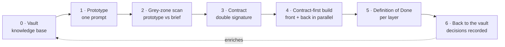

<div align="center">

# Mainstay

**Transformer la puissance brute d'un modèle en logiciel livré — sans tâtonner.**

Une méthode de livraison logicielle pilotée par agents : la mémoire, les
contrats et les garde-fous qui tiennent debout la production d'un agent IA.

[](LICENSE)
[](CONTRIBUTING.md)
[](docs/fr/README.md)
[](#ce-que-mainstay-est--et-nest-pas)

[English](README.md) · **Français**

</div>

---

## Pourquoi cela existe

Tout le monde observe le modèle. La partie se joue ailleurs.

Un modèle, c'est un cerveau. Un agent, c'est ce cerveau auquel on a donné des
mains — il peut agir, et plus seulement répondre. Mais un cerveau brillant doté
de mains, privé de mémoire et de règles, fait n'importe quoi : vite, et avec
assurance.

Ce qui transforme cette puissance en résultat utile, ce n'est pas le cerveau.
C'est tout ce que l'on bâtit autour — son infrastructure. **Mainstay est cette
infrastructure**, décrite avec assez de détail pour la cloner et l'utiliser : le
monorepo qui ancre la connaissance dans le code, les couches qui outillent un
agent, la chaîne qui mène du vide à la production, les protocoles qui tiennent
quand les choses cassent, et les modèles à copier.

La promesse n'est pas la vitesse en bâclant. C'est de livrer en quelques
semaines ce qui en demandait trois mois — en supprimant les allers-retours, les
zones grises et les spécifications à moitié écrites. L'agent avance vite *parce
que rien ne lui laisse le moindre doute.* La contrainte ne le ralentit pas ;
elle le délivre de l'hésitation.

> Un **mainstay**, c'est l'étai qui maintient le mât d'un navire droit — et, en
> clair, ce dont un système dépend pour rester debout.

---

## Mainstay en un schéma



La connaissance démarre dans le **vault**. Un prototype est généré en **un seul
prompt**. L'écart entre ce que l'agent a décidé et ce que le brief demandait est
balayé en **zones grises**. Le prototype validé devient un **contrat** signé.
Front et back construisent en parallèle, en **contract-first**. « Fait » est
défini par couche. Les décisions qui ont émergé refluent **dans le vault** — et
la fonctionnalité suivante démarre plus intelligente.

---

## Les trois piliers

Toute infrastructure agentique repose sur trois fondations. Retirez-en une et
l'agent vacille.

| Pilier | Ce que c'est | Ce qui casse sans lui |
|---|---|---|
| **Mémoire** | Une base de connaissances unique et versionnée — conventions, décisions, contraintes — qui vit *dans* le dépôt. | L'agent réinvente la réalité à chaque session, et dérive d'une documentation qui ment. |
| **Contrat** | Une spécification assortie de critères d'acceptation, pas un brief vague à interpréter. | « Presque fait » pour toujours ; validé côté UX, infaisabilité découverte deux semaines plus tard. |
| **Garde-fous** | Ce que l'agent ne doit jamais faire, écrit noir sur blanc, hors de portée de son interprétation. | L'agent comble chaque vide qu'on lui laisse — et rarement comme on l'espérait. |

Le principe qui les relie : le meilleur modèle du monde sur une infrastructure
bancale livre quand même un projet bancal. Une infrastructure solide, servie par
un modèle ordinaire, livre des chantiers entiers en quelques semaines. **Votre
énergie va dans les trois piliers, pas dans le modèle.**

---

## Démarrage rapide

Adoptez Mainstay sur un dépôt neuf en cinq étapes. Le guide complet — y compris
comment le greffer sur une base de code existante — est dans
[**docs/fr/10-quickstart.md**](docs/fr/10-quickstart.md).

```bash
# 1. Clone Mainstay for its templates, skills, and hooks
git clone https://github.com/gabrielchinarro-pro/mainstay.git

# 2. In your own project, create the knowledge base beside the code
mkdir -p vault/decisions vault/contracts vault/concepts vault/design-system
cp mainstay/templates/vault-index.md      vault/00-index.md
cp mainstay/templates/context-file.md     AGENTS.md      # the root context file

# 3. Install a guardrail hook (blocks merges when docs and schema drift apart)
cp mainstay/hooks/doc-schema-sync.sh      .githooks/pre-commit
chmod +x .githooks/pre-commit && git config core.hooksPath .githooks

# 4. Add your first skill (a reusable, progressively-disclosed capability)
cp -r mainstay/skills/grey-zone-scan      skills/grey-zone-scan

# 5. Write your first contract from the template, then ship a feature by the chain
cp mainstay/templates/contract.md         vault/contracts/your-first-screen.md
```

Suivez ensuite une vraie fonctionnalité de bout en bout dans
[**examples/walkthrough/**](examples/walkthrough/README.md) — un écran fictif
de « vues enregistrées » (Saved Views), pris de l'entrée du vault à une
definition of done cochée.

---

## Ce que contient ce dépôt

| Chemin | Ce que vous obtenez |
|---|---|
| [`docs/en/`](docs/en/README.md) · [`docs/fr/`](docs/fr/README.md) | 18 chapitres autonomes, en anglais et en français. |
| [`templates/`](templates/) | Modèles copiables : fichier de contexte, prompts, contrat, décision, index de vault, registre des zones grises. |
| [`examples/walkthrough/`](examples/walkthrough/README.md) | Une fonctionnalité fictive, suivie du vault à la production avec chaque artefact réel. |
| [`examples/monorepo-skeleton/`](examples/monorepo-skeleton/) | Une arborescence annotée pour un monorepo Mainstay. |
| [`skills/`](skills/) | Skills d'exemple fonctionnels avec scripts exécutables. |
| [`hooks/`](hooks/) | Hooks exécutables, dont le garde-fou de synchro doc/schéma. |
| [`tools/`](tools/) | Un serveur MCP minimal et un générateur OpenAPI vers mocks et types. |

---

## Documentation

Lisez dans l'ordre, ou allez directement à ce dont vous avez besoin. Chaque
chapitre est autonome.

**Fondations**
- [00 · Introduction](docs/fr/00-introduction.md) — pourquoi Mainstay existe, et comment lire cette documentation
- [01 · Les trois piliers](docs/fr/01-three-pillars.md) — mémoire, contrat, garde-fous
- [02 · Le monorepo](docs/fr/02-monorepo.md) — la connaissance vit à côté du code
- [03 · L'architecture agentique](docs/fr/03-agent-architecture.md) — les six couches autour d'un modèle
- [04 · Les sources de vérité](docs/fr/04-sources-of-truth.md) — qui gagne quand les sources divergent

**La méthode en mouvement**
- [05 · La chaîne de livraison](docs/fr/05-the-delivery-chain.md) — du vide à la production
- [06 · Le prompt comme contrat](docs/fr/06-prompt-as-contract.md) — chaque section ferme une porte
- [07 · Les zones grises](docs/fr/07-grey-zones.md) — le cœur de la méthode
- [08 · Protocoles de défaillance](docs/fr/08-failure-protocols.md) — quand quelque chose casse
- [09 · Patterns et anti-patterns](docs/fr/09-patterns-and-antipatterns.md) — le catalogue

**Pour aller plus loin**
- [10 · Démarrage rapide](docs/fr/10-quickstart.md) — dépôts greenfield et existants
- [11 · Orchestration multi-agents](docs/fr/11-multi-agent-orchestration.md) — chef d'orchestre, bras droit, exécutant
- [12 · Observabilité et métriques](docs/fr/12-observability-and-metrics.md) — mesurer la santé de la méthode
- [13 · Tester et évaluer les agents](docs/fr/13-testing-and-evaluating-agents.md) — prouver qu'un agent honore le contrat
- [14 · CI/CD et hooks](docs/fr/14-cicd-and-hooks.md) — la boucle d'auto-correction
- [15 · Adoption par l'équipe](docs/fr/15-team-adoption.md) — rôles, rituels, montée en charge
- [16 · FAQ](docs/fr/16-faq.md) — des réponses tranchantes aux questions courantes
- [17 · Glossaire](docs/fr/17-glossary.md) — chaque terme, défini

---

## Ce que Mainstay est — et n'est pas

Mainstay est une **méthode**, pas un outil. Elle est agnostique du modèle, du
langage et du domaine. Elle ne livre pas un runtime, un framework ou une
dépendance à importer. Elle livre une façon de travailler, plus les modèles, les
skills, les hooks et les exemples pour la mettre en pratique aujourd'hui.

Reprenez-la, adaptez-la, contredisez-la. Ce sont les conversations qui font
vraiment avancer.

---

## Contribuer

Les issues, corrections, traductions et nouveaux exemples sont les bienvenus.
Commencez par [CONTRIBUTING.md](CONTRIBUTING.md) et le
[Code de conduite](CODE_OF_CONDUCT.md).

## Licence

[MIT](LICENSE) © 2026 Mainstay contributors.

<div align="center">

*Mainstay décrit une méthode, pas un outil. Elle est agnostique du modèle, du
langage et du domaine. Reprenez-la, adaptez-la, contredisez-la.*

[Lire la documentation →](docs/fr/README.md) · [English →](README.md)

Une méthode de [Gabriel Chinarro](https://gabrielchinarro.com).

</div>
