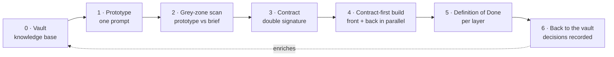

<div align="center">

# Mainstay

**Turn raw model power into shipped software — without the guesswork.**

A method for agent-driven software delivery: the memory, contracts, and
guardrails that keep an AI agent's output upright.

[](LICENSE)
[](CONTRIBUTING.md)
[](docs/en/README.md)
[](#what-mainstay-is-and-is-not)

**English** · [Français](README.fr.md)

</div>

---

## Why this exists

Everyone is watching the model. The game is played somewhere else.

A model is a brain. An agent is that brain given hands — it can act, not just
answer. But a brilliant brain with hands, and no memory or rules, does the wrong
thing: fast, and with confidence.

What turns that power into a useful result is not the brain. It is everything
you build around it — its infrastructure. **Mainstay is that infrastructure**,
described in enough detail to clone and use: the monorepo that anchors knowledge
in code, the layers that equip an agent, the chain that runs from nothing to
production, the protocols that hold when things break, and the templates to copy.

The promise is not speed by cutting corners. It is delivering in a few weeks
what used to take three months — by removing the round-trips, the grey zones,
and the half-written specs. The agent moves fast *because nothing leaves it room
for doubt.* The constraint does not slow it down; it frees it from hesitation.

> A **mainstay** is the line that holds a ship's mast upright — and, in plain
> English, the thing a system depends on to stay standing.

---

## Mainstay in one diagram



Knowledge starts in the **vault**. A prototype is generated in **one prompt**.
The gap between what the agent decided and what the brief asked is swept as
**grey zones**. The validated prototype becomes a signed **contract**. Front and
back build in parallel, **contract-first**. "Done" is defined per layer. The
decisions that emerged flow **back into the vault** — and the next feature
starts smarter.

---

## The three pillars

Every agentic infrastructure stands on three foundations. Remove one and the
agent wobbles.

| Pillar | What it is | What breaks without it |
|---|---|---|
| **Memory** | A single, versioned knowledge base — conventions, decisions, constraints — living *inside* the repo. | The agent reinvents reality every session, and drifts from a documentation that lies. |
| **Contract** | A specification with acceptance criteria, not a vague brief to interpret. | "Almost done" forever; UX-approved, infeasibility discovered two weeks later. |
| **Guardrails** | What the agent must never do, written down, out of reach of its interpretation. | The agent fills every gap you leave — and rarely the way you hoped. |

The principle that ties them together: the best model in the world on a shaky
infrastructure still ships a shaky project. A solid infrastructure, served by an
ordinary model, ships whole features in weeks. **Your energy goes into the three
pillars, not the model.**

---

## Quickstart

Adopt Mainstay on a fresh repository in five steps. The full guide — including
how to retrofit it onto an existing codebase — is in
[**docs/en/10-quickstart.md**](docs/en/10-quickstart.md).

```bash
# 1. Clone Mainstay for its templates, skills, and hooks
git clone https://github.com/gabrielchinarro-pro/mainstay.git

# 2. In your own project, create the knowledge base beside the code
mkdir -p vault/decisions vault/contracts vault/concepts vault/design-system
cp mainstay/templates/vault-index.md      vault/00-index.md
cp mainstay/templates/context-file.md     AGENTS.md      # the root context file

# 3. Install a guardrail hook (blocks merges when docs and schema drift apart)
cp mainstay/hooks/doc-schema-sync.sh      .githooks/pre-commit
chmod +x .githooks/pre-commit && git config core.hooksPath .githooks

# 4. Add your first skill (a reusable, progressively-disclosed capability)
cp -r mainstay/skills/grey-zone-scan      skills/grey-zone-scan

# 5. Write your first contract from the template, then ship a feature by the chain
cp mainstay/templates/contract.md         vault/contracts/your-first-screen.md
```

Then follow a real feature end to end in
[**examples/walkthrough/**](examples/walkthrough/README.md) — a fictional
"Saved Views" screen taken from vault entry to a checked definition of done.

---

## What's in this repo

| Path | What you get |
|---|---|
| [`docs/en/`](docs/en/README.md) · [`docs/fr/`](docs/fr/README.md) | 18 self-contained chapters, English and French. |
| [`templates/`](templates/) | Copyable models: context file, prompts, contract, decision, vault index, grey-zone ledger. |
| [`examples/walkthrough/`](examples/walkthrough/README.md) | One fictional feature, followed from vault to production with every real artifact. |
| [`examples/monorepo-skeleton/`](examples/monorepo-skeleton/) | An annotated directory tree for a Mainstay monorepo. |
| [`skills/`](skills/) | Working example skills with executable scripts. |
| [`hooks/`](hooks/) | Executable hooks, including the doc/schema sync guardrail. |
| [`tools/`](tools/) | A minimal MCP server and an OpenAPI-to-mocks-and-types generator. |

---

## Documentation

Read in order, or jump to what you need. Each chapter is self-contained.

**Foundations**
- [00 · Introduction](docs/en/00-introduction.md) — why Mainstay exists, and how to read these docs
- [01 · The Three Pillars](docs/en/01-three-pillars.md) — memory, contract, guardrails
- [02 · The Monorepo](docs/en/02-monorepo.md) — knowledge lives beside the code
- [03 · The Agentic Architecture](docs/en/03-agent-architecture.md) — the six layers around a model
- [04 · Sources of Truth](docs/en/04-sources-of-truth.md) — who wins when sources disagree

**The method in motion**
- [05 · The Delivery Chain](docs/en/05-the-delivery-chain.md) — from nothing to production
- [06 · The Prompt as a Contract](docs/en/06-prompt-as-contract.md) — every section closes a door
- [07 · Grey Zones](docs/en/07-grey-zones.md) — the heart of the method
- [08 · Failure Protocols](docs/en/08-failure-protocols.md) — when something breaks
- [09 · Patterns & Anti-Patterns](docs/en/09-patterns-and-antipatterns.md) — the catalogue

**Going further**
- [10 · Quickstart](docs/en/10-quickstart.md) — greenfield and existing repos
- [11 · Multi-Agent Orchestration](docs/en/11-multi-agent-orchestration.md) — conductor, lieutenant, runner
- [12 · Observability & Metrics](docs/en/12-observability-and-metrics.md) — measuring method health
- [13 · Testing & Evaluating Agents](docs/en/13-testing-and-evaluating-agents.md) — proving an agent honours the contract
- [14 · CI/CD & Hooks](docs/en/14-cicd-and-hooks.md) — the self-correction loop
- [15 · Team Adoption](docs/en/15-team-adoption.md) — roles, rituals, scaling
- [16 · FAQ](docs/en/16-faq.md) — sharp answers to common questions
- [17 · Glossary](docs/en/17-glossary.md) — every term, defined

---

## What Mainstay is — and is not

Mainstay is a **method**, not a tool. It is agnostic of the model, the language,
and the domain. It does not ship a runtime, a framework, or a dependency to
import. It ships a way of working, plus the templates, skills, hooks, and
examples to put it into practice today.

Take it, adapt it, contradict it. The conversations are what move things forward.

---

## Contributing

Issues, corrections, translations, and new examples are welcome. Start with
[CONTRIBUTING.md](CONTRIBUTING.md) and the
[Code of Conduct](CODE_OF_CONDUCT.md).

## License

[MIT](LICENSE) © 2026 Mainstay contributors.

<div align="center">

*Mainstay describes a method, not a tool. It is agnostic of the model, the
language, and the domain. Take it, adapt it, contradict it.*

[Read the docs →](docs/en/README.md) · [Français →](README.fr.md)

</div>
