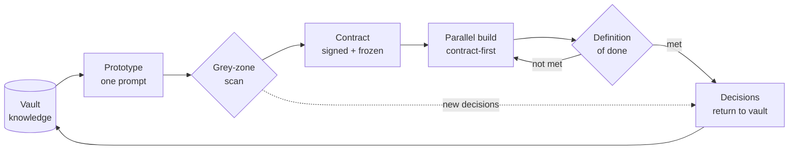

# Introduction — Why Mainstay exists

*The model is not the game. The infrastructure around it is — and that is what Mainstay builds.*

## The model is a brain. An agent has hands.

Everyone is watching the model. The game is being played somewhere else.

A model is a brain. An agent is that brain given hands — the ability to act,
not only to answer. It edits files, runs commands, queries databases, opens
pull requests. That is a categorical change, and it is the reason agent-driven
delivery is now possible at all.

But a brilliant brain with hands, deprived of memory and rules, does the wrong
thing — fast, and with confidence. It invents a label because none was given.
It picks a sort order because the brief was silent. It rebuilds a working
component because it decided the old one could be better. None of these are
bugs. They are the predictable behaviour of a capable system filling a vacuum.

What turns raw model power into shipped software is not the brain. It is
everything you build around it. Its infrastructure.

## What Mainstay is

> A mainstay is the line that holds the mast upright — and, in plain English,
> the thing a system depends on to stay standing. Mainstay is the infrastructure
> that keeps an AI agent's output upright: memory, contracts, guardrails.

Mainstay is a **method**, not a tool. It is agnostic of the model, the
programming language, and the problem domain. It describes, in operational
detail:

- the **monorepo** that anchors knowledge inside the code, versioned with it;
- the **six technical layers** that turn a model into an equipped agent;
- the **delivery chain** that runs from an empty repository to production;
- the **failure protocols** that hold when generation breaks;
- the **patterns and anti-patterns** to copy and to avoid.

This documentation expands each of those into something you can apply on
Monday morning.

## The promise

The promise is not "go fast by cutting corners." It is the opposite.

The promise is to ship in a few weeks what used to take twelve — by removing
the round-trips, the grey zones, and the half-written specifications that
quietly consume most of a project's calendar. The agent moves fast precisely
because nothing leaves it room for doubt. The constraint does not slow it
down; it frees it from hesitation.

A single sentence carries the whole thesis:

> The best model in the world, sitting on shaky infrastructure, will always
> produce a shaky project. Solid infrastructure, even served by an ordinary
> model, ships whole features in weeks.

Your energy does not go into the model. It goes into the three pillars:
memory, contract, guardrails. Everything in this documentation is, in some
way, a consequence of that choice.

## Mainstay in one diagram

The whole method is a loop. Knowledge feeds a prototype; the prototype is
scanned for grey zones; the resolved understanding becomes a signed contract;
front and back build in parallel against that contract; a per-layer definition
of done gates the result; and the decisions that emerged flow back into
knowledge, so the next feature starts richer.

Read [Chapter 05 — The Delivery Chain](./05-the-delivery-chain.md) for each
step in depth. The loop is the heart of Mainstay; the rest of the
documentation explains how to make each arrow reliable.

## Who this is for

Mainstay is written for three audiences. The method is the same for all
three; only the scale changes.

**Solo builders.** You are one person shipping real software with an agent.
Mainstay is what lets you behave like a small disciplined team: the vault is
your memory across sessions, the contract is your own brief made explicit, the
guardrails stop the agent from quietly redesigning yesterday's work. Start
with [Chapter 10 — Quickstart](./10-quickstart.md).

**Teams.** You have several engineers, possibly several agents, working in one
codebase. The hardest problem is no longer writing code — it is keeping
everyone (human and agent) pointed at the same truth. Mainstay gives you a
single source of truth, a contract that both product and engineering sign, and
rituals that scale. See [Chapter 15 — Team Adoption](./15-team-adoption.md).

**Agentic-infrastructure architects.** You design and operate the system that
lets agents deliver: the context files, the skills, the hooks, the MCP
servers, the orchestration tiers. This role does not yet have a settled name.
Mainstay is, in effect, the job description. See
[Chapter 03 — The Agentic Architecture](./03-agent-architecture.md) and
[Chapter 11 — Multi-Agent Orchestration](./11-multi-agent-orchestration.md).

## How to read this documentation

The documentation has eighteen chapters in two groups.

| Group | Chapters | Purpose |
|---|---|---|
| Core | 00–09 | The method itself: principles, architecture, the delivery chain, failure handling. |
| Operations | 10–17 | Putting it into practice: quickstart, orchestration, metrics, testing, CI/CD, adoption, FAQ, glossary. |

Three reading paths:

- **The one-hour spine.** Read [00](./00-introduction.md),
  [01](./01-three-pillars.md), [05](./05-the-delivery-chain.md), and
  [07](./07-grey-zones.md). That is enough to understand and argue for the
  method.
- **The full method.** Read 00–09 in order. Each chapter is autonomous but
  they compound.
- **The adoption path.** Read [10 — Quickstart](./10-quickstart.md) first, copy
  the templates, then circle back to the core chapters when a concept bites.

Every chapter opens with a one-line summary and ends with a `## See also`
list. Cross-links are relative, so they work whether you read on GitHub or in
a cloned repository. Code blocks are real and runnable. Examples are generic
and fictional — the running example throughout the documentation is a
"Saved Views" feature on a generic data-table screen, screen id
`saved-views-panel`. You will meet it in [Chapter 05](./05-the-delivery-chain.md)
and in `examples/walkthrough/`.

## What Mainstay is not

- It is not a framework you install. It is a set of disciplines and file
  conventions. The code in `skills/`, `hooks/`, and `tools/` is illustrative,
  not a dependency.
- It is not model-specific. Where the documentation says "the agent", any
  capable coding agent fits.
- It is not a promise that agents need no supervision. It is a method for
  making supervision cheap, structured, and mostly automated.

## See also

- [Chapter 01 — The Three Pillars](./01-three-pillars.md)
- [Chapter 05 — The Delivery Chain](./05-the-delivery-chain.md)
- [Chapter 10 — Quickstart](./10-quickstart.md)
