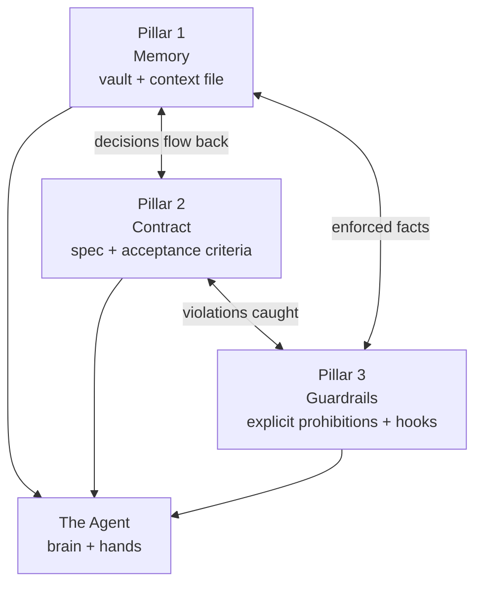

# The Three Pillars

*Memory, contract, guardrails. Remove one and the agent topples.*

Every agentic infrastructure rests on three foundations. They are not
abstractions — each one is a concrete set of files and processes you build and
maintain. Remove any one, and the agent wobbles in a way you can predict and
name.



The agent sits on all three. They also reinforce each other: the contract
draws on memory, the guardrails enforce the contract, and resolved decisions
return to memory. A diagram of one pillar in isolation is misleading — the
strength is in the triangle.

---

## Pillar 1 — Memory

### Definition

A single knowledge base where your conventions, decisions, and constraints
live: stable, versioned, and historized. The agent reinvents nothing. It
leans on a truth that does not change from one session to the next, or from
one agent to another.

Memory has two halves, and the distinction matters:

| Half | Holds | Lives in |
|---|---|---|
| **Declarative memory** | Facts and rules: conventions, architecture, prohibitions | The context file (`AGENTS.md`) |
| **Procedural memory** | Know-how: repeatable, step-by-step capability | Skills (`skills/`) |

Both are covered in depth in [Chapter 03 — The Agentic Architecture](./03-agent-architecture.md).

### What breaks without it

A fictional but typical failure. A team builds a data-table feature on Monday.
The agent, with no memory of house conventions, names the empty state
component `NoData`. On Wednesday a different agent session builds an adjacent
screen and names its empty state `EmptyPlaceholder`. On Friday a third session
builds a filter panel and calls it `BlankView`. Three names for one concept.
No single change is wrong. Six months later a new contributor greps for the
empty-state pattern, finds three, picks the wrong one to copy, and the
divergence compounds.

The cost is not the three names. It is that **the agent had no way to know a
convention existed**, so it invented one each time. Memory is what makes "the
empty state is always `EmptyState`, see the design-system note" a fact the
agent reads instead of a decision it improvises.

### How to build it

1. Create the vault inside the monorepo (see [Chapter 02](./02-monorepo.md)).
   Knowledge versioned with code is knowledge that cannot silently rot.
2. Write a lean, layered context file at the repo root. Lean: only the
   cross-cutting and stable belongs there, because every line is reloaded each
   turn and consumes context budget. Layered: a short root file that points to
   specialized files loaded on demand.
3. Encode repeated know-how as skills, so a procedure is explained once and
   reused forever.
4. Make every vault artifact carry frontmatter so it is traceable and
   queryable (see [Chapter 04 — Sources of Truth](./04-sources-of-truth.md)).

A minimal context-file skeleton:

```markdown
# Project context

## Commands
- build:  `npm run build`
- test:   `npm test`
- lint:   `npm run lint`

## Architecture (cross-cutting rules only)
- One feature = one screen contract in `vault/contracts/`.
- Code is the source of truth for the data schema.

## Conventions
- Components: PascalCase. The empty state is always `EmptyState`.

## Permanent prohibitions
- Never edit generated files in `apps/*/src/__generated__/`.

## Going deeper (loaded on demand)
- Backend detail: ./apps/backend/docs/
- Decisions:      ./vault/decisions/
```

---

## Pillar 2 — Contract

### Definition

Not a vague brief the agent interprets, but a specification paired with
acceptance criteria. The agent knows exactly what is expected; you know exactly
what to verify. A contract closes the gap between "build a Saved Views panel"
and a result you can sign off without surprises.

A contract is more than a wish list. It states behaviour, edge cases, error
states, permissions, endpoints, and test data. It is the artifact that both
product and engineering sign before a single line of feature code is written.

### What breaks without it

A fictional failure. The brief reads: "Users can save a view." The agent
ships a working `saved-views-panel`. It looks correct. Two weeks later
integration begins and the questions arrive all at once:

- What happens when a user saves a view with the same name as an existing
  one? (No one decided.)
- Can a saved view be shared, or is it always private? (No one decided.)
- What is the error state when the save endpoint returns `409`? (The agent
  invented a toast no one approved.)
- Is there a limit on the number of saved views per user? (Discovered when a
  load test created ten thousand.)

Each of these is a **grey zone** — a decision the agent made by default
because the brief was silent (see [Chapter 07](./07-grey-zones.md)). Without a
contract, grey zones are invisible until they detonate together. With a
contract, they are surfaced and resolved *before* the build.

### How to build it

The contract is produced from a validated prototype — see
[Chapter 05, Step 3](./05-the-delivery-chain.md) and
[Chapter 06 — The Prompt as a Contract](./06-prompt-as-contract.md). Its
structure, as a vault artifact:

```yaml
---
type: contract
screen: "saved-views-panel"
version: "1.0"
status: draft          # draft | review | frozen | obsolete
signed_product: false
signed_engineering: false
related_decisions: [DEC-007, DEC-011]
---
```

```markdown
# Contract — saved-views-panel

1.  Context and persona
2.  Visual source of truth (link to validated prototype)
3.  Architecture (fixed zones / conditional zones)
4.  States and transitions
5.  Components (exact copy, validations)
6.  Endpoints (URL, payload, return codes, test data)
7.  Edge cases
8.  Permissions
9.  Business rules
10. Test data
11. Acceptance criteria — [ ] ...
12. Signatures — [ ] Product  [ ] Engineering
```

The two signatures are not ceremony. They kill the trap of "approved on the
UX side, found unbuildable on the performance side two weeks later." Without
both signatures, the contract is not frozen, and nothing downstream may start.

---

## Pillar 3 — Guardrails

### Definition

What the agent must never do, written down explicitly, out of reach of its
interpretation. An agent always fills the vacuum you leave it — and rarely the
way you hoped. A guardrail is a closed door.

Guardrails come in two forms:

| Form | Example | Enforced by |
|---|---|---|
| **Stated prohibition** | "No change other than this one" in a prompt | The agent reading it |
| **Mechanical guardrail** | A pre-commit hook that blocks if tests fail | A hook — no model judgement involved |

The strongest guardrails are mechanical. A stated prohibition depends on the
agent honouring it; a hook simply runs. See
[Chapter 14 — CI/CD & Hooks](./14-cicd-and-hooks.md).

### What breaks without it

A fictional failure. You ask the agent for a surgical change to one button on
`saved-views-panel`: tighten its padding. The agent does that — and also,
unprompted, "improves" the adjacent list by switching it from a flat list to
cards, because it judged cards looked better. The list was correct. It had a
signed contract. Now it does not match the contract, and you did not notice
until QA.

The cost: a regression introduced by an agent doing more than it was asked.
This is the most common cause of grey zones (see
[Chapter 09 — Patterns & Anti-Patterns](./09-patterns-and-antipatterns.md), the
*over-correction* anti-pattern). A single line — "No change other than this
one" — closes that door.

### How to build it

1. End every surgical prompt with an explicit scope prohibition. See the
   worked example in [Chapter 06](./06-prompt-as-contract.md).
2. List permanent prohibitions in the context file, so they apply to every
   session without being restated.
3. Convert any prohibition that *can* be mechanical into a hook. "Never commit
   failing tests" is a sentence; a pre-commit hook makes it a guarantee.
4. Treat a violated guardrail as a signal to tighten the guardrail, not just to
   fix the symptom.

A minimal mechanical guardrail (a pre-commit hook):

```bash
#!/usr/bin/env bash
# Trigger: pre-commit. Blocks the commit if the test suite fails.
set -euo pipefail

if ! npm test --silent; then
  echo "guardrail: tests failing — commit blocked" >&2
  exit 1
fi
```

---

## How the three interlock

The pillars are not independent. They form a cycle, and the cycle is what
makes the infrastructure get smarter over time.

- **Memory feeds the contract.** A contract written against a rich vault
  inherits conventions, prior decisions, and constraints for free. A contract
  written against an empty vault re-litigates everything.
- **The contract feeds the guardrails.** Every acceptance criterion and edge
  case in the contract is a candidate guardrail: a check the agent must pass,
  or a hook that enforces it.
- **The guardrails feed memory.** A grey zone caught by a guardrail becomes a
  formal decision (`DEC-XXX`) in the vault. The next contract starts with that
  decision already settled.

Run the loop once and the gain is small. Run it across a project and the
infrastructure compounds: each feature starts with more memory, sharper
contracts, and tighter guardrails than the last. That compounding is the real
return on building the three pillars — far more than any single feature's
speed.

The single principle that ties them together: **your energy goes into the
pillars, not the model.** A solid triangle served by an ordinary model
out-delivers a brilliant model on a shaky one, every time.

## See also

- [Chapter 00 — Introduction](./00-introduction.md)
- [Chapter 02 — The Monorepo](./02-monorepo.md)
- [Chapter 03 — The Agentic Architecture](./03-agent-architecture.md)
- [Chapter 04 — Sources of Truth](./04-sources-of-truth.md)
