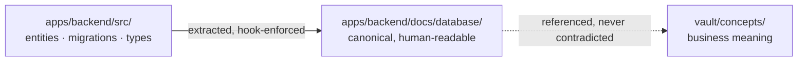
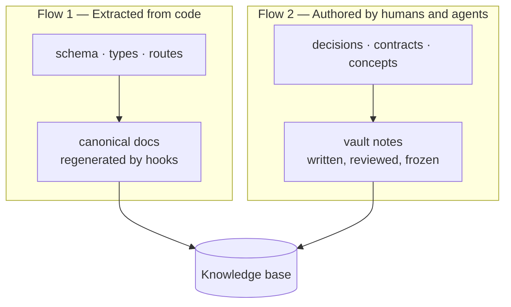

# The Monorepo: Home of Knowledge

*Knowledge lives beside the code, versioned with it. Anything else drifts.*

## The first mistake

The first mistake is to house the knowledge base anywhere other than the code:
a wiki, a notes app, a separate documentation tool. Everything that lives
outside the repository drifts from the code — mechanically and inexorably. The
code changes; the doc stays; six months later the agent leans on a truth that
lies.

This is not a discipline problem you can fix with reminders. It is structural.
A wiki page and a code file have no shared commit, no shared review, no shared
merge. Nothing forces them to move together, so they don't.

Mainstay therefore sets a structural rule:

> **Knowledge lives in the monorepo, beside the code, versioned with it.**

That is what makes the agent's memory reliable instead of stale.

## Knowledge versioned like code

Code and the knowledge base share one repository, one history, one set of
reviews. A schema change and its associated documentation travel in the same
commit, pass through the same pull request, and merge together.

Knowledge stops being a copy that ages. It becomes a part of the codebase you
*cannot forget to update*, because updating it is a condition of merging. The
discipline is no longer "remember to update the docs." It is "the docs are
part of the diff, and the diff does not merge until they are right."

This is also why the doc/schema sync hook exists (see
[Chapter 14 — CI/CD & Hooks](./14-cicd-and-hooks.md)): the same pull request
that touches a migration is blocked until the canonical data-model
documentation is regenerated.

## Code is the source of truth for the schema

The canonical data model does not live in a hand-drawn schema. It lives in the
code: entities, migrations, types. The human-readable representation of the
model is co-located with the backend, in a documentation folder that is
*derived from* the code.

When you want the real shape of a table or a type, you look at the code —
never at a diagram that has been lying for three months. Any other source that
claims to describe the schema ranks behind it.



The arrow that matters: the canonical doc is *extracted from* the code, never
authored independently. If the two disagree, the code wins and the doc is
regenerated. See the divergence golden rule in
[Chapter 04 — Sources of Truth](./04-sources-of-truth.md).

## The vault is the navigable mirror, not a parallel source

On top of the code, the vault adds what the code does not carry by itself:
decisions and their justification, screen contracts, business concepts, and
the links that connect them. The vault **indexes and gives meaning**.

But the vault never contradicts the code. For anything technical, the code
wins. The vault is the layer of *meaning* placed over the layer of *truth* —
not a competing truth.

Concretely, the vault holds what code cannot express:

| Vault folder | Holds | Why it cannot live in code |
|---|---|---|
| `decisions/` | `DEC-XXX` decisions, dated, justified | Code shows *what*, not *why this and not that* |
| `contracts/` | One contract per screen, with status | Behaviour, edge cases, and acceptance criteria are not source code |
| `concepts/` | Business concepts and vocabulary | Domain meaning spans many code files |
| `design-system/` | Tokens, components, copy conventions | Cross-cutting visual rules, referenced everywhere |

## The two knowledge flows

The knowledge base is built from two flows. Telling them apart is essential,
because they are maintained differently.



**Flow 1 — extracted from the code.** The schema, the types, the routes. These
are reflected into the canonical documentation. This flow should be
*automated*: a human writing it by hand is a human introducing drift. A hook
keeps it in sync — if a migration touches the schema, a check blocks the merge
until the canonical documentation is updated, or regenerates it outright.

**Flow 2 — authored by humans and agents.** Decisions, contracts, concepts.
These cannot be extracted because they encode intent, not structure. This flow
is written, reviewed, and frozen like any other deliverable.

The rule that keeps the two honest: **knowledge is never "to be done later."
It is a condition of delivery.** Flow 1 is enforced by hooks; Flow 2 is
enforced by the definition of done (see
[Chapter 05, Step 6](./05-the-delivery-chain.md)).

## The doc/schema sync hook

The sync hook is the mechanism that makes Flow 1 trustworthy. Its logic, in
plain terms:

```bash
#!/usr/bin/env bash
# Trigger: pre-commit. If a migration changed, the canonical data-model
# doc must be regenerated and staged in the same commit — or the commit blocks.
set -euo pipefail

migrations_changed=$(git diff --cached --name-only -- 'apps/backend/src/migrations/')
[ -z "$migrations_changed" ] && exit 0

npm run docs:schema --silent          # regenerate apps/backend/docs/database/
if ! git diff --quiet -- 'apps/backend/docs/database/'; then
  echo "doc/schema drift: regenerated docs are not staged." >&2
  echo "Run 'git add apps/backend/docs/database/' and commit again." >&2
  exit 1
fi
```

The full, runnable version lives in `hooks/`. The point here is the principle:
a schema change and its documentation are *physically inseparable* in the
history. See [Chapter 14](./14-cicd-and-hooks.md) for the complete setup.

## Why this is decisive for agents

Because everything lives in one repository, the agent has a coherent view: it
reads the real code and the knowledge around it in the same space — no
round-trip to an external system, no risk of reading stale documentation.

An exploration subagent walks the monorepo and produces a faithful synthesis,
because the truth and its explanation are in the same place (see
[Chapter 03, §3.5](./03-agent-architecture.md) and
[Chapter 11](./11-multi-agent-orchestration.md)). If knowledge lived in a wiki,
that subagent would need a separate integration, separate credentials, and
would still risk reading a stale page.

The monorepo is, very concretely, **what makes the memory pillar
operational.** Without it, "memory" is an aspiration. With it, memory is a
folder the agent can read.

## The annotated skeleton

A typical Mainstay monorepo. Every directory has a reason; the comments are
the reason. A copyable version lives in `examples/monorepo-skeleton/`.

```text
monorepo/
├── AGENTS.md                       # Root context file, auto-loaded by the
│                                   #   agent each session. Lean and layered:
│                                   #   only cross-cutting, stable rules.
├── apps/
│   ├── backend/
│   │   ├── src/
│   │   │   ├── entities/           # CODE = source of truth for the schema
│   │   │   ├── migrations/         # Schema changes; watched by the sync hook
│   │   │   └── routes/             # API routes; reflected into canonical docs
│   │   └── docs/
│   │       └── database/           # Canonical data-model doc — EXTRACTED from
│   │                               #   src/, regenerated by the sync hook.
│   │                               #   Never hand-edited.
│   └── frontend/
│       └── src/
│           └── __generated__/      # Types/mocks generated from the API spec.
│                                   #   Permanent prohibition: never hand-edit.
├── packages/                       # Shared types and code across apps
├── vault/                          # Knowledge base — the navigable mirror
│   ├── 00-index.md                 # Vault entry point; may double as a
│   │                               #   context-file target
│   ├── decisions/                  # DEC-XXX notes, dated and justified
│   │   ├── DEC-007.md
│   │   └── DEC-011.md
│   ├── contracts/                  # One contract per screen, with a status
│   │   └── saved-views-panel.md
│   ├── concepts/                   # Business concepts and vocabulary
│   └── design-system/              # Tokens, components, copy conventions
├── skills/                         # Procedural memory — capabilities loaded
│                                   #   on demand (progressive disclosure)
├── hooks/                          # Deterministic triggers, including the
│                                   #   doc/schema sync check
├── tools/                          # MCP server, spec-to-mocks generator
└── examples/
    └── walkthrough/                # The end-to-end fictional feature
```

The principle in one sentence: **knowledge lives where the code lives, it is
versioned with it, and the code remains the source of truth for anything
technical.**

## See also

- [Chapter 01 — The Three Pillars](./01-three-pillars.md)
- [Chapter 03 — The Agentic Architecture](./03-agent-architecture.md)
- [Chapter 04 — Sources of Truth](./04-sources-of-truth.md)
- [Chapter 14 — CI/CD & Hooks](./14-cicd-and-hooks.md)
