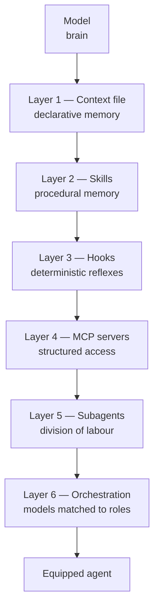
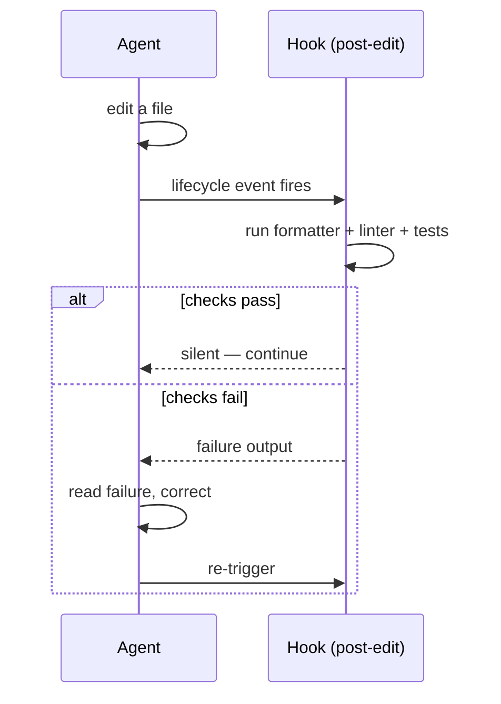
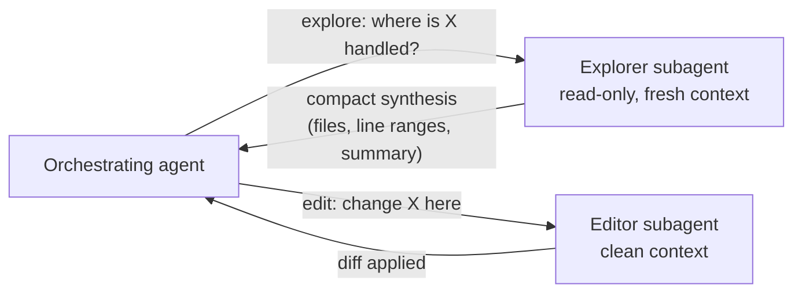
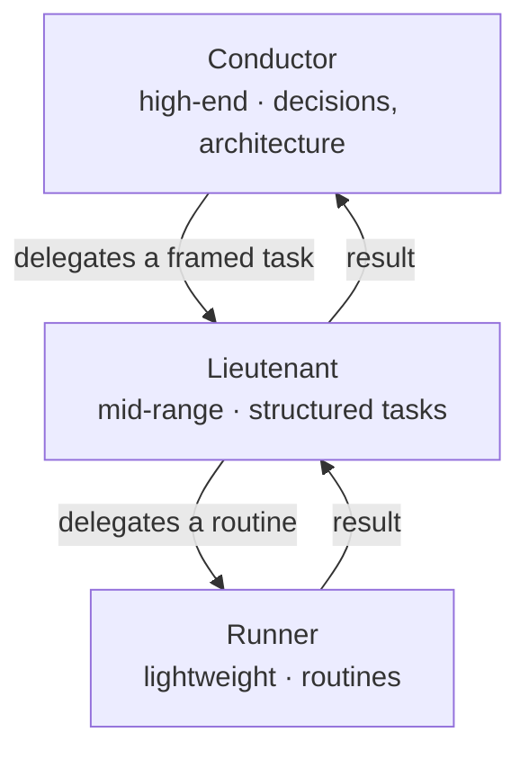

# The Agentic Architecture

*The six layers that turn a model into an equipped agent — each a file, a process, or an extension point.*

The three pillars are not ideas. They are files, processes, and extension
points. A modern agent is not a model you talk to — it is a model wrapped in a
technical harness, and that harness lives in the monorepo described in
[Chapter 02](./02-monorepo.md). It has six layers.



The layers stack: each adds a capability, and each closes a specific failure
mode. The table below is the summary; the sections that follow are the detail.

| Layer | What it is | When it loads | Failure it prevents |
|---|---|---|---|
| 1 Context file | Declarative memory | Start of every session | The agent reinventing conventions |
| 2 Skills | Procedural memory | When a task triggers it | Re-explaining a procedure every time |
| 3 Hooks | Deterministic triggers | On a lifecycle event | Good practice depending on the agent remembering |
| 4 MCP servers | Structured external access | When the agent calls a tool | Stale data pasted into prompts |
| 5 Subagents | Role-scoped instances | When work is delegated | One agent burning its context on everything |
| 6 Orchestration | Models matched to roles | Across the whole workflow | Paying premium cost for routine work |

---

## 3.1 The memory layer: the context file

A context file is loaded automatically at the start of every agent session —
by convention `AGENTS.md`, `CLAUDE.md`, or a vault index — at the root of the
monorepo. It is the first pillar made operational: declarative memory.

Two disciplines decide its effectiveness.

**Keep it lean.** Everything in it is reloaded on every turn and consumes
context budget. Write only the cross-cutting and the stable: conventions,
commands, architecture rules, permanent prohibitions. The detail of a feature
lives in its contract, not here.

**Layer it.** A short root file points to specialized files loaded on demand.
The agent reads a subsystem's detail only when it works on that subsystem.

A minimal, layered context file:

```markdown
# Project context

## Commands
- build:  `npm run build`
- test:   `npm test`

## Architecture (cross-cutting only)
- Code is the source of truth for the data schema.
- One feature = one contract in `vault/contracts/`.

## Permanent prohibitions
- Never hand-edit files under `apps/*/src/__generated__/`.

## Going deeper (loaded on demand)
- Backend detail: ./apps/backend/docs/
- Decisions:      ./vault/decisions/
```

**When it loads:** at session start, every session.
**Failure it prevents:** the agent reinventing a convention because it never
knew one existed (see [Chapter 01, Pillar 1](./01-three-pillars.md)).

---

## 3.2 The capability layer: skills

A skill is a folder that encapsulates a reusable capability: an instruction
file, sometimes scripts and templates. The key principle is **progressive
disclosure** — the agent loads a skill's content only when the task triggers
it. You can therefore keep dozens of capabilities without saturating the
default context.

A skill encodes proven know-how so it never has to be re-explained. It is
*procedural* memory, where the context file is *declarative* memory.

A minimal skill is a `SKILL.md` with frontmatter plus a script:

```markdown
---
name: spec-to-mocks
description: Generate TypeScript types and JSON mock fixtures from an
  OpenAPI YAML spec. Use when a frozen API spec needs front-end mocks.
---

# spec-to-mocks

Run `node tools/spec-to-mocks/generate.mjs --spec <spec.yaml> --out <out-dir>`.
Output, written directly at `<out-dir>`: `types.ts`, `endpoints.ts`,
and one `<SchemaName>.mock.json` per schema.
Never hand-edit the output; regenerate from the spec.
```

**When it loads:** when a task matches the skill's `description`.
**Failure it prevents:** re-explaining a multi-step procedure on every use,
and the drift that comes from explaining it slightly differently each time.

See `skills/` in the repository for runnable examples.

---

## 3.3 The reflex layer: hooks

A hook is a deterministic trigger attached to an event in the agent's
lifecycle:

- after every edit — run the formatter and linter;
- before every commit — run the tests;
- after a migration — verify the canonical documentation is in sync.

A hook asks the model nothing. It runs. That is what turns a good practice
into a *guarantee*, and what creates the **self-correction loop**: the agent
edits, the hook tests, the failure returns to the agent, the agent fixes.



A minimal post-edit hook:

```bash
#!/usr/bin/env bash
# Trigger: post-edit. Format and lint the changed file; surface any error.
set -euo pipefail

file="$1"
npx prettier --write "$file"
npx eslint "$file"            # non-zero exit returns the error to the agent
```

**When it loads:** on the lifecycle event it is bound to.
**Failure it prevents:** a good practice that depends on the agent remembering
to do it — the hook makes it unconditional.

See `hooks/` in the repository, and [Chapter 14](./14-cicd-and-hooks.md).

---

## 3.4 The access layer: MCP servers

An MCP server gives the agent structured access to an external resource: a
database, a business API, an internal tool. Instead of pasting data into the
prompt, the agent queries the source on demand, through a defined tool
contract. That is what wires it to the real world without drowning it in
context.

A minimal MCP server exposes one tool. In TypeScript with the high-level
`McpServer` API from `@modelcontextprotocol/sdk`:

```ts
import { McpServer } from "@modelcontextprotocol/sdk/server/mcp.js";
import { z } from "zod";

const server = new McpServer({ name: "saved-views", version: "1.0.0" });

// One tool: fetch a saved view by id from the real service.
server.registerTool(
  "lookup_saved_view",
  {
    title: "Look up a saved view",
    description: "Return the saved view matching the given id.",
    inputSchema: { id: z.string().describe("The saved-view id.") },
  },
  async ({ id }) => {
    const res = await fetch(`https://api.example.com/v1/saved-views/${id}`, {
      headers: { Authorization: `Bearer ${process.env.API_TOKEN}` },
    });
    return { content: [{ type: "text", text: await res.text() }] };
  },
);
```

The base URL is fake (`https://api.example.com`) and the token is read from an
environment variable, never hard-coded. See `tools/mcp-server/` for the
complete, commented server — it also registers a resource alongside the tool.

**When it loads:** when the agent invokes one of the server's tools.
**Failure it prevents:** stale data — copy-pasted into a prompt at one moment
and wrong the next.

---

## 3.5 The division-of-labour layer: subagents

A subagent is an instance dedicated to a role, with its own context. The most
profitable pattern separates **exploration from editing**:

- an **explorer** subagent walks the repository read-only, understands it, and
  returns a compact synthesis;
- an **editor** subagent — which did *not* burn its context reading everything
  — applies the change with precision.

The point is to preserve the context of the agent that *acts*. Reading is
cheap to delegate; editing needs a clean, focused context.



**When it loads:** when the orchestrating agent delegates a sub-task.
**Failure it prevents:** one agent reading the whole repository, exhausting
its context window, and then editing badly because it has no room left to
reason. See [Chapter 08](./08-failure-protocols.md) on context drift.

Subagent roles and handoffs are covered fully in
[Chapter 11 — Multi-Agent Orchestration](./11-multi-agent-orchestration.md).

---

## 3.6 The orchestration layer: several models, several roles

You do not use the same model for everything. A proven architecture
distributes work across three tiers:

| Tier | Model class | Used for |
|---|---|---|
| **Conductor** | High-end, on demand | Decisions, architecture, ambiguous work |
| **Lieutenant** | Mid-range | Structured tasks where the frame is set |
| **Runner** | Lightweight | Automated routines |

This balance optimizes cost and latency without sacrificing quality where it
matters. The conductor is expensive — so it is reserved for the work that
needs judgement. The runner is cheap — so it handles the high-volume routine.



The job of designing and operating this whole system does not yet have a
settled name: *agentic-infrastructure architect*, or simply the person who is
answerable for the system. See
[Chapter 11](./11-multi-agent-orchestration.md) for the cost model and the
explore-vs-edit split, and [Chapter 15](./15-team-adoption.md) for the human
role.

---

## The six layers together

No single layer makes an agent reliable. The context file without hooks is
memory with no enforcement. Hooks without a contract enforce nothing
meaningful. MCP without subagents floods one context with external data. The
architecture is the *stack* — and the stack maps directly onto the three
pillars:

- Layers 1–2 (context file, skills) build the **memory** pillar.
- Layers 3 (hooks) and the prohibitions in layer 1 build the **guardrails** pillar.
- The **contract** pillar is upstream of all six — it is what the layers serve.

## See also

- [Chapter 01 — The Three Pillars](./01-three-pillars.md)
- [Chapter 02 — The Monorepo](./02-monorepo.md)
- [Chapter 11 — Multi-Agent Orchestration](./11-multi-agent-orchestration.md)
- [Chapter 14 — CI/CD & Hooks](./14-cicd-and-hooks.md)
