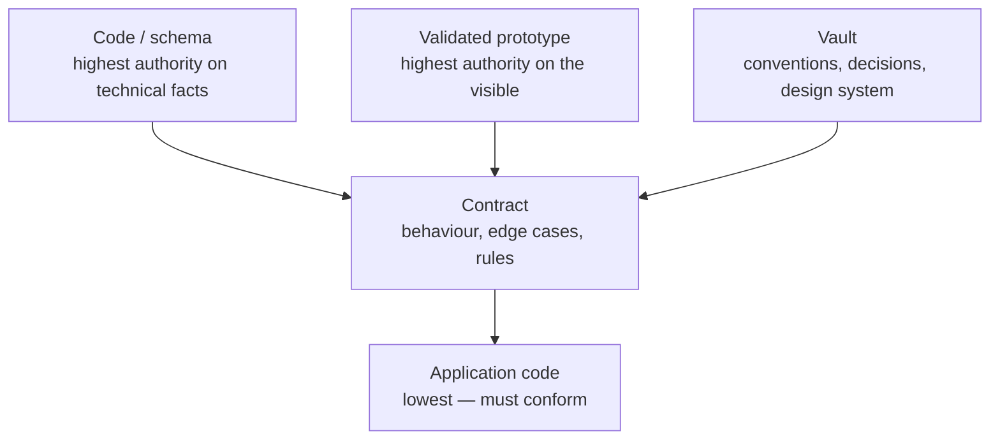
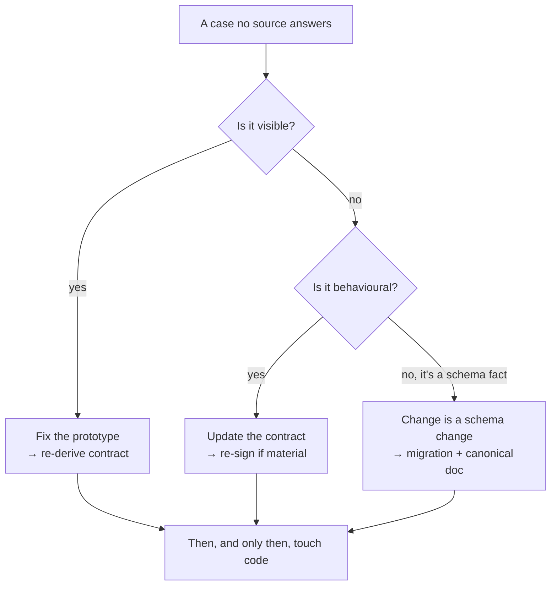

# Sources of Truth

*When in doubt, where do you look? The answer must be single and non-negotiable.*

An agent — and a team — works well only when "where is the truth?" has exactly
one answer. The moment two sources can both claim authority over the same
fact, every decision becomes a negotiation, and the agent, asked to negotiate,
guesses.

Mainstay removes the negotiation. There is an explicit hierarchy of sources, a
single rule for what happens when they disagree, and a reflex for what to do
when none of them has the answer.

## The authority table

Each source has authority over a defined domain, and a defined behaviour when
it meets a higher source.

| Source | Authority over | On divergence |
|---|---|---|
| **The code (monorepo)** | Data schema, types, real technical contracts | Wins on everything technical and executed. Nothing overrules it on schema. |
| **The validated prototype** | Interface, user journey, copy, visible states | Wins on everything visible. The contract describes it; it does not contradict it. |
| **The contract** | Behaviour, edge cases, rules, test data | Wins over application code. Loses against the prototype and the schema. |
| **The vault** | Conventions, decisions, constraints, design system | Wins on cross-cutting rules. Defers to code on technical facts. |

Read the table two ways.

**By domain.** Each row owns a domain. Asking "what is the real shape of the
`saved_views` table?" is a *code* question — you read `apps/backend/src/`, not
a diagram. Asking "what colour is a primary button?" is a *design-system*
question — you read the vault. Asking "what happens on a `409` from the save
endpoint?" is a *contract* question.

**By rank.** The "on divergence" column is a precedence order. The schema (in
code) is the floor — nothing overrules it. The prototype wins for anything
visible. The contract sits between: it governs behaviour and beats application
code, but it cannot redefine what the prototype shows or what the schema is.



Note that "the code" appears in two roles. As the **schema**, it is the
highest authority. As **application code** — the feature logic an agent writes
against a contract — it is the lowest, and must conform to the contract above
it. The distinction is not a contradiction: the schema is a fact; application
code is an attempt to satisfy a contract.

## The divergence golden rule

> If two sources contradict each other, the higher source wins — **and the
> lower source is updated immediately.**

You never let two truths coexist. Not for an afternoon, not "until the
sprint ends." The moment a divergence is observed, the lower source is
corrected to match the higher one, in the same change.

The reason is **consistency debt**.

## Consistency debt

Consistency debt is the cost of two sources that disagree. It is the most
expensive debt of all, for one reason: **it is invisible until the day
everything breaks at once.**

A worked, fictional example. The contract for `saved-views-panel` says a saved
view's name is limited to 60 characters. The agent, building the backend,
reads a stale concept note that says 80, and ships a column `VARCHAR(80)`. The
frontend, built against the contract, validates at 60. For weeks nothing
breaks — no one types a 70-character name. Then a user does. The frontend
rejects it; a different integration that writes directly to the API does not;
the database accepts it; a report that assumes 60 truncates it. One number,
disagreed upon in two places, surfaces as four bugs in four systems on the
same afternoon.

The fix was free at the moment of divergence: update the stale note. It was
expensive once shipped. **Consistency debt does not accrue interest linearly;
it accrues silently and is called in all at once.**

This is why the golden rule says *immediately*. There is no cheap later.

## Historization with frontmatter

Every vault artifact carries a YAML frontmatter header that makes it
traceable and queryable. The keys are English (frontmatter is machine-read;
only prose is translated). Two artifact types matter most.

**A contract:**

```yaml
---
type: contract
screen: "saved-views-panel"
version: "1.2"
status: frozen          # draft | review | frozen | obsolete
signed_product: true
signed_engineering: true
frozen_on: 2026-05-18
related_decisions: [DEC-007, DEC-011]
---
```

**A decision:**

```yaml
---
type: decision
id: DEC-007
date: 2026-05-14
status: accepted        # proposed | accepted | superseded
supersedes: null
---
```

What the frontmatter buys you:

- **Status as a gate.** A contract is authoritative only when `status: frozen`
  and both signatures are `true`. A `draft` contract binds nothing. The status
  field is the difference between a wish and a contract.
- **Traceability.** `related_decisions` links a contract to the decisions that
  shaped it. `supersedes` lets a decision retire an older one without deleting
  history — the old `DEC-XXX` becomes `status: superseded`, never disappears.
- **Queryability.** Because the keys are uniform, a script or an agent can ask
  "show every `obsolete` contract" or "every `proposed` decision older than 30
  days" without parsing prose.

A decision is never edited in place to mean something new. It is superseded by
a new `DEC-XXX` that names the old one in `supersedes`. The vault is an
append-mostly history, not a mutable wiki — that is what makes it a reliable
memory across sessions and across agents.

## The escalation reflex

The reflex to anchor: faced with a case that is in no source, you do not
decide alone and you do not invent. You climb to the higher source, complete
it, and come back down.

> Always in this order: **the prototype first, the contract next, the code
> last.**

Why that order:

1. **Prototype first.** If the gap is something visible — a missing empty
   state, an unspecified hover — it belongs in the prototype, which is the
   authority on the visible. Fix it there and the contract and code inherit a
   correct picture.
2. **Contract next.** If the gap is behavioural — an edge case, a permission,
   an error state — it belongs in the contract. Add it, get it re-signed if
   the change is material.
3. **Code last.** Only once the higher sources are correct do you touch code.
   Code written to satisfy an incomplete contract is code you will rewrite.

A case in no source is, by definition, a **grey zone** — a decision waiting to
be made. The escalation reflex is *how* you resolve one; the two valid
outcomes (a formal decision in the vault, or a documented note on the
contract) are covered in [Chapter 07 — Grey Zones](./07-grey-zones.md).



The anti-pattern this reflex kills is the agent — or a hurried engineer —
patching code to cover a gap, leaving the prototype and contract still
silent. The next time anyone reads the contract, the gap is still there, and
the next agent guesses again. Fix the source, not the symptom.

## See also

- [Chapter 02 — The Monorepo](./02-monorepo.md)
- [Chapter 05 — The Delivery Chain](./05-the-delivery-chain.md)
- [Chapter 07 — Grey Zones](./07-grey-zones.md)
- [Chapter 09 — Patterns & Anti-Patterns](./09-patterns-and-antipatterns.md)
