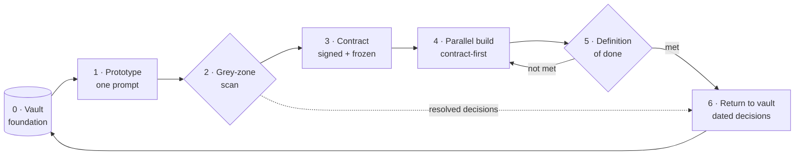
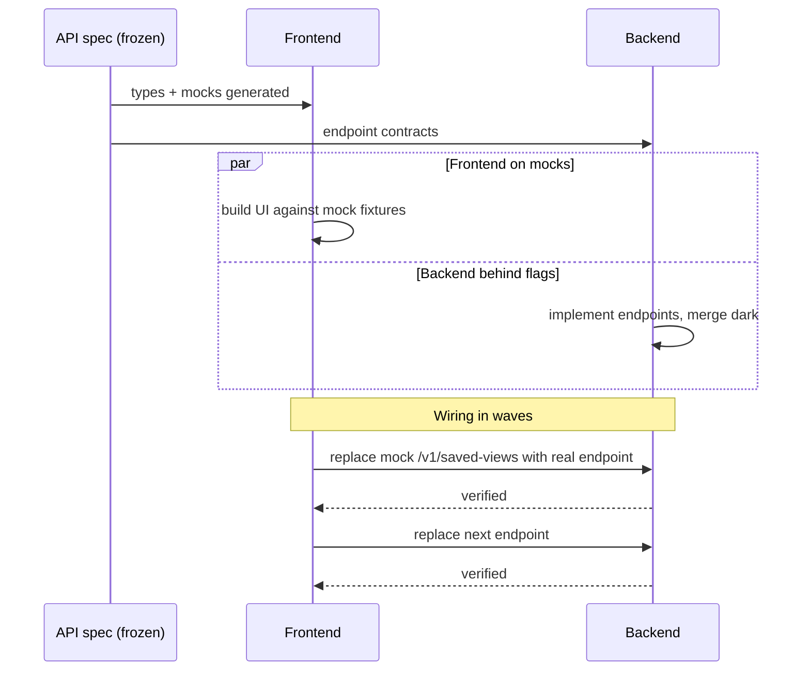

# The Delivery Chain

*From an empty repository to production, in seven steps that loop back to where they started.*

The delivery chain is the heart of Mainstay. It is a loop: knowledge feeds a
prototype, the prototype is scanned, a contract is signed, front and back build
in parallel, a per-layer definition of done gates the result, and the decisions
that emerged flow back into knowledge — so the next feature starts richer.



Each step has inputs, outputs, a discipline that makes it work, and a metric
it produces. The metrics are what let you tell a healthy chain from a sick one
(see [Chapter 12 — Observability & Metrics](./12-observability-and-metrics.md)).

---

## Step 0 — The vault, the foundation of everything

Before the first line of feature code, the vault exists in the monorepo:
design system, conventions, decisions, constraints.

| | |
|---|---|
| **Inputs** | Prior project knowledge, design system, house conventions |
| **Outputs** | A populated vault the agent can read |
| **Discipline** | Knowledge lives in the monorepo, versioned with code ([Chapter 02](./02-monorepo.md)) |
| **Metric** | Vault coverage — how much of a new feature is already answered |

A poor vault produces agents that hesitate; a rich vault produces agents that
decide correctly. Step 0 is not a phase you finish — it is the floor every
later step stands on, and Step 6 keeps raising it.

---

## Step 1 — The prototype, in a single prompt

The prototype comes out of a single generation.

> **One prompt = one prototype.**

If the agent does not deliver a usable screen in one pass, it is not the agent
that failed — it is the upstream brief that was vague. The number of
iterations is a direct measure of brief quality. This is the single most
important diagnostic in the chain: a screen that took five prompts is telling
you the brief had five holes.

Inside that one generation, you ask for two to four solid internal passes:

1. **Structure** — layout, zones, component hierarchy.
2. **Implementation** — real content, states, wired interactions.
3. **Polish and responsive** — spacing, typography, breakpoints.
4. **Cross-viewport verification** — the agent checks its own output.

| | |
|---|---|
| **Inputs** | The brief + the vault |
| **Outputs** | A working, usable prototype screen |
| **Discipline** | One prompt; internal passes; no piecemeal regeneration |
| **Metric** | Iterations per screen (target: 1) |

The prompt that produces the prototype is itself a contract — see
[Chapter 06 — The Prompt as a Contract](./06-prompt-as-contract.md). The
running example's prototype prompt is in `examples/walkthrough/01-prototype-prompt.md`.

---

## Step 2 — Validation by grey zones

You compare the prototype to the initial brief, point by point, while it is
fresh. For every observable element, one question: *did the brief explicitly
ask for this?* If yes, move on. If no, it is a **grey zone** — a decision the
agent made by default.

| | |
|---|---|
| **Inputs** | The prototype + the initial brief |
| **Outputs** | A grey-zone ledger; each entry routed to a decision or a contract note |
| **Discipline** | Systematic sweep — zone by zone, state by state; re-scan after every pass |
| **Metric** | Grey-zone rate (grey zones found per screen) |

This step is the part almost no one does, and the part that pays the most.
[Chapter 07 — Grey Zones](./07-grey-zones.md) is the full protocol. The filled
scan for the running example is `examples/walkthrough/02-grey-zone-scan.md`.

---

## Step 3 — The contract

The validated prototype becomes a signable contract. The contract adds to the
pixels everything the pixels do not show: endpoints, permissions, error
states, transitions, rules, test data.

Two signatures are required — **product and engineering**. Without both, you
do not freeze.

The double signature kills a specific, expensive trap: "approved on the UX
side, found unbuildable on the performance side two weeks later." Product
signs that the behaviour is right; engineering signs that it is buildable as
specified. A contract frozen without engineering's signature is a contract
that hides its own infeasibility.

| | |
|---|---|
| **Inputs** | The validated prototype + the resolved grey-zone ledger |
| **Outputs** | A frozen, double-signed contract in `vault/contracts/` |
| **Discipline** | No freeze without both signatures; `status: frozen` set explicitly |
| **Metric** | Contract lead time — brief to frozen contract |

```yaml
---
type: contract
screen: "saved-views-panel"
version: "1.0"
status: frozen
signed_product: true
signed_engineering: true
frozen_on: 2026-05-18
related_decisions: [DEC-007, DEC-011]
---
```

The contract structure is in [Chapter 01](./01-three-pillars.md); the filled
contract for the running example is `examples/walkthrough/03-contract.md`.

---

## Step 4 — Parallel implementation, contract-first

Front and back advance **in parallel**, on the same contract.

The mechanism is **contract-first**:

1. The **versioned API spec is frozen first**. It becomes the shared technical
   truth. (`examples/walkthrough/04-api-spec.yaml`.)
2. The **front starts on mocks** derived from the contract, with types
   generated from the spec — no waiting for a line of backend.
   (`examples/walkthrough/05-mocks/`, produced by `tools/spec-to-mocks`.)
3. The **back advances behind feature flags**, mergeable to production before
   the front is ready.
4. The two are joined by **wiring in waves**, endpoint by endpoint: a gradual,
   verifiable replacement of each mock by its real endpoint — not a risky
   final phase.



You never sequence back-then-front. Sequencing serializes a project that the
contract has made parallelizable.

| | |
|---|---|
| **Inputs** | The frozen contract + the frozen API spec |
| **Outputs** | Front and back implemented, joined wave by wave |
| **Discipline** | Spec frozen first; front on mocks; back behind flags; wiring in waves |
| **Metric** | Velocity — endpoints wired per unit time |

---

## Step 5 — The definition of done, per layer

"Almost done" does not exist. The definition of done is checked per layer.

**Contract done:** all sections filled, double signature, `status: frozen`.

**Backend done:** code written; tests passing; API spec up to date;
integration verified against a stub; performance measured on a realistic data
volume.

**Frontend done:** every state implemented; every endpoint consumed; error
cases handled; permissions respected; pixel-conformant to the prototype.

| | |
|---|---|
| **Inputs** | The implemented feature |
| **Outputs** | A fully-checked per-layer DoD checklist |
| **Discipline** | Binary — a layer is done or it is not; no partial credit |
| **Metric** | DoD pass rate on first review |

The filled DoD for the running example is
`examples/walkthrough/07-definition-of-done.md`. If a layer is not done, the
chain loops back to Step 4 — that is the `not met` edge in the diagram.

---

## Step 6 — The return to the vault

The decisions that emerged — from the grey-zone scan, from the build — return
to the vault as dated decisions (`DEC-XXX`).

| | |
|---|---|
| **Inputs** | Decisions made during Steps 2–5 |
| **Outputs** | New `DEC-XXX` notes in `vault/decisions/`; updated concepts |
| **Discipline** | Every decision historized before the feature is considered closed |
| **Metric** | Decisions captured per feature (a proxy for learning retained) |

The next feature starts with a richer context. The infrastructure gets
smarter every cycle. This is the loop closing: Step 6 feeds Step 0.

A decision note for the running example
(`examples/walkthrough/06-decision-DEC-007.md`):

```yaml
---
type: decision
id: DEC-007
date: 2026-05-14
status: accepted
supersedes: null
---
```

```markdown
# DEC-007 — Default-view behaviour

## Context      Grey-zone scan on saved-views-panel: the brief did not say
                what happens when a user marks a second view as default.
## Decision     Marking a view as default clears the default flag on any
                other view; exactly zero or one default per user.
## Justification A single default keeps the load behaviour deterministic.
## Consequences Contract §9 gains a rule; API adds POST /v1/saved-views/{id}/default.
```

---

## Why the loop matters

A linear process delivers a feature. A loop delivers a feature *and* leaves the
infrastructure better than it found it. Run the chain once and the gain is one
screen. Run it across a project and Step 0 is never empty again — every feature
inherits the decisions, contracts, and conventions of every feature before it.
That compounding is the return on the discipline.

## See also

- [Chapter 04 — Sources of Truth](./04-sources-of-truth.md)
- [Chapter 06 — The Prompt as a Contract](./06-prompt-as-contract.md)
- [Chapter 07 — Grey Zones](./07-grey-zones.md)
- [Chapter 12 — Observability & Metrics](./12-observability-and-metrics.md)
