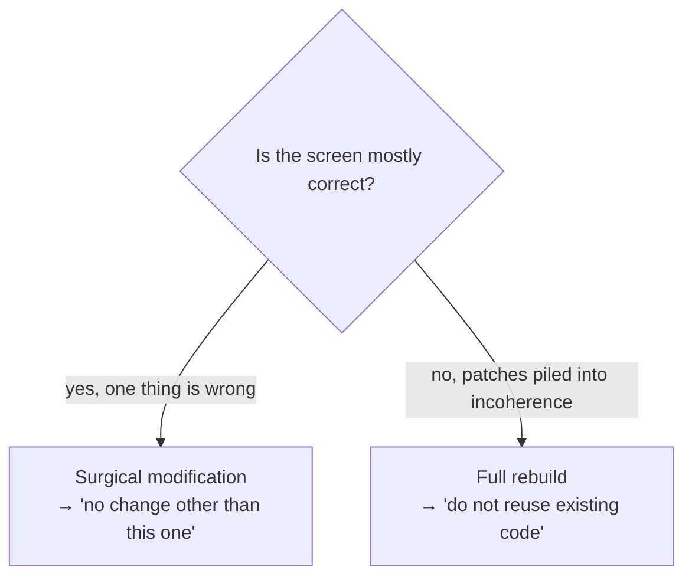

# The Prompt as a Contract

*A prompt is not a conversation. It is a contract handed to an agent — and every section closes a door.*

## A prompt is a contract

When you talk to an agent casually, you are negotiating. Negotiation invites
interpretation, and an agent asked to interpret will fill every gap with a
guess. A prompt written as a *contract* removes the negotiation: it states the
operation, the constraints, the prohibitions, and the checklist the agent
verifies against itself.

Every section of a well-formed prompt **closes a door** through which the
agent could otherwise wander off. That is the lens for this whole chapter:
read each section as a door, and ask what walks through if it stays open.

## Anatomy of a prompt

A complete generation prompt has seven sections.

| Section | What it states | Door it closes |
|---|---|---|
| **Operation type** | Create, or surgical modification, or full rebuild | The agent guessing the *scope* of the work |
| **Passes** | How many internal passes, and what each does | The agent stopping at a rough first draft |
| **Context** | Where the screen lives, who uses it | The agent inventing a purpose |
| **Specifications** | Structure, states, content — with numeric values | The agent reinterpreting vague adjectives |
| **Design-system recall** | Colours, type, radii, spacing — always restated | The agent assuming it remembers the design system |
| **Prohibitions** | What it must not do | The agent "improving" things unasked |
| **Validation checklist** | Observable criteria the agent ticks itself | The agent declaring done without checking |

Two sections deserve emphasis.

**Design-system recall — always, never assumed known.** Even if the design
system is in the vault, restate the tokens the screen uses. An agent that has
to *recall* the design system will approximate it; an agent that *reads* it in
the prompt cannot.

**Numeric values, not adjectives.** "Compact" is interpretable. "1px
separator, 600/14px title, 13px description, 70/30 split" is not. Every value
you can quantify, you must — each number is a door the agent cannot reopen.

## Two modes

A prompt operates in one of two modes, and stating which is the first door
closed.

### Surgical modification

A *surgical modification* corrects one precise point. Its defining feature is
the final, capital prohibition: **"No change other than this one."** That line
prevents the agent from rebuilding, in its own taste, things that already
worked.

Use it when the current screen is mostly right and one thing is wrong.

### Full rebuild

A *full rebuild* starts from zero and **forbids reusing the existing code**.
Use it when an accumulation of patches has made the existing code incoherent —
when the cheapest path forward is a clean slate, not another patch on a patch.



Choosing the wrong mode is itself a failure. A surgical prompt against
incoherent code produces another patch on the pile. A full rebuild against a
mostly-correct screen throws away validated work. Pick deliberately.

## Worked example — a surgical modification

A real surgical-modification prompt. The screen is generic: a
`conditions-list` panel.

```text
SURGICAL MODIFICATION on "conditions-list"

CURRENT PROBLEM
Individual cards with a drop shadow, a large number in a circle, a title,
a long description, a badge, and a sub-label. Together they read as too
heavy: the screen takes too much vertical height and tires the eye.

TARGET PATTERN
A compact vertical list, no individual cards. Plain horizontal separators.
One row per item, dense and readable.

SPECIFICATIONS
- Single container, no per-item shadow.
- 1px separator between each row.
- Left block (title 600/14px + description 13px on one line): 70%.
- Right block (compact badge + short value): 30%, right-aligned.
- Numbered circles removed.

PROHIBITIONS
- No individual cards with a shadow.
- No multi-line descriptions.
- No change other than this list rework.

VALIDATION CHECKLIST
[ ] Single vertical list with separators
[ ] Numbers removed
[ ] Compact badge on the right, short value beneath it
[ ] Total height reduced versus the previous version
[ ] No regression anywhere else on the screen
```

Three things give this prompt its strength:

1. **It names the problem in observable terms.** "Too heavy, takes too much
   height" describes what is *seen*, not a feeling. The agent and the reviewer
   can both check it.
2. **It gives numeric values the agent cannot reinterpret.** `70/30`, `1px`,
   `600/14px` — there is no room to approximate.
3. **It closes with a scope prohibition and a self-verifiable checklist.** The
   last prohibition forbids overreach; the checklist forces the agent to
   confirm each criterion, including "no regression anywhere else."

The last checklist line — "no regression anywhere else" — is the partner of
the last prohibition. One forbids the overreach; the other makes the agent
look for it.

## Why each section closes a door

Walk the prompt once more, asking what happens if each section is *missing*:

- **No operation type** → the agent guesses whether to patch or rebuild, and
  may rebuild a screen you wanted patched.
- **No passes** → the agent ships a rough first draft and calls it done.
- **No context** → the agent invents who the screen is for and designs for the
  wrong user.
- **No numeric specs** → "compact" becomes whatever the agent's default is.
- **No design-system recall** → the screen drifts from the system by a few
  pixels and a slightly wrong colour.
- **No prohibitions** → the agent improves the untouched parts and introduces
  regressions.
- **No checklist** → the agent declares done without verifying, and the
  reviewer finds the gaps.

A vague prompt is not a faster prompt. It is a prompt that defers its missing
sections into grey zones (see [Chapter 07](./07-grey-zones.md)) and rework.

## A contract-mode prompt template

Copy this for any generation or modification. The bracketed parts are the only
parts you fill in.

```text
[CREATION | SURGICAL MODIFICATION | FULL REBUILD] on "<component>"

CONTEXT
[Where the screen lives, who uses it, what it is for.]

PASSES
Run [2-4] passes: [structure / implementation / polish + responsive /
cross-viewport check].

SPECIFICATIONS
[Structure, states, content. Every value numeric: sizes, weights, spacing,
splits, breakpoints. No bare adjectives.]

DESIGN-SYSTEM RECALL
[Colours, typography, radii, spacing tokens used by this screen. Restated
in full — never assumed known.]

PROHIBITIONS
- No invention of labels or values; fetch them from the source.
- No change outside the scope defined above.
- [Mode-specific: surgical → "no change other than this one";
   full rebuild → "do not reuse the existing code".]

VALIDATION CHECKLIST
[ ] [Observable criterion 1]
[ ] [Observable criterion 2]
[ ] No regression anywhere else on the screen
```

A copyable version lives in `templates/`. For the prototype prompt that opens
the delivery chain, see [Chapter 05, Step 1](./05-the-delivery-chain.md); the
running example's prototype prompt is
`examples/walkthrough/01-prototype-prompt.md`.

## The relationship to the vault contract

Two things in Mainstay are called a "contract", and they are different
artifacts:

- the **prompt-as-contract** — the instruction handed to the agent for one
  generation, this chapter;
- the **screen contract** — the frozen, double-signed vault artifact for
  `saved-views-panel`, see [Chapter 01](./01-three-pillars.md) and
  [Chapter 05, Step 3](./05-the-delivery-chain.md).

They are related: a good screen contract makes writing a good prompt almost
mechanical, because the specifications, prohibitions, and acceptance criteria
are already settled. A prompt written without a screen contract behind it is a
prompt improvising the contract — and improvisation is where grey zones are
born.

## See also

- [Chapter 05 — The Delivery Chain](./05-the-delivery-chain.md)
- [Chapter 07 — Grey Zones](./07-grey-zones.md)
- [Chapter 08 — Failure Protocols](./08-failure-protocols.md)
- [Chapter 09 — Patterns & Anti-Patterns](./09-patterns-and-antipatterns.md)
