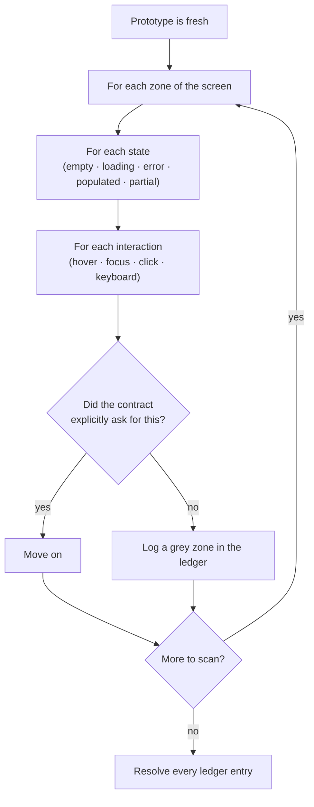
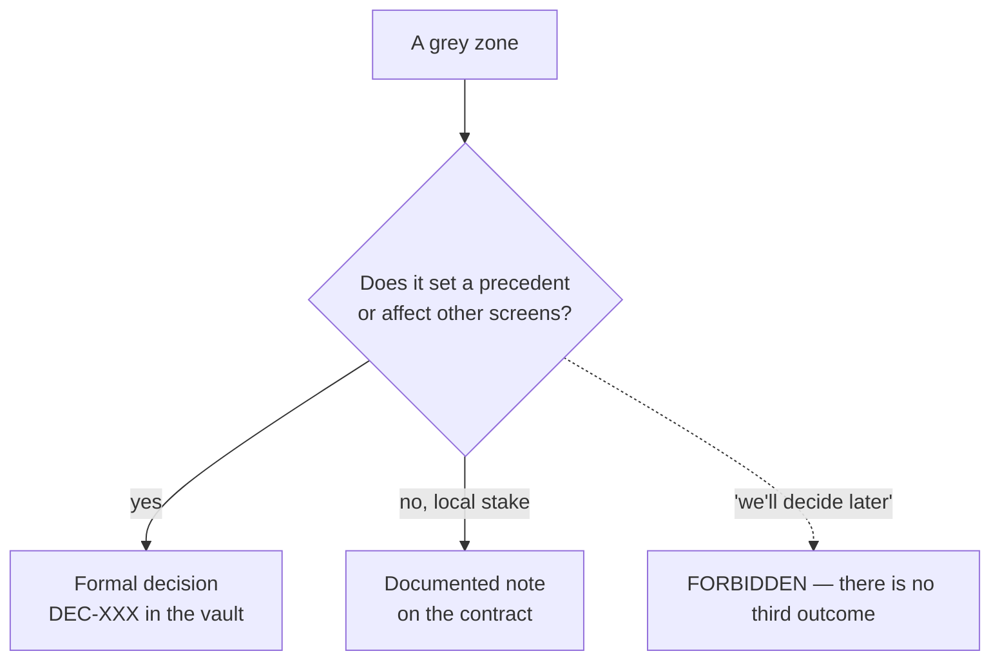

# Grey Zones

*A grey zone is a decision the agent made by default, in the dark, without authority to make it. Finding them is the heart of the method.*

This is the core of Mainstay, and the part almost no one does.

## Definition

A grey zone is everything the agent decided on its own because neither the
prototype nor the contract specified it.

It is neither an error nor a correct answer. It is a decision taken **by
default, in the shadow, by someone who had no authority to take it.** Examples:

- an empty state filled in the agent's own way;
- a hover behaviour invented;
- a sort order chosen arbitrarily;
- an error message no one approved;
- a permission assumed.

None of these is "wrong." Each is a choice that *someone with authority* —
product, design, engineering — should have made, and didn't, so the agent
made it instead. The danger is not the choice. The danger is that **no one
knows the choice was made.**

The British spelling "grey" is used deliberately and consistently throughout
Mainstay — it is a coined term of the method, not ordinary prose.

## Why grey zones are the expensive failure mode

A bug announces itself: something is visibly broken. A grey zone hides: the
screen *looks* finished. It is a silent decision that surfaces weeks later, at
integration, when fifteen of them detonate together.

> Fifteen unresolved grey zones are fifteen bombs that explode together at
> integration.

The reason they cluster is structural. Each grey zone is a gap between what
was specified and what was built. Gaps do not block the build — the agent
filled them — so the build proceeds and the gaps accumulate. They are
discovered only when something *external* (a second integration, a real user,
a load test) probes the assumption. By then there are many, and they are
expensive.

The whole point of the grey-zone protocol is to move that discovery **forward
in time**, to the moment the prototype is fresh and a grey zone costs one
sentence to resolve.

## The detection protocol

You compare the product to the initial brief, while it is fresh. For every
observable element, exactly one question:

> Did the contract explicitly ask for this?

- **Yes** → move on.
- **No** → it is a grey zone.

The sweep is **systematic** — zone by zone, state by state, interaction by
interaction. "Systematic" is not a tone; it is a coverage requirement. You do
not scan the parts that catch your eye. You walk a grid.

A practical sweep grid — run the question against every cell:

| Dimension | Cells to walk |
|---|---|
| Zones | Header, list/content, side panel, footer, modals |
| States | Empty, loading, partial, populated, error, success |
| Interactions | Hover, focus, click, keyboard, drag, long-press |
| Data | Min, max, overflow, missing fields, very long strings |
| Permissions | Each role: what is visible, enabled, disabled, hidden |

## The two outcomes — never a third

Every grey zone resolves to exactly one of two outcomes.

**A formal decision.** Recorded in the vault, dated, justified — it becomes a
rule. Use this when the choice has consequences beyond this one screen, or
sets a precedent. It becomes a `DEC-XXX` (see
[Chapter 04 — Sources of Truth](./04-sources-of-truth.md)).

**A documented decision noted on the contract.** Recorded as a note in the
contract itself. Use this when the stake is local — the choice matters for
this screen and nowhere else.

What you never do is the third outcome: **"we'll decide later."** Deferral is
not resolution. A deferred grey zone is a grey zone that will be rediscovered
at integration, with the others, when it is expensive.

The two valid outcomes share one property: after either, the grey zone is no
longer a silent choice. It is a *visible* choice — in the vault or on the
contract — that someone with authority can review, accept, or overturn. That
is the entire goal: make the invisible decision visible.

## Re-scan after every pass

Each iteration pass *creates new grey zones*. When the agent polishes a
screen, it makes new micro-decisions; when it adds a state, it decides how
that state looks and behaves.

Therefore: **after every pass, re-scan.** A single scan at the end misses
everything the polishing passes introduced. The scan is not a milestone you
pass once — it is a step you repeat each time the prototype changes.

## The grey-zone ledger

Track grey zones in a **grey-zone ledger** — a small table, kept beside the
contract during Steps 2–3 of the delivery chain. Every detected grey zone gets
a row, and no row may stay open when the contract is frozen.

A ledger has these columns:

| ID | Observed | Zone / state | Question | Outcome | Resolution |
|---|---|---|---|---|---|

A filled example, for the running `saved-views-panel` feature. This is an
**abbreviated extract** — the full scan, with every row, is in
[`../../examples/walkthrough/02-grey-zone-scan.md`](../../examples/walkthrough/02-grey-zone-scan.md):

| ID | Observed | Zone / state | Question | Outcome | Resolution |
|---|---|---|---|---|---|
| GZ-01 | A second view marked default; the first stayed default too | Side panel, populated | What happens to the previous default? | Formal decision | DEC-007 — exactly one default per user |
| GZ-02 | New views default to private | Create modal | Private or shared by default? | Formal decision | DEC-011 — new views are private until shared |
| GZ-03 | Save with a duplicate name silently overwrote | Create modal, error | Reject, version, or overwrite? | Contract note | Reject with inline "name already used" |
| GZ-04 | Empty state showed a bare "No views" string | List, empty | What does the empty state say and offer? | Contract note | Empty state copy + a "Create a view" button |
| GZ-05 | List sorted by creation date | List, populated | What is the default sort? | Contract note | Sort by name, ascending |

Read the ledger as a worklist: the feature is not ready for Step 3 until every
row has an `Outcome` and a `Resolution`. GZ-01 and GZ-02 became decisions
because default behaviour and visibility are precedents other screens will
follow; GZ-03 to GZ-05 are local to this screen and live as contract notes.

The filled ledger for the running example is
`examples/walkthrough/02-grey-zone-scan.md`. The ledger is also a metric
source — the count of rows per screen is the **grey-zone rate** (see
[Chapter 12 — Observability & Metrics](./12-observability-and-metrics.md)). A
high rate is not shameful; it means the scan worked. A *zero* rate usually
means the scan was skipped.

## Where grey zones come from

Most grey zones trace back to one of three upstream causes:

1. **A vague brief.** The most common. The fix is upstream — see
   [Chapter 06 — The Prompt as a Contract](./06-prompt-as-contract.md).
2. **An agent inventing to "improve."** The agent fills a gap helpfully. The
   guardrail "no invention" closes this door (see
   [Chapter 09](./09-patterns-and-antipatterns.md)).
3. **An unstated state or edge case.** The prototype showed the happy path;
   the empty, error, and overflow states were never specified.

The grey-zone scan catches all three after the fact. A sharp contract and
firm guardrails reduce how many there are in the first place. You need both:
prevention upstream, detection downstream.

## See also

- [Chapter 04 — Sources of Truth](./04-sources-of-truth.md)
- [Chapter 05 — The Delivery Chain](./05-the-delivery-chain.md)
- [Chapter 06 — The Prompt as a Contract](./06-prompt-as-contract.md)
- [Chapter 09 — Patterns & Anti-Patterns](./09-patterns-and-antipatterns.md)
