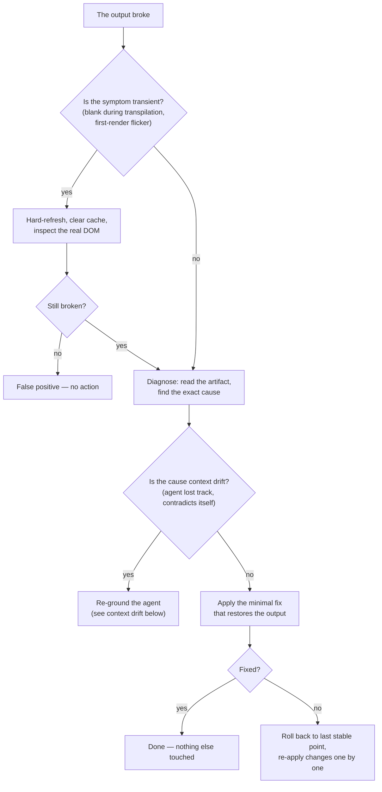
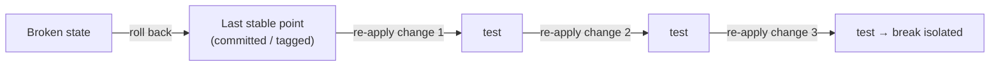

# Failure Protocols

*A mature method is judged when something breaks. The reflex that matters: minimal action, never destructive regeneration.*

A mature method is judged the moment something goes wrong. When generation
breaks, when a page renders blank, when the agent's context has drifted — the
instinct is to wipe and regenerate. That instinct is the error. It throws away
validated work to escape a problem that a small, targeted fix would solve.

The principle under every protocol in this chapter:

> **Minimal action. Never destructive regeneration.**



## Generation-crash recovery

**Symptom.** The output no longer renders, even though the content looked
coherent.

The temptation to regenerate everything is the error: you would lose the
validated work. Follow the procedure instead.

```text
PROCEDURE
1. Current state — read the artifact, identify the cause class
   (syntax, missing import, render loop), find the exact error.
2. Diagnosis — point to the line, the import, or the faulty component.
3. Minimal action — the smallest correction that brings the render back.
   DO NOT regenerate. DO NOT touch the rest.
4. If insufficient — roll back to the last stable point, re-apply the
   changes one by one, testing between each.

PROHIBITIONS
- No full regeneration.
- No change outside the crash perimeter.
- No new feature during recovery.
```

The fourth prohibition matters as much as the first. Recovery is not a moment
to also slip in an improvement; mixing a fix with a feature makes both
impossible to verify. Recovery does one thing: restore the last known-good
state.

A worked example. A `saved-views-panel` build stops rendering after an edit.
Step 1: reading the artifact shows a render loop — a state setter called
during render. Step 2: the faulty line is identified. Step 3: the setter is
moved into an effect — one line changed, render restored. No regeneration, no
other change. Total cost: one diagnosis and one line. The cost of regenerating
would have been every grey-zone resolution baked into that screen.

## Transpilation false positives

On environments that compile on the fly, a page can look blank for the
duration of transpilation. Before concluding "bug":

1. Hard-refresh with the cache cleared.
2. Inspect the **real DOM** — not the visual, the actual rendered tree.
3. For heavy cases, pre-compile before running, which removes the problem
   entirely.

The lesson generalizes beyond transpilation: **never react to a transient
symptom with a destructive action.** A blank page during a compile step, a
flicker on first render, a momentary 404 while a dev server restarts — these
are not failures. Confirm the symptom is real and stable before you act on
it. A destructive action taken against a symptom that would have cleared on
its own is pure loss.

## Context drift and context-window exhaustion

A failure mode specific to long agent sessions: the agent's working context
fills up or drifts. Symptoms:

- the agent contradicts a decision it made earlier in the same session;
- it reintroduces code it removed twenty minutes ago;
- it "forgets" a constraint stated in the context file;
- its edits become less precise as the session runs long.

The cause is not the model failing — it is the context window filling with
session history, pushing the stable, important facts out of effective reach.

**Recovery procedure:**

```text
CONTEXT-DRIFT RECOVERY
1. Stop. Do not ask the drifting agent to "try again" — it will drift further.
2. Capture state — write the current, verified state to a durable place:
   the contract, the grey-zone ledger, a short handoff note. Not the chat.
3. Re-ground — start a fresh agent context. Load: the context file, the
   relevant contract, and the captured state. Nothing else.
4. Resume — the fresh agent continues from a clean, small, accurate context.

PROHIBITIONS
- No "continue anyway" with the drifted context.
- No relying on the chat history as the record of truth.
```

The structural prevention is in the architecture: delegate read-heavy work to
an **explorer subagent** so the acting agent's context stays small and clean
(see [Chapter 03, §3.5](./03-agent-architecture.md) and
[Chapter 11](./11-multi-agent-orchestration.md)). The durable record is the
**vault**, never the conversation — that is exactly why the vault exists. A
session ends; a vault persists.

## Rollback discipline

Rollback is a tool, not a defeat — but it has rules.

1. **Always have a point to roll back to.** Before an iteration, the validated
   state is archived (a commit, a tag, a saved snapshot). You cannot roll back
   to a state you never saved. This is the *save-before-iteration* pattern of
   [Chapter 09](./09-patterns-and-antipatterns.md).
2. **Roll back to the last stable point, not to zero.** The goal is the
   nearest known-good state, not an empty repository.
3. **Re-apply forward, one change at a time, testing between each.** This both
   restores progress and isolates which change caused the break.
4. **A rollback is logged.** Note what broke and why, so the next attempt does
   not repeat it. A silent rollback teaches nothing.



## Minimal action, never destructive regeneration

Every protocol here is one principle applied to a different failure:

| Failure | Destructive instinct | Minimal action |
|---|---|---|
| Generation crash | Regenerate the whole screen | Fix the one faulty line |
| Transpilation blank page | Rebuild the page | Hard-refresh, inspect the DOM |
| Context drift | Push the drifted agent harder | Capture state, re-ground a fresh context |
| A broken iteration | Start over | Roll back to the last stable point |

Destructive regeneration feels like progress because it produces fresh output.
It is not progress. It discards the grey-zone resolutions, the contract
conformance, and the validated decisions already baked into the artifact. The
disciplined move is almost always smaller, slower to feel satisfying, and far
cheaper.

When in genuine doubt between a small fix and a regeneration, the tie goes to
the small fix. You can always escalate to a rebuild; you cannot un-discard
validated work.

## See also

- [Chapter 05 — The Delivery Chain](./05-the-delivery-chain.md)
- [Chapter 06 — The Prompt as a Contract](./06-prompt-as-contract.md)
- [Chapter 09 — Patterns & Anti-Patterns](./09-patterns-and-antipatterns.md)
- [Chapter 11 — Multi-Agent Orchestration](./11-multi-agent-orchestration.md)
