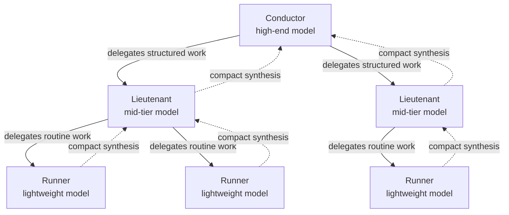
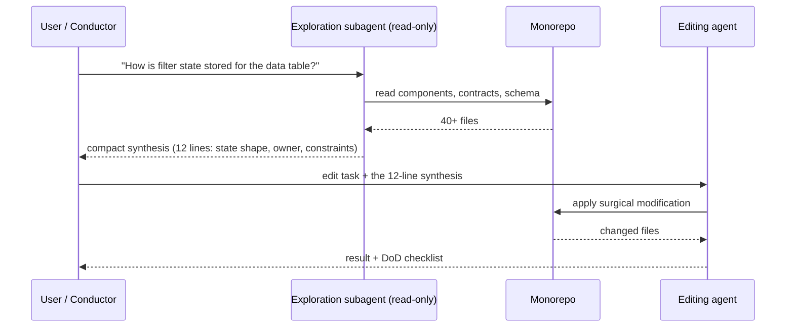

# Multi-Agent Orchestration

*One model for everything is the expensive default. Mainstay distributes work across three tiers — conductor, lieutenant, runner — and separates exploration from editing to keep context clean and cost honest.*

You do not use the same model for every task. A high-end model deciding architecture and a lightweight model formatting a file are not interchangeable: one is expensive and slow, the other is cheap and fast, and using the wrong one wastes money or quality. Orchestration is the discipline of routing each unit of work to the right tier — and of keeping each agent's context unpolluted.

This chapter covers the three tiers, the explore-vs-edit split, how context is handed off, a worked cost model, and — just as important — when **not** to reach for subagents.

---

## The three tiers

Mainstay's orchestration distributes work across three roles. They differ in model class, cost, latency, and what they own.



### Conductor

The conductor is a high-end model, used on demand. It owns the work that cannot be delegated without losing quality.

- **Owns:** architecture decisions, contract design, grey-zone adjudication, planning the work breakdown, resolving conflicts between sources of truth.
- **Model class:** the strongest available; the cost is justified because these decisions shape everything downstream.
- **Cost/latency profile:** high cost per token, used sparingly, latency tolerable because the decision is rare and consequential.
- **Does not:** apply routine edits, run formatters, write boilerplate. Every token the conductor spends on routine work is overpriced.

### Lieutenant

The lieutenant is a mid-tier model. It does structured work where the frame is already set — typically by a contract or a plan the conductor produced.

- **Owns:** implementing a screen against a frozen contract, writing backend handlers against an API spec, wiring endpoints in waves, producing tests for a defined behaviour.
- **Model class:** mid-tier — strong enough to write correct code, cheap enough to run often.
- **Cost/latency profile:** moderate cost, moderate latency, the workhorse of the chain.
- **Does not:** decide what to build. If a lieutenant hits an ambiguity, it escalates to the conductor rather than guessing — guessing produces grey zones.

### Runner

The runner is a lightweight model for automated routines.

- **Owns:** formatting, mechanical refactors, renaming, applying a lint fix, extracting a synthesis from files, regenerating mocks from a spec.
- **Model class:** the cheapest model that does the job reliably.
- **Cost/latency profile:** low cost, low latency, run constantly and often in parallel.
- **Does not:** make any judgement call. A runner executes a fully specified instruction; if the instruction needs interpretation, it is the wrong tier.

| Tier | Model class | Relative cost | Owns | Escalates when |
|---|---|---|---|---|
| Conductor | High-end | High | Decisions, architecture, contracts | Never — it is the top |
| Lieutenant | Mid-tier | Medium | Structured implementation | Ambiguity not covered by the contract |
| Runner | Lightweight | Low | Deterministic routines | Instruction requires a judgement call |

---

## The explore-vs-edit split

The most rentable subagent pattern is not "more agents" — it is separating **exploration** from **editing**.

Reading a large codebase to understand it burns context. An agent that has read forty files to answer one question now carries forty files of noise into every subsequent edit. Its precision degrades. The fix is a division of labour:

- An **exploration subagent** runs read-only. It traverses the monorepo, understands the relevant area, and returns a **compact synthesis** — not the files, the answer.
- An **editing agent**, whose context was never spent on the search, applies the change with a clean, focused context.

Because the monorepo holds code and knowledge in one place (see [The Monorepo](./02-monorepo.md)), the exploration subagent's synthesis is trustworthy: it read the real schema and the real decisions in the same space.



The editing agent never sees the forty files. It sees twelve lines of distilled truth and the task. Its context stays clean.

---

## Context handoff: the compact synthesis

A subagent's value collapses if it returns everything it read. A handoff is a **synthesis**, governed by three rules.

1. **Answer, do not transcribe.** Return conclusions and the few facts that support them, not raw file contents.
2. **Name sources, do not paste them.** Cite `vault/contracts/saved-views-panel.md` and `apps/backend/src/...`; let the editing agent open them only if it must.
3. **Surface ambiguity explicitly.** If the exploration found a grey zone, the synthesis says so — the conductor decides, the subagent does not.

A good synthesis shape:

```text
SYNTHESIS — filter state for the data table

WHERE:    apps/frontend/src/table/use-table-state.ts
SHAPE:    { filters: Filter[], sort: SortSpec, columns: string[] }
OWNER:    the table screen; persisted per-user on save
CONSTRAINT: a saved view stores a snapshot, not a live reference
            (see vault/contracts/saved-views-panel.md §3)
GREY ZONE: behaviour when a saved column no longer exists is
           unspecified — needs a decision before editing.
NEXT:     editing the panel is safe; resolve the grey zone first.
```

Twelve lines replace forty files. That is the entire point of the handoff.

---

## A cost model (worked, illustrative)

The numbers below are **illustrative** — invented for the example, not real prices. They show the *shape* of the cost argument, not a quote.

Scenario: build one screen end to end. Naive approach uses the high-end model for everything. Orchestrated approach routes each task to its tier.

**Naive — conductor does everything (illustrative figures):**

| Task | Tokens (illustrative) | Tier used | Unit cost (illustrative) | Cost (illustrative) |
|---|---|---|---|---|
| Explore the codebase | 180,000 | High-end | $15 / 1M | $2.70 |
| Design the contract | 60,000 | High-end | $15 / 1M | $0.90 |
| Implement the screen | 240,000 | High-end | $15 / 1M | $3.60 |
| Format and lint passes | 90,000 | High-end | $15 / 1M | $1.35 |
| **Total** | **570,000** | — | — | **$8.55** |

**Orchestrated — each task on its tier (illustrative figures):**

| Task | Tokens (illustrative) | Tier used | Unit cost (illustrative) | Cost (illustrative) |
|---|---|---|---|---|
| Explore the codebase | 180,000 | Runner | $0.50 / 1M | $0.09 |
| Design the contract | 60,000 | Conductor | $15 / 1M | $0.90 |
| Implement the screen | 240,000 | Lieutenant | $3 / 1M | $0.72 |
| Format and lint passes | 90,000 | Runner | $0.50 / 1M | $0.045 |
| **Total** | **570,000** | — | — | **$1.76** |

In this illustrative scenario the orchestrated approach costs roughly **5× less** for the same output, because expensive tokens are spent only on the 60,000 tokens of genuine decision work. The lesson is durable even though the numbers are fictional: **match token price to judgement required.**

A second saving is latency. Runners run in parallel and fast; the conductor is invoked rarely. The wall-clock time of the orchestrated build is lower because cheap parallel work does not queue behind one expensive model.

---

## When NOT to use subagents

Subagents are not free. Each one adds a handoff, and a handoff can lose information or add round-trip latency. Do not reach for orchestration when:

- **The task is small and self-contained.** A two-file change does not need an exploration subagent — the editing agent can read two files cheaply. The handoff would cost more than it saves.
- **The context is already loaded.** If the agent just built the screen and you ask for a tweak, it already holds the relevant context. Spawning a fresh subagent throws that away.
- **The work is one indivisible decision.** Splitting a single architectural judgement across agents fragments it. The conductor should make it whole.
- **The synthesis would be as large as the source.** If exploration cannot compress the area into a short synthesis, the area is the work — edit it directly.
- **Debugging a subtle, stateful bug.** Bug hunts need continuity of context. Handoffs break the chain of reasoning that finds the cause.

The rule: use a subagent when the **context saved by delegating exceeds the context spent on the handoff**. Below that line, one agent is faster, cheaper, and sharper.

---

## See also

- [The Agentic Architecture](./03-agent-architecture.md)
- [The Monorepo: Home of Knowledge](./02-monorepo.md)
- [Observability & Metrics](./12-observability-and-metrics.md)
- [CI/CD & Hooks](./14-cicd-and-hooks.md)
