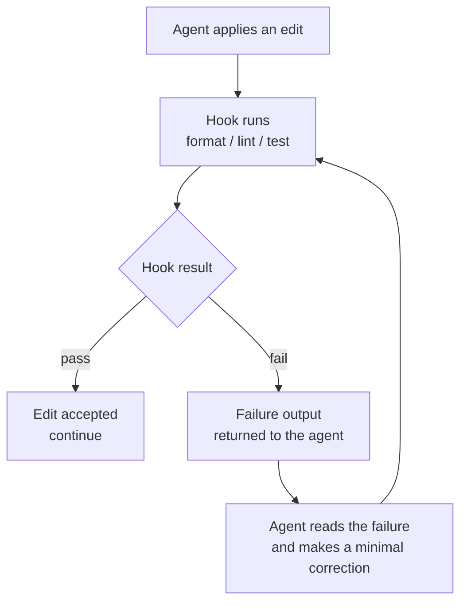

# CI/CD & Hooks

*Hooks turn good practice into a guarantee. CI turns guarantees into gates. Together they create the self-correction loop: the agent edits, a hook tests, failure returns, the agent fixes — with no human in the inner loop.*

A hook is a deterministic trigger attached to an event in the agent's cycle. It does not ask the model for an opinion; it runs. That determinism is what makes a hook reliable: a good practice that depends on the agent remembering to do it is not a guarantee — a hook is.

This chapter covers the doc/schema sync hook in full, blocking checks in CI, the self-correction loop, and a provider-neutral sample pipeline. The executable hooks referenced here live in the `hooks/` directory of this repository.

---

## Hooks: events and effects

A hook is defined by its trigger event and its effect.

| Trigger event | Hook effect | Why |
|---|---|---|
| After every edit | Format and lint the changed files | Keeps the tree consistent without the agent thinking about it |
| Before every commit | Run the test suite | A failing commit never enters history |
| After a migration | Verify doc/schema sync (see below) | The canonical data model never drifts from the code |
| Before a contract freeze | Check both signatures are present | An unsigned contract cannot reach `frozen` |
| On pull request | Run blocking CI checks | Quality gates apply to every change, agent or human |

Hooks follow the code conventions in this repository: POSIX `bash`, `#!/usr/bin/env bash`, `set -euo pipefail`, the executable bit set, and a header comment naming the trigger event.

---

## The doc/schema sync hook, in full

This is the most important hook in a Mainstay monorepo, because it enforces the structural rule that the **code is the source of truth for the schema** (see [The Monorepo](./02-monorepo.md)).

The problem it solves: a migration changes the database schema. If the canonical data model in `apps/backend/docs/database/` is not updated in the same change, the documentation now lies. Six months later an agent reads the stale doc and builds against a schema that no longer exists. The hook makes that impossible.

It has two valid modes. Choose one per repository.

### Mode 1 — Blocking check

The hook detects that a migration touched the schema and fails the build until the canonical docs are updated in the same change. The agent (or human) must update the docs to proceed.

```bash
#!/usr/bin/env bash
# hooks/doc-schema-sync.sh
# Trigger: pre-commit, and again as a blocking CI check on every PR.
# Effect: if a migration changed the schema but the canonical data-model
#         docs were not updated in the same change, fail.
set -euo pipefail

MIGRATIONS_GLOB="apps/backend/src/migrations/"
DOCS_DIR="apps/backend/docs/database/"

# Files changed in this commit / PR diff.
changed="$(git diff --cached --name-only)"

schema_touched="$(echo "$changed" | grep "^${MIGRATIONS_GLOB}" || true)"
docs_touched="$(echo "$changed"   | grep "^${DOCS_DIR}"        || true)"

if [ -n "$schema_touched" ] && [ -z "$docs_touched" ]; then
  echo "BLOCKED: a migration changed the schema but the canonical"
  echo "data-model docs in ${DOCS_DIR} were not updated."
  echo "Update the canonical docs in this same change, then retry."
  exit 1
fi

echo "doc-schema-sync: OK"
```

### Mode 2 — Auto-regenerate

An extended mode of the same `hooks/doc-schema-sync.sh` script: instead of failing, the hook regenerates the canonical docs from the code automatically, then stages the result, so they cannot fall behind. Use this when the docs are fully derivable from the schema.

```bash
#!/usr/bin/env bash
# hooks/doc-schema-sync.sh — regenerate mode
# Trigger: post-migration.
# Effect: regenerate the canonical data-model docs from the code and stage them.
set -euo pipefail

npm run generate:schema-docs        # reads entities/migrations, writes docs
git add apps/backend/docs/database/

echo "doc-schema-sync: canonical docs regenerated and staged"
```

Either way, the principle holds: **knowledge is never "to do later" — it is a condition of merging.**

---

## Blocking checks in CI

CI is where guarantees become gates. A *blocking check* fails the pipeline and prevents merge. In a Mainstay repo the blocking checks are not only "does it build" — they also enforce the method.

| Blocking check | Fails the PR when... |
|---|---|
| Build | The project does not compile. |
| Test suite | Any output test fails. |
| Lint / format | The tree is not consistent. |
| Doc/schema sync | A migration changed the schema without updating canonical docs. |
| Contract signatures | A contract is set to `frozen` without both signatures. |
| Eval harness | A golden task, conformance test, or guardrail probe fails (see [Testing & Evaluating Agents](./13-testing-and-evaluating-agents.md)). |
| Grey-zone scan present | A new screen merges without a completed grey-zone scan artifact. |

The eval-harness and grey-zone checks are what make CI enforce Mainstay rather than just enforce compilation. Without them, an agent can ship a green build that ignored a guardrail.

---

## The self-correction loop

The combination of hooks and CI creates the loop that lets an agent fix its own mistakes without a human in the inner cycle.

The agent edits. A hook runs and tests the result. If the test fails, the failure output is returned to the agent. The agent reads the failure, makes a minimal correction, and the hook runs again. The loop closes when the hook passes.



Two disciplines keep this loop healthy:

- **The hook's failure output must be actionable.** A useful failure names the file, the line, and the expectation. A vague failure ("tests failed") gives the agent nothing to correct against and the loop spins.
- **The correction must be minimal.** The loop is for fixing the specific failure, not for refactoring. An agent that "improves" code while fixing a test introduces context drift — see [Failure Protocols](./08-failure-protocols.md).

The self-correction loop is why a Mainstay agent can run unattended for long stretches: the infrastructure, not a human, catches and returns each mistake.

---

## A sample CI pipeline (provider-neutral, fictional)

The configuration below is generic and **fictional** — it does not target any real CI provider and uses placeholder syntax. Adapt it to whatever your CI runs.

```yaml
# .ci/pipeline.yml  — illustrative, provider-neutral
pipeline:
  triggers:
    - on: pull_request
    - on: push
      branch: main

  env:
    API_BASE_URL: "https://api.example.com"
    API_TOKEN: "<API_TOKEN>"          # injected from CI secrets, never committed

  stages:

    - name: build
      run: npm ci && npm run build
      blocking: true

    - name: lint
      run: npm run lint
      blocking: true

    - name: test
      run: npm run test
      blocking: true

    - name: doc-schema-sync
      run: ./hooks/doc-schema-sync.sh
      blocking: true

    - name: contract-signatures
      run: ./skills/contract-lint/lint.sh
      blocking: true

    - name: grey-zone-scan-present
      run: ./skills/grey-zone-scan/scan.sh
      blocking: true

    - name: eval-harness
      run: npm run eval -- --suite golden,conformance,guardrail,regression
      blocking: true

    - name: metrics
      run: npm run metrics:dashboard      # refreshes the health dashboard
      blocking: false                     # advisory, never blocks a merge
```

Note the last stage: the metrics dashboard from [Observability & Metrics](./12-observability-and-metrics.md) runs on every main-branch move but is **non-blocking** — metrics inform, they do not gate.

---

## Wiring CI into the parallel build

CI also protects the contract-first parallel build (delivery chain step 4). Front and back advance on the same frozen contract, the back behind feature flags. CI keeps that safe:

- The API spec is a versioned, blocking artifact — a PR that changes an endpoint without bumping the spec fails.
- The back can merge to `main` before the front is ready because feature flags keep it dark; CI verifies the flag default is off.
- Wiring happens in waves, endpoint by endpoint; each wave is its own PR with its own green pipeline, so integration is continuous and verifiable rather than one risky final phase.

---

## See also

- [The Monorepo: Home of Knowledge](./02-monorepo.md)
- [The Agentic Architecture](./03-agent-architecture.md)
- [Testing & Evaluating Agents](./13-testing-and-evaluating-agents.md)
- [Failure Protocols](./08-failure-protocols.md)
