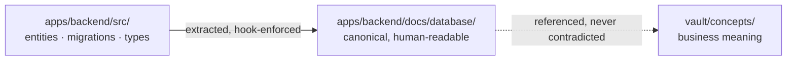
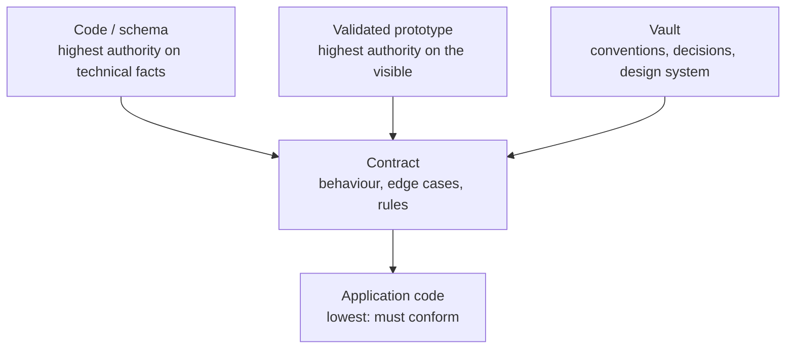
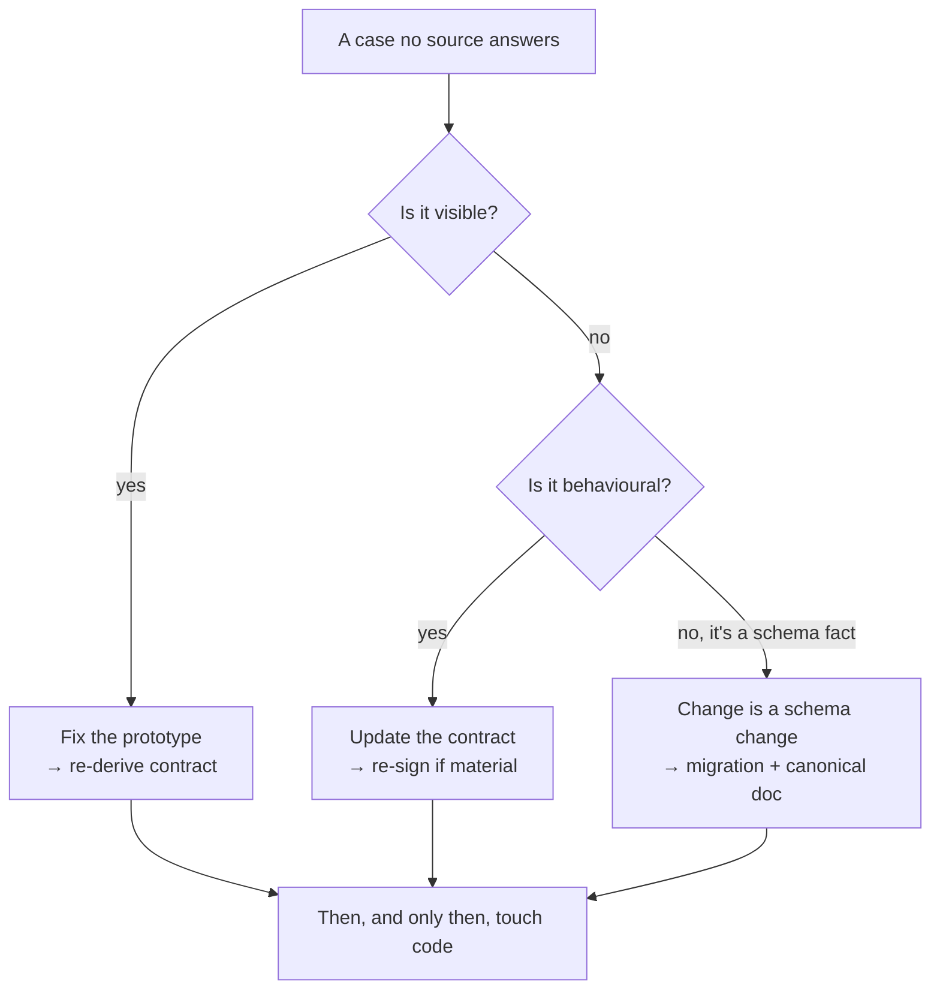

# The Vault and the Sources of Truth

*Knowledge lives in the monorepo, versioned with the code. When in doubt,
exactly one source answers. And the vault only survives parallel sessions
thanks to three guardrails, each born from a recorded violation.*

## The first mistake

The first mistake is to house the knowledge base anywhere other than the code:
a wiki, a notes app, a separate documentation tool. Everything that lives
outside the repository drifts from the code, mechanically and inexorably. The
code changes; the doc stays; six months later the agent leans on a truth that
lies.

This is not a discipline problem you can fix with reminders. It is structural.
A wiki page and a code file have no shared commit, no shared review, no shared
merge. Nothing forces them to move together, so they don't.

Mainstay therefore sets a structural rule:

> **Knowledge lives in the monorepo, beside the code, versioned with it.**

Code and knowledge share one repository, one history, one set of reviews. A
schema change and its documentation travel in the same commit, pass through
the same pull request, and merge together. Knowledge stops being a copy that
ages: it becomes part of the diff, and the diff does not merge until the
knowledge is right. The discipline is no longer "remember to update the docs";
it is "the docs are part of the diff."

This is what makes the memory pillar of
[Chapter 01](./01-three-pillars.md) operational. Without the monorepo,
"memory" is an aspiration. With it, memory is a folder the agent can read: no
round-trip to an external system, no risk of a stale page. The full annotated
directory layout lives in `examples/monorepo-skeleton/`.

## Code is the source of truth for the schema

The canonical data model does not live in a hand-drawn schema. It lives in the
code: entities, migrations, types. The human-readable representation of the
model is co-located with the backend, in a documentation folder that is
*derived from* the code.

When you want the real shape of a table or a type, you look at the code,
never at a diagram that has been lying for three months. Any other source that
claims to describe the schema ranks behind it.



The arrow that matters: the canonical doc is *extracted from* the code, never
authored independently. If the two disagree, the code wins and the doc is
regenerated. A hook makes the pair physically inseparable in the history: a
migration that changes the schema blocks the commit until the canonical doc
has been regenerated and staged with it (full setup in
[CI/CD & Hooks](../reference/cicd-and-hooks.md)).

## The vault is the navigable mirror, not a parallel source

On top of the code, the vault adds what the code does not carry by itself:
decisions and their justification, screen contracts, business concepts, and
the links that connect them. The vault **indexes and gives meaning**.

But the vault never contradicts the code. For anything technical, the code
wins. The vault is the layer of *meaning* placed over the layer of *truth*,
not a competing truth.

| Vault folder | Holds | Why it cannot live in code |
|---|---|---|
| `decisions/` | `DEC-XXX` decisions, dated, justified | Code shows *what*, not *why this and not that* |
| `contracts/` | One contract per screen, with status | Behaviour, edge cases, and acceptance criteria are not source code |
| `concepts/` | Business concepts and vocabulary | Domain meaning spans many code files |
| `design-system/` | Tokens, components, copy conventions | Cross-cutting visual rules, referenced everywhere |

## The two knowledge flows

The knowledge base is built from two flows, maintained differently.

**Flow 1: extracted from the code.** The schema, the types, the routes. This
flow should be *automated*: a human writing it by hand is a human introducing
drift. The sync hook keeps it honest.

**Flow 2: authored by humans and agents.** Decisions, contracts, concepts.
These cannot be extracted because they encode intent, not structure. This flow
is written, reviewed, and frozen like any other deliverable.

The rule that keeps both honest: **knowledge is never "to be done later." It
is a condition of delivery.** Flow 1 is enforced by hooks; Flow 2 is enforced
by the definition of done
([Chapter 04, Step 6](./04-delivery-chain.md)).

## The authority table

An agent (and a team) works well only when "where is the truth?" has
exactly one answer. The moment two sources can both claim authority over the
same fact, every decision becomes a negotiation, and the agent, asked to
negotiate, guesses. Mainstay removes the negotiation: each source has
authority over a defined domain, and a defined behaviour when it meets a
higher source.

| Source | Authority over | On divergence |
|---|---|---|
| **The code (monorepo)** | Data schema, types, real technical contracts | Wins on everything technical and executed. Nothing overrules it on schema. |
| **The validated prototype** | Interface, user journey, copy, visible states | Wins on everything visible. The contract describes it; it does not contradict it. |
| **The contract** | Behaviour, edge cases, rules, test data | Wins over application code. Loses against the prototype and the schema. |
| **The vault** | Conventions, decisions, constraints, design system | Wins on cross-cutting rules. Defers to code on technical facts. |

Read the table two ways.

**By domain.** Each row owns a domain. "What is the real shape of the
`saved_views` table?" is a *code* question: you read `apps/backend/src/`, not
a diagram. "What colour is a primary button?" is a *design-system* question:
you read the vault. "What happens on a `409` from the save endpoint?" is a
*contract* question.

**By rank.** The "on divergence" column is a precedence order. The schema is
the floor: nothing overrules it. The prototype wins for anything visible.
The contract sits between: it governs behaviour and beats application code,
but it cannot redefine what the prototype shows or what the schema is.



Note that "the code" appears in two roles. As the **schema**, it is the
highest authority. As **application code** (the logic an agent writes against
a contract), it is the lowest, and must conform. The distinction is not a
contradiction: the schema is a fact; application code is an attempt to satisfy
a contract.

## The divergence golden rule

> If two sources contradict each other, the higher source wins, **and the
> lower source is updated immediately.**

You never let two truths coexist. Not for an afternoon, not "until the sprint
ends." The moment a divergence is observed, the lower source is corrected to
match the higher one, in the same change.

The reason is **consistency debt**.

## Consistency debt

Consistency debt is the cost of two sources that disagree. It is the most
expensive debt of all, for one reason: **it is invisible until the day
everything breaks at once.**

A worked, fictional example. The contract for `saved-views-panel` limits a
saved view's name to 60 characters. The agent, building the backend, reads a
stale concept note that says 80, and ships a `VARCHAR(80)` column. The
frontend, built against the contract, validates at 60. For weeks nothing
breaks: no one types a 70-character name. Then a user does. The frontend
rejects it; an integration writing straight to the API does not; the database
accepts it; a report that assumes 60 truncates it. One number, disagreed upon
in two places, surfaces as four bugs in four systems on the same afternoon.

The fix was free at the moment of divergence: update the stale note. It became
expensive once shipped. **Consistency debt does not accrue interest linearly;
it accrues silently and is called in all at once.** That is why the golden
rule says *immediately*. There is no cheap later.

## Historization with frontmatter

Every vault artifact carries a YAML frontmatter header that makes it traceable
and queryable. The keys are English (frontmatter is machine-read; only prose
is translated). Two artifact types matter most.

**A contract:**

```yaml
---
type: contract
screen: "saved-views-panel"
version: "1.2"
status: frozen          # draft | review | frozen | obsolete
signed_product: true
signed_engineering: true
frozen_on: 2026-05-18
related_decisions: [DEC-007, DEC-011]
---
```

**A decision:**

```yaml
---
type: decision
id: DEC-007
date: 2026-05-14
status: accepted        # proposed | accepted | superseded
supersedes: null
---
```

What the frontmatter buys you:

- **Status as a gate.** A contract is authoritative only when `status: frozen`
  and both signatures are `true`. A `draft` contract binds nothing.
- **Traceability.** `related_decisions` links a contract to the decisions that
  shaped it. `supersedes` lets a decision retire an older one without deleting
  history: the old `DEC-XXX` becomes `status: superseded`, never disappears.
- **Queryability.** Because the keys are uniform, a script or an agent can ask
  "every `obsolete` contract" or "every `proposed` decision older than 30
  days" without parsing prose.

A decision is never edited in place to mean something new. It is superseded by
a new `DEC-XXX` that names the old one in `supersedes`. The vault is an
append-mostly history, not a mutable wiki; that is what makes it a reliable
memory across sessions and across agents.

## Vault guardrails under parallel sessions

Everything above holds effortlessly while a single session writes to the
vault. The moment several sessions write in parallel (worktrees, fleet
orchestration; [orchestration reference](../reference/orchestration.md)), the
append-mostly history cracks in precise, predictable places. Three guardrails
hold it. None of the three was born from theory: each was written *after* the
violation that made it necessary, and the violations are published here
alongside the rules.

*The facts in this section and in the box that follows come from a private
corpus: dated facts, counts obtained by command, verified by an internal audit
in three adversarial passes. The reader cannot replay them; they are published
for what they are: recorded violations that founded rules, not benchmarks.*

### Guardrail 1: Continuous numbering, held by a central registry

The failure mode: two parallel sessions each create "the next" decision by
counting the files in `decisions/`, and mint the same number. At a fintech,
six decision numbers each carried two files on the vault's main branch; a
month later, three numbers were still contested between unmerged branches. On
a legacy e-commerce platform in production, two pairs of homonymous decisions
were never resolved, and a file following another vault's naming scheme had
slipped into the folder.

The rule that followed, instituted by a dated decision: **the next number is
reserved in a central registry**, a single vault file, updated in the same
commit that creates the artifact. You never count the folder again. The
registry turns a race between sessions into a queue: the reservation is
visible in the history, and a collision becomes a merge conflict (loud,
caught at merge time) instead of a silent duplicate discovered weeks later.

### Guardrail 2: Every number collision is arbitrated in writing

When the collision already exists, you never renumber silently: numbers are
cited everywhere (contracts, indexes, commit messages), and a silent
renumbering turns every citation into a lie. A collision is resolved by an
**arbitration document**: who keeps the number, who changes, and why. The
criterion observed in the field: artifacts that cite each other keep their
numbers, and a signed artifact that changes number loses its signature; it
gets re-signed. At the same fintech, an arbitration document ruled in writing
on every contested number across a wave of branches before anything merged.

The case the canon did not cover: the **cross-vault collision**. Two vaults
can coexist on one machine (an audit vault on a client's platform, next to
the platform's own vault) with homonymous `DEC` series: four numbers there
each had two meanings, and one of them had a third in the code. The
convention that emerged: **you cite the neighbouring vault's rules by their
title, never by their bare number**, and every cross-reference names its
series. On a two-developer, multi-repo product, an architecture decision was
renumbered one step up because its number was already taken in the sibling
repo's vault, and the renumbering is recorded, with its reason, inside the
document itself. That is the correct form: the arbitration leaves a trace
exactly where the reader will stumble.

### Guardrail 3: The index updates in the same commit

The vault index (`00-index.md`) obeys the same logic as the schema doc: **it
updates in the same commit as any file it must list.** A stale index is worse
than no index: the agent reading it believes it has seen everything, and
trusts a perimeter that is false.

Two vaults in the corpus wrote this rule in black and white inside their own
index. Both violated it. On the legacy e-commerce platform, the index froze
for two months: six decisions listed while the folder held twenty-nine, in
direct contradiction with the convention written in the index itself. On the
audit vault, a decision created mid-worksite was missing from the index on the
day of the audit, with the same-commit rule sitting a hundred lines above.
The lesson is not that the rule is wrong; it is that **an index rule that is
written but not tooled gives way under parallel sessions**. It is tooled the
same way as the schema doc: a pre-commit hook that blocks when `vault/`
changes without the index staged alongside
([CI/CD & Hooks](../reference/cicd-and-hooks.md)).

| Guardrail | What it prevents | Recorded violation that founded it |
|---|---|---|
| Continuous numbering with a central registry | Two sessions minting the same number by counting the folder | Six doubled numbers on a fintech's vault; two homonymous pairs never resolved on a legacy e-commerce platform |
| Written arbitration of collisions | Silent renumbering that invalidates citations and signatures | Homonymous series across two vaults on one machine; renumbering motivated inside the document itself on a multi-repo product |
| Index updated in the same commit | An index that lies about the vault's perimeter | Index frozen at six decisions for twenty-nine files; decision missing from the index despite the rule written a hundred lines above |

> **Box · The living guide: the semver variant for audits and grafts**
>
> The exploded vault (per-screen contracts, decisions, concepts) assumes a
> construction worksite. When the worksite is an **audit** or a **graft onto
> code you do not own**, there is no prototype to freeze and no screen to
> contract: the central deliverable is an *understanding* of the system, and
> it changes every day. One field site in the corpus (an audit vault on a
> client's platform) replaced the explosion with a single document: the
> **living guide**.
>
> Its mechanics come down to four traits:
>
> - **Semver-versioned, status `living`.** Frontmatter `type: guide`, a
>   semver `version` whose PATCH, MINOR, and MAJOR are defined at the top of
>   the document: a correction, an added section, a changed understanding.
>   The observed guide was at v1.2.10 after one week.
> - **Self-challengeable.** Section 0 embeds the exact prompt that lets any
>   session verify the guide against reality: code, database, observed
>   behaviour. The document organizes its own contestation instead of waiting
>   to drift: the divergence golden rule, turned into a protocol.
> - **The revision journal doubles as a registry.** Every bump records the
>   fix, the acceptance run that proves it, the backup, and the commit. On
>   the original site: twenty-six revisions in seven days, each carrying all
>   four. The journal does for the worksite what the release registry does
>   for a product ([Chapter 09](./09-release-gate-and-registry.md)).
> - **Paired with the code.** Every code commit is followed by a bump of the
>   guide, immediately: the audit-worksite equivalent of the inseparable
>   doc/schema commit.
>
> A fifth trait makes it transmissible: two reading levels. The first part
> reads without jargon, the rest is technical. What the living guide does not
> replace: as soon as the worksite writes code that commits to a behaviour,
> the contract becomes the artifact again. See the
> [run & audit profile](../profiles/run-and-audit.md).

## The escalation reflex

The reflex to anchor: faced with a case that is in no source, you do not
decide alone and you do not invent. You climb to the higher source, complete
it, and come back down.

> Always in this order: **the prototype first, the contract next, the code
> last.**

1. **Prototype first.** If the gap is something visible (a missing empty
   state, an unspecified hover), it belongs in the prototype, the authority
   on the visible. Fix it there and the contract and code inherit a correct
   picture.
2. **Contract next.** If the gap is behavioural (an edge case, a permission,
   an error state), it belongs in the contract. Add it, get it re-signed if
   the change is material.
3. **Code last.** Only once the higher sources are correct do you touch code.
   Code written to satisfy an incomplete contract is code you will rewrite.



A case in no source is, by definition, a **grey zone**: a decision waiting
to be made. The escalation reflex is *how* you resolve one; the two valid
outcomes are covered in
[Chapter 05 · Grey Zones & Divergences](./05-grey-zones-and-divergence.md).
The anti-pattern this reflex kills: the agent (or a hurried engineer)
patching code to cover a gap, leaving the prototype and contract silent. The
next agent reads the same void, and guesses again. Fix the source, not the
symptom.

The chapter's principle in one sentence: **knowledge lives where the code
lives, exactly one source answers each question, and the vault rules worth
publishing are the ones that survived their own violations.**

## See also

- [Chapter 01 · The Three Pillars](./01-three-pillars.md)
- [Chapter 04 · The Delivery Chain](./04-delivery-chain.md)
- [Chapter 05 · Grey Zones & Divergences](./05-grey-zones-and-divergence.md)
- [Chapter 10 · Session Conduct](./10-session-conduct.md)
- [Reference · CI/CD & Hooks](../reference/cicd-and-hooks.md)
- [Profile: Run & Audit](../profiles/run-and-audit.md)
