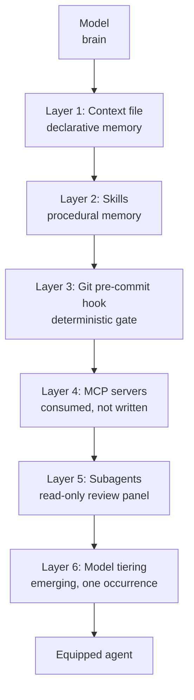
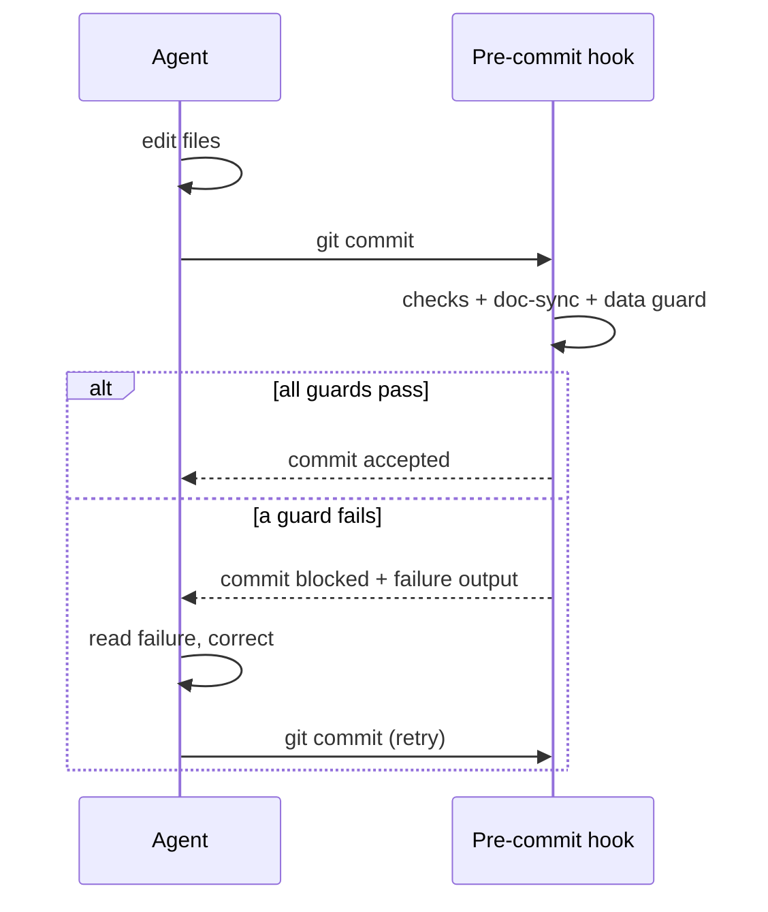
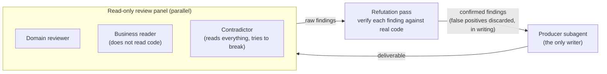

# The Agentic Architecture

*The six layers that turn a model into an equipped agent, each now carrying its field verdict: two kept, three rebuilt, one emerging.*

The three pillars are not ideas. They are files, processes, and extension points. A modern agent is not a model you talk to; it is a model wrapped in a technical harness, and that harness lives in the monorepo described in [Chapter 02](./02-vault-and-sources-of-truth.md). It has six layers.

The first version of this chapter described the stack as designed. This one describes it as adopted. Every layer now carries a verdict: what real projects did with it when nobody was watching. Two layers survived untouched. Three exist in the field in a different shape than the one v1 taught, and it is the field's shape that is documented here. The sixth has exactly one occurrence.

> **Status of the evidence.** The field verdicts in this chapter come from a private corpus: dated facts, counts obtained by command, checked by an internal audit in three adversarial passes. Readers cannot replay them; they can, however, test every mechanism described here on their own project.



The layers stack: each adds a capability, and each closes a specific failure mode. The table below is the summary; the sections that follow are the detail.

| Layer | What it is | Failure it prevents | Field verdict |
|---|---|---|---|
| 1 Context file | Declarative memory | The agent reinventing conventions | **Kept**: present on every ground |
| 2 Skills | Procedural memory | Re-explaining a procedure every time | **Kept**: verbatim copies observed |
| 3 Git pre-commit hook | Deterministic gate at commit | Good practice depending on memory | **Rebuilt**: the real road is the git hook |
| 4 MCP servers | Structured external access | Stale data pasted into prompts | **Rebuilt**: consume, don't write |
| 5 Subagents | Read-only review panel | The producer grading its own work | **Rebuilt**: the real pattern is the panel |
| 6 Model tiering | Models matched to roles | Paying judgement rates for measurement | **Emerging**: one occurrence |

---

## 3.1 The memory layer: the context file

A context file is loaded automatically at the start of every agent session (by convention `AGENTS.md`, `CLAUDE.md`, or a vault index) at the root of the repository. It is the first pillar made operational: declarative memory.

It is also the sturdiest layer in the corpus: every ground observed, without exception, carries a root context file. When a practice survives its authors' distraction, it is because it costs less than its absence.

Two disciplines decide its effectiveness.

**Keep it lean.** Everything in it is reloaded on every turn and consumes context budget. Write only the cross-cutting and the stable: conventions, commands, architecture rules, permanent prohibitions. The detail of a feature lives in its contract, not here.

**Layer it.** A short root file points to specialized files loaded on demand. The agent reads a subsystem's detail only when it works on that subsystem.

A minimal, layered context file:

```markdown
# Project context

## Commands
- build:  `npm run build`
- test:   `npm test`

## Architecture (cross-cutting only)
- Code is the source of truth for the data schema.
- One feature = one contract in `vault/contracts/`.

## Permanent prohibitions
- Never push without an explicit human go. *(Cause: two unsolicited deploys, 2026-04-02.)*
- Never hand-edit files under `apps/*/src/__generated__/`.

## Going deeper (loaded on demand)
- Backend detail: ./apps/backend/docs/
- Decisions:      ./vault/decisions/
```

Note the shape of the prohibitions: each cites the incident that created it. A prohibition without a cause is a dogma the next session will renegotiate; a dated prohibition is a scar nobody reopens. The full template is in [Chapter 01](./01-three-pillars.md).

**When it loads:** at session start, every session.
**Failure it prevents:** the agent reinventing a convention because it never knew one existed.

---

## 3.2 The capability layer: skills

A skill is a folder that encapsulates a reusable capability: an instruction file, sometimes scripts and templates. The key principle is **progressive disclosure**: the agent loads a skill's content only when the task triggers it. You can therefore keep dozens of capabilities without saturating the default context.

A skill encodes proven know-how so it never has to be re-explained. It is *procedural* memory, where the context file is *declarative* memory.

The layer is verified by the harshest test there is: copying. This repository's grey-zone-scan skill was found on one ground copied byte for byte: a `diff` with zero divergence. The other field skills follow the same shape with local content: in-house delivery protocols, editorial procedures, publishing commands. The pattern is stable: one skill per procedure someone got tired of re-explaining.

A minimal skill is a `SKILL.md` with frontmatter; the `description` is the trigger, and it deserves more care than anything else:

```markdown
---
name: grey-zone-scan
description: >-
  Run a systematic grey-zone scan of a freshly generated prototype against its
  contract or brief. Use immediately after a prototype generation, and again
  after every iteration pass. Produces a grey-zone ledger.
---

# Grey-Zone Scan

Compare the build to its reference while it is fresh. For every observable
element, ask one question: did the reference specify this explicitly?
Yes → move on. No → record it in the ledger. Zone by zone, state by state,
interaction by interaction. Do not eyeball it; walk the checklist.
```

**When it loads:** when a task matches the skill's `description`.
**Failure it prevents:** re-explaining a multi-step procedure on every use, and the drift that comes from explaining it slightly differently each time.

See `skills/` in the repository for the complete examples.

---

## 3.3 The gate layer: the git pre-commit hook

A hook asks the model nothing. It runs. That is what turns a good practice into a *guarantee*.

Version 1 of this chapter placed that guarantee in the assistant's lifecycle hooks: after every edit, before every commit, wired into the agent's configuration. The field settled it differently: not a single agent configuration in the corpus declares a lifecycle hook. The only real materialization of this layer is a **git pre-commit hook**, wired through `core.hooksPath`, versioned with the repository. So that is what the method now documents as the main road.

The move is not a downgrade. The commit is the boundary where work becomes history, and a guard posted at that boundary has three properties no assistant hook will ever have:

- it is **tool-agnostic**: it holds whether the commit comes from the agent, a human, or a different agent than the one you planned for;
- it is **versioned with the code**: clone the repository, wire one line, the guard is in place;
- it is **inescapable**: nobody "forgets" a pre-commit hook; it gets bypassed explicitly, and an explicit bypass is visible.

The wiring is one command, worth putting in the repository README:

```bash
git config core.hooksPath .githooks
```

And the field pattern is the **dispatcher**: a single `.githooks/pre-commit` file that calls each guard in turn. Three guards recur in the field:

```bash
#!/usr/bin/env bash
# .githooks/pre-commit dispatcher: every guard runs, first failure blocks.
set -euo pipefail

./hooks/run-checks.sh        # tests + lint on staged files
./hooks/doc-schema-sync.sh   # schema changed => canonical docs in same commit
./hooks/no-real-data.sh      # block real domains, emails, dumps in fixtures
```

The first guard is classic. The second enforces a method rule: knowledge and code travel in one commit, or not at all (see `hooks/doc-schema-sync.sh` in the repository). The third protects a public history from real data: a guardrail born from incidents, detailed in [Chapter 12 · Secrets & PII](./12-secrets-and-pii.md).

The **self-correction loop** remains, simply relocated to the commit: the agent edits, tries to commit, the guard blocks, the failure returns to the agent, the agent fixes and recommits.



Assistant lifecycle hooks remain possible: a post-edit formatter shortens the loop. Treat them as a convenience, never as the guarantee: nothing critical should depend on a mechanism that vanishes when you change tools. The guarantee lives at the commit.

**When it loads:** on every `git commit`, whoever the author is.
**Failure it prevents:** a good practice that depends on someone (human or agent) remembering to do it.

Where these guards sit in the full chain, including the CI side, is covered in [CI/CD & Hooks](../reference/cicd-and-hooks.md).

---

## 3.4 The access layer: MCP servers, consumed

An MCP server gives the agent structured access to an external resource: a database, a hosting provider, an internal tool. Instead of pasting data into the prompt, the agent queries the source on demand, through a defined tool contract. That is what wires it to the real world without drowning it in context.

Version 1 taught how to write your own server in TypeScript. Field verdict: nobody wrote one. The only MCP wiring observed is a project-level `.mcp.json` that **consumes existing published servers**, launched via `npx`: six servers from a hosting provider, and not one line of home-grown server anywhere. The example server this repository shipped was never copied by anyone. The method draws the rule:

> **You consume MCP servers. You do not write them.** The ecosystem already publishes servers for databases, hosting providers, browsers, ticketing tools. Your job is selection and wiring, not development.

The standard wiring:

```json
{
  "mcpServers": {
    "hosting": {
      "command": "npx",
      "args": ["-y", "@example/hosting-mcp"],
      "env": { "HOSTING_API_TOKEN": "${HOSTING_API_TOKEN}" }
    }
  }
}
```

One non-negotiable security rule travels with this file: it is often versioned, so **never a token in clear text inside it**. An environment variable, nothing else. The corpus carries a real incident of an access token sitting in clear text in an MCP configuration that was probably committed; [Chapter 12](./12-secrets-and-pii.md) turns that lesson into an executable guard.

Writing your own server becomes legitimate again in one narrow case: the resource has no published server, the access sits on the project's critical path, and you accept maintaining that code like any production code. It is an investment decision, not an architectural reflex, and it deserves a dated decision in the vault.

**When it loads:** when the agent invokes one of the server's tools.
**Failure it prevents:** stale data pasted into a prompt, and the stillborn home-grown server nobody will ever use.

---

## 3.5 The division-of-labour layer: the review panel

A subagent is an instance dedicated to a role, with its own context. Version 1 promoted the explorer/editor pair: a reader that synthesizes, an editor with a clean context. That pair left no trace in the field. What the field built instead, everywhere subagents exist at all, is something else and better: the **fanned-out, read-only review panel**.

The pattern has three fixed properties:

1. **Exactly one role mutates the code.** The producer, and nobody else, writes.
2. **Reviewers are read-only and parallel.** After a production pass, a fan of reviewers goes out in parallel, each with its own lens: domain-specific technical review, a business reader who does not read the code, a contradictor who reads everything and tries to break it. None of them can "fix it while they're there": a reviewer that edits has stopped reviewing.
3. **No finding is acted on without refutation.** The panel's raw findings pass through a counter-verification against the real code before they reach the producer. False positives are discarded with a written justification; only confirmed findings trigger a fix.



Refutation is not a courtesy: it is what makes the panel usable at all. A panel without refutation drowns the producer in ghosts. The corpus puts a number on it from one project (private-corpus figures; see the evidence note at the top of this chapter): 45 raw findings, 32 confirmed, 13 false positives discarded with justification. Without the refutation pass, thirteen pointless fixes would have consumed the budget of the nineteen real ones.

The explorer/editor pair remains a reasonable context economy for large codebases, but it is a hypothesis, not a proven pattern. The panel is what the field built spontaneously, on unrelated projects. When several grounds invent the same structure without coordinating, the method listens.

**When it loads:** after every production pass, before any fix.
**Failure it prevents:** the producer grading its own work, and the flood of false positives that turns a review into noise.

The full protocol (rounds, graded verdicts, the two-dry-passes stopping rule, the honest freeze) is in [Chapter 07 · Adversarial Review](./07-adversarial-review.md). The orchestration mechanics are in the [Orchestration reference](../reference/orchestration.md).

---

## 3.6 The model-tiering layer: an emerging pattern, one occurrence

Version 1 presented a three-tier split (conductor, lieutenant, runner) as a proven architecture. Retracted: the corpus contains no field trace of that tiering. The observed default, everywhere, is simpler: **one strong model for everything that requires judgement.**

Tiering exists on exactly one occurrence, and it is worth describing precisely because its dividing line is unexpected. On a rebuild project against a frozen reference, the work was distributed across four roles:

| Role | Remit | Model class |
|---|---|---|
| **Product steering** | Holds the registry, prepares the gates | Strong model |
| **Code** | The only role that writes | Strong model |
| **Contradictor** | Contests everything; must justify even a "nothing to report" | Strong model |
| **Acceptance** | Mechanical, repeatable measurement: pixel comparison, contrast checks, keyboard runs | Lower-tier model |

Exactly one role steps down a model tier: acceptance. The dividing line is neither importance nor volume: acceptance is decisive; it is the role that closes stages. The dividing line is **judgement versus measurement**: a role steps down when its success can be checked by a repeatable measure, with no interpretation involved. Everything that judges stays on the strong model.

The engagement rule that holds the topology together deserves quoting:

> **No stage is ever closed by the one who built it.**

It is the same hygiene as the layer-5 panel, lifted to the level of the plan: the builder delivers, another role measures, and closing belongs to the one who measures, never to the one with an interest in being done.

Honest status: **one occurrence is not a canon.** This chapter publishes it as an emerging pattern: a topology observed once, consistent with the rest of the method, to be tested against your own projects. Until more occurrences exist, the safe choice remains the field default: a strong model everywhere, and step down only what can be verified by measurement.

**When it loads:** when the execution plan is designed and the roles are cast.
**Failure it prevents (intended):** paying judgement rates for measurement work, without ever handing judgement to a model that cannot carry it.

---

## The six layers together

No single layer makes an agent reliable. The context file without a gate at the commit is memory with no enforcement. A gate without a contract enforces nothing meaningful. MCP without a panel floods one context with external data nobody counter-checks. The architecture is the *stack*, and the stack maps directly onto the three pillars:

- Layers 1-2 (context file, skills) build the **memory** pillar.
- Layer 3 (pre-commit hook) and the prohibitions in layer 1 build the **guardrails** pillar, and layer 5 (the panel) extends it to the moment of delivery.
- The **contract** pillar is upstream of all six: it is what the layers serve.

Version 2 of this stack is humbler than version 1: two layers kept, three rebuilt around what the field actually constructed, one demoted to an observation. It is also harder: every remaining layer survived real projects, which is the only authority a method can claim.

## See also

- [Chapter 01 · The Three Pillars](./01-three-pillars.md)
- [Chapter 02 · The Vault & Sources of Truth](./02-vault-and-sources-of-truth.md)
- [Chapter 07 · Adversarial Review](./07-adversarial-review.md)
- [Chapter 12 · Secrets & PII](./12-secrets-and-pii.md)
- [Reference · CI/CD & Hooks](../reference/cicd-and-hooks.md)
- [Reference · Orchestration](../reference/orchestration.md)
