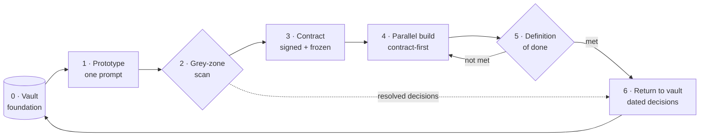
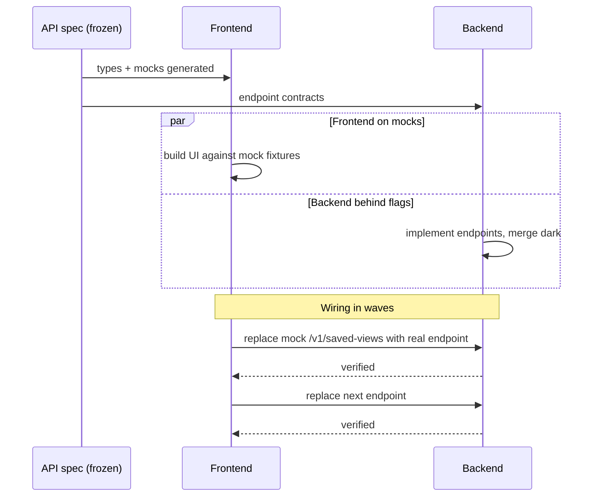

# The Delivery Chain

*From an empty repository to production, in seven steps that loop back to
where they started, with one hard prohibition, and two variants owned in
writing.*

The delivery chain is the heart of Mainstay. It is a loop: knowledge feeds a
prototype, the prototype is scanned, a contract is signed, front and back build
in parallel, a per-layer definition of done gates the result, and the decisions
that emerged flow back into knowledge, so the next feature starts richer.



Each step has inputs, outputs, a discipline that makes it work, and a metric it
can produce. An honest word about those metrics: they are **proposed
instruments, not proven ones**: no project in the corpus ever collected them
as such. They stay in the tables because they tell you where to look, not
because they have earned their keep (see
[Reference · Metrics](../reference/metrics.md)).

This chapter walks the seven steps, names the prohibition that holds the whole
chain together, then documents two situations where the chain bends without
breaking: the **contract without a prototype** (internal tooling) and **design
grafted onto an existing site** (the AS-IS / GRAFT / NEW triage).

---

## Step 0: The vault, the foundation of everything

Before the first line of feature code, the vault exists in the monorepo:
design system, conventions, decisions, constraints.

| | |
|---|---|
| **Inputs** | Prior project knowledge, design system, house conventions |
| **Outputs** | A populated vault the agent can read |
| **Discipline** | Knowledge lives in the monorepo, versioned with code ([Chapter 02](./02-vault-and-sources-of-truth.md)) |
| **Metric** | Vault coverage: how much of a new feature is already answered |

A poor vault produces agents that hesitate; a rich vault produces agents that
decide correctly. Step 0 is not a phase you finish; it is the floor every
later step stands on, and Step 6 keeps raising it.

---

## Step 1: The prototype, in a single prompt

The prototype comes out of a single generation.

> **One prompt = one prototype.**

If the agent does not deliver a usable screen in one pass, it is not the agent
that failed; it is the upstream brief that was vague. The number of
iterations is a direct measure of brief quality. This is the single most
important diagnostic in the chain: a screen that took five prompts is telling
you the brief had five holes.

Inside that one generation, you ask for two to four solid internal passes:

1. **Structure**: layout, zones, component hierarchy.
2. **Implementation**: real content, states, wired interactions.
3. **Polish and responsive**: spacing, typography, breakpoints.
4. **Cross-viewport verification**: the agent checks its own output.

| | |
|---|---|
| **Inputs** | The brief + the vault |
| **Outputs** | A working, usable prototype screen |
| **Discipline** | One prompt; internal passes; no piecemeal regeneration |
| **Metric** | Iterations per screen (target: 1) |

The prompt that produces the prototype is itself a contract; see
[Chapter 06 · The Prompt as a Contract](./06-prompt-as-contract.md). The
running example's prototype prompt is in `examples/walkthrough/01-prototype-prompt.md`.

---

## Step 2: Validation by grey zones

You compare the prototype to the initial brief, point by point, while it is
fresh. For every observable element, one question: *did the brief explicitly
ask for this?* If yes, move on. If no, it is a **grey zone**: a decision the
agent made by default.

| | |
|---|---|
| **Inputs** | The prototype + the initial brief |
| **Outputs** | A grey-zone ledger; each entry routed to a decision or a contract note |
| **Discipline** | Systematic sweep: zone by zone, state by state; re-scan after every pass |
| **Metric** | Grey-zone rate (grey zones found per screen) |

This step is the part almost no one does, and the part that pays the most.
[Chapter 05 · Grey Zones and Divergence](./05-grey-zones-and-divergence.md) is
the full protocol. The filled scan for the running example is
`examples/walkthrough/02-grey-zone-scan.md`.

---

## Step 3: The contract

The validated prototype becomes a signable contract. The contract adds to the
pixels everything the pixels do not show: endpoints, permissions, error
states, transitions, rules, test data.

Two signatures are required: **product and engineering**. Without both, you
do not freeze.

The double signature kills a specific, expensive trap: "approved on the UX
side, found unbuildable on the performance side two weeks later." Product
signs that the behaviour is right; engineering signs that it is buildable as
specified. A contract frozen without engineering's signature is a contract
that hides its own infeasibility.

| | |
|---|---|
| **Inputs** | The validated prototype + the resolved grey-zone ledger |
| **Outputs** | A frozen, double-signed contract in `vault/contracts/` |
| **Discipline** | No freeze without both signatures; `status: frozen` set explicitly |
| **Metric** | Contract lead time: brief to frozen contract |

```yaml
---
type: contract
screen: "saved-views-panel"
version: "1.0"
status: frozen
signed_product: true
signed_engineering: true
frozen_on: 2026-05-18
related_decisions: [DEC-007, DEC-011]
---
```

The contract structure is in [Chapter 01](./01-three-pillars.md); the filled
contract for the running example is `examples/walkthrough/03-contract.md`.

---

## Step 4: Parallel implementation, contract-first

> **Nothing is built until the contract that covers it is frozen.**

This prohibition is hard, and it comes from the field: on a fintech with two
real signatories and on a two-developer, multi-repo product alike, it is
written into the agent's context file: the framing phase is not negotiable
there, and a build started without a freeze stops, however far along it is.
Note the qualifier: the contract *that covers it*. The prohibition does not
serialize the project: two work packages advance in parallel, each behind its
own freeze. It forbids exactly one thing: coding against a target that is
still moving. Everything the rest of the chain promises (the parallelism of
this step, the binary DoD of the next) rests on a target that holds still;
building before the freeze reintroduces the moving target and pays for the
fifteen bombs at integration all over again.

So front and back advance **in parallel**, on the same contract. The mechanism
is **contract-first**:

1. The **versioned API spec is frozen first**. It becomes the shared technical
   truth. (`examples/walkthrough/04-api-spec.yaml`.)
2. The **front starts on mocks** derived from the contract, with types
   generated from the spec: no waiting for a line of backend.
   (`examples/walkthrough/05-mocks/`.)
3. The **back advances behind feature flags**, mergeable to production before
   the front is ready.
4. The two are joined by **wiring in waves**, endpoint by endpoint: a gradual,
   verifiable replacement of each mock by its real endpoint, not a risky
   final phase.



You never sequence back-then-front. Sequencing serializes a project that the
contract has made parallelizable.

| | |
|---|---|
| **Inputs** | The frozen contract + the frozen API spec |
| **Outputs** | Front and back implemented, joined wave by wave |
| **Discipline** | Nothing before the freeze; spec frozen first; front on mocks; back behind flags; wiring in waves |
| **Metric** | Velocity: endpoints wired per unit time |

---

## Step 5: The definition of done, per layer

"Almost done" does not exist. The definition of done is checked per layer.

**Contract done:** all sections filled, double signature, `status: frozen`.

**Backend done:** code written; tests passing; API spec up to date;
integration verified against a stub; performance measured on a realistic data
volume.

**Frontend done:** every state implemented; every endpoint consumed; error
cases handled; permissions respected; pixel-conformant to the prototype.

| | |
|---|---|
| **Inputs** | The implemented feature |
| **Outputs** | A fully-checked per-layer DoD checklist |
| **Discipline** | Binary: a layer is done or it is not; no partial credit |
| **Metric** | DoD pass rate on first review |

Every ticked box is a claim, and claims get proven: per-layer verification is
a matter of measurement on the real code path, not declaration; see
[Chapter 08 · Proof and Probes](./08-proof-and-probes.md). And a fully-checked
DoD is **not** an authorization to deploy: the go is a separate ritual, human
and explicit; see
[Chapter 09 · The Release Gate and the Registry](./09-release-gate-and-registry.md).

The filled DoD for the running example is
`examples/walkthrough/07-definition-of-done.md`. If a layer is not done, the
chain loops back to Step 4: that is the `not met` edge in the diagram.

---

## Step 6: The return to the vault

The decisions that emerged (from the grey-zone scan, from the build) return
to the vault as dated decisions (`DEC-XXX`).

| | |
|---|---|
| **Inputs** | Decisions made during Steps 2-5 |
| **Outputs** | New `DEC-XXX` notes in `vault/decisions/`; updated concepts |
| **Discipline** | Every decision historized before the feature is considered closed |
| **Metric** | Decisions captured per feature (a proxy for learning retained) |

The next feature starts with a richer context. The infrastructure gets
smarter every cycle. This is the loop closing: Step 6 feeds Step 0.

A decision note for the running example
(`examples/walkthrough/06-decision-DEC-007.md`):

```yaml
---
type: decision
id: DEC-007
date: 2026-05-14
status: accepted
supersedes: null
---
```

```markdown
# DEC-007: Default-view behaviour

## Context      Grey-zone scan on saved-views-panel: the brief did not say
                what happens when a user marks a second view as default.
## Decision     Marking a view as default clears the default flag on any
                other view; exactly zero or one default per user.
## Justification A single default keeps the load behaviour deterministic.
## Consequences Contract §9 gains a rule; API adds POST /v1/saved-views/{id}/default.
```

---

## The owned variant: a contract without a prototype

The chain as described assumes a screen. Internal tooling does not always
deserve one: an acceptance-testing agent, a generator, a pipeline that only
the project's own operators will ever see. For deliverables like these, a
fintech in the corpus wrote down an **explicit method precedent**, invoked
twice: the contract is written directly, with no prototype.

The variant is a straight application of the dosage variable: **code
ownership × cost of error**. The prototype pays off when someone has to *see
it right* before building: a client, a user, a product signatory who judges on
pixels. On an internal tool (owned code, where an error is fixed by
re-shipping to yourself), that return collapses. The contract's return stays
whole.

What drops, and what holds:

| | |
|---|---|
| **Drops** | Step 1 (the prototype) and Step 2's sweep over pixels |
| **Moves** | The grey-zone sweep runs over the contract text, section by section: a spec's silences are grey zones exactly as unrequested pixels are |
| **Holds, in full** | The contract, its two signatures, its freeze; and Step 4's prohibition, *harder* than elsewhere: without a prototype, the contract is the only reference that exists |

One condition makes the variant legitimate, and only one: **it is written
down.** On the originating project, the direct contract without a prototype is
recorded as a method precedent, named as such, citable against later work. The
same shortcut taken in silence is not a variant; it is drift. The difference
between the two is one dated line in the vault.

---

## Design grafted onto an existing site: AS-IS, GRAFT, NEW

The second place the chain bends: shipping a module that must slot into a
site already in production, with a design already established. The canon makes
the validated prototype the visual truth. Here that assumption breaks: **the
visual truth is the live site**, and an internal prototype, however good, is
a contamination risk. The apparatus below comes from one project in the
corpus: an audit vault on a client's platform, where every delivered screen
had to look native.

### The triage

Every screen in scope is placed in exactly one of three classes:

| Class | When | The visual reference | The risk to watch |
|---|---|---|---|
| **AS-IS** | The screen exists on the live site and will do | The capture of the real screen | "While we're at it": the agent improves a screen it was told to take as-is |
| **GRAFT** | The container exists (chrome, navigation, layout); the content is new | The capture of the real container + the content brief | An interior that clashes with its frame: two styles in one screen |
| **NEW** | No equivalent exists | The style guide + the contract | A screen that looks like it came from another site |

The triage comes before any prototype: it decides, screen by screen, *what is
allowed to be drawn at all*. An AS-IS screen never enters Step 1: there is
nothing to generate, only something to take over. A GRAFT screen enters it for
its interior only. Only NEW runs the full canonical chain.

### The switch log

A classification is not a verdict: it is a working hypothesis, reversible by
construction. Screens change class as your understanding of the live site
sharpens, and that is expected. The discipline is not to forbid the switch;
it is to **log it**. The screen registry keeps, for every switch, two exhibits:
the capture that motivated it, and the decision-maker's sentence that settled
it.

On the originating project, one screen changed class twice in two days
(graft, new, then graft again), each switch traced with its capture and its
quote. Cost of the round trip: zero, precisely because it was written down. An
unlogged switch, by contrast, is a grey zone at the scale of an entire screen:
someone changed the nature of a deliverable, and nobody knows who, when, or
why.

### The anti-contamination design submission kit

When the design work is handed to a dedicated design agent (a separate
session, without the project's context), you hand it a **self-contained
submission package**:

1. **A mission order with the hierarchy of sources of truth**, in order:
   captures of the live site, then the per-screen briefs, then the contracts,
   then the style guide. On conflict, the higher source wins.
2. **A blocking step 0**: look at the captures of the real site before
   producing anything. An agent that cannot open them stops: it does not
   produce "from memory."
3. **Named do-nots**: the forbidden demo values are listed one by one. Not
   "avoid placeholders": the list.
4. **The deliberate exclusion of the internal prototype.** The proto is
   removed from the package. This is the kit's counterintuitive move, and its
   most important one: an agent that sees a prototype copies it; that is its
   natural slope. On grafted design, copying the internal proto is precisely
   missing the target, which is to blend into the live site. The canon makes
   the prototype the source of truth; here, you organize its **quarantine**.

### When the hierarchy flips: in writing

The same project carries the end of the story, and its lesson. Once the design
agent's prototypes were finalized and validated, a written, dated rule flipped
the local hierarchy: the finalized protos now take precedence over the vault,
which aligns to them. And the same project records its own breach of this
chapter's prohibition: no contract there ever reached `status: frozen`, first
because the audit pass forbade any freeze, then because the truth had pivoted
to the finalized protos. The chain held through a different frozen reference:
the captures, then the validated protos.

The lesson is not that the hierarchy of sources of truth is sacred. It is
that it may flip: **by dated rule, never by attrition**
([Chapter 02 · The Vault and Sources of Truth](./02-vault-and-sources-of-truth.md)).
The flip was not the scandal; the silence would have been.

*The field facts in this chapter (prohibitions, precedents, switches) come
from a private corpus: dated facts, verified by an internal audit in three
adversarial passes, not replayable by the reader (see the
[Preface](../00-preface.md)).*

---

## Why the loop matters

A linear process delivers a feature. A loop delivers a feature *and* leaves the
infrastructure better than it found it. Run the chain once and the gain is one
screen. Run it across a project and Step 0 is never empty again: every feature
inherits the decisions, contracts, and conventions of every feature before it.
That compounding is the return on the discipline.

## See also

- [Chapter 02 · The Vault and Sources of Truth](./02-vault-and-sources-of-truth.md)
- [Chapter 05 · Grey Zones and Divergence](./05-grey-zones-and-divergence.md)
- [Chapter 06 · The Prompt as a Contract](./06-prompt-as-contract.md)
- [Chapter 08 · Proof and Probes](./08-proof-and-probes.md)
- [Chapter 09 · The Release Gate and the Registry](./09-release-gate-and-registry.md)
- [Profile P · Product Build](../profiles/product-build.md)
- [Profile R · Run & Audit](../profiles/run-and-audit.md)
