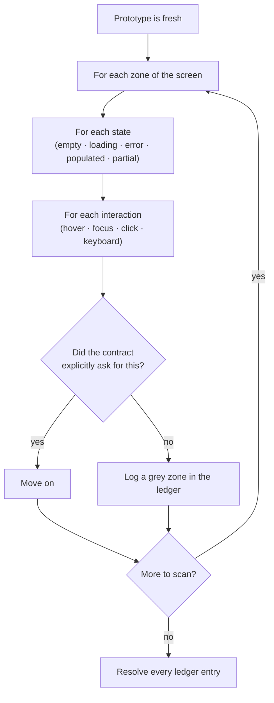
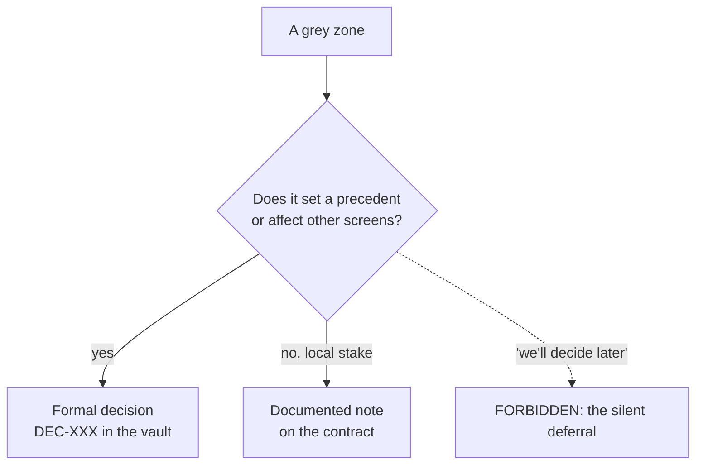

# Grey Zones & Divergence

*A grey zone is a decision the agent made by default, in the dark, without
authority to make it. Finding them is the heart of the method; resolving them
is what even well-kept ledgers forget.*

This is the core of Mainstay, and the part almost no one does. This chapter
gives the detection protocol and the valid outcomes, then what the field
taught us by actually running the protocol: the shapes a ledger really takes,
how grey zones are inherited across repositories, the twin artefact that
appears when you rebuild against a frozen reference, and the counter that
keeps a ledger from becoming a graveyard.

> The field facts in this chapter come from a private corpus: dated events,
> counts obtained by command, verified by an internal audit in three
> adversarial passes. They are not replayable by the reader.

## Definition

A grey zone is everything the agent decided on its own because neither the
prototype nor the contract specified it.

It is neither an error nor a correct answer. It is a decision taken **by
default, in the shadow, by someone who had no authority to take it**: an
empty state filled in the agent's own way, an invented hover behaviour, a
sort order chosen arbitrarily, an error message no one approved, a permission
assumed. None of these is "wrong." Each is a choice that someone with
authority (product, design, engineering) should have made, and didn't, so
the agent made it instead. The danger is not the choice. The danger is that
**no one knows the choice was made.**

The British spelling "grey" is used deliberately and consistently throughout
Mainstay: it is a coined term of the method, not ordinary prose.

## Why grey zones are the expensive failure mode

A bug announces itself: something is visibly broken. A grey zone hides: the
screen *looks* finished. It is a silent decision that surfaces weeks later,
at integration, when fifteen of them detonate together.

> Fifteen unresolved grey zones are fifteen bombs that explode together at
> integration.

The clustering is structural. Each grey zone is a gap between what was
specified and what was built. Gaps do not block the build (the agent filled
them), so the build proceeds and the gaps accumulate. They are discovered
only when something *external* (a second integration, a real user, a load
test) probes the assumption. By then there are many, and they are expensive.

The whole point of the protocol is to move that discovery **forward in
time**, to the moment the prototype is fresh and a grey zone costs one
sentence to resolve.

## The detection protocol

You compare the product to the initial brief, while it is fresh. For every
observable element, exactly one question:

> Did the contract explicitly ask for this?

- **Yes** → move on.
- **No** → it is a grey zone.

The sweep is **systematic**: zone by zone, state by state, interaction by
interaction. "Systematic" is not a tone; it is a coverage requirement. You do
not scan the parts that catch your eye. You walk a grid.



The sweep grid. Run the question against every cell:

| Dimension | Cells to walk |
|---|---|
| Zones | Header, list/content, side panel, footer, modals |
| States | Empty, loading, partial, populated, error, success |
| Interactions | Hover, focus, click, keyboard, drag, long-press |
| Data | Min, max, overflow, missing fields, very long strings |
| Permissions | Each role: what is visible, enabled, disabled, hidden |

And because every iteration pass *creates new grey zones* (a polishing agent
makes new micro-decisions), **you re-scan after every pass**. A single scan
at the end misses everything the finishing passes introduced.

## The two outcomes, and what became of deferral

Every grey zone detected before the contract freeze resolves to exactly one
of two outcomes.

**A formal decision.** Recorded in the vault, dated, justified: it becomes a
rule. Use this when the choice sets a precedent or has consequences beyond
this one screen. It becomes a `DEC-XXX` (see
[Chapter 02 · The Vault & Sources of Truth](./02-vault-and-sources-of-truth.md)).

**A documented decision noted on the contract.** Recorded as a note in the
contract itself. Use this when the stake is local: the choice matters for
this screen and nowhere else.



The two valid outcomes share one property: after either, the grey zone is no
longer a silent choice. It is a *visible* choice (in the vault or on the
contract) that someone with authority can review, accept, or overturn. That
is the entire goal: make the invisible decision visible.

What you never do is the *silent* deferral: "we'll decide later," with no
date and no owner. Version 1 of the method banned deferral absolutely. The
field amended that: there is one form of deferral that is not silent, and it
is framed below, in the divergence register. Before the contract freeze,
though, the amendment does not apply: a contract does not freeze on top of an
open row.

## The grey-zone ledger, and its field shapes

Every detected grey zone gets a row in a **grey-zone ledger**, kept beside
the contract during Steps 2-3 of the
[delivery chain](./04-delivery-chain.md). The canonical shape is a table:

| ID | Observed | Zone / state | Question | Outcome | Resolution |
|---|---|---|---|---|---|

The template is
[`templates/grey-zone-ledger.md`](../../../templates/grey-zone-ledger.md); a
filled ledger for the (fictional) running example `saved-views-panel` is
[`examples/walkthrough/02-grey-zone-scan.md`](../../../examples/walkthrough/02-grey-zone-scan.md).
Read it as a worklist: the feature is not ready for the contract until every
row has an outcome and a resolution. The row count per screen is the
grey-zone rate ([metrics](../reference/metrics.md), a proposed, unproven
instrument); a high rate is not shameful, it means the scan worked. A zero
rate usually means the scan was skipped.

The canon prescribes the table. The field produced four shapes, all
defensible, each with its cost:

| Shape | Seen on | When it fits | What it costs |
|---|---|---|---|
| Markdown table beside the contract (canonical) | A legacy e-commerce platform in production (ten entries, each tied to a contract or a decision); a two-developer, multi-repo product (twenty-five entries, dated scan passes, traced arbitrations) | The canonical chain, one screen at a time | Nothing: it is the default shape, versioned with the code |
| Sorted spreadsheet, per-domain numbering, P0/P1/P2 priorities arbitrated by the PO | A fintech (thirteen grey-zone workbooks) | High volume, arbitration by a non-technical PO, need for sorting and filtering | The artefact leaves git: no diff, no history; keeping it in sync with the vault becomes its own ritual |
| A family of ledgers, one per screen, in the contracts directory | An audit vault on a client's platform (fifteen ledgers, 312 entries counted by command) | Many-screen efforts; counting by command becomes possible | Volume hides stagnation; see the resolution counter |
| Inline escalation: "block and ask," no ledger | A pilot feature on a SaaS product (written rule: do not guess the data schema, ask for it) | Short effort, one head, code you own | Without a trace, the arbitration gets lost: on that same field, two files gave two different values for the same count, and the divergence was never arbitrated |

The format is free. The invariant is not: **no gap between brief and build is
settled in silence**; every gap goes through a ledger, or through a question
that blocks the build until it is answered. The canonical "two outcomes only"
form held as-is on three fields; everywhere else it was reincarnated or
amended *in writing*, never abandoned by attrition.

## Nominal inheritance across repositories

When a product lives in several repositories, grey zones do not respect repo
boundaries: a question about the shared data layer concerns every repo that
consumes it.

On a two-developer, multi-repo product (two owned repos, plus a backend held
by the partner developer and out of reach), each repo keeps its own ledger,
and the second repo's ledger did not copy the shared questions: it
**inherited five entries nominally** from the first, same identifier, origin
cited, status kept live. The rules that fall out:

- **Inheritance is nominal.** An inherited grey zone keeps its original
  identifier and cites its source ledger. Never renumber it: two numbers for
  one question means two possible answers.
- **Resolution belongs to the source ledger.** The inheriting repo reads the
  status; it does not change it. One resolution authority per question,
  wherever the question is read.
- **An inherited grey zone can freeze an entire phase.** On this field, a
  phase of the downstream repo stayed "frozen" until four inherited entries
  were settled. That is the intended behaviour, not an accident: the build
  does not fill upstream gaps.
- **Authority can sit on the other side of the boundary.** One entry local to
  the downstream repo was settled by the partner developer, because the
  technical boundary in question was his to rule on. The ledger records *who*
  settled, not just what.

Nominal inheritance is the grey-zone version of a broader multi-repo
principle: one truth per question, references everywhere else (see
[Chapter 02](./02-vault-and-sources-of-truth.md)).

## The divergence register: the twin artefact

Everything above assumes you are building something new against a brief. The
field met the other situation: rebuilding a site against a **frozen
reference**: a prototype declared to be the truth, down to the pixel. The
scanning question changes in kind. It is no longer "did the contract ask for
this?"; it is "does the rebuild do what the reference does, and if not, is
the gap intended?"

That situation produced a twin of the ledger: the **divergence register**.
Same skeleton (numbered rows, one question per row, arbitrations routed to
the human with authority) but a different object:

| | Grey-zone ledger | Divergence register |
|---|---|---|
| Object | Decisions taken in the dark, absent a spec | Divergences *measured* against a frozen reference |
| Question | Did the contract explicitly ask for this? | Does the reference do the same, and is the gap intended? |
| When | Steps 2-3, before the contract freeze | Throughout the rebuild, the reference being frozen already |
| Outcomes | Two: formal decision or contract note | Four statuses: owned · fixed · awaiting arbitration · dated deferral |

The four statuses:

- **Owned**: the divergence is kept, and justified in writing. The field
  rule that founded this status: *do not repair what the reference does not
  do.* A rebuild is not an occasion to improve things quietly; "better than
  the reference" is a divergence like any other.
- **Fixed**: the divergence is repaired, and the fix is **re-measured under
  the same conditions** as the measurement that caught it (see
  [Chapter 07 · Adversarial Review](./07-adversarial-review.md)).
- **Awaiting arbitration**: the divergence is routed by name to the human
  with authority and held open, visible at the top of the register, until
  they rule. Rendered arbitrations carry the date and the decider's name.
- **Dated deferral**: the divergence is pushed to a future pass. This is the
  amendment to the ban, and it is framed:

> **The dated deferral: the amendment to the ban**
>
> Version 1 of this chapter forbade any third outcome: "we'll decide later"
> did not exist. The field amended the rule in writing, and the amendment is
> more precise than the ban. What is forbidden is the *silent* deferral. A
> deferral is legitimate if, and only if, four conditions hold:
>
> 1. **Dated**: attached to a named future pass, with a deadline; not
>    "later," a date.
> 2. **Arbitrated**: the deferral itself is a decision, made by someone with
>    authority, not a lapse of attention.
> 3. **Named**: the register records who decided the deferral and who will
>    carry it.
> 4. **Counted**: the row stays in the register and in the resolution
>    counter; a deferral is not an exit.
>
> The difference fits in one sentence: a framed deferral is a sequencing
> decision; "later" without a date is the absence of a decision. The first is
> steering. The second is still the third outcome, and it is still forbidden.

On its field of origin, the divergence register also absorbs the adversarial
review's findings, with their before/after measurements replayed, and the
per-view fidelity measurements. And the fidelity verdict is rendered on the
*shape* of the divergent zones, not on the percentage alone: a few pixels on
an animated element are a false positive; a shifted block of text is a real
divergence, even if it weighs fewer pixels.

Epistemic status: the divergence register has **one field occurrence**. It is
an emergent pattern, published as such: prescribed because it solved a real
problem once, and because no other artefact in the corpus covers rebuilding
against a frozen reference. It is not proven canon.

Which artefact for which situation:

| Situation | Artefact |
|---|---|
| New build: brief → prototype → contract | Grey-zone ledger |
| Rebuild or migration against a frozen reference | Divergence register |
| Short effort, one head, code you own | Inline escalation: the agent blocks and asks, the answer is written down |

## The resolution counter

The finding this section rests on: in an audit vault on a client's platform,
fifteen ledgers held **312 grey zones**, numbered, described, each one
*dispositioned*: the outcome was designated (contract or decision), the link
in place. At the time of the internal audit, **274 were still "open"**, 38
resolved. One entire ledger: twenty entries, twenty open, all waiting on a
later pass that was never played. (Counts obtained by command on the private
corpus; not replayable by the reader.)

The ledger recorded. It did not resolve.

**Dispositioning is not resolving.** A row with a designated outcome but no
applied resolution is still a bomb; it merely has a label. And this is the
ledger's number-one failure mode, more common than the skipped scan:
recording produces an artefact, volume, a feeling of control, while resolving
costs an arbitration from someone who has other things to do. The register
grows, the build moves on, and the stock of open rows becomes a liability no
one rereads.

The countermeasure is a **resolution counter**, at the head of every ledger
and every divergence register:

```markdown
<!-- Resolution counter: updated on every state change, not at the end -->
**Open: 3 · Resolved: 14 · Dated deferrals: 1** ("accessibility" pass, 2026-09-12)
```

Four rules make it work:

1. **At the head of the file**, not in an external dashboard. The counter is
   read where the rows are written; a counter elsewhere is a counter no one
   updates.
2. **Updated on state change.** A row moving from "open" to "resolved"
   updates the counter in the same gesture, not at the end of the effort,
   when no one remembers what moved.
3. **Freezing requires "Open: 0."** This is the existing rule (no open row
   under a frozen contract) made checkable at a glance, and automatable: a
   contract lint can fail when the counter does not match the rows.
4. **Two passes with no movement trigger a dedicated resolution pass.** If,
   over two consecutive passes, only the "open" column moves, stop scanning
   and settle. One more sweep over a stock that is not melting is not rigour;
   it is accumulation.

The counter has a corollary: **the register stays the single entry point for
its own grey zones.** On one field, an entry was created outside the table
(in a waiting list in another file), and the counter never saw it: the
register had sprung a leak. A grey zone without a row exists for no one.

## Where grey zones come from

Most trace back to one of three upstream causes: a **vague brief** (the most
common; the fix is in
[Chapter 06 · The Prompt as a Contract](./06-prompt-as-contract.md)); an
**agent inventing to "improve"** (the "no invention" guardrail closes that
door; [Chapter 13](./13-patterns-and-antipatterns.md)); an **unstated state
or edge case** (the prototype showed the happy path; empty, error, and
overflow were never specified).

The scan catches all three after the fact. A sharp contract and firm
guardrails reduce how many there are in the first place. You need both:
prevention upstream, detection downstream, and the counter, so that
detection ends in resolutions.

## See also

- [Chapter 02 · The Vault & Sources of Truth](./02-vault-and-sources-of-truth.md)
- [Chapter 04 · The Delivery Chain](./04-delivery-chain.md)
- [Chapter 06 · The Prompt as a Contract](./06-prompt-as-contract.md)
- [Chapter 07 · Adversarial Review](./07-adversarial-review.md)
- [Chapter 13 · Patterns & Anti-Patterns](./13-patterns-and-antipatterns.md)
- [Reference · Metrics](../reference/metrics.md) (a proposed, unproven instrument)
