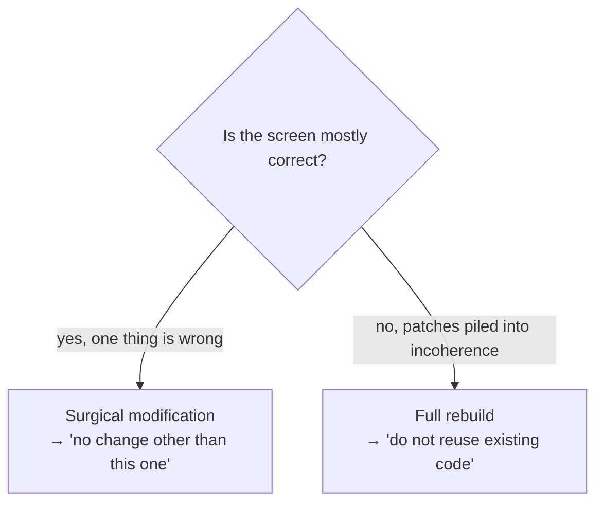

# The Prompt as a Contract

*A prompt is not a conversation. It is a contract handed to an agent, and
every section closes a door.*

The v1 of this chapter described a single genre of prompt: the screen
generation prompt. The field practiced it, and forged two more genres, both
more frequent: the **resume prompt**, which restarts a project after an
interruption, and the **orchestrator mega-prompt**, which installs an entire
multi-role session with its exit gate. This chapter gives the grammar the
three genres share, then each genre, then two sections any of the three can
carry: the **initiative mandate** and the **posture** section.

> The field facts in this chapter come from a private corpus: dated events,
> counts obtained by command, verified by an internal audit in three
> adversarial passes. They are not replayable by the reader.

## A prompt is a contract

When you talk to an agent casually, you are negotiating. Negotiation invites
interpretation, and an agent asked to interpret will fill every gap with a
guess. A prompt written as a *contract* removes the negotiation: it states
the operation, the constraints, the prohibitions, and the checklist the
agent verifies against itself.

Every section of a well-formed prompt **closes a door** through which the
agent could otherwise wander off. That is the lens for this whole chapter:
read each section as a door, and ask what walks through if it stays open.

## The shared anatomy: five sections

Five sections every contract-mode prompt carries, whatever its genre. All
five are practiced in every prompt of the corpus.

| Section | What it states | Door it closes |
|---|---|---|
| **Operation type** | Create, surgical modification, rebuild, resume, orchestration | The agent guessing the *scope* of the work |
| **Context** | Where the work lives, who uses it, what is already settled | The agent inventing a purpose |
| **Specifications** | Structure, states, content, with numeric values | The agent reinterpreting vague adjectives |
| **Prohibitions** | What it must not do | The agent "improving" things unasked |
| **Validation checklist** | Observable criteria the agent ticks itself | The agent declaring done without checking |

**Numeric values, not adjectives.** "Compact" is interpretable. "1px
separator, 600/14px title, 13px description, 70/30 split" is not. Every
value you can quantify, you must: each number is a door the agent cannot
reopen. The field pushed the rule one notch further: the best constraint is
not merely numeric, it is **verifiable by command**: the resume prompt
below is built on that idea.

> **Version note: two sections removed.** The v1 prescribed two more
> sections: "Passes" (how many internal passes to run) and "Design-system
> recall" (the tokens restated in every prompt). No prompt in the corpus
> contains either. Design-system recall was replaced everywhere by a rule
> that is shorter and harder: **the proto is the truth**. The validated
> prototype is the sole visual truth, the agent never rewrites it by hand,
> and the tokens you would have restated live inside it, where the agent
> reads them instead of remembering them. Internal passes survive as a
> discipline of prototype generation ([Chapter 04, Step
> 1](./04-delivery-chain.md)), not as a prompt section.

## Genre 1: The generation prompt

The v1 genre, kept because it is practiced: produce or modify one artifact
in one generation. It operates in one of two modes, and stating which is the
first door closed.

**Surgical modification.** It corrects one precise point. Its defining
feature is the final, capital prohibition: **"No change other than this
one."** That line prevents the agent from rebuilding, in its own taste,
things that already worked. Use it when the current screen is mostly right
and one thing is wrong.

**Full rebuild.** It starts from zero and **forbids reusing the existing
code**. Use it when an accumulation of patches has made the existing code
incoherent: when the cheapest path forward is a clean slate, not another
patch on a patch.



Choosing the wrong mode is itself a failure. A surgical prompt against
incoherent code produces another patch on the pile. A full rebuild against a
mostly-correct screen throws away validated work. Pick deliberately.

A worked example, on the (fictional) running-example screen:

```text
SURGICAL MODIFICATION on "conditions-list"

CURRENT PROBLEM
Individual cards with a drop shadow, a large number in a circle, a title,
a long description, a badge, and a sub-label. Together they read as too
heavy: the screen takes too much vertical height and tires the eye.

SPECIFICATIONS
- Single container, no per-item shadow.
- 1px separator between each row.
- Left block (title 600/14px + description 13px on one line): 70%.
- Right block (compact badge + short value): 30%, right-aligned.

PROHIBITIONS
- No individual cards with a shadow.
- No multi-line descriptions.
- No change other than this list rework.

VALIDATION CHECKLIST
[ ] Single vertical list with separators
[ ] Compact badge on the right, short value beneath it
[ ] Total height reduced versus the previous version
[ ] No regression anywhere else on the screen
```

Three things give it its strength: it names the problem in observable terms;
it gives numeric values the agent cannot reinterpret (`70/30`, `1px`,
`600/14px`); and it closes with a scope prohibition and a self-verifiable
checklist. The last checklist line ("no regression anywhere else") is the
partner of the last prohibition: one forbids the overreach, the other makes
the agent look for it.

And if a section is missing: no operation type, and the agent guesses
whether to patch or rebuild; no context, and it invents who the screen is
for; no numeric specs, and "compact" becomes whatever its default is; no
prohibitions, and it improves the untouched parts and introduces
regressions; no checklist, and it declares done without verifying. A vague
prompt is not a faster prompt: it is a prompt that defers its missing
sections into grey zones ([Chapter 05](./05-grey-zones-and-divergence.md))
and rework.

## Genre 2: The resume prompt

This is the most universal practice in the corpus (present on the most
heavily tooled projects and on the lightest ones, including one project
where it is the *only* method artifact that exists) and, until this
version, the least documented: the genre appeared neither in this chapter
nor in the templates. The corpus counts give the measure: twenty-eight dated
handover artifacts at the root of a legacy e-commerce platform in
production, twenty-three on a fintech, seven on a two-developer, multi-repo
product. On the oldest project, the agent's context file reduces onboarding
to a single instruction: read the handoff.

An agent session dies: an interruption, a context limit, the end of a day.
The next one does not start from zero; it starts from a **resume prompt**:
a versioned file that reconstitutes a working session in minutes, written as
a contract, not as a summary. Its cardinal rule: **state is measured, not
deduced.** A resume prompt that says "the tests should pass" may be lying; a
prompt that says "42/42 green, verify: `npm test`" cannot.

| Section | What it states | Door it closes |
|---|---|---|
| **Session objective** | What this session must achieve, and nothing else | The session drifting toward whatever looks interesting |
| **Dated, measured state** | Exact commit, counts obtained by command, a date | The agent resuming on an assumed state |
| **Command-verifiable constraints** | Each constraint with the command that checks it | The mood constraint, unverifiable and therefore ignored |
| **Locked decisions** | The rulings already made, dated, not to be reopened | The agent re-litigating what was already settled |
| **No guessing** | The known gaps, with orders to block and ask | The gap filled with a plausible assumption |
| **Known traps** | The mistakes already paid for, so they are not paid twice | The session stepping on a defused mine |
| **First actions, in order** | The opening moves, numbered, verifications first | The improvised start on an unchecked state |

A filled example, in the universe of the (fictional) running example:

```text
RESUME · "saved-views" project · 2026-05-20

SESSION OBJECTIVE
Wire the real GET /v1/saved-views endpoint in place of the mock.
Nothing else.

STATE AS OF 2026-05-19 (measured, not deduced)
- HEAD: 4f2a9c1; verify: git rev-parse --short HEAD
- Tests: 42/42 green; verify: npm test
- Active mocks: 3 endpoints out of 4; verify: grep -c "mock:" src/api/config.ts

CONSTRAINTS (verifiable by command)
- No writes outside src/api/: git status --short must list only
  src/api/ paths.
- No push: everything stays local until the explicit go.

LOCKED DECISIONS (do not reopen)
- DEC-007 (2026-05-14): zero or one default view per user.
- DEC-011 (2026-05-16): new views are private until shared.

NO GUESSING
The real response schema of /v1/saved-views is not in the spec.
Do not derive it from the mocks; ask for it, and block until you have it.

KNOWN TRAPS (already paid for; do not pay twice)
- The mock returns created_at in seconds; the real API in milliseconds.

FIRST ACTIONS, IN ORDER
1. git status --short: must be empty.
2. npm test: must show 42/42.
3. Read vault/contracts/saved-views-panel.md, API section.
4. State your plan in five lines maximum, then wait for the go.
```

Every section of the genre was observed on the record: one resume prompt in
the corpus cites the exact commit at the git head; another states a scope
constraint checkable with a single `git status`; another writes in so many
words not to guess the data schema and to ask for it; the longest
(ninety-two lines, on an audit vault sitting on a client's platform)
dictates the reading order, lists the known traps, and ends with the first
concrete action of the resumed session.

The resume prompt is the entry twin of the **handoff**, its exit twin: the
handoff records the state at the end of a session, the resume prompt turns
it into a contract for the next one; in the field, the two often fuse into
a single file. The full ritual (when to write it, how it goes stale, the
staleness banner) is in [Chapter 10 · Session
Conduct](./10-session-conduct.md); what belongs to this chapter is the
contract: a resume prompt without verification commands is not a resume
prompt, it is a memory.

## Genre 3: The orchestrator mega-prompt

The third genre frames neither a generation nor a resumption: it installs an
**entire session**, with its unit of work, its cast of roles, and its exit
condition. Its field motto: *one session = one page*, a named unit of work,
never "make progress on the project."

Its blocks:

1. **The project invariants.** Physical isolation of the session (dedicated
   worktree, dedicated port; never the main checkout), the proto as visual
   truth, and the rule for settling facts: the compiler and the test suite
   are authoritative, not agent reports.
2. **The cast of roles.** One role writes: the producer. Around it, a
   read-only review panel running in parallel: functional and visual
   acceptance, an agnostic reviewer, an adversarial reviewer. This is the
   pattern of [Chapter 03, §3.5](./03-agent-architecture.md), embedded in
   the prompt instead of improvised mid-session.
3. **The looped pipeline.** Delivery, panel, counter-verification of every
   finding against the real code (false positives discarded in writing),
   correction, re-measurement under the same conditions, until convergence.
   The full protocol is in [Chapter 07 · Adversarial
   Review](./07-adversarial-review.md).
4. **The exit gate.** A hard checklist with boxes to tick: nothing leaves
   the session until every box is true. And the last box is never a push:
   publication is a separate, human ritual, granted in the current turn
   ([Chapter 09 · The Release Gate & the Release
   Registry](./09-release-gate-and-registry.md)).

The skeleton:

```text
MEGA-PROMPT · "saved-views" project · one session = one screen

INVARIANTS
- Dedicated worktree ../wt-saved-views, port 8043. Never the main checkout.
- The validated proto is the visual truth. You never rewrite it by hand.
- The compiler and the tests are authoritative, not the reports.

ROLES
- DEV: the only writer. Delivers in atomic passes.
- PO: functional and visual acceptance against the contract. Read-only.
- AGNOSTIC REVIEWER: reads everything, no priors. Read-only.
- ADVERSARIAL REVIEWER: tries to break it. Read-only.

PIPELINE
DEV delivers → panel in parallel → every finding counter-verified against
the real code (false positives discarded in writing) → DEV fixes →
re-measure under the same conditions → loop until convergence.

EXIT GATE: nothing leaves without every box
[ ] Contract checklist ticked line by line
[ ] Zero major findings open; false positives justified in writing
[ ] Replayable proofs recorded (commands + outputs)
[ ] Grey-zone ledger: Open: 0
[ ] No push; the publication go is a separate ritual
```

Epistemic status: the complete form (roles, loop, and exit gate in a single
prompt) has **one fully formed field occurrence**, on a fintech in the
corpus. The genre is broader: a founding mega-prompt bootstrapped the method
on a two-developer, multi-repo product, and a design mega-prompt produced
the authoritative prototype on an agency site rebuilt against a frozen
reference. Published as the field's dominant pattern for orchestration, not
as a long-proven canon.

## The initiative mandate: locked / open

Prohibitions close doors. But a prompt that does *nothing but* close doors
sterilizes the agent exactly where you want proposals from it. The field
resolved that tension with an explicit section, the **initiative
mandate**, which splits the work into two zones and dictates the form
proposals must take:

```text
LOCKED: you cannot change this
- The structure of the screens, the flows, the copy.
- Decisions DEC-007 and DEC-011.

OPEN: where I expect you
- Micro-interactions, transitions, hover states.
- The vertical breathing of long lists.

HOW TO SUBMIT YOUR ADDITIONS
- Each proposal: one line, its cost, its reversibility.
- Propose; do not apply.
```

The door it closes is double. Without a mandate, an agent oscillates between
two symmetric failures: "improving" everything (the overreach prohibitions
exist to stop) or daring nothing (the literal executor delivering
judgment-free work where judgment was wanted). The mandate replaces that
oscillation with a written boundary, and the "propose, do not apply" clause
guarantees that an initiative stays a *proposal* submitted to authority,
never a decision taken in the dark: the grey-zone logic, applied upstream.

Epistemic status: one field occurrence, in the design mega-prompt of an
agency site rebuilt against a frozen reference. An emergent pattern,
published because it closes a door no other section closes.

## Posture: the contract on the human relationship

The last section observed in the field talks about neither the code nor the
screen: it talks about *the human*. Three projects in the corpus (an audit
vault, a fintech, an agency site) codify, inside the prompt, how to work
with the pilot: how they communicate, what their sentences mean, and what
stays in their hands.

What a posture section states:

- **How the human communicates.** Fast, often by voice dictation: the text
  may carry transcription errors. The agent decodes the intent; on genuine
  doubt, it asks; it does not silently correct what it thinks it
  understood.
- **The truth regime.** Test results are reported raw, failures included.
  "It should work" is banned; complacency is a failure, not a courtesy.
- **The semantics of approvals.** Approving an acceptance run or a staging
  deploy never equals a production go. The go is an explicit sentence,
  spoken in the current turn, never inferred from enthusiasm
  ([Chapter 09](./09-release-gate-and-registry.md)).
- **The reserved gestures.** Accounts, secrets, payments, anything sent to
  third parties: the agent prepares, the human executes. The list is named
  in the prompt, not assumed known.

The door it closes is the most insidious in the chapter: **the agent
reading the human's manner as an authorization.** A fast, enthusiastic
pilot produces messages that *look* like green lights. Without a posture
section, the agent eventually treats one as such, and that is how an
approved staging build becomes a production deploy nobody authorized. The
corpus registries record unsolicited production releases, logged as such;
those breaches founded the explicit-go rule. Posture is that rule, written
in the exact place the agent will read it every session.

## Which genre for which situation

| Situation | Genre | The reflex |
|---|---|---|
| Produce or modify one precise artifact | Generation prompt | Pick the mode (surgical or rebuild) before anything |
| Restart a project after an interruption | Resume prompt | State measured by command, never deduced |
| Hand a unit of work to a multi-role session | Orchestrator mega-prompt | Name the unit, lock the exit gate |
| The agent must propose without overreaching | Initiative-mandate section | Locked / open / propose, do not apply |
| The session involves a human pilot (all of them) | Posture section | The semantics of approvals, in writing |

Copyable templates for all four (generation prompt, surgical modification,
resume prompt, orchestrator mega-prompt) live in
[`templates/`](../../../templates/), all with fictional data. The prototype
prompt that opens the delivery chain is in [Chapter 04, Step
1](./04-delivery-chain.md); the running example's prototype prompt is
`examples/walkthrough/01-prototype-prompt.md`.

## The relationship to the vault contract

Two things in Mainstay are called a "contract", and they are different
artifacts:

- the **prompt-as-contract**: the instruction handed to the agent, this
  chapter;
- the **screen contract**: the frozen, double-signed vault artifact, see
  [Chapter 01](./01-three-pillars.md) and [Chapter 04, Step
  3](./04-delivery-chain.md).

They are related: a good screen contract makes writing a good prompt almost
mechanical, because the specifications, prohibitions, and acceptance
criteria are already settled. A prompt written without a screen contract
behind it is a prompt improvising the contract, and improvisation is where
grey zones are born.

The resume prompt holds the same relationship to the vault as a whole: it
does not replace it, it **dictates its reading order**: which files to
read, in what order, before the first move. A resume prompt that copies the
vault goes stale at the first new decision; a prompt that points into it
stays true as long as the vault does.

## See also

- [Chapter 04 · The Delivery Chain](./04-delivery-chain.md)
- [Chapter 05 · Grey Zones & Divergence](./05-grey-zones-and-divergence.md)
- [Chapter 07 · Adversarial Review](./07-adversarial-review.md)
- [Chapter 09 · The Release Gate & the Release Registry](./09-release-gate-and-registry.md)
- [Chapter 10 · Session Conduct](./10-session-conduct.md)
- [Chapter 13 · Patterns & Anti-Patterns](./13-patterns-and-antipatterns.md)
