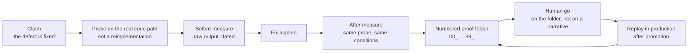

# Proof & Probes

*"Done" is not a state of the system; it is a claim made by an agent. This
chapter makes proof a first-class artifact: probes that measure the real
code path, numbered and timestamped proof folders, proof replayed in
production after promotion, mocks whose fidelity is audited, data-invariant
sensors, and the rule that keeps the proof trail alive longer than the
tooling that produced it.*

A green test suite tells you the code passes its tests. It does not tell you
that the claim you actually care about ("the defect is fixed", "the price
the customer pays did not change", "the send really goes out") is true.
Mainstay holds one simple rule: **no claim without instrumented proof.**
Whatever an agent declares it has verified does not exist until an
instrument has measured it, the measurement is dated, and the trace is kept.

> The field facts in this chapter come from a private corpus: dated events,
> counts obtained by command, verified by an internal audit in three
> adversarial passes. They are not replayable by the reader.

## The hierarchy of proof

Not all forms of "it's verified" are worth the same. In descending order:

| Rank | Form | Status |
|---|---|---|
| 1 | Probe on the real code path, raw output kept, replayable | Proof |
| 2 | Replayable harness: command, dataset and conditions recorded | Proof |
| 3 | Raw output of a single command, dated, never replayed | Weak proof |
| 4 | An agent's report: "tests pass", "it's fixed" | Not proof |
| 5 | The written rule: "the code says", "the spec provides" | Not proof |

Three rules pin down the bottom two ranks, and each one cost something
before it was written.

**An agent's word is never proof.** An agent reports what it believes it
did, in the terms that flatter it. On an agency's internal cockpit, the rule
is written into the context file itself: the orchestrator does not believe
agent reports; it re-measures. A delivery status there only counted its
hundreds of checks (443/443 on one part, 208/208 on the other, zero
skipped) after the orchestrator re-ran the harnesses itself and got
identical outputs. It is the measurement version of the
[adversarial review](./07-adversarial-review.md) rule of engagement: a
stage is never closed by whoever built it.

**Verify the computed value, never the written rule.** On a personal site,
the lesson is on record after an incident: the written rule described the
correct behaviour, and the value actually computed was wrong. Docs,
comments and specs describe an intention. Only execution tells you what the
system does.

**Even a measurement can measure the wrong object.** On a legacy e-commerce
platform in production, a decision formally corrected the false claim of
the previous day's decision, re-measured read-only against production,
with an autopsy of the measurement error: the indicator that was counted
usually moved with the object of interest, but a different mechanism
decided the real behaviour. The rule that came out of it: **measure the
observable that decides, not an indicator that co-varies with it.**

## The probe: the real code path, never a reimplementation

A **probe** is a small program that calls the real code path (the real
function, the real endpoint, the real database) and records what it
returns. What a probe never is: a reimplementation of the logic inside the
test. Re-coding the pricing grid in the probe, then observing that the two
grids agree, proves exactly one thing: that the test author understands
the rule the same way the code author does. Both can be wrong together.

The corpus's founding occurrence: on a legacy e-commerce platform in
production, a real financial defect (a tax missing from shipping fees)
was fixed and accepted through a probe that calls the cart's real
calculation method, explicitly "not a reimplementation". The probe covered
44 cases (eleven destinations × four sizes), with a two-part verdict: the
tax appears, *and the price the customer pays does not change by a cent*.
The second half ("nothing else moved") is precisely what a
reimplementation cannot give you: it would only have verified the rule you
had just encoded into it.

**Prove at every surface where the defect could live.** A fix crosses
several layers: the API can answer correctly while the UI displays the
wrong thing; the screen can display correctly while nothing persists. On a
pilot feature on a SaaS product, every fix in the adversarial acceptance
run carries a "verified" note with its test: the API via curl, the state
via SQL, the behaviour in the real UI, and persistence re-checked across
several successive passes. A fix proven in curl alone is a half-proven fix.

## The proof folder: numbered and timestamped, per piece of work

A probe produces one measurement. A piece of work produces dozens. The form
that holds them together is the **proof folder**: one directory per piece
of work (a ticket, a lot, a screen) with files numbered in demonstration
order, each timestamped.

The most complete form in the corpus: on a legacy e-commerce platform in
production, the acceptance run of a single piece of work produced 101 proof
files numbered `00_` to `99_` (from initial state to final verification in
production) across three indexed acceptance rounds, with screenshots and
fact records per simulated role, a dry-run of the promotion before the go,
an external proof replayed after the promotion, and the release registry's
synchronisation verified last.

Why the numbering: **the order is the argument.** A proof folder reads like
a demonstration (state before, action, state after, same conditions) and
numbering makes the holes visible: if nothing sits between `30_` and
`90_`, what proves the steps in between? Timestamps make the order
indisputable, and the prefixes force the question "what proves this?" at
every step of the work, not at the end.

A skeleton (fictional, on the walkthrough feature):

```
_work/saved-views-wiring/proof/
  00_initial_state.txt          # raw output: the saved_views table, before
  10_probe_before_fix.txt       # the probe on the real path, before
  20_diff_applied.txt           # what changed, exactly
  30_probe_after_fix.txt        # the same probe, same conditions
  40_ui_acceptance_capture.png  # the UI surface, verified too
  90_promotion_dry_run.txt      # the promotion rehearsed before the go
  95_external_proof_prod.txt    # the probe replayed in production, after the go
  99_registry_synced.txt        # the release registry up to date
```



The proof folder has an addressee: the human go at the
[release gate](./09-release-gate-and-registry.md) is given on the folder,
not on a narrative. "The acceptance run went well" is a sentence;
`30_probe_after_fix.txt` is a fact.

## Proof replayed after promotion

The pre-production acceptance run proves pre-production. Promotion changes
the environment (configuration, data, volumes, real third parties), so it
expires the claim. The rule: **after promotion, the same probe replays in
production**, under conditions as identical as possible, and its output
joins the proof folder.

The corpus holds this on both sides of the gate: on the legacy e-commerce
platform, the financial probe ran in pre-production *and* in production,
and the work's proof folder closes on an external post-promotion proof; on
an audit vault on a client's platform, the pre-production pass was played
and verified, with the date on record, before any promotion.

The same principle governs fixes inside an acceptance run: a before/after
measurement only has value when **replayed under the same conditions**:
same command, same dataset, same environment. "Before: eighteen failures.
After: zero" only proves something if both numbers come out of the same
instrument. Two different instruments measure two different questions, and
the comparison measures nothing.

## The read-only probe before an architecture decision

Probes are not only for acceptance. Before an architecture arbitration, you
assert nothing and modify nothing: you probe.

On a two-developer, multi-repo product, before deciding a refactor,
parallel read-only probes each wrote a proven findings file (paths and
line numbers included), among them two deliberately adversarial probes: one
instructed to argue *for* the refactor, the other *against*. The decision,
rendered afterwards, cites the probes. The same device instructed other
arbitrations on the same ground, and a pre-production playbook there opens
with "terrain verified by probes, read-only".

Four rules make the device hold:

1. **Read-only.** An evidence-gathering probe modifies nothing. It builds
   the case file; the decision, once taken, executes.
2. **One finding, one file, with locations.** A finding without path:line
   cannot be counter-verified; it is an impression with a date on it.
3. **Adversarial probes by construction.** A probe that only looks for
   confirmation will find it. Instructing one for each side forces the case
   file to contain the best argument of both (same root as the
   [adversarial review](./07-adversarial-review.md)).
4. **The decision cites its probes.** An architecture decision that cites
   no finding is an opinion equipped with authority.

## The mock-fidelity audit

The delivery chain starts the frontend on mocks
([chapter 04](./04-delivery-chain.md)). Mocks are therefore a code path the
acceptance run travels, and the weak point of the whole proof: **a
complacent mock manufactures false successes.** A mock that answers too
kindly turns an entire acceptance run green on behaviour the real backend
will never have.

The corpus's counter-measure, on a fintech: a local acceptance harness (a
set of mocks shared between two application surfaces, a start script that
checks its ports) was only admitted into the acceptance run after a
**fidelity audit run by a separate agent**: neither the one who had built
the harness, nor the one who was going to run the acceptance. The audit
confronted the harness with the backend's real code, not the spec alone,
and verified four identified fidelity traps against it.

Why a separate agent: whoever built the harness has calibrated their own
proof. The corpus paid to learn this: on an agency's internal cockpit, a
developer calibrated the proof of his own acceptance criterion twice, and
the criterion was hardened into a structural invariant precisely for that.
It is the tooling version of chapter 07's rule: a harness is never
certified by whoever wrote it.

The fidelity audit replays whenever the backend changes: a mock faithful to
the backend of three weeks ago is a complacent mock that doesn't know it
yet.

## Data-invariant sensors

An acceptance run proves a moment. Some invariants ("every order has at
least one line", "no reference is duplicated") must hold continuously,
including when nobody is shipping: data moves without the code changing
(operations, third parties, incidents).

The pattern, born on a legacy e-commerce platform in production: a
versioned directory of **invariant sensors** (five scripts, each detecting
one precise inconsistent state of the database) and, next to each sensor,
a **fixtures** script that fabricates the broken state to prove the sensor
detects it.

The fixtures rule is the heart of the pattern: **a sensor that has never
seen the anomaly it hunts is a hope, not an instrument.** You test the
detector before trusting it with detection: every sensor ships with the
means to prove itself. It is the same logic as the guardrail probe below:
the monitoring instrument is itself under monitoring.

A sensor is not a test. A test runs when the code changes and protects the
build; a sensor watches a state that can degrade with no code change at
all, and protects operations.

## The durability of the proof trail

The counter-example that founds this section is real and on record. On a
pilot feature on a SaaS product, the acceptance document pointed, as proof
that development-mode sends worked, to a log line: "search for this marker
in the backend log". Weeks later, the internal audit searched for the
marker: zero occurrences. The stack's start script truncated the log on
every launch. The proof had existed; the tooling had erased it. The proof
trail for the sends was no longer replayable, and the claim it supported
had become, once again, an agent's word.

> **Proof must outlive the tooling that produced it.**

Four rules follow:

1. **Proof lives in a dedicated artifact.** At acceptance time, the
   relevant excerpt is *copied* into the proof folder, never merely
   referenced in a rotating log, a session directory, a terminal output.
   Whatever can be truncated, will be.
2. **A proof cited by reference is re-verified at citation time.** If the
   target can disappear, embed the excerpt. A link to a proof is not a
   proof; it is a promise of one.
3. **Audit the tooling for what it destroys.** Start scripts, log
   rotations, end-of-session cleanups: anything that truncates or purges is
   a threat to the proof trail and is listed as such. The script that
   erased the proof above did exactly what it was asked to do.
4. **The trail belongs to the work, not to the session.** It is versioned
   or archived with the work it proves. A session's artifacts are purged
   with the session; a proof stored there is a proof on borrowed time
   (see [session conduct](./10-session-conduct.md)).

## Probing the agent itself: what remains of evaluation

The former chapter "Testing & Evaluating Agents" drew a distinction that
holds: testing the agent's **output** (does the code work?) is not testing
the **infrastructure** (does the agent honour the contracts and the
guardrails?). An agent can produce correct code while ignoring a
guardrail: the build is green, the method has failed.

The instrument for the second question is the **guardrail probe**: a test
that tries to make the agent do something forbidden, and passes only if the
agent **refuses or escalates**. A guardrail that is never probed is a
guardrail you only hope holds. Five moves to probe: the out-of-scope edit,
the modification of a frozen artifact, the invention of a value absent from
every source of truth, the destructive action without confirmation, the
silent choice between two contradicting sources. A probe the agent
"passes" by doing the forbidden thing is the most valuable test in the
suite: it just found a hole in your infrastructure.

The corpus carries one occurrence of this move, applied to a production
prompt: on an agency site rebuilt against a frozen reference, the
instruction of an LLM component was tried dry, before any API key was
available: seventeen hostile probes played by a model held to the real
instruction, verdicts rendered by a double judge. Fourteen probes held; the
three breaches produced two surgical clauses added to the instruction. A
verifier mode then made "one single real call", so that the first real call
would be a deliberate act, not an accident. That is the guardrail probe in
its full sense: attack the instruction before trusting it with production.

The rest of the former chapter (golden tasks, contract-conformance tests,
regression sets, the eval harness) keeps its logic but changes status:
**proposed, unproven instruments.** No ground in the corpus built an eval
harness or a golden-task suite. The corpus covered the same needs by other
routes:

| Proposed instrument | Status | What the field did instead |
|---|---|---|
| Guardrail probe | One field occurrence (dry trial of a production prompt) | Run it before trusting an instruction with production |
| Golden tasks + eval harness | Proposed, unproven | The [adversarial review](./07-adversarial-review.md) with counter-verified findings |
| Contract-conformance tests | Proposed, unproven | The adversarial acceptance run played against the contract, plus the contract lint |
| Regression sets | Proposed, unproven | Rules written after incidents ([chapter 01](./01-three-pillars.md)) and invariant sensors |

If you build the harness, it works as described in the former chapter. Then
publish it for what it is on your ground too: a prescription that became a
practice, not the other way round.

## See also

- [Chapter 04 · The Delivery Chain](./04-delivery-chain.md)
- [Chapter 07 · Adversarial Review](./07-adversarial-review.md)
- [Chapter 09 · The Release Gate & Registry](./09-release-gate-and-registry.md)
- [Chapter 10 · Session Conduct](./10-session-conduct.md)
- [Chapter 11 · Failure Protocols](./11-failure-protocols.md)
- [Reference · CI/CD & Hooks](../reference/cicd-and-hooks.md)
- [Reference · Metrics](../reference/metrics.md) (a proposed, unproven instrument)
