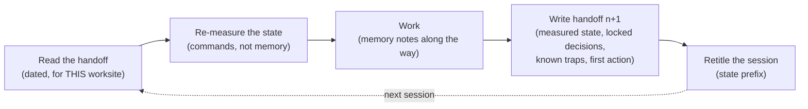

# Session Conduct

*An agent session is born, works, and dies within hours. What survives it —
a dated handoff, memory notes, a state-prefixed title — is the only memory
the next session will have.*

The delivery chain describes work at the scale of a feature. But the real
operating unit of agent-driven work, the one that opens and closes every
day, is the **session**: a bounded context window that starts empty, ends
full — and then vanishes. This chapter covers the rituals that keep a
session from dying with its context: the dated handoff and its twin the
resume prompt, the expiry banner, worksite disambiguation, state-prefixed
titles, memory notes, and the autonomous loop that works without
interrupting.

It is the most universal practice in the corpus — present from the
compressed solo worksite to fleets of parallel sessions — and it was the
least documented part of v1, which dispatched the whole matter in one line:
"a short handoff note." The field turned it into the most produced document
genre in the entire corpus: twenty-eight handoff files at the root of a
single repository, twenty-three on another, seven on each of two more —
counted by command. On one worksite, the string "handoff" appears in more than half of
the archived session transcripts (224 of 414).

> The field facts in this chapter come from a private corpus: dated events,
> counts obtained by command, verified by an internal audit in three
> adversarial passes. They are not replayable by the reader.

## The session is the real unit of work

When a session ends, everything that was not written down is lost. The next
session will not remember it — it will *re-deduce* it: from the state of
the repository, from file names, from whatever looks like an intention. And
deduction invents. An agent deducing the state of a worksite makes exactly
the same kind of silent decisions as an agent filling a vague brief
([Chapter 05 — Grey Zones & Divergence](./05-grey-zones-and-divergence.md)):
it picks a plausible interpretation, without authority, and no one knows a
choice was made.

The countermeasure is a corridor: **every session opens with a read and
closes with a write.** It opens by reading the previous session's handoff
and re-measuring what it claims; it closes by writing the next session's
handoff, filing its memory notes, and retitling its own trace.



The loop mirrors, at small scale, the delivery chain itself: a session
inherits a state, moves it forward, and leaves the next session starting
richer. The rest of the chapter walks each edge.

## The dated handoff

The handoff is a session's exit artifact: a dated file, one per worksite,
versioned with the code. The field convention has two levels: a root
`HANDOFF.md` serving as permanent onboarding — readable in under a minute,
it says where the living worksites are — and one dated handoff per
worksite, named with its date and its worksite
(`handoffs/2026-05-19-saved-views.md`).

Four sections are mandatory. They are the ones the corpus reproduces
everywhere, each because its absence has cost something:

| Section | What it holds | What it prevents |
|---|---|---|
| **Exact state — measured, not deduced** | Every claim of state paired with the command that produced it, run at writing time | The handoff that "thinks it remembers" — credible, dated, and wrong |
| **Locked decisions** | The rulings not to be reopened, with identifier and date | The next session re-litigating what is settled |
| **Known traps** | The mistakes already paid for on this worksite, with their cause | Paying the same trap on every resume |
| **First action, ordered** | The exact sequence the resume starts with, expected results included | The successor choosing its own starting point |

The field adds two sections that have earned their place: **what is NOT
committed, and why** — one handoff in the corpus explicitly lists the files
left out of the commit and the reason; without that line, a successor
"cleans up" or commits the exact opposite of the intention — and a closing
reminder of the worksite's **standing guardrails** (no push without the
explicit go, frozen scope), because the handoff is often the only document
the next session will read in full.

A filled handoff for the (fictional) running example `saved-views-panel`:

```markdown
# Handoff — saved-views-panel — 2026-05-19

> Worksite: saved-views-panel, wiring in waves. Repo: main app.
> Supersedes: handoffs/2026-05-18-saved-views.md (expiry banner posted).

## State as of 2026-05-19, 18:40 (measured, not deduced)
- HEAD: 4f2a9c1 — `git rev-parse --short HEAD`
- Tests: 42/42 green — `npm test`, run at 18:35
- Wired: POST /v1/saved-views (wave 1); the 3 other endpoints
  still on mocks — `grep -c "mock:" src/api/config.ts` → 3
- NOT committed: the type drafts in src/api/drafts/ — deliberate,
  the real schema of GET is not confirmed yet.

## Locked decisions (do not reopen)
- DEC-007 (2026-05-14): zero or one default view per user.
- DEC-011 (2026-05-16): new views are private until shared.

## Known traps (paid for — do not pay twice)
- The mock timestamps `created_at` in seconds, the real API in
  milliseconds: date sorting passed on mocks and broke on real data.

## First action on resume
1. `git status --short` — expected: empty.
2. `npm test` — expected: 42/42.
3. Read vault/contracts/saved-views-panel.md §API, state your plan.

## Standing guardrails
No push without the explicit go. No writes outside src/api/.
```

The resume prompt of [Chapter 06](./06-prompt-as-contract.md) is derived
from this handoff: same measurements, same decisions, same trap — turned
into a contract for the incoming session.

## "Measured, not deduced"

This is the rule that holds up everything else, and it deserves its own
section. One handoff in the corpus titles its state section "State verified
on [date] — measured, not deduced," and every line is the output of a
command run that same day: HTTP codes of the public pages, active services,
full test runs. Another, on a multi-agent worksite, records that the test
counts were *re-measured by the orchestrator itself* rather than taken from
agent reports. A third cites the exact commit at the git head.

The discipline has two faces:

- **At writing time**: no claim of state without the command that produced
  it, run at the moment of writing. "The tests should pass" does not exist
  in a handoff. `npm test` → 42/42, run at 18:35, exists.
- **At reading time**: the first action of every resume replays the
  handoff's commands and compares against the expected results. **If a
  command contradicts the handoff, stop**: the handoff is stale, and the
  resume starts by establishing that, not by building on it.

A deduced state in a handoff is a grey zone on your own worksite: a
plausible claim nobody verified, bequeathed to someone who will treat it as
a fact.

## The frozen scope, verifiable by command

The same principle applies to the worksite's boundaries. "Don't touch the
two other repositories" is an instruction; it gets forgotten, worked
around, reinterpreted. The field hardened it by making it executable:

> Frozen scope: no writes outside the working repository.
> **Verifiable: `git status --porcelain` must stay empty in the two other
> repositories — at any moment, by anyone.**

The difference is not cosmetic. A scope in prose is a commitment; a scope
with a command is a **checkable fact** — by the agent mid-session, by the
pilot at any moment, by the successor on resume, and by an audit long
after. On the originating worksite, the closing report wrote "zero files
touched" *with* its proving command — and weeks later, an internal audit
replayed the command: repositories intact, a single init commit. The freeze
had outlived its session.

The general rule: **every freeze — of scope, branch, or version — is
declared together with the command that verifies it and the expected
result.** Outside git the command changes (a file count, a checksum, a diff
against a tag); the rule does not. A freeze without a command is an
opinion.

## The expiry banner

A handoff goes stale fast — that is its nature: it photographs a state the
next session exists precisely to change. A stale handoff is worse than no
handoff, because it is *credible*: measured, dated, precise — and wrong.
V1 dealt with document divergence in general; session conduct has its own
short rule:

> **Stale = marked stale.** A superseded handoff gets a banner on its first
> line; it is neither rewritten nor deleted.

```markdown
> ⚠️ STALE — banner posted 2026-05-19. The state below describes the
> worksite before wave 1 wiring.
> Current state: handoffs/2026-05-19-saved-views.md
```

Three elements, never fewer: the banner's date, the verdict, the pointer to
the current source. On the field, one handoff received its banner *the day
after* it was written — that is the normal rhythm, not a failure; a
technical report carries a dated banner pointing to the up-to-date journal,
the old state kept in full as history. Nothing is deleted: the handoff
trail is the worksite's chronology, and it is what you re-read when you
need to know when a trap first appeared. The same mechanism, applied to
specs and plans, is in
[Chapter 11 — Failure Protocols](./11-failure-protocols.md).

## Worksite disambiguation

The guardrail in this section cites its incident, as the template of
[Chapter 01](./01-three-pillars.md) requires.

The incident, dated in the corpus: on 20 July 2026, a complete multi-agent
team session was launched **on the wrong worksite**. The instruction said
to read "the handoff" — with no path. Two neighbouring worksites each had a
file of the same name. The session read the wrong one, and diligently
executed a plan meant for another project. Nothing in the handoff itself
was false; the *designation* was ambiguous.

The rule born from the incident, the next day:

1. **A handoff is designated by full path**, never by file name. "Read the
   handoff" is forbidden; "read this file, of this worksite" is the valid
   form.
2. **The first line of a handoff names its worksite.** A handoff that does
   not say which worksite it belongs to is ambiguous by construction — the
   running example above opens with `Worksite: saved-views-panel`.
3. **Before acting, cross-check the vocabulary.** Every worksite has a
   lexicon: one speaks in stages and gates, another in tickets and
   production releases, a third in decisions and batches. If the handoff's
   vocabulary does not match the announced worksite, stop and ask — that
   is the price of one sentence against the price of an entire session.

The more parallel sessions there are, the more target ambiguity becomes the
dominant failure mode: in a fleet, explicit worksite designation is a
precondition of every brief
([Reference — Orchestration](../reference/orchestration.md)).

## Session titles as a kanban

A session tool keeps the list of sessions and their titles. The field
turned that list into a status board, at the cost of one convention: **the
title starts with a state prefix.**

| Prefix | Meaning | The move that sets it |
|---|---|---|
| `CLOSED` | Worksite closed, handoff written | Retitle on closing, *after* the handoff — the title often takes its name |
| `PAUSE` | Suspended, resume planned | Retitle on suspending, reason in the title |
| `STAND BY` | Waiting on a third party or a decision | Same — the title says what is awaited |
| `LATER` | Deliberately postponed, no deadline | A deferral decision, not an oversight |
| `A FAIRE` (*to do*) | Backlog: session opened as a reminder, work not started | Create the session as a placeholder |
| *(none)* | In progress | The absence of a prefix is a state in itself |

The session list, sorted, then reads like a kanban: what is closed, what is
waiting, what is alive — without opening a single session. On one
worksite's live session store, queried by command on a given day, seventeen
of the two hundred titles returned carried `CLOSED`; suspended states
sat next to backlog items, each readable at a glance.

Two rules make the convention hold. **Retitle on closing**: the retitle is
part of the closing ritual, on the same footing as the handoff — a closed
session without its prefix is a session that looks alive. And **the title
names the worksite**, not a generality: "CLOSED Wave 1 wiring —
saved-views," never "make progress on the project" — the same rule as in
[Chapter 06](./06-prompt-as-contract.md): one session = one named unit of
work.

## Normed memory notes

The vault remembers the *product*: decisions, contracts, conventions
([Chapter 02](./02-vault-and-sources-of-truth.md)). But part of what a
session learns is not about the product — it is about *conduct*: a tooling
trap, a collaboration rule with the pilot, a protocol that failed and its
correction. The field files these as **memory notes**, kept alongside the
sessions, in a normed shape:

> **One note = one fact + why + how to apply it.**

```markdown
---
type: memory
date: 2026-05-19
origin: session "CLOSED Wave 1 wiring — saved-views"
---
# The mock timestamps in seconds, the real API in milliseconds

**Fact.** Date sorting passed every test on mocks and broke on real
data.
**Why.** The mock fixtures were written by hand; the spec does not
state the timestamp unit.
**How to apply.** On every endpoint wiring, compare one real response
to the fixture field by field before removing the mock.
```

A note without "how to apply" is an anecdote; a note without "why" is a
dogma. The frontmatter dates the note and ties it to its originating
session — the conduct-side counterpart of decision supersession: you will
always know where a rule came from.

Notes accumulate — one worksite in the corpus carried about seventy-eight —
and it is the **index** that keeps them usable: one index file, one line
per note, grouped in sections (hard rules, traps, protocols). Onboarding
reads the index, not the notes. And the index is **compacted
periodically**: when it grows too long to read at the start of a session,
its lines are regrouped and tightened — the notes themselves do not move.
The corpus's compaction, dated, carries the phrase that makes the rule:
*nothing is lost* — you compact the index, never the memory.

Routing between the two memories is simple: **a fact that constrains the
product goes up to the vault as a decision; a fact that constrains the
conduct of sessions stays a note.** Notes are also the ledger of repeat
offences: on one worksite, the third violation of a production-release
rule was counted in writing *inside the rule's own note* — and it was that
bookkeeping that triggered the hardening
([Chapter 09](./09-release-gate-and-registry.md)).

## The autonomous loop — "until perfect"

The last ritual governs the delegated session: a worksite handed to the
agent with the instruction to **loop until convergence without soliciting
the pilot**. The loop chains the method's roles — development, PO
acceptance, adversarial review, agnostic re-read, arbitration — and starts
over as long as the passes keep finding
([Chapter 07 — Adversarial Review](./07-adversarial-review.md)). The pilot
comes back exactly twice: for the final acceptance, and for the go.

The problem this ritual solves is precise: a loop that interrupts on every
arbitration is not autonomous — it forwards context-free micro-decisions to
the pilot in the middle of the day. And a loop that settles everything
silently manufactures grey zones. The field invention holds the middle:

> Arbitrations met during the loop are presented at the end as **decisions
> to confirm** — settled, justified, with a recommendation — not as open
> questions.

The difference is one of kind. A question interrupts and transfers the work
of arbitration; a decision to confirm *keeps* the work done — the loop
chose, applied its choice, kept going — and leaves the pilot the power to
overturn: confirmation in bulk, veto line by line. Each decision to confirm
carries the choice, the justification, and what overturning it would cost.

The loop's bounds are absolute:

| The loop settles alone | It presents as "decisions to confirm" | It never crosses |
|---|---|---|
| Choices already covered by the contract and the vault | New arbitrations: a local grey zone, priority between two fixes, a minor scope deviation | The production go, a push, anything sent to a third party ([Chapter 09](./09-release-gate-and-registry.md)) |
| Corrections from the reviews, re-tested | Any *proposed* exception to an established convention | A locked decision, a frozen scope |

And one exception, which is a return to the general rule: if the loop hits
a **blocking** grey zone — one that leaves no path forward without an
authority it does not have — it stops and asks. "Until perfect" never
meant "by guessing": the ban on guessing outranks the ban on
interrupting.

At close, the loop rejoins the common corridor: dated handoff, decisions to
confirm at the top, memory notes filed, prefixed title. An autonomous
session ends exactly like any other — it just asked less often.

## See also

- [Chapter 01 — The Three Pillars](./01-three-pillars.md)
- [Chapter 02 — The Vault and the Sources of Truth](./02-vault-and-sources-of-truth.md)
- [Chapter 06 — The Prompt as a Contract](./06-prompt-as-contract.md)
- [Chapter 07 — Adversarial Review](./07-adversarial-review.md)
- [Chapter 09 — The Release Gate & the Release Registry](./09-release-gate-and-registry.md)
- [Chapter 11 — Failure Protocols](./11-failure-protocols.md)
- [Reference — Orchestration](../reference/orchestration.md)
