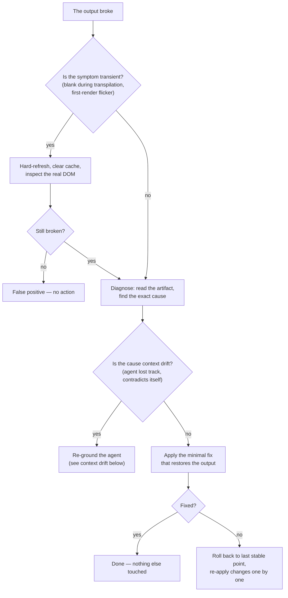
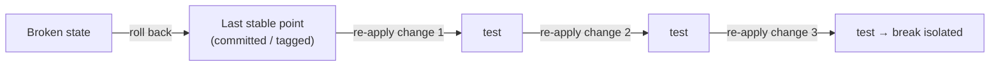

# Failure Protocols

*A mature method is judged when something breaks. The reflex that matters:
minimal action, never destructive regeneration — and when what broke is a
document that stopped being true, you mark it, you do not rewrite it.*

A mature method is judged the moment something goes wrong. When generation
breaks, when a page renders blank, when the agent's context has drifted, when
a registry no longer tells the truth — the instinct is to wipe everything and
start over. That instinct is the error. It throws away validated work to
escape a problem that a small, targeted fix would solve, and it erases the
history the next failure would have needed.

The principle under every protocol in this chapter:

> **Minimal action. Never destructive regeneration.**

This chapter covers two families of failure. The first four are failures of
*production*: the output breaks, a symptom turns out to be transient, the
context drifts, an iteration goes wrong. The last two are failures of
*truth*: the artifacts that describe the state of the world — registries,
handoffs, technical recaps — stop telling it. The same principle governs
both: the smallest action that restores the truth, never the destruction of
what was right.

> **Status of the evidence.** The field facts in this chapter come from a
> private corpus: dated facts, counts obtained by command, verified by an
> internal audit in three adversarial passes. Readers cannot replay them;
> they can, however, apply every protocol here to their own project.



## Generation-crash recovery

**Symptom.** The output no longer renders, even though the content looked
coherent.

The temptation to regenerate everything is the error: you would lose the
validated work. Follow the procedure instead.

```text
PROCEDURE
1. Current state — read the artifact, identify the cause class
   (syntax, missing import, render loop), find the exact error.
2. Diagnosis — point to the line, the import, or the faulty component.
3. Minimal action — the smallest correction that brings the render back.
   DO NOT regenerate. DO NOT touch the rest.
4. If insufficient — roll back to the last stable point, re-apply the
   changes one by one, testing between each.

PROHIBITIONS
- No full regeneration.
- No change outside the crash perimeter.
- No new feature during recovery.
```

The fourth prohibition matters as much as the first. Recovery is not a moment
to also slip in an improvement; mixing a fix with a feature makes both
impossible to verify. Recovery does one thing: restore the last known-good
state.

A worked example, on the documentation's running (fictional) example. A
`saved-views-panel` build stops rendering after an edit. Step 1: reading the
artifact shows a render loop — a state setter called during render. Step 2:
the faulty line is identified. Step 3: the setter is moved into an effect —
one line changed, render restored. No regeneration, no other change. Total
cost: one diagnosis and one line. The cost of regenerating would have been
every grey-zone resolution baked into that screen.

## False positives and transient symptoms

On environments that compile on the fly, a page can look blank for the
duration of transpilation. Before concluding "bug":

1. Hard-refresh with the cache cleared.
2. Inspect the **real DOM** — not the visual, the actual rendered tree.
3. For heavy cases, pre-compile before running, which removes the problem
   entirely.

The lesson generalizes beyond transpilation: **never react to a transient
symptom with a destructive action.** A blank page during a compile step, a
flicker on first render, a momentary 404 while a dev server restarts — these
are not failures. Confirm the symptom is real and stable before you act on
it. A destructive action taken against a symptom that would have cleared on
its own is pure loss.

## Context drift and context-window exhaustion

A failure mode specific to long agent sessions: the agent's working context
fills up or drifts. Symptoms:

- the agent contradicts a decision it made earlier in the same session;
- it reintroduces code it removed twenty minutes ago;
- it "forgets" a constraint stated in the context file;
- its edits become less precise as the session runs long.

The cause is not the model failing — it is the context window filling with
session history, pushing the stable, important facts out of effective reach.

**Recovery procedure:**

```text
CONTEXT-DRIFT RECOVERY
1. Stop. Do not ask the drifting agent to "try again" — it will drift further.
2. Capture state — write the current, verified state to a durable place:
   the contract, the divergence ledger, a dated handoff. Not the chat.
3. Re-ground — start a fresh agent context. Load: the context file, the
   relevant contract, and the captured state. Nothing else.
4. Resume — the fresh agent continues from a clean, small, accurate context.

PROHIBITIONS
- No "continue anyway" with the drifted context.
- No relying on the chat history as the record of truth.
```

The capture artifact has a name and a template: it is the dated handoff of
[Chapter 10 — Session Conduct](./10-session-conduct.md), with its rule
"state measured, not deduced". The structural prevention lives in the
architecture: delegate read-heavy work to subagents so the acting agent's
context stays small and clean ([Chapter 03 — The Agent
Architecture](./03-agent-architecture.md)). The durable record is the
**vault**, never the conversation — that is exactly why the vault exists. A
session ends; a vault persists.

## Rollback discipline

Rollback is a tool, not a defeat — but it has rules.

1. **Always have a point to roll back to.** Before an iteration, the
   validated state is archived (a commit, a tag, a named and dated backup —
   including where git is absent: there, the dated backup *is* the version
   history). You cannot roll back to a state you never saved. This is the
   *save-before-iteration* pattern of
   [Chapter 13](./13-patterns-and-antipatterns.md).
2. **Roll back to the last stable point, not to zero.** The goal is the
   nearest known-good state, not an empty repository.
3. **Re-apply forward, one change at a time, testing between each.** This
   restores progress and isolates which change caused the break.
4. **A rollback is logged.** Note what broke and why, so the next attempt
   does not repeat it. A silent rollback teaches nothing.



## Reconciliation against the real state

The previous protocols deal with code that breaks. This one deals with a
quieter disease: **the bookkeeping artifact that no longer tells the truth.**
A release registry, a vault index, a worksite state file — any artifact that
claims "here is what exists" can drift away from what actually exists. The
drift mode is well known: parallel sessions each advance the bookkeeping on
their own, a number gets taken twice, an entry gets written from memory. The
artifact stays plausible — which is precisely what makes it dangerous. A
visibly broken registry raises an alarm; a plausible, wrong one makes people
take bad decisions with confidence.

The corpus carries the founding case. On a legacy e-commerce platform in
production, after an episode of parallel sessions, the release registry was
reconciled against the real state of the server: a major version promoted to
production had *never* been logged by the session that promoted it; tagged
releases had no entry; hotfixes carried numbers that had become wrong. The
reconciliation realigned everything with what production was actually doing —
the dated note in the registry header says it in four words: **"verified on
the server, not from memory"** — and the corrections were logged as
corrections, visible, never erased.

The protocol:

```text
RECONCILIATION
1. Trigger — periodically, and after ANY episode of parallel sessions.
2. Query the real state — by command, on the live system: version served,
   tags present, artifacts deployed, files actually tracked.
   Never from memory, never from the chat.
3. Diff — compare the record to the real state, line by line.
4. Correct by dated annotation — every divergence becomes a dated
   correction note IN the record. The wrong entry is marked wrong and
   corrected beside itself, never silently rewritten.
5. Fix the cause — a number collision or a missing entry under parallel
   sessions is a coordination bug; treat it (lock the number before
   bumping, one writer per record).
```

Two points carry the whole protocol. **The real state is obtained by
command** — a query against the live system, not a recollection of what you
deployed. And **the correction is a dated annotation, never a rewrite**: a
wrong entry marked wrong teaches something (when the bookkeeping drifted, and
under what conditions); an entry silently rewritten pretends the drift never
happened — and guarantees it will not be prevented. The full registry
apparatus, with its keeping rules, is in [Chapter 09 — The Release Gate and
the Registry](./09-release-gate-and-registry.md); what belongs to this
chapter is the reflex: **when a bookkeeping artifact is suspect, you do not
correct it from memory — you query the real world, and you annotate.**

## Marking — the staleness banner and the dated obsolescence banner

The last failure family: the document that stopped being true. A handoff
describes the state of a worksite; the worksite moves on; the handoff now
describes a state that no longer exists. A technical recap describes a data
model; the model is replaced; the recap now teaches falsehood. No code broke
— but the next reader, human or agent, will load that document and act on a
vanished world.

The destructive instinct has two faces here: **deleting** the document (you
lose the history — why things were believed, in what order they changed) or
**rewriting it** (you lie about what was written at the time, and you pay for
a full rewrite where one line would do). The method does the third, smallest
thing:

> **You mark. One dated line at the top of the document — the line that
> prevents the documentary lie.**

Two variants, for two situations:

**The staleness banner.** The document was true and time expired it. The
archetype is the handoff: on a two-developer, multi-repo product, a dated
worksite handoff received, the very next day, a banner on its third line
saying it was stale. One day of validity, marked the day it expired — the
document stays readable as an archive, and nobody can mistake it for the
current state again.

```markdown
> ⚠️ STALE — 2026-05-22. This handoff described the state as of
> 2026-05-21; the worksite has moved since. Current state:
> handoff-2026-05-24.md.
```

**The dated obsolescence banner.** The document describes a state that has
been replaced by another. On a pilot feature on a SaaS product, an exhaustive
technical recap carries a dated banner at the top stating that it describes
the initial demo model, with a pointer to the up-to-date source. The document
is neither deleted nor rewritten: it is archived in place. This is the
divergence rule of [Chapter 05](./05-grey-zones-and-divergence.md) applied to
documents — **marking rather than rewriting** — and the same move as a
decision's `superseded` status: you never rewrite the substance, you amend by
dated addition.

```markdown
> ⚠️ 2026-06-02 — This document describes the initial (demo) model.
> Up-to-date source: concepts/data-model.md.
```

The counter-example is documented too. On another site, a study document kept
activity figures that the vault had declared false — by dated decision, the
very same day. No staleness mechanism ever marked it: the false document
stayed in circulation next to the decision that refuted it, two
contradictory truths in the same repository. That is exactly what the banner
costs one line to prevent.

The short rule, the one that must become an end-of-session reflex: **stale =
marked stale.** A banner carries three things: the date of the marking, the
status, the pointer to the up-to-date source. Nothing else. If you hesitate
between marking and rewriting, mark — it is the minimal action, and it is
reversible: you can always rewrite a marked document; you cannot restore what
a silent rewrite made disappear.

## Minimal action, never destructive regeneration

Every protocol in this chapter is one principle applied to a different
failure:

| Failure | Destructive instinct | Minimal action |
|---|---|---|
| Generation crash | Regenerate the whole screen | Fix the one faulty line |
| Transpilation blank page | Rebuild the page | Hard-refresh, inspect the DOM |
| Context drift | Push the drifted agent harder | Capture state, re-ground a fresh context |
| A broken iteration | Start over | Roll back to the last stable point |
| A drifted registry | Rewrite it from memory | Reconcile against the real state, correct by dated annotation |
| A document that stopped being true | Delete it or rewrite it | One dated banner line, pointing to the up-to-date source |

Destructive regeneration feels like progress because it produces fresh
output. It is not progress. On code, it discards the grey-zone resolutions,
the contract conformance, and the validated decisions already baked into the
artifact. On documents, it erases the history — what was believed, when, and
why it became false — which is precisely the raw material guardrails are made
of: in this method, every major prohibition cites the incident that created
it ([Chapter 01](./01-three-pillars.md)), and an erased incident founds
nothing.

When in genuine doubt between a small fix and a regeneration, the tie goes to
the small fix. You can always escalate to a rebuild; you cannot un-discard
validated work.

## See also

- [Chapter 04 — The Delivery Chain](./04-delivery-chain.md)
- [Chapter 05 — Grey Zones and Divergence](./05-grey-zones-and-divergence.md)
  — the divergence rule that marking applies to documents
- [Chapter 09 — The Release Gate and the Registry](./09-release-gate-and-registry.md)
  — the release registry, reconciliation's founding ground
- [Chapter 10 — Session Conduct](./10-session-conduct.md) — dated handoffs,
  "state measured, not deduced"
- [Chapter 13 — Patterns & Anti-Patterns](./13-patterns-and-antipatterns.md)
  — save-before-iteration, destructive regeneration
