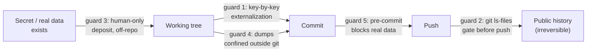

# Secrets & PII

*An agent reads everything, pastes fast, and commits faster. Four real
incidents wrote this chapter — and it comes down to three laws: an exposed
secret is a compromised secret, only what a command verifies is true, and a
deferred security finding with no deadline is deemed open.*

Agent-driven delivery changes the exposure surface of secrets and personal
data — not because the agent is malicious, but through the very mechanics
that make it productive. An agent reads whole files at once, including files
a human would never have opened. It pastes values into configurations to
"make the test work". It commits in batches, fast, often — and a pushed git
history is public forever. It works on realistic data, and the most realistic
data is the real thing. None of these moves is a fault; each is a leak path
that working with agents multiplies.

This chapter does not derive from a principle. It derives from four real
incidents in the corpus — none was an attack, all were routine — and from the
guardrails the field built in response. That is the template of the whole
method ([Chapter 01](./01-three-pillars.md)): every prohibition cites the
incident that created it.

> **Status of the evidence.** The incidents and facts in this chapter come
> from a private corpus: dated facts, counts obtained by command, verified by
> an internal audit in three adversarial passes. Readers cannot replay them;
> they can, however, run every guard described here on their own repository,
> today.

## The four incidents

Four categories, four distinct leak paths. The sites are not identified; the
mechanisms are fully transposable.

| Incident | The leak path | What it teaches |
|---|---|---|
| **An API key in a pushed git history.** The key of an emailing service, in clear text in commits already pushed — found by an adversarial review, not by its author. | The agent's commit speed: the key went in "to test" and the history kept it. | Deleting the file no longer helps; a pushed history is irreversible. Only rotation remediates. |
| **A key pasted in clear text into a chat.** An API key pasted into the conversation with the agent, logged that same day as "to be revoked" — with no written trace ever confirming the revocation. | The working channel itself: the chat is a third-party medium, outside your control. | A chat is never a place for a secret value — and "to be revoked" without written confirmation is not a remediation. |
| **A default secret committed.** An authentication signing secret left at its default value and versioned with the code. | The silent default: nobody pasted a secret — nobody generated one either. | A default value is a secret everyone knows. Externalization is verified key by key, including the keys "nobody touched". |
| **A hosting-provider token in a versioned configuration.** A hosting provider's API token in clear text in an MCP configuration file, probably committed — spotted in passing, by an audit that was looking for something else. | The agent's own tooling: the files that equip the agent (MCP configuration, context files) are versioned by design. | Any versioned file is a publishable file. Configuration means environment variables, never a clear-text value ([Chapter 03](./03-agent-architecture.md)). |

The common trait is more instructive than the differences: **none of these
secrets was stolen.** They were deposited — out of convenience, by default,
for speed — in places that have a memory. The apparatus of this chapter is
therefore not built to repel an attacker; it is built to make the accidental
deposit impossible, or at worst detectable before the push.

Three laws follow, and they govern everything else:

1. **An exposed secret is a compromised secret.** In a pushed history, in a
   chat, in a published default value: it does not matter that "probably
   nobody looked". The only remediation is rotation or revocation. Deleting
   the file is a cosmetic gesture.
2. **Only what a command verifies is true.** "I believe the dump is not
   versioned" is worth nothing; `git ls-files` is authoritative. Every guard
   in this chapter ends with a command whose output you read.
3. **Deferred is not settled.** A security finding may legitimately be
   deferred — but a deferral without a deadline and a confirmation is an open
   risk that has stopped being visible. The follow-up rule at the end of this
   chapter is the most important guardrail here.

## Guard 1 — Externalize secrets, key by key

Externalization is not decreed in bulk ("secrets live in the environment");
it is verified **key by key**, against an explicit mapping table. Every
sensitive configuration key has its environment variable, its generation
rule, and its behaviour when absent:

```text
SECRETS MAP (example, fictional)
mailer.api.key      → MAILER_API_KEY      prod env only, never in repo
auth.token.secret   → AUTH_TOKEN_SECRET   generated per environment —
                                          the default value is forbidden
demo.access.token   → DEMO_ACCESS_TOKEN   empty in prod = feature disabled
```

Three details the field paid to learn:

- **The "default value forbidden" line exists because of incident 3.** Naive
  externalization checks the keys you filled in; it is the key left at its
  default that leaks.
- **An absent key must degrade cleanly.** The demo-token pattern — an empty
  variable in production disables the feature — holds for every optional
  key: absence is a designed state, not a crash that pushes someone to commit
  "just a value to unblock things".
- **The table is checked by command.** After externalizing, verify that no
  clear-text value survives in tracked files:

```bash
# no clear-text values left behind for any mapped key
git grep -nE "(api\.key|token\.secret|password)\s*[:=]\s*[^$ ]" -- \
  ':!*.md' && echo "CLEAR-TEXT VALUE FOUND — stop" || echo "clean"
```

## Guard 2 — The anti-PII gate before every push

Before any push, one question, asked of git and not of memory: **what are you
actually tracking?** The field form is a blocking checklist in the push
playbook, whose core fits in one command:

```bash
# what does git actually track that looks like data or env?
git ls-files | grep -iE 'snapshot|dump|\.env|\.sql$'
# expected: nothing — or ONLY the known, reviewed migration files
```

The subtlety is in the choice of command. `ls` answers "what is on disk";
`.gitignore` answers "what I believe I excluded"; **`git ls-files` answers
"what leaves with the next push"** — the only one of the three questions that
matters. On the originating site, this command is part of a playbook replayed
at every push, and its expected output is written in the playbook itself:
nothing, beyond the known and reviewed migrations.

The gate belongs to the same family of gestures as the release gate
([Chapter 09](./09-release-gate-and-registry.md)): a push is an irreversible
act, so it gets a blocking checklist, and the checklist ends with commands
whose output you read — not with boxes ticked from memory.

## Guard 3 — Keys are deposited by the human, alone

The field rule is blunt and simple:

> **The agent never handles, writes, or pastes a key. Depositing a secret is
> a human gesture.**

It is a special case of a broader invariant of the method — some gestures are
reserved for the human and named explicitly: accounts, payments, sendings,
secrets. The agent prepares everything *around* the secret: the expected
location, the format, the deposit procedure, the check that confirms the key
is in place and working. The value itself never transits through the agent —
and therefore never through a chat, a prompt, a generated file, or a session
history.

The field pushed the pattern all the way to its ergonomics: double-click
deposit scripts, written by the agent, executed by the human — the script
asks for the key, stores it in the right place outside the repository, and
verifies. The human does not need to be a developer; the agent does not need
to see the value. It is the structural answer to incident 2: a key pasted
into the chat becomes an accident *made impossible* once the deposit circuit
exists and the rule is written into the context file.

## Guard 4 — Production data is confined outside git

Working on realistic data is legitimate — the definition of done even
requires it. The corpus did so with a production dump containing hundreds of
real customer email addresses, without ever versioning it, thanks to a
three-stage confinement:

1. **The dump lives outside every git repository.** A dedicated directory at
   the root of the workspace, out of reach of any `git add` — verified by
   command: the file appears in no repository's `git ls-files`.
2. **The dump is imported into a scratch database**, separate from the
   application database. Application code never points at real data by
   accident: someone would have to decide it.
3. **Production is read read-only.** When the application must read the
   original database, it does so through a separate datasource declared
   immutable in code: the agent can read; writing is structurally
   impossible.

And the honest counter-point, published because it teaches: the instruction
"delete the dump once it is no longer needed" existed in writing — and weeks
later, the dump was still on disk. The confinement held (nothing was ever
versioned); the purge stayed an open residual. It is a live demonstration of
law 3: an instruction without a deadline and a confirmation is not executed,
it is merely written. The field's playbooks have a dedicated section for
exactly this, under its exact name: separating the **"neutralized
(testable)"** from the **"non-zero residual"** — what is settled and provable
by command, and what remains open and must say so.

## Guard 5 — The pre-commit guard against real data

The last line of defence, and an automatic one: a git pre-commit hook that
**blocks the commit** if tracked content contains real data — a third
party's real domain, real addresses in fixtures, a dump pattern. It is the
canonical implementation path for the hooks layer
([Chapter 03](./03-agent-architecture.md) and the
[CI/CD and hooks reference](../reference/cicd-and-hooks.md)): a
`core.hooksPath` dispatcher, versioned with the project, that runs whoever
authors the commit — human, agent, or a fleet of agents.

The corollary is a data rule: **fixtures are fictional, mandatorily.** A test
dataset that embeds real values "because it was faster" turns every commit
into a potential leak; the pre-commit guard is what turns that intention into
mechanics. Born on a site whose history is public, it holds everywhere: a
private repository is just a public repository whose leak has not happened
yet — one visibility change, one fork, one share too many.

Each of the five guards sits on one point of the leak path:



## The follow-up rule — a deferred finding is deemed open

The previous guards prevent the next leak. This rule governs the leak already
found — and it is the one the corpus paid the highest price to establish.

Deferring a remediation is sometimes legitimate: rotating a key may require
coordination, an access only a third party holds, a low-traffic window. The
failure is not the deferral. The failure, documented in the corpus, is the
deferral *without structure*: a critical finding — the key in the pushed
history, incident 1 — deferred by explicit decision, remediation delegated…
then no trace at all. No deadline, no rotation confirmation, no purge
verified: more than seven weeks of open risk that nobody was accountable for
anymore. Same pattern on incident 2: "to be revoked" logged the same day,
revocation never confirmed in writing. In both cases the initial logging was
exemplary — it was the *follow-up* that did not exist.

Hence the rule, in the method's prohibition format:

> **A deferred security finding carries three things: a dated deadline, a
> named owner, and a closure by written confirmation of the completed
> gesture — verified by command whenever possible. Without all three, the
> finding is deemed OPEN.**

"Deemed open" is a reversal of the burden of proof, and a deliberate one: it
is not the auditor's job to prove the risk persists; it is the deferral's job
to prove it was settled. Concretely:

- a finding deemed open **appears in every status document** — handoff,
  resumption prompt, worksite review — until closure; it cannot slide out of
  sight by the mere passage of time;
- its **severity does not negotiate with age**: a critical finding does not
  become minor because it is seven weeks old — if anything, the opposite;
- its closure is a **verifiable fact**, not a declaration: "key rotated on
  [date], old key tested and refused, confirmed by [name]" — the same
  standard of proof as everything else in the method
  ([Chapter 08 — Proof and Probes](./08-proof-and-probes.md));
- a deadline passed without closure is an **automatic escalation** to the
  human who decided the deferral: the decision to defer is renegotiated,
  never silently renewed.

The adversarial review ([Chapter 07](./07-adversarial-review.md)) is the
entry point of this circuit: it is what finds the findings the author can no
longer see — incident 1 was discovered exactly that way. But a review that
finds without a follow-up circuit produces the worst of both worlds: a risk
that is documented *and* open. Finding is not remediating; logging is not
closing.

## What scales down — and what never does

As everywhere in the method, the dosage follows code ownership and the cost
of error — neither the size of the worksite nor its duration. A solo project
with no production may keep only the secrets map and the `git ls-files` gate;
someone else's production carrying customer data requires all five guards and
the full follow-up circuit ([run & audit profile](../profiles/run-and-audit.md)).

Three things never scale down, at any scale in the corpus:

1. **No secret value ever transits through the agent** — not a chat, not a
   prompt, not a versioned file.
2. **Verification is done by command**, never from memory.
3. **A deferred finding without a deadline and a confirmation is deemed
   open** — and is treated as such.

## See also

- [Chapter 01 — The Three Pillars](./01-three-pillars.md) — the "prohibition
  (cause: dated incident)" template
- [Chapter 03 — The Agent Architecture](./03-agent-architecture.md) — MCP
  configuration: environment variables, never a clear-text token
- [Chapter 07 — The Adversarial Review](./07-adversarial-review.md) — where
  security findings come from
- [Chapter 08 — Proof and Probes](./08-proof-and-probes.md) — the standard of
  proof for closures
- [Chapter 09 — The Release Gate and the Registry](./09-release-gate-and-registry.md)
  — the blocking checklist before an irreversible act
- [Reference — CI/CD and hooks](../reference/cicd-and-hooks.md) — the
  `core.hooksPath` pre-commit as the implementation path
- [Run & audit profile](../profiles/run-and-audit.md) — the full apparatus on
  someone else's production
