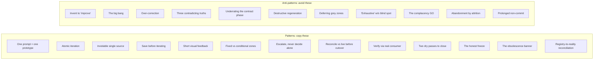

# Patterns & Anti-Patterns

*The catalogue. Patterns to copy: what they are, why they work, how to apply. Anti-patterns to avoid: their symptom, their cost, their fix.*

This chapter is a reference catalogue. Patterns are described as **What / Why
it works / How**. Anti-patterns are described as **Symptom / Cost / Fix**.
Most are drawn directly from the method; a few are natural extensions marked
*(extension)*; entries marked *(field)* come from the corpus where the method
has been applied (around ten real worksites, anonymized). The numbers they
carry have a precise epistemic status: private corpus, dated facts, counts
obtained by command, verified by an internal three-pass adversarial audit,
not replayable by the reader. Where a practice has documented breaches, they
are published with it: the violations are what founded the rules.

---

## Patterns

### Pattern 1: One prompt = one prototype

**What.** The prototype comes out of a single generation, with two to four
internal passes. You do not build it in piecemeal prompts.

**Why it works.** The number of iterations becomes a clean, honest metric of
brief quality. If a screen takes five prompts, the brief had five holes, and
now you know it. Piecemeal prompting hides that signal by spreading the holes
across many small successes.

**How.** Write the prototype prompt as a contract (see
[Chapter 06](./06-prompt-as-contract.md)): operation type, specifications
with numeric values, prohibitions, checklist, and the validated prototype as
the sole visual truth. Then generate once. If the result is unusable, fix the
*prompt*, not the screen.

### Pattern 2: Atomic iteration

**What.** One modification per message. Each iteration changes exactly one
thing.

**Why it works.** When a change breaks something, the cause is unambiguous:
there is only one candidate. Bundled changes turn debugging into a search.

**How.** Use the surgical-modification prompt mode. One problem named, one
target pattern, one scope prohibition ("no change other than this one").
Verify, then start the next message.

### Pattern 3: The inviolable single source

**What.** Never invent a label or a value. Always fetch it from its source.

**Why it works.** Invented labels and values are the raw material of grey
zones and consistency debt. A value fetched from its source of truth cannot
diverge from it.

**How.** When the agent needs a string, a limit, a colour, or an endpoint, it
reads the design system, the contract, or the code; see the authority table
in [Chapter 02](./02-vault-and-sources-of-truth.md). Make "no invention" a
permanent prohibition in the context file.

### Pattern 4: Save before iterating

**What.** Archive the validated state before any iteration. Never modify
destructively.

**Why it works.** It guarantees a rollback point. You can attempt a change
boldly because the known-good state is safe (see
[Chapter 11](./11-failure-protocols.md), rollback discipline).

**How.** Commit or tag the validated state before the iteration prompt. The
iteration then has somewhere to fall back to if it breaks. Where git is
absent, a named, dated backup stands in for versioning: the documented
degraded variant, not an exemption.

### Pattern 5: Short visual feedback

**What.** Validate against a real screenshot or rendered output, not a
description.

**Why it works.** A description of what was built is the agent's *claim*. A
screenshot is *evidence*. Grey zones hide in the gap between the claim and the
evidence.

**How.** After a generation or iteration, look at the actual rendered result,
across viewports. Run the grey-zone scan against what you see, not what the
agent says it did ([Chapter 05](./05-grey-zones-and-divergence.md)).

### Pattern 6: Fixed zones vs conditional zones

**What.** Separate, explicitly, the parts of a screen that are always present
(fixed zones) from the parts that appear only under conditions (conditional
zones).

**Why it works.** Conditional zones are where states and edge cases live:
empty, error, permission-gated. Naming them explicitly forces them into the
contract and the grey-zone scan instead of being discovered later.

**How.** In the contract's architecture section, list fixed zones and
conditional zones separately. For each conditional zone, state the condition
that shows it and the state it shows.

### Pattern 7: Escalate, never decide alone *(extension)*

**What.** When a case is in no source, climb to the higher source, complete
it, come back down: prototype first, contract next, code last.

**Why it works.** It fixes the *source* of the gap, not the symptom. The next
agent and the next reviewer inherit a complete source instead of guessing
again.

**How.** This is the escalation reflex of
[Chapter 02](./02-vault-and-sources-of-truth.md). A case in no source is a
grey zone; resolve it via the outcomes of
[Chapter 05](./05-grey-zones-and-divergence.md).

### Pattern 8: Reconcile against the live source before cutover *(extension)*

**What.** Before a migration or consolidation goes live, do not trust the
migrated snapshot. Pull the real values from the live source(s), and when
several sources disagree, resolve by a **declared priority order**, not by
guessing, and not by averaging.

**Why it works.** A snapshot taken during a migration *lies*: it carries
placeholder values, stale fields, and silent gaps that look exactly like real
data. Trusting it ships a state that is wrong in ways no screenshot reveals.
Pulling from the live source turns assumption into evidence; a declared
priority makes "who wins when sources disagree" a rule, not an improvisation.

**How.** Pull the authoritative fields (`key + state + value`) from each live
source, read-only. Match by a stable key. Resolve conflicts by the authority
table in [Chapter 02](./02-vault-and-sources-of-truth.md): one source is the
reference, the others fill gaps, and a source you have flagged as unreliable
is *never* the authority. Write into the staging copy with a backup, then
**gate the cutover on a read-only certification check** that returns a single
GO / NO-GO. The cutover does not happen on a green claim; it happens on green
evidence (Pattern 5, applied to data).

### Pattern 9: Verify through the real consumer, not a convenient proxy *(extension)*

**What.** When a check's result contradicts observed reality, re-run the
verification through the *exact* client and path the real system uses, not
the handiest tool at hand.

**Why it works.** A proxy tool can fail where the real client succeeds. A
`mysql` CLI denied a password that the application's PHP driver accepted over
the same socket; trusting the CLI would have rolled back a change that was
actually working. The proxy's "failure" was a false negative, not evidence.

**How.** Model the verification on the actual consumer: connect the way the
app connects, request the way a browser requests. When the proxy and reality
disagree, the real consumer is the source of truth, and a green light from a
proxy is not green evidence (Pattern 5).

### Pattern 10: The "two dry passes" stop rule *(field)*

**What.** A review loop does not close on fatigue, nor on the feeling that
"it looks fine": it closes when **two consecutive full passes produce no new
finding**. A pass with no finding is a *dry pass*; it takes two in a row.

**Why it works.** A subjective stop criterion selects exactly the moment the
reviewer drops their guard, which is the worst moment to stop. One dry pass
can be luck, or a lazy pass; the second one confirms it. Closure becomes a
measured fact, not a feeling. Field: a fintech in the corpus closed a
milestone after six review rounds, closure pronounced on two consecutive dry
passes.

**How.** Count new findings per pass, in the loop journal. Until the count
hits zero twice in a row, the loop continues, or freezes honestly
(Pattern 11). The full protocol is in
[Chapter 07 · Adversarial Review](./07-adversarial-review.md).

### Pattern 11: The honest freeze *(field)*

**What.** When the review loop is not converging (the count of major
findings rises instead of falling), you **freeze the batch in writing**:
verdict "frozen", exact state recorded, resumption condition stated. You do
not pronounce a GO.

**Why it works.** Non-convergence is information: the scope was too large,
the brief too vague, or the work not ripe. A documented freeze can be resumed
cleanly; an extracted GO is paid for in production. Field: on an agency's
internal cockpit, one pass took a batch's findings from 13 to 21 (that is
not convergence), and the batch was frozen in writing, commit attached,
instead of being approved.

**How.** Fix the convergence criterion *before* the loop (for example: zero
majors + a real refutation attempt that fails). If a pass raises the count,
freeze: a dated entry stating what is known, what remains open, and what must
change before resumption. The freeze is a first-class verdict, on par with GO
and NO-GO ([Chapter 07](./07-adversarial-review.md)).

### Pattern 12: The obsolescence banner *(field)*

**What.** A stale artifact is neither deleted nor rewritten: it gets **a
dated banner at the top** ("obsolete since DD/MM, superseded by X") and
stays readable as history.

**Why it works.** Deletion destroys history; silent rewriting manufactures a
false truth: the artifact looks current, and an agent will trust it. The
banner costs one line and makes the state explicit: whoever lands on it knows
not to rely on it, and knows where to go. It is the documentary counterpart
of decision supersession: you do not rewrite, you replace and keep the trail.
Field: across several worksites in the corpus, stale handoffs and reports
carry a dated expiry banner, the old state kept as history.

**How.** The moment an artifact is superseded or invalidated, add the top
line: date, status, pointer to the replacement. Short rule: *stale = marked
stale*. See [Chapter 10 · Session Conduct](./10-session-conduct.md) and
[Chapter 11 · Failure Protocols](./11-failure-protocols.md).

### Pattern 13: Registry-to-reality reconciliation *(field)*

**What.** Every registry (releases, decisions, artifacts) is periodically
**checked against the real state it claims to describe**: git tags, server,
disk. Every gap is dealt with: a missing entry added and marked retroactive,
or an anomaly opened.

**Why it works.** No test protects a registry: it can lie by omission and
nothing fails. Field: on a two-developer, multi-repo product, the release
registry declared "no production release to date" while the repo carried
11 tags: the rule had been instituted, then no longer held, and nothing
flagged it. At the other end, the corpus's fully-held registry lines up
239 entries against 193 tags, and its golden rule fits on one line: no
release without an entry, no entry without a release. The difference between
the two is not writing discipline; it is reconciliation.

**How.** A command or script compares the registry to reality: entry count
against tag count, displayed version against deployed version, listed files
against files on disk. Make it a post-release ritual and a periodic check.
The full mechanism is in
[Chapter 09 · Release Gate and Registry](./09-release-gate-and-registry.md).

---

## Anti-patterns

### Anti-pattern 1: Inventing to "improve"

**Symptom.** The agent adds, changes, or "polishes" something that was not
asked for, because it judged the result would be better.

**Cost.** The single largest source of grey zones. Each invention is a silent
decision no one with authority made. They accumulate invisibly and detonate at
integration.

**Fix.** A permanent "no invention" prohibition in the context file; a scope
prohibition in every surgical prompt; the inviolable single source (Pattern 3).
What looks like helpfulness is unbudgeted decision-making.

### Anti-pattern 2: The big bang

**Symptom.** Everything is built before anything is tested; all the pieces are
wired together at the end, in one final phase.

**Cost.** Every integration problem surfaces at once, at the worst possible
moment, with no isolation. A big-bang join is the moment fifteen grey zones
explode together.

**Fix.** Contract-first parallel build with **wiring in waves**: endpoint by
endpoint, each replacement verified
([Chapter 04, Step 4](./04-delivery-chain.md)). Integration becomes a
sequence of small, verified steps, not one cliff.

### Anti-pattern 3: Over-correction

**Symptom.** Asked to change one thing, the agent also reworks adjacent things
that were not in scope and were already correct.

**Cost.** Regressions in code that had a signed contract and was working.
Discovered in QA, traced back with difficulty, because the diff is larger than
the request.

**Fix.** End every surgical prompt with "no change other than this one"
([Chapter 06](./06-prompt-as-contract.md)); end the checklist with "no
regression anywhere else." Atomic iteration (Pattern 2) keeps the diff
auditable.

### Anti-pattern 4: Three contradicting truths

**Symptom.** A note, a contract, and the code each say something different
about the same fact.

**Cost.** Consistency debt: the most expensive debt, invisible until
everything breaks at once ([Chapter 02](./02-vault-and-sources-of-truth.md)).
An agent reading three truths picks one at random.

**Fix.** The divergence golden rule: the higher source wins and the lower one
is updated *immediately*. Never let two truths coexist, not for an afternoon.

### Anti-pattern 5: Underrating the contract phase

**Symptom.** The contract is treated as paperwork: rushed, half-filled, or
skipped to "get to the real work."

**Cost.** The most expensive debt of the project. Every gap in the contract
becomes a grey zone, a round-trip, or a rework. The time "saved" on the
contract is borrowed at a punishing rate.

**Fix.** Treat the contract as Step 3 of the chain, with a definition of done
of its own: all sections filled, double signature, `status: frozen`
([Chapter 04](./04-delivery-chain.md)). The contract phase *is* the real
work.

### Anti-pattern 6: Destructive regeneration *(extension)*

**Symptom.** When generation breaks, the response is to wipe and regenerate
the whole artifact.

**Cost.** Every grey-zone resolution, every contract conformance, every
validated decision baked into that artifact is discarded. The fresh output
*looks* like progress; it is loss.

**Fix.** The failure protocols of [Chapter 11](./11-failure-protocols.md):
minimal action, diagnose the exact cause, fix the smallest thing, roll back to
the last stable point if needed; never regenerate.

### Anti-pattern 7: Deferring grey zones *(extension)*

**Symptom.** A grey zone is found and parked: "we'll decide that later."

**Cost.** "Later" is integration, when it arrives with all the other deferred
zones. A deferred grey zone is not resolved; it is rescheduled to the most
expensive moment.

**Fix.** Every grey zone resolves to a formal decision or a contract note
([Chapter 05](./05-grey-zones-and-divergence.md)). The only admissible
deferral is the **dated deferral** of the divergence register (planned,
visible, carrying a due date), never an undated "later." The ledger is not
closed until every row has a resolution or a due date.

### Anti-pattern 8: Claiming "exhaustive" without naming the blind spot *(extension)*

**Symptom.** Reporting full coverage ("that was the only one", "it's all
clean") when the method only checked the easy surface: top-level names, a
list of guessed slugs, a single server.

**Cost.** A real defect or exposure survives behind the false confidence and
surfaces at the worst moment. An "exhaustive" sweep that checked only
top-level files and guessed names missed **22 GB of publicly-downloadable
customer-database dumps**, found only when a recursive content search was
finally run.

**Fix.** State the *method* and its limits alongside any coverage claim
("grepped top-level HTML; sub-directories, other extensions, and other hosts
not covered"). Prefer recursive content search over name-guessing. And treat
a stakeholder's "are you sure?" as a gift that catches the gap, not a
challenge to defend against.

### Anti-pattern 9: The complacency GO *(field)*

**Symptom.** The review loop is long, the calendar presses, and the verdict
flips to GO "to move forward", while the last pass was still finding majors,
or while the person pronouncing the GO is the one who built the thing.

**Cost.** The remaining findings ship to production, invisible again. And the
damage outlives the worksite: if a GO can be extracted, no GO proves anything
any more: the verdict stops being information.

**Fix.** An objective stop rule (Pattern 10), the honest freeze when
convergence does not come (Pattern 11), and the separation rule of
[Chapter 07](./07-adversarial-review.md): a milestone is never closed by
whoever built it.

### Anti-pattern 10: Abandonment by attrition *(field)*

**Symptom.** A ritual of the method stops being held without anyone deciding
it: the registry receives no more entries, the index is no longer updated,
decisions are no longer numbered. Nobody chose it; it just happened.

**Cost.** The worst of both worlds: the cost of the mechanism was paid, its
value is lost, and the half-dead mechanism *lies*. Field: a release registry
left empty asserted nothing had happened, while the repo carried 11 tags
(Pattern 13).

**Fix.** **Written de-escalation**: a ritual you abandon is abandoned by a
dated decision that says why, and over what scope. Field: a versioning rule
was declared in writing not applicable to a worksite with no production,
with a ban on re-flagging its absence as debt. Written modulation is
compliant; silent non-observance never is. The dosing variable is always the
same: code ownership × cost of error, not size, not duration.

### Anti-pattern 11: Prolonged non-commit *(field)*

**Symptom.** Work continues, files change, and nothing has been committed for
days or weeks. No decision recorded it.

**Cost.** No rollback point left (Pattern 4 broken), no auditable diff, a
handoff that rests on someone's word. Field: 85 uncommitted paths on an
agency's internal cockpit, on the lead's call, never recorded as a dated
decision; 123 uncommitted files on an audit vault, covering the entire end of
the worksite.

**Fix.** Short rule: **prolonged non-commit = dated decision or anomaly.**
Either a dated decision records the choice, its scope, and its exit, or it
is an anomaly to fix on the spot. Where git is absent, the named, dated
backup stands in for versioning (Pattern 4): the documented degraded
variant, not silent absence.

---

## The catalogue as a checklist

Use this as a fast self-audit at the end of a feature.

| Did you... | Pattern / anti-pattern |
|---|---|
| Generate the prototype in one prompt? | P1 |
| Keep each iteration to one change? | P2 |
| Fetch every label and value from its source? | P3 / A1 |
| Archive the validated state before iterating? | P4 |
| Validate against real rendered output? | P5 |
| Separate fixed and conditional zones in the contract? | P6 |
| Escalate gaps instead of patching code? | P7 |
| Reconcile against the live source (not the snapshot) before cutover? | P8 |
| Verify through the real consumer when a check contradicts reality? | P9 |
| Close the review loop on two dry passes, not on fatigue? | P10 / A9 |
| Freeze in writing when convergence did not come? | P11 / A9 |
| Mark the stale with a dated banner instead of rewriting it? | P12 |
| Reconcile every registry with the reality it describes? | P13 / A10 |
| Wire integration in waves, not a big bang? | A2 |
| Keep the diff scoped to the request? | A3 |
| Keep all sources consistent? | A4 |
| Treat the contract as real work? | A5 |
| Fix breakage minimally, never regenerate? | A6 |
| Resolve every grey zone now, or defer it with a date? | A7 |
| Name the method's blind spot instead of claiming "exhaustive"? | A8 |
| Record every abandoned ritual as a dated decision? | A10 |
| Treat prolonged non-commit as a decision or an anomaly? | A11 |

A "no" anywhere is a known failure mode with a known fix. The catalogue exists
so that none of them is a surprise.

## See also

- [Chapter 04 · The Delivery Chain](./04-delivery-chain.md)
- [Chapter 05 · Grey Zones and Divergence](./05-grey-zones-and-divergence.md)
- [Chapter 06 · The Prompt as a Contract](./06-prompt-as-contract.md)
- [Chapter 07 · Adversarial Review](./07-adversarial-review.md)
- [Chapter 09 · Release Gate and Registry](./09-release-gate-and-registry.md)
- [Chapter 10 · Session Conduct](./10-session-conduct.md)
- [Chapter 11 · Failure Protocols](./11-failure-protocols.md)
