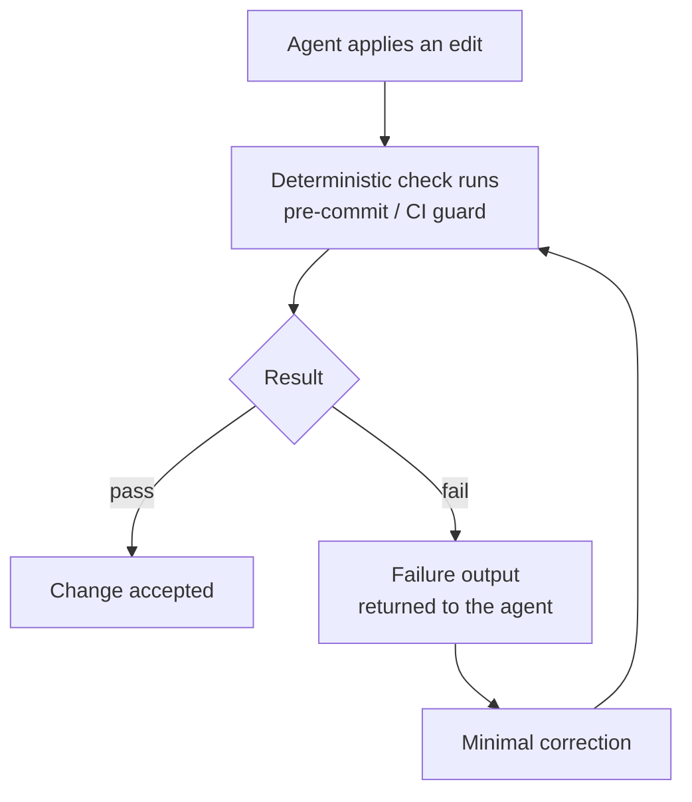

# CI/CD and hooks

*A hook turns a good practice into a guarantee. On the ground, the guarantee that actually got built is the git `pre-commit` hook — and the only method check that ever ran in CI is a static decision guard. This chapter owns both, and marks the rest for what it is: prescriptive, unproven.*

A hook is a deterministic trigger attached to an event in the working cycle. It does not ask the model's opinion; it executes. That determinism is what makes a hook reliable: a good practice that depends on the agent remembering to do it is not a guarantee — a hook is.

Earlier versions of this chapter described a family of hooks attached to the agent's lifecycle — format after every edit, test before every commit, remind about the grey-zone scan. Confrontation with the field returned a blunt verdict: **none of those agent hooks was adopted on any project** — no agent configuration file in the corpus carries a hooks key. What the field built instead is simpler and more robust: the git `pre-commit` hook, wired through `core.hooksPath`, and one static guard in CI. This chapter is rewritten around what exists.

---

## The main road: the git `pre-commit` hook

The only field implementation of the hooks layer ever observed is a **git `pre-commit` hook versioned inside the repository** and wired by configuration:

```bash
# hooks/README.md — wiring, once per clone
git config core.hooksPath .githooks
```

Choosing git's `pre-commit` over an agent-runtime hook has three virtues, and they probably explain why it is the one that survived contact with the field:

- **It is tool-agnostic.** It applies to the agent, to the human, to any future agent — whoever commits passes under it. A runtime hook only covers the runtime that knows about it.
- **It is versioned with the code.** The `.githooks/` folder travels in the repository; the hook is reviewed, amended and historised like everything else.
- **It guards the right event.** The commit is the boundary where state becomes history. That is where a prohibition must bite — not on every edit, where it gets in the way, nor only in CI, where it arrives after the fact.

An observed `pre-commit` chains **numbered blocks**, each guarding one precise prohibition, each traceable to the decision that founded it:

```bash
#!/usr/bin/env bash
# .githooks/pre-commit — illustrative structure, modelled on a field hook
set -euo pipefail

# Block 1 — doc/schema: a migration without the canonical doc update blocks.
./hooks/doc-schema-sync.sh

# Block 2 — real-data guard (founded by a dated decision):
# no staged file may contain production data.
staged="$(git diff --cached --name-only)"
if echo "$staged" | grep -qE '(prod-snapshot|\.dump$|customer-export)'; then
  echo "BLOCKED: real-data artefact staged. Production data never enters git."
  exit 1
fi

echo "pre-commit: OK"
```

The real-data block comes from a two-developer, multi-repo product, where it implements an architecture decision: production extracts live outside every git repository, and the hook makes the prohibition mechanical ([Chapter 12 — Secrets and PII](../core/12-secrets-and-pii.md)). That is the template to copy: **each block of the hook cites the rule it guards, and the rule cites the incident that founded it** ([Chapter 01](../core/01-three-pillars.md)).

---

## The doc/schema sync hook

This is the hook retained from the method's first version — the only one whose principle the field picked up, adapting it to its own scope. It enforces the structural rule that **code is the source of truth for the schema** ([Chapter 02](../core/02-vault-and-sources-of-truth.md)). A migration that changes the schema without updating the canonical docs in the same change produces documentation that lies; the hook makes that impossible.

Two valid modes — pick one per repository:

**Mode 1 — blocking check:**

```bash
#!/usr/bin/env bash
# hooks/doc-schema-sync.sh
# Trigger: pre-commit (via .githooks/), and optionally as a CI check.
set -euo pipefail

MIGRATIONS_GLOB="apps/backend/src/migrations/"
DOCS_DIR="apps/backend/docs/database/"

changed="$(git diff --cached --name-only)"
schema_touched="$(echo "$changed" | grep "^${MIGRATIONS_GLOB}" || true)"
docs_touched="$(echo "$changed"   | grep "^${DOCS_DIR}"        || true)"

if [ -n "$schema_touched" ] && [ -z "$docs_touched" ]; then
  echo "BLOCKED: a migration changed the schema but the canonical"
  echo "data-model docs in ${DOCS_DIR} were not updated."
  exit 1
fi
echo "doc-schema-sync: OK"
```

**Mode 2 — automatic regeneration:** instead of failing, the hook regenerates the canonical docs from the code and stages them. Use it when the docs are fully derivable from the schema.

Field status, honestly recorded: the adopted copy currently runs as a **prepared rail** — the hook is wired and executes, but exits with a warning, not a block, while the guarded scope stabilises. That is real but partial adoption: the rail exists; the blocking train has not yet run on it. A prepared rail that stays non-blocking forever becomes a lie about guarantees — date the switch-over, or de-escalate in writing ([Chapter 09](../core/09-release-gate-and-registry.md)).

---

## The static decision guard — the one method check observed in CI

Exactly one check belonging to the method — as opposed to plain compilation — was observed **actually wired into CI** in the field: a **static guard that implements a vault decision**.

The observed case, on an audit vault on a client's platform: a dated decision forbids a class of writes (any database write outside the sanctioned channel). A CI job runs a script that walks the tree — instrumented `grep`, nothing more — and fails the pipeline if the forbidden pattern appears. The workflow notes that it can be run by hand from the server if CI is not active: the guard outlives its infrastructure.

```yaml
# .ci/pipeline.yml — extract, provider-neutral, illustrative
- name: decision-guard
  run: ./tools/ci/decision-guard.sh    # implements DEC-XXX: no writes outside the sanctioned channel
  blocking: true
```

```bash
#!/usr/bin/env bash
# tools/ci/decision-guard.sh — static guard for a vault decision
set -euo pipefail
violations="$(grep -rnE 'INSERT INTO|UPDATE .+ SET' src/ --include='*.php' \
              | grep -v 'src/sanctioned-channel/' || true)"
if [ -n "$violations" ]; then
  echo "BLOCKED by DEC-XXX: raw writes outside the sanctioned channel:"
  echo "$violations"
  exit 1
fi
echo "decision-guard: OK"
```

The generic pattern deserves a name: **the static decision guard**. A vault decision states a prohibition; a deterministic script checks it across the whole tree; CI makes it blocking. It is the cheapest form of guardrail: no model, no judgement, a grep that cites its decision. Any decision expressible as a textual pattern is a candidate — out-of-channel writes, a forbidden import, a plaintext secret, a proscribed file path.

---

## The prescriptive, unproven checks

The first version of this chapter prescribed other blocking checks. None was observed in CI on any project. They remain published — the reasoning behind them holds — but with their real status:

| Check | Would fail the PR when... | Status |
|---|---|---|
| Build / tests / lint | The project doesn't compile, a test fails, the tree is inconsistent | Standard, proven everywhere (not method-specific) |
| Static decision guard | A pattern forbidden by a decision appears in the tree | **Proven — one field occurrence** |
| Doc/schema sync | A migration changes the schema without the canonical docs | Adopted at pre-commit, prepared rail, non-blocking |
| Contract signatures | A contract reaches `frozen` without both signatures | **Prescriptive, unproven** |
| Grey-zone scan presence | A screen merges without a completed scan ledger | **Prescriptive, unproven** |
| Eval harness | A golden task or guardrail probe fails | **Prescriptive, unproven** ([Chapter 08](../core/08-proof-and-probes.md)) |
| Agent-lifecycle hooks (format after edit, tests before commit via runtime) | — | **Deprecated as the main road** — zero field adoption; git pre-commit replaces them |

The dividing line is instructive. What got adopted shares two properties: **deterministic** (a grep, a path diff — never a judgement) and **sitting on a natural boundary** (the commit, the PR). What did not get adopted required either dedicated tooling (the eval harness) or a convention the field had not yet stabilised (the signature frontmatter). If you adopt the prescriptive checks, adopt them in cost order: static guard first, signatures next, eval harness last.

---

## The self-correction loop

Wherever a deterministic check exists, a loop becomes possible: the agent edits, the check runs, the failure returns to the agent with its output, the agent applies a minimal correction, the check runs again. The loop closes when the check passes — no human in the inner cycle.



The loop's real seat, in the field, is the `pre-commit`: the agent commits, the hook blocks, the hook's output names the file and the prohibition, the agent fixes and recommits. Two disciplines keep it healthy:

- **Failure output must be actionable.** A useful failure names the file, the line, the expectation — and the decision it enforces. "BLOCKED by DEC-XXX" hands the agent the rule to reread, not just the symptom.
- **The correction must be minimal.** The loop fixes the precise failure; it does not refactor. An agent that "improves" code while clearing a block introduces drift — see [Failure protocols](../core/11-failure-protocols.md).

---

## An example pipeline (neutral, fictional)

The configuration below is generic and **fictional** — no real provider's syntax. Proven stages first, prescriptive ones as owned comments:

```yaml
# .ci/pipeline.yml — illustrative, provider-neutral
pipeline:
  triggers:
    - on: pull_request
    - on: push
      branch: main

  stages:
    - name: build
      run: npm ci && npm run build
      blocking: true

    - name: lint
      run: npm run lint
      blocking: true

    - name: test
      run: npm run test
      blocking: true

    - name: decision-guard                  # the one method check proven in CI
      run: ./tools/ci/decision-guard.sh
      blocking: true

    - name: doc-schema-sync                 # adopted at pre-commit; run again here
      run: ./hooks/doc-schema-sync.sh
      blocking: true

    # --- prescriptive, not field-proven — adopt knowingly, in this order ---
    # - name: contract-signatures
    #   run: ./skills/contract-lint/lint.sh
    #   blocking: true
    # - name: eval-harness
    #   run: npm run eval -- --suite golden,conformance,guardrail,regression
    #   blocking: true

    - name: metrics                          # proposed instrument, advisory only
      run: npm run metrics:dashboard
      blocking: false
```

The metrics stage refers to a [proposed, unproven instrument](./metrics.md) — it informs, it never locks.

---

## What CI does not guard: production

A green pipeline is not a go. The most important boundary in the cycle — the push to production — is guarded by no hook and no CI: it is guarded by an **explicit human go, given in the current turn**, recorded in the release registry. That is a design choice, not a gap: automating that gate would amount to inferring authorisation from validation, which is precisely what the method forbids. See [Chapter 09 — The release gate and registry](../core/09-release-gate-and-registry.md).

---

## See also

- [Chapter 02 — The vault and sources of truth](../core/02-vault-and-sources-of-truth.md)
- [Chapter 08 — Proof and probes](../core/08-proof-and-probes.md)
- [Chapter 09 — The release gate and registry](../core/09-release-gate-and-registry.md)
- [Chapter 12 — Secrets and PII](../core/12-secrets-and-pii.md)
- [Reference — Metrics](./metrics.md)
