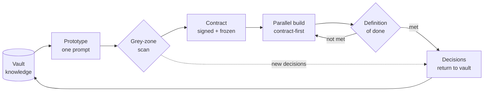

# Introduction — Pourquoi Mainstay existe

*Le modèle n'est pas la partie. La partie se joue dans l'infrastructure autour de lui — et c'est elle que Mainstay construit.*

## Le modèle est un cerveau. Un agent a des mains.

Tout le monde observe le modèle. La partie se joue ailleurs.

Un modèle, c'est un cerveau. Un agent, c'est ce cerveau auquel on a donné des mains — la capacité d'agir, et plus seulement de répondre. Il édite des fichiers, lance des commandes, interroge des bases de données, ouvre des pull requests. C'est un changement de nature, et c'est la raison pour laquelle la livraison pilotée par agents est désormais possible tout court.

Mais un cerveau brillant doté de mains, privé de mémoire et de règles, fait n'importe quoi — vite, et avec assurance. Il invente un libellé parce qu'on ne lui en a donné aucun. Il choisit un ordre de tri parce que le brief était muet. Il reconstruit un composant qui marchait parce qu'il a jugé que l'ancien pouvait être meilleur. Aucune de ces actions n'est un bug. Ce sont les comportements prévisibles d'un système capable qui comble un vide.

Ce qui transforme la puissance brute d'un modèle en logiciel livré, ce n'est pas le cerveau. C'est tout ce que l'on bâtit autour. Son infrastructure.

## Ce qu'est Mainstay

> Un *mainstay*, c'est l'étai qui maintient le mât d'un navire droit — et, en clair, ce dont un système dépend pour rester debout. Mainstay est l'infrastructure qui tient debout la production d'un agent IA : mémoire, contrats, garde-fous.

Mainstay est une **méthode**, pas un outil. Elle est agnostique du modèle, du langage de programmation et du domaine métier. Elle décrit, dans le détail opérationnel :

- le **monorepo** qui ancre la connaissance dans le code, versionnée avec lui ;
- les **six couches techniques** qui transforment un modèle en agent outillé ;
- la **chaîne de livraison** qui mène d'un dépôt vide à la production ;
- les **protocoles de défaillance** qui tiennent quand la génération casse ;
- les **patterns et anti-patterns** à copier et à éviter.

Cette documentation développe chacun de ces points en quelque chose que vous pouvez appliquer lundi matin.

## La promesse

La promesse n'est pas « aller vite en bâclant ». C'est l'inverse.

La promesse, c'est de livrer en quelques semaines ce qui en demandait douze — en supprimant les allers-retours, les zones grises et les spécifications laissées à moitié écrites qui consomment silencieusement l'essentiel du calendrier d'un projet. L'agent avance vite précisément parce que rien ne lui laisse le moindre doute. La contrainte ne le ralentit pas ; elle le délivre de l'hésitation.

Une seule phrase porte toute la thèse :

> Le meilleur modèle du monde, posé sur une infrastructure bancale, donnera toujours un projet bancal. Une infrastructure solide, même servie par un modèle ordinaire, livre des chantiers entiers en quelques semaines.

Votre énergie ne va pas dans le modèle. Elle va dans les trois piliers : mémoire, contrat, garde-fous. Tout, dans cette documentation, découle d'une manière ou d'une autre de ce choix.

## Mainstay en un schéma

La méthode tout entière est une boucle. La connaissance nourrit un prototype ; le prototype est balayé à la recherche de zones grises ; la compréhension résolue devient un contrat signé ; front et back avancent en parallèle contre ce contrat ; une definition of done par couche valide le résultat ; et les décisions qui ont émergé retournent à la connaissance, de sorte que la fonctionnalité suivante démarre plus riche.

Lisez le [chapitre 05 — La chaîne de livraison](./05-the-delivery-chain.md) pour le détail de chaque étape. La boucle est le cœur de Mainstay ; le reste de la documentation explique comment rendre chaque flèche fiable.

## À qui cela s'adresse

Mainstay est écrit pour trois publics. La méthode est la même pour les trois ; seule l'échelle change.

**Les constructeurs solo.** Vous êtes une seule personne à livrer du vrai logiciel avec un agent. Mainstay est ce qui vous permet de vous comporter comme une petite équipe disciplinée : le vault est votre mémoire d'une session à l'autre, le contrat est votre propre brief rendu explicite, les garde-fous empêchent l'agent de redessiner discrètement le travail d'hier. Commencez par le [chapitre 10 — Démarrage rapide](./10-quickstart.md).

**Les équipes.** Vous avez plusieurs ingénieurs, peut-être plusieurs agents, qui travaillent dans une même base de code. Le problème le plus difficile n'est plus d'écrire du code — c'est de garder tout le monde (humains et agents) pointé sur la même vérité. Mainstay vous donne une source de vérité unique, un contrat que produit et technique signent tous les deux, et des rituels qui passent à l'échelle. Voir le [chapitre 15 — Adoption par l'équipe](./15-team-adoption.md).

**Les architectes d'infrastructure agentique.** Vous concevez et exploitez le système qui permet aux agents de livrer : les fichiers de contexte, les skills, les hooks, les serveurs MCP, les niveaux d'orchestration. Ce rôle n'a pas encore de nom stable. Mainstay en est, de fait, la fiche de poste. Voir le [chapitre 03 — L'architecture agentique](./03-agent-architecture.md) et le [chapitre 11 — Orchestration multi-agents](./11-multi-agent-orchestration.md).

## Comment lire cette documentation

La documentation comporte dix-huit chapitres répartis en deux groupes.

| Groupe | Chapitres | Objet |
|---|---|---|
| Fondations | 00–09 | La méthode elle-même : principes, architecture, chaîne de livraison, gestion des défaillances. |
| Opérations | 10–17 | La mise en pratique : démarrage rapide, orchestration, métriques, tests, CI/CD, adoption, FAQ, glossaire. |

Trois parcours de lecture :

- **La colonne vertébrale en une heure.** Lisez [00](./00-introduction.md), [01](./01-three-pillars.md), [05](./05-the-delivery-chain.md) et [07](./07-grey-zones.md). C'est assez pour comprendre la méthode et la défendre.
- **La méthode complète.** Lisez 00–09 dans l'ordre. Chaque chapitre est autonome, mais ils se renforcent.
- **Le parcours d'adoption.** Lisez d'abord [10 — Démarrage rapide](./10-quickstart.md), copiez les modèles, puis revenez aux chapitres de fond quand un concept vous accroche.

Chaque chapitre s'ouvre sur un résumé d'une ligne et se termine par une liste `## Voir aussi`. Les liens croisés sont relatifs : ils fonctionnent que vous lisiez sur GitHub ou dans un dépôt cloné. Les blocs de code sont réels et exécutables. Les exemples sont génériques et fictifs — l'exemple fil rouge de toute la documentation est une fonctionnalité de « vues enregistrées » (Saved Views) sur un écran générique de table de données, d'identifiant d'écran `saved-views-panel`. Vous la rencontrerez au [chapitre 05](./05-the-delivery-chain.md) et dans `examples/walkthrough/`.

## Ce que Mainstay n'est pas

- Ce n'est pas un framework que l'on installe. C'est un ensemble de disciplines et de conventions de fichiers. Le code dans `skills/`, `hooks/` et `tools/` est illustratif, pas une dépendance.
- Ce n'est pas spécifique à un modèle. Là où la documentation dit « l'agent », n'importe quel agent de code capable convient.
- Ce n'est pas la promesse que les agents se passent de supervision. C'est une méthode pour rendre la supervision peu coûteuse, structurée et largement automatisée.

## Voir aussi

- [Chapitre 01 — Les trois piliers](./01-three-pillars.md)
- [Chapitre 05 — La chaîne de livraison](./05-the-delivery-chain.md)
- [Chapitre 10 — Démarrage rapide](./10-quickstart.md)
