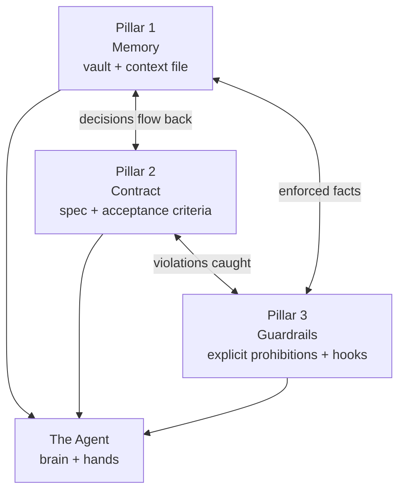

# Les trois piliers

*Mémoire, contrat, garde-fous. Retirez-en un et l'agent vacille.*

Toute infrastructure agentique repose sur trois fondations. Ce ne sont pas des abstractions — chacune est un ensemble concret de fichiers et de processus que vous construisez et entretenez. Retirez-en une, et l'agent vacille d'une manière que vous pouvez prévoir et nommer.



L'agent repose sur les trois. Et les trois se renforcent mutuellement : le contrat puise dans la mémoire, les garde-fous font respecter le contrat, et les décisions résolues retournent à la mémoire. Un schéma d'un seul pilier isolé est trompeur — la solidité tient dans le triangle.

---

## Pilier 1 — La mémoire

### Définition

Une base de connaissances unique où vivent vos conventions, vos décisions et vos contraintes : stable, versionnée et historisée. L'agent ne réinvente rien. Il s'appuie sur une vérité qui ne change ni d'une session à l'autre, ni d'un agent à l'autre.

La mémoire a deux moitiés, et la distinction compte :

| Moitié | Contient | Vit dans |
|---|---|---|
| **Mémoire déclarative** | Faits et règles : conventions, architecture, interdits | Le fichier de contexte (`AGENTS.md`) |
| **Mémoire procédurale** | Savoir-faire : capacité reproductible, pas à pas | Les skills (`skills/`) |

Les deux sont traitées en détail au [chapitre 03 — L'architecture agentique](./03-agent-architecture.md).

### Ce qui casse sans elle

Une défaillance fictive mais typique. Une équipe construit une fonctionnalité de table de données le lundi. L'agent, sans mémoire des conventions maison, nomme le composant d'état vide `NoData`. Le mercredi, une autre session d'agent construit un écran voisin et nomme son état vide `EmptyPlaceholder`. Le vendredi, une troisième session construit un panneau de filtres et l'appelle `BlankView`. Trois noms pour un seul concept. Aucun changement n'est faux pris isolément. Six mois plus tard, un nouvel arrivant cherche le pattern d'état vide, en trouve trois, copie le mauvais, et la divergence s'aggrave.

Le coût, ce ne sont pas les trois noms. C'est que **l'agent n'avait aucun moyen de savoir qu'une convention existait**, alors il en a inventé une à chaque fois. La mémoire, c'est ce qui transforme « l'état vide est toujours `EmptyState`, voir la note de design system » en un fait que l'agent lit, au lieu d'une décision qu'il improvise.

### Comment la construire

1. Créez le vault à l'intérieur du monorepo (voir le [chapitre 02](./02-monorepo.md)). Une connaissance versionnée avec le code est une connaissance qui ne peut pas pourrir en silence.
2. Écrivez un fichier de contexte maigre et stratifié à la racine du dépôt. Maigre : seul le transverse et le stable y a sa place, parce que chaque ligne est rechargée à chaque tour et consomme du budget de contexte. Stratifié : un fichier racine court qui pointe vers des fichiers spécialisés chargés à la demande.
3. Encodez le savoir-faire répété sous forme de skills, pour qu'une procédure soit expliquée une fois et réutilisée à jamais.
4. Faites en sorte que chaque artefact du vault porte un en-tête de métadonnées, pour qu'il soit traçable et interrogeable (voir le [chapitre 04 — Les sources de vérité](./04-sources-of-truth.md)).

Un squelette minimal de fichier de contexte :

```markdown
# Project context

## Commands
- build:  `npm run build`
- test:   `npm test`
- lint:   `npm run lint`

## Architecture (cross-cutting rules only)
- One feature = one screen contract in `vault/contracts/`.
- Code is the source of truth for the data schema.

## Conventions
- Components: PascalCase. The empty state is always `EmptyState`.

## Permanent prohibitions
- Never edit generated files in `apps/*/src/__generated__/`.

## Going deeper (loaded on demand)
- Backend detail: ./apps/backend/docs/
- Decisions:      ./vault/decisions/
```

---

## Pilier 2 — Le contrat

### Définition

Non pas un brief vague que l'agent interprète, mais une spécification assortie de critères d'acceptation. L'agent sait exactement ce que l'on attend ; vous savez exactement quoi vérifier. Un contrat referme l'écart entre « construis un panneau de vues enregistrées » et un résultat que vous pouvez valider sans surprise.

Un contrat est plus qu'une liste de souhaits. Il énonce le comportement, les edge cases, les états d'erreur, les permissions, les endpoints et les données de test. C'est l'artefact que produit et technique signent tous les deux avant qu'une seule ligne de code de fonctionnalité ne soit écrite.

### Ce qui casse sans lui

Une défaillance fictive. Le brief dit : « Les utilisateurs peuvent enregistrer une vue. » L'agent livre un `saved-views-panel` qui fonctionne. Il a l'air correct. Deux semaines plus tard, l'intégration commence et les questions arrivent toutes en même temps :

- Que se passe-t-il quand un utilisateur enregistre une vue portant le même nom qu'une vue existante ? (Personne n'a tranché.)
- Une vue enregistrée peut-elle être partagée, ou est-elle toujours privée ? (Personne n'a tranché.)
- Quel est l'état d'erreur quand l'endpoint d'enregistrement renvoie un `409` ? (L'agent a inventé une notification que personne n'a validée.)
- Y a-t-il une limite au nombre de vues enregistrées par utilisateur ? (Découverte quand un test de charge en a créé dix mille.)

Chacune de ces questions est une **zone grise** — une décision que l'agent a prise par défaut parce que le brief était muet (voir le [chapitre 07](./07-grey-zones.md)). Sans contrat, les zones grises sont invisibles jusqu'au jour où elles explosent ensemble. Avec un contrat, elles sont mises au jour et résolues *avant* la construction.

### Comment le construire

Le contrat est produit à partir d'un prototype validé — voir le [chapitre 05, étape 3](./05-the-delivery-chain.md) et le [chapitre 06 — Le prompt comme contrat](./06-prompt-as-contract.md). Sa structure, en tant qu'artefact du vault :

```yaml
---
type: contract
screen: "saved-views-panel"
version: "1.0"
status: draft          # draft | review | frozen | obsolete
signed_product: false
signed_engineering: false
related_decisions: [DEC-007, DEC-011]
---
```

```markdown
# Contract — saved-views-panel

1.  Context and persona
2.  Visual source of truth (link to validated prototype)
3.  Architecture (fixed zones / conditional zones)
4.  States and transitions
5.  Components (exact copy, validations)
6.  Endpoints (URL, payload, return codes, test data)
7.  Edge cases
8.  Permissions
9.  Business rules
10. Test data
11. Acceptance criteria — [ ] ...
12. Signatures — [ ] Product  [ ] Engineering
```

Les deux signatures ne sont pas un cérémonial. Elles tuent le piège du « validé côté UX, découvert infaisable côté performance deux semaines plus tard ». Sans les deux signatures, le contrat n'est pas figé, et rien en aval ne peut démarrer.

---

## Pilier 3 — Les garde-fous

### Définition

Ce que l'agent ne doit jamais faire, écrit noir sur blanc, hors de portée de son interprétation. Un agent comble toujours le vide qu'on lui laisse — et rarement comme on l'espérait. Un garde-fou est une porte fermée.

Les garde-fous prennent deux formes :

| Forme | Exemple | Appliqué par |
|---|---|---|
| **Interdit énoncé** | « Aucune autre modification que celle-ci » dans un prompt | L'agent qui le lit |
| **Garde-fou mécanique** | Un hook de pre-commit qui bloque si les tests échouent | Un hook — aucun jugement du modèle en jeu |

Les garde-fous les plus solides sont mécaniques. Un interdit énoncé dépend du fait que l'agent le respecte ; un hook, lui, s'exécute, point. Voir le [chapitre 14 — CI/CD et hooks](./14-cicd-and-hooks.md).

### Ce qui casse sans eux

Une défaillance fictive. Vous demandez à l'agent une modification chirurgicale sur un bouton de `saved-views-panel` : resserrer son padding. L'agent le fait — et, sans qu'on le lui demande, « améliore » aussi la liste voisine en la faisant passer d'une liste plate à des cartes, parce qu'il a jugé que les cartes rendaient mieux. La liste était correcte. Elle avait un contrat signé. Maintenant elle ne correspond plus au contrat, et vous ne l'avez pas remarqué avant la QA.

Le coût : une régression introduite par un agent qui en a fait plus qu'on ne lui demandait. C'est la cause la plus fréquente de zones grises (voir le [chapitre 09 — Patterns et anti-patterns](./09-patterns-and-antipatterns.md), l'anti-pattern de la *sur-correction*). Une seule ligne — « Aucune autre modification que celle-ci » — ferme cette porte.

### Comment les construire

1. Terminez chaque prompt chirurgical par un interdit de périmètre explicite. Voir l'exemple travaillé au [chapitre 06](./06-prompt-as-contract.md).
2. Listez les interdits permanents dans le fichier de contexte, pour qu'ils s'appliquent à chaque session sans être réénoncés.
3. Convertissez en hook tout interdit qui *peut* être mécanique. « Ne jamais committer des tests qui échouent » est une phrase ; un hook de pre-commit en fait une garantie.
4. Traitez un garde-fou violé comme un signal pour resserrer le garde-fou, pas seulement pour corriger le symptôme.

Un garde-fou mécanique minimal (un hook de pre-commit) :

```bash
#!/usr/bin/env bash
# Trigger: pre-commit. Blocks the commit if the test suite fails.
set -euo pipefail

if ! npm test --silent; then
  echo "guardrail: tests failing — commit blocked" >&2
  exit 1
fi
```

---

## Comment les trois s'imbriquent

Les piliers ne sont pas indépendants. Ils forment un cycle, et c'est ce cycle qui fait que l'infrastructure devient plus intelligente avec le temps.

- **La mémoire nourrit le contrat.** Un contrat écrit contre un vault riche hérite gratuitement des conventions, des décisions antérieures et des contraintes. Un contrat écrit contre un vault vide rejuge tout.
- **Le contrat nourrit les garde-fous.** Chaque critère d'acceptation et chaque edge case du contrat est un garde-fou candidat : un contrôle que l'agent doit passer, ou un hook qui le fait respecter.
- **Les garde-fous nourrissent la mémoire.** Une zone grise attrapée par un garde-fou devient une décision formelle (`DEC-XXX`) dans le vault. Le contrat suivant démarre avec cette décision déjà tranchée.

Faites tourner la boucle une fois, le gain est faible. Faites-la tourner sur l'ensemble d'un projet et l'infrastructure compose : chaque fonctionnalité démarre avec plus de mémoire, des contrats plus tranchants et des garde-fous plus serrés que la précédente. Cette composition est le vrai retour sur la construction des trois piliers — bien plus que la vitesse d'une fonctionnalité isolée.

Le principe unique qui les relie : **votre énergie va dans les piliers, pas dans le modèle.** Un triangle solide servi par un modèle ordinaire livre mieux qu'un modèle brillant posé sur un triangle bancal, à chaque fois.

## Voir aussi

- [Chapitre 00 — Introduction](./00-introduction.md)
- [Chapitre 02 — Le monorepo](./02-monorepo.md)
- [Chapitre 03 — L'architecture agentique](./03-agent-architecture.md)
- [Chapitre 04 — Les sources de vérité](./04-sources-of-truth.md)
