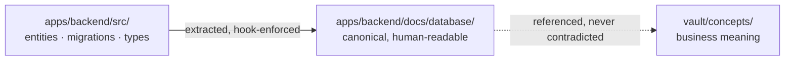
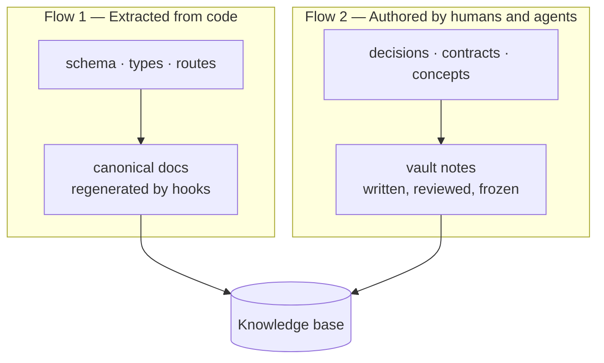

# Le monorepo, socle de la connaissance

*La connaissance vit à côté du code, versionnée avec lui. Tout le reste dérive.*

## La première erreur

La première erreur consiste à loger la base de connaissance ailleurs que dans le code : un wiki, un espace de notes, un outil de documentation séparé. Tout ce qui vit à l'extérieur du dépôt dérive du code — mécaniquement et inexorablement. Le code change ; la doc reste ; six mois plus tard, l'agent s'appuie sur une vérité qui ment.

Ce n'est pas un problème de discipline que des rappels suffiraient à régler. C'est structurel. Une page de wiki et un fichier de code n'ont pas de commit partagé, pas de revue partagée, pas de fusion partagée. Rien ne les force à bouger ensemble, donc ils ne le font pas.

Mainstay pose donc une règle structurelle :

> **La connaissance vit dans le monorepo, à côté du code, versionnée avec lui.**

C'est ce qui rend la mémoire de l'agent fiable plutôt que périmée.

## Une connaissance versionnée comme le code

Le code et la base de connaissance partagent un seul dépôt, un seul historique, un seul jeu de revues. Une modification de schéma et la documentation associée voyagent dans le même commit, passent dans la même pull request et sont fusionnées ensemble.

La connaissance cesse d'être une copie qui vieillit. Elle devient une partie du code que l'on *ne peut pas oublier de mettre à jour*, parce que la mise à jour est une condition de la fusion. La discipline n'est plus « pensez à mettre à jour la doc ». Elle est « la doc fait partie du diff, et le diff ne fusionne pas tant qu'elle n'est pas juste ».

C'est aussi pourquoi le hook de synchronisation doc/schéma existe (voir le [chapitre 14 — CI/CD et hooks](./14-cicd-and-hooks.md)) : la pull request qui touche une migration est bloquée tant que la documentation canonique du modèle de données n'a pas été régénérée.

## Le code est la source de vérité du schéma

Le modèle de données canonique ne vit pas dans un schéma dessiné à la main. Il vit dans le code : entités, migrations, types. La représentation lisible du modèle est co-localisée avec le back, dans un dossier de documentation qui en *découle*.

Quand on veut connaître la forme réelle d'une table ou d'un type, on regarde le code — jamais un diagramme qui ment depuis trois mois. Toute autre source qui prétendrait décrire le schéma se range derrière lui.



La flèche qui compte : la doc canonique est *extraite du* code, jamais rédigée indépendamment. Si les deux divergent, le code gagne et la doc est régénérée. Voir la règle d'or de la divergence au [chapitre 04 — Les sources de vérité](./04-sources-of-truth.md).

## Le vault est le miroir navigable, pas une source parallèle

Par-dessus le code, le vault ajoute ce que le code ne porte pas de lui-même : les décisions et leur justification, les contrats d'écrans, les concepts métier, et les liens qui relient tout cela. Le vault **indexe et donne du sens**.

Mais le vault ne contredit jamais le code. Pour tout ce qui est technique, le code gagne. Le vault est la couche de *sens* posée au-dessus de la couche de *vérité* — pas une vérité concurrente.

Concrètement, le vault porte ce que le code ne peut pas exprimer :

| Dossier du vault | Contient | Pourquoi cela ne peut pas vivre dans le code |
|---|---|---|
| `decisions/` | Décisions `DEC-XXX`, datées, justifiées | Le code montre le *quoi*, pas le *pourquoi ceci et pas cela* |
| `contracts/` | Un contrat par écran, avec un statut | Comportement, edge cases et critères d'acceptation ne sont pas du code source |
| `concepts/` | Concepts métier et vocabulaire | Le sens du domaine s'étale sur de nombreux fichiers de code |
| `design-system/` | Tokens, composants, conventions de copies | Règles visuelles transverses, référencées partout |

## Les deux flux de connaissance

La base de connaissance se constitue de deux flux. Les distinguer est essentiel, parce qu'ils s'entretiennent différemment.



**Flux 1 — extrait du code.** Le schéma, les types, les routes. Ils se reflètent dans la documentation canonique. Ce flux doit être *automatisé* : un humain qui l'écrit à la main est un humain qui introduit de la dérive. Un hook le garde synchrone — si une migration touche le schéma, un contrôle bloque la fusion tant que la documentation canonique n'a pas été mise à jour, voire la régénère purement et simplement.

**Flux 2 — rédigé par les humains et les agents.** Décisions, contrats, concepts. Ils ne peuvent pas être extraits parce qu'ils encodent une intention, pas une structure. Ce flux est rédigé, revu et figé comme n'importe quel autre livrable.

La règle qui garde les deux honnêtes : **la connaissance n'est jamais « à faire plus tard ». Elle est une condition de la livraison.** Le flux 1 est imposé par les hooks ; le flux 2 est imposé par la definition of done (voir le [chapitre 05, étape 6](./05-the-delivery-chain.md)).

## Le hook de synchronisation doc/schéma

Le hook de synchronisation est le mécanisme qui rend le flux 1 fiable. Sa logique, en clair :

```bash
#!/usr/bin/env bash
# Trigger: pre-commit. If a migration changed, the canonical data-model
# doc must be regenerated and staged in the same commit — or the commit blocks.
set -euo pipefail

migrations_changed=$(git diff --cached --name-only -- 'apps/backend/src/migrations/')
[ -z "$migrations_changed" ] && exit 0

npm run docs:schema --silent          # regenerate apps/backend/docs/database/
if ! git diff --quiet -- 'apps/backend/docs/database/'; then
  echo "doc/schema drift: regenerated docs are not staged." >&2
  echo "Run 'git add apps/backend/docs/database/' and commit again." >&2
  exit 1
fi
```

La version complète et exécutable vit dans `hooks/`. Le point ici, c'est le principe : un changement de schéma et sa documentation sont *physiquement inséparables* dans l'historique. Voir le [chapitre 14](./14-cicd-and-hooks.md) pour la mise en place complète.

## Pourquoi c'est décisif pour les agents

Comme tout vit dans un seul dépôt, l'agent dispose d'une vue cohérente : il lit le code réel et la connaissance qui l'entoure dans le même espace — pas d'aller-retour vers un système externe, pas de risque de lire une documentation périmée.

Un sous-agent d'exploration parcourt le monorepo et produit une synthèse fidèle, parce que la vérité et son explication sont au même endroit (voir le [chapitre 03, §3.5](./03-agent-architecture.md) et le [chapitre 11](./11-multi-agent-orchestration.md)). Si la connaissance vivait dans un wiki, ce sous-agent aurait besoin d'une intégration séparée, d'identifiants séparés, et risquerait quand même de lire une page périmée.

Le monorepo est, très concrètement, **ce qui rend le pilier mémoire opérationnel.** Sans lui, la « mémoire » est une aspiration. Avec lui, la mémoire est un dossier que l'agent peut lire.

## Le squelette annoté

Un monorepo Mainstay type. Chaque dossier a une raison ; les commentaires sont cette raison. Une version copiable vit dans `examples/monorepo-skeleton/`.

```text
monorepo/
├── AGENTS.md                       # Root context file, auto-loaded by the
│                                   #   agent each session. Lean and layered:
│                                   #   only cross-cutting, stable rules.
├── apps/
│   ├── backend/
│   │   ├── src/
│   │   │   ├── entities/           # CODE = source of truth for the schema
│   │   │   ├── migrations/         # Schema changes; watched by the sync hook
│   │   │   └── routes/             # API routes; reflected into canonical docs
│   │   └── docs/
│   │       └── database/           # Canonical data-model doc — EXTRACTED from
│   │                               #   src/, regenerated by the sync hook.
│   │                               #   Never hand-edited.
│   └── frontend/
│       └── src/
│           └── __generated__/      # Types/mocks generated from the API spec.
│                                   #   Permanent prohibition: never hand-edit.
├── packages/                       # Shared types and code across apps
├── vault/                          # Knowledge base — the navigable mirror
│   ├── 00-index.md                 # Vault entry point; may double as a
│   │                               #   context-file target
│   ├── decisions/                  # DEC-XXX notes, dated and justified
│   │   ├── DEC-007.md
│   │   └── DEC-011.md
│   ├── contracts/                  # One contract per screen, with a status
│   │   └── saved-views-panel.md
│   ├── concepts/                   # Business concepts and vocabulary
│   └── design-system/              # Tokens, components, copy conventions
├── skills/                         # Procedural memory — capabilities loaded
│                                   #   on demand (progressive disclosure)
├── hooks/                          # Deterministic triggers, including the
│                                   #   doc/schema sync check
├── tools/                          # MCP server, spec-to-mocks generator
└── examples/
    └── walkthrough/                # The end-to-end fictional feature
```

Le principe en une phrase : **la connaissance vit là où vit le code, elle est versionnée avec lui, et le code reste la source de vérité de tout ce qui est technique.**

## Voir aussi

- [Chapitre 01 — Les trois piliers](./01-three-pillars.md)
- [Chapitre 03 — L'architecture agentique](./03-agent-architecture.md)
- [Chapitre 04 — Les sources de vérité](./04-sources-of-truth.md)
- [Chapitre 14 — CI/CD et hooks](./14-cicd-and-hooks.md)
