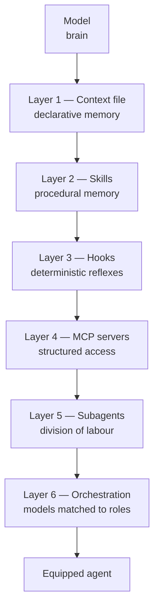
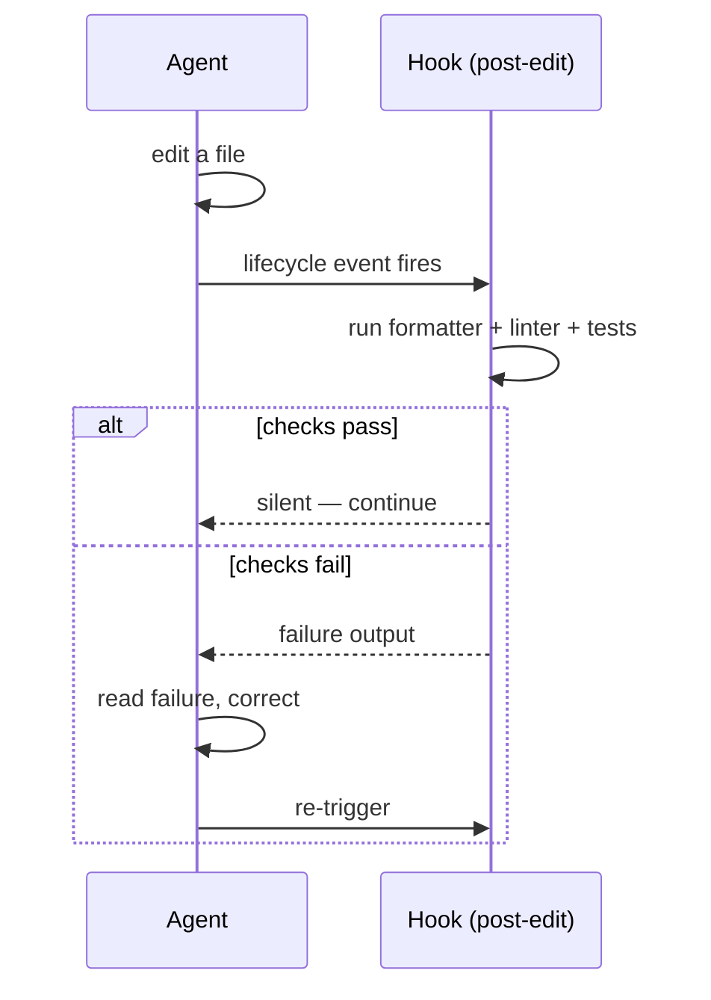
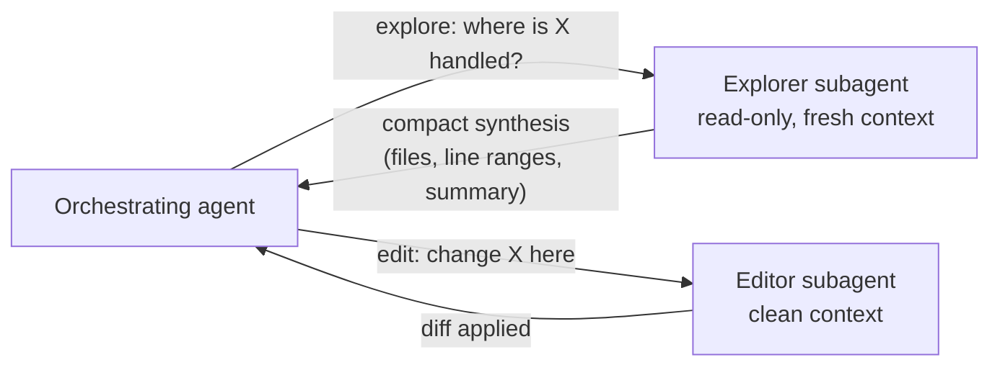
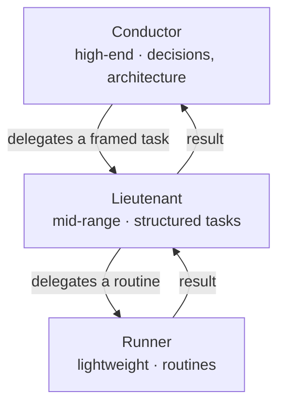

# L'architecture agentique

*Les six couches qui transforment un modèle en agent outillé — chacune un fichier, un processus ou un point d'extension.*

Les trois piliers ne sont pas des idées. Ce sont des fichiers, des processus et des points d'extension. Un agent moderne n'est pas un modèle auquel on parle — c'est un modèle entouré d'un harnais technique, et ce harnais vit dans le monorepo décrit au [chapitre 02](./02-monorepo.md). Il a six couches.



Les couches s'empilent : chacune ajoute une capacité, et chacune ferme un mode de défaillance précis. Le tableau ci-dessous est le résumé ; les sections qui suivent en sont le détail.

| Couche | Ce que c'est | Quand elle se charge | Défaillance qu'elle évite |
|---|---|---|---|
| 1 Fichier de contexte | Mémoire déclarative | Au début de chaque session | L'agent réinvente les conventions |
| 2 Skills | Mémoire procédurale | Quand une tâche le déclenche | Réexpliquer une procédure à chaque fois |
| 3 Hooks | Déclencheurs déterministes | Sur un événement du cycle de vie | Une bonne pratique qui dépend de la mémoire de l'agent |
| 4 Serveurs MCP | Accès externe structuré | Quand l'agent appelle un outil | Des données périmées collées dans les prompts |
| 5 Sous-agents | Instances dédiées à un rôle | Quand du travail est délégué | Un agent qui brûle son contexte sur tout |
| 6 Orchestration | Modèles ajustés aux rôles | Sur l'ensemble du flux | Payer le tarif premium pour du travail de routine |

---

## 3.1 La couche mémoire : le fichier de contexte

Un fichier de contexte est chargé automatiquement au début de chaque session de l'agent — par convention `AGENTS.md`, `CLAUDE.md`, ou un index de vault — à la racine du monorepo. C'est le premier pilier rendu opérationnel : la mémoire déclarative.

Deux disciplines décident de son efficacité.

**Le garder maigre.** Tout ce qu'on y met est rechargé à chaque tour et consomme du budget de contexte. N'y écrivez que le transverse et le stable : conventions, commandes, règles d'architecture, interdits permanents. Le détail d'une fonctionnalité vit dans son contrat, pas ici.

**Le stratifier.** Un fichier racine court pointe vers des fichiers spécialisés chargés à la demande. L'agent lit le détail d'un sous-système seulement quand il y travaille.

Un fichier de contexte minimal et stratifié :

```markdown
# Project context

## Commands
- build:  `npm run build`
- test:   `npm test`

## Architecture (cross-cutting only)
- Code is the source of truth for the data schema.
- One feature = one contract in `vault/contracts/`.

## Permanent prohibitions
- Never hand-edit files under `apps/*/src/__generated__/`.

## Going deeper (loaded on demand)
- Backend detail: ./apps/backend/docs/
- Decisions:      ./vault/decisions/
```

**Quand elle se charge :** au démarrage de la session, à chaque session.
**Défaillance évitée :** l'agent qui réinvente une convention parce qu'il n'a jamais su qu'il en existait une (voir le [chapitre 01, pilier 1](./01-three-pillars.md)).

---

## 3.2 La couche capacités : les skills

Un skill est un dossier qui encapsule une capacité réutilisable : un fichier d'instructions, parfois des scripts et des gabarits. Le principe clé est la **divulgation progressive** — l'agent ne charge le contenu d'un skill que lorsque la tâche le déclenche. Vous pouvez donc disposer de dizaines de capacités sans saturer le contexte par défaut.

Un skill encode un savoir-faire éprouvé pour ne plus jamais le réexpliquer. C'est de la mémoire *procédurale*, là où le fichier de contexte est de la mémoire *déclarative*.

Un skill minimal est un `SKILL.md` doté d'un frontmatter, plus un script :

```markdown
---
name: spec-to-mocks
description: Generate TypeScript types and JSON mock fixtures from an
  OpenAPI YAML spec. Use when a frozen API spec needs front-end mocks.
---

# spec-to-mocks

Run `node tools/spec-to-mocks/generate.mjs --spec <spec.yaml> --out <out-dir>`.
Output, written directly at `<out-dir>`: `types.ts`, `endpoints.ts`,
and one `<SchemaName>.mock.json` per schema.
Never hand-edit the output; regenerate from the spec.
```

**Quand il se charge :** quand une tâche correspond à la `description` du skill.
**Défaillance évitée :** réexpliquer une procédure en plusieurs étapes à chaque usage, et la dérive qui vient de l'expliquer un peu différemment chaque fois.

Voir `skills/` dans le dépôt pour des exemples exécutables.

---

## 3.3 La couche réflexes : les hooks

Un hook est un déclencheur déterministe attaché à un événement du cycle de vie de l'agent :

- après chaque édition — lancer le formateur et le linter ;
- avant chaque commit — lancer les tests ;
- après une migration — vérifier que la documentation canonique est synchrone.

Un hook ne demande rien au modèle. Il s'exécute. C'est ce qui transforme une bonne pratique en *garantie*, et ce qui crée la **boucle d'auto-correction** : l'agent édite, le hook teste, l'échec revient à l'agent, l'agent corrige.



Un hook de post-édition minimal :

```bash
#!/usr/bin/env bash
# Trigger: post-edit. Format and lint the changed file; surface any error.
set -euo pipefail

file="$1"
npx prettier --write "$file"
npx eslint "$file"            # non-zero exit returns the error to the agent
```

**Quand il se charge :** sur l'événement de cycle de vie auquel il est rattaché.
**Défaillance évitée :** une bonne pratique qui dépend du fait que l'agent se souvienne de la faire — le hook la rend inconditionnelle.

Voir `hooks/` dans le dépôt, et le [chapitre 14](./14-cicd-and-hooks.md).

---

## 3.4 La couche accès : les serveurs MCP

Un serveur MCP donne à l'agent un accès structuré à une ressource externe : une base de données, une API métier, un outil interne. Au lieu de coller des données dans le prompt, l'agent interroge la source à la demande, à travers un contrat d'outil défini. C'est ce qui le branche au monde réel sans le noyer de contexte.

Un serveur MCP minimal expose un outil. En TypeScript avec l'API de haut niveau `McpServer` de `@modelcontextprotocol/sdk` :

```ts
import { McpServer } from "@modelcontextprotocol/sdk/server/mcp.js";
import { z } from "zod";

const server = new McpServer({ name: "saved-views", version: "1.0.0" });

// One tool: fetch a saved view by id from the real service.
server.registerTool(
  "lookup_saved_view",
  {
    title: "Look up a saved view",
    description: "Return the saved view matching the given id.",
    inputSchema: { id: z.string().describe("The saved-view id.") },
  },
  async ({ id }) => {
    const res = await fetch(`https://api.example.com/v1/saved-views/${id}`, {
      headers: { Authorization: `Bearer ${process.env.API_TOKEN}` },
    });
    return { content: [{ type: "text", text: await res.text() }] };
  },
);
```

L'URL de base est fictive (`https://api.example.com`) et le token est lu depuis une variable d'environnement, jamais codé en dur. Voir `tools/mcp-server/` pour le serveur complet et commenté — il enregistre aussi une ressource à côté de l'outil.

**Quand il se charge :** quand l'agent invoque l'un des outils du serveur.
**Défaillance évitée :** les données périmées — collées dans un prompt à un instant donné et fausses l'instant suivant.

---

## 3.5 La couche division du travail : les sous-agents

Un sous-agent est une instance dédiée à un rôle, avec son propre contexte. Le pattern le plus rentable sépare **l'exploration de l'édition** :

- un sous-agent **explorateur** parcourt le dépôt en lecture seule, le comprend, et renvoie une **synthèse compacte** ;
- un sous-agent **éditeur** — qui n'a *pas* brûlé son contexte à tout lire — applique la modification avec précision.

Le but est de préserver le contexte de l'agent qui *agit*. La lecture est peu coûteuse à déléguer ; l'édition a besoin d'un contexte propre et concentré.



**Quand il se charge :** quand l'agent orchestrateur délègue une sous-tâche.
**Défaillance évitée :** un agent qui lit tout le dépôt, épuise sa fenêtre de contexte, puis édite mal parce qu'il n'a plus la place de raisonner. Voir le [chapitre 08](./08-failure-protocols.md) sur la dérive de contexte.

Les rôles de sous-agents et les passations de relais sont traités en détail au [chapitre 11 — Orchestration multi-agents](./11-multi-agent-orchestration.md).

---

## 3.6 La couche orchestration : plusieurs modèles, plusieurs rôles

On n'utilise pas le même modèle pour tout. Une architecture éprouvée distribue le travail sur trois niveaux :

| Niveau | Classe de modèle | Utilisé pour |
|---|---|---|
| **Chef d'orchestre** | Haut de gamme, à la demande | Décisions, architecture, travail ambigu |
| **Bras droit** | Milieu de gamme | Tâches structurées où le cadre est posé |
| **Exécutant** | Léger | Routines automatisées |

Ce dosage optimise coût et latence sans sacrifier la qualité là où elle compte. Le chef d'orchestre est cher — il est donc réservé au travail qui exige du jugement. L'exécutant est bon marché — il prend donc la routine à fort volume.



Le métier qui consiste à concevoir et piloter cet ensemble n'a pas encore de nom stable : *architecte d'infrastructure agentique*, ou simplement la personne qui répond du système. Voir le [chapitre 11](./11-multi-agent-orchestration.md) pour le modèle de coût et la séparation explorer/éditer, et le [chapitre 15](./15-team-adoption.md) pour le rôle humain.

---

## Les six couches ensemble

Aucune couche prise seule ne rend un agent fiable. Le fichier de contexte sans hooks, c'est de la mémoire sans application. Les hooks sans contrat n'imposent rien de significatif. MCP sans sous-agents inonde un seul contexte de données externes. L'architecture, c'est la *pile* — et la pile se projette directement sur les trois piliers :

- Les couches 1–2 (fichier de contexte, skills) construisent le pilier **mémoire**.
- La couche 3 (hooks) et les interdits de la couche 1 construisent le pilier **garde-fous**.
- Le pilier **contrat** est en amont des six — c'est ce que les couches servent.

## Voir aussi

- [Chapitre 01 — Les trois piliers](./01-three-pillars.md)
- [Chapitre 02 — Le monorepo](./02-monorepo.md)
- [Chapitre 11 — Orchestration multi-agents](./11-multi-agent-orchestration.md)
- [Chapitre 14 — CI/CD et hooks](./14-cicd-and-hooks.md)
