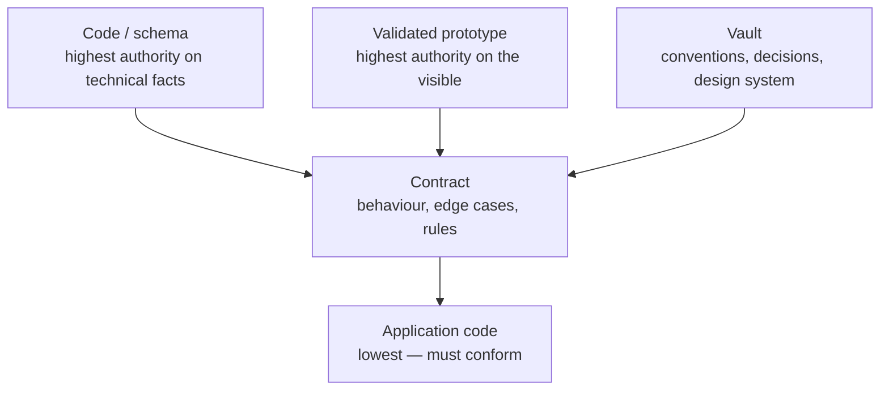
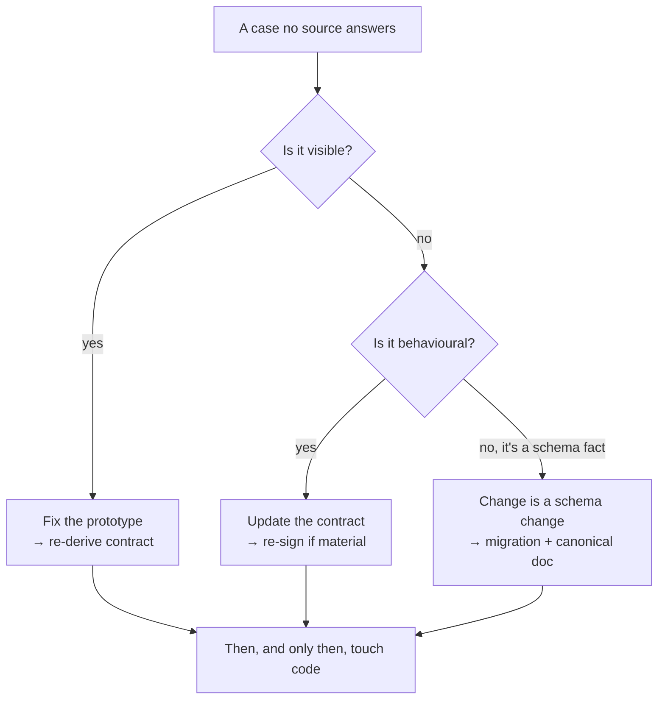

# Les sources de vérité

*En cas de doute, où regarde-t-on ? La réponse doit être unique et non négociable.*

Un agent — et une équipe — ne travaille bien que lorsque « où est la vérité ? » a exactement une réponse. Dès l'instant où deux sources peuvent toutes les deux revendiquer autorité sur le même fait, chaque décision devient une négociation, et l'agent, sommé de négocier, devine.

Mainstay supprime la négociation. Il existe une hiérarchie explicite des sources, une règle unique pour ce qui se passe quand elles divergent, et un réflexe pour ce qu'il faut faire quand aucune n'a la réponse.

## La table d'autorité

Chaque source a autorité sur un domaine défini, et un comportement défini quand elle rencontre une source supérieure.

| Source | Autorité sur | En cas de divergence |
|---|---|---|
| **Le code (monorepo)** | Schéma de données, types, contrats techniques réels | Fait foi sur tout ce qui est technique et exécuté. Rien ne le surpasse sur le schéma. |
| **Le prototype validé** | Interface, parcours utilisateur, copies, états visibles | Gagne sur tout ce qui se voit. Le contrat le décrit ; il ne le contredit pas. |
| **Le contrat** | Comportement, edge cases, règles, données de test | Gagne sur le code applicatif. Perd contre le prototype et le schéma. |
| **Le vault** | Conventions, décisions, contraintes, design system | Gagne sur les règles transverses. S'incline devant le code sur les faits techniques. |

Lisez la table de deux façons.

**Par domaine.** Chaque ligne possède un domaine. Demander « quelle est la forme réelle de la table `saved_views` ? » est une question de *code* — on lit `apps/backend/src/`, pas un diagramme. Demander « de quelle couleur est un bouton primaire ? » est une question de *design system* — on lit le vault. Demander « que se passe-t-il sur un `409` de l'endpoint d'enregistrement ? » est une question de *contrat*.

**Par rang.** La colonne « en cas de divergence » est un ordre de précédence. Le schéma (dans le code) est le plancher — rien ne le surpasse. Le prototype gagne sur tout ce qui est visible. Le contrat se situe entre les deux : il gouverne le comportement et l'emporte sur le code applicatif, mais il ne peut pas redéfinir ce que le prototype montre ni ce qu'est le schéma.



Notez que « le code » apparaît dans deux rôles. En tant que **schéma**, il est l'autorité suprême. En tant que **code applicatif** — la logique de fonctionnalité qu'un agent écrit contre un contrat —, il est le plus bas, et doit se conformer au contrat au-dessus de lui. La distinction n'est pas une contradiction : le schéma est un fait ; le code applicatif est une tentative de satisfaire un contrat.

## La règle d'or de la divergence

> Si deux sources se contredisent, la source supérieure gagne — **et la source inférieure est immédiatement mise à jour.**

On ne laisse jamais deux vérités coexister. Pas le temps d'un après-midi, pas « jusqu'à la fin du sprint ». Dès l'instant où une divergence est observée, la source inférieure est corrigée pour correspondre à la supérieure, dans le même changement.

La raison, c'est la **dette de cohérence**.

## La dette de cohérence

La dette de cohérence est le coût de deux sources qui divergent. C'est la plus chère de toutes les dettes, pour une raison : **elle est invisible jusqu'au jour où tout casse en même temps.**

Un exemple travaillé et fictif. Le contrat de `saved-views-panel` dit que le nom d'une vue enregistrée est limité à 60 caractères. L'agent, en construisant le back, lit une note de concept périmée qui dit 80, et livre une colonne `VARCHAR(80)`. Le front, construit contre le contrat, valide à 60. Pendant des semaines, rien ne casse — personne ne tape un nom de 70 caractères. Puis un utilisateur le fait. Le front le rejette ; une autre intégration qui écrit directement dans l'API, non ; la base de données l'accepte ; un rapport qui suppose 60 le tronque. Un seul chiffre, sur lequel on diverge à deux endroits, fait surface en quatre bugs dans quatre systèmes le même après-midi.

La correction était gratuite au moment de la divergence : mettre à jour la note périmée. Elle est devenue chère une fois livrée. **La dette de cohérence ne court pas un intérêt linéaire ; elle s'accumule en silence et se règle d'un seul coup.**

C'est pourquoi la règle d'or dit *immédiatement*. Il n'y a pas de « plus tard » bon marché.

## L'historisation avec le frontmatter

Chaque artefact du vault porte un en-tête YAML de frontmatter qui le rend traçable et interrogeable. Les clés sont en anglais (le frontmatter est lu par la machine ; seule la prose est traduite). Deux types d'artefacts comptent le plus.

**Un contrat :**

```yaml
---
type: contract
screen: "saved-views-panel"
version: "1.2"
status: frozen          # draft | review | frozen | obsolete
signed_product: true
signed_engineering: true
frozen_on: 2026-05-18
related_decisions: [DEC-007, DEC-011]
---
```

**Une décision :**

```yaml
---
type: decision
id: DEC-007
date: 2026-05-14
status: accepted        # proposed | accepted | superseded
supersedes: null
---
```

Ce que le frontmatter vous achète :

- **Le statut comme verrou.** Un contrat ne fait autorité que lorsque `status: frozen` et que les deux signatures sont à `true`. Un contrat en `draft` n'engage rien. Le champ statut est la différence entre un souhait et un contrat.
- **La traçabilité.** `related_decisions` relie un contrat aux décisions qui l'ont façonné. `supersedes` permet à une décision d'en retirer une plus ancienne sans effacer l'historique — l'ancienne `DEC-XXX` passe en `status: superseded`, elle ne disparaît jamais.
- **L'interrogeabilité.** Comme les clés sont uniformes, un script ou un agent peut demander « montre tous les contrats `obsolete` » ou « toute décision `proposed` de plus de 30 jours » sans analyser de prose.

Une décision n'est jamais éditée sur place pour signifier autre chose. Elle est remplacée par une nouvelle `DEC-XXX` qui nomme l'ancienne dans `supersedes`. Le vault est un historique en quasi-ajout seul, pas un wiki mutable — c'est ce qui en fait une mémoire fiable d'une session à l'autre et d'un agent à l'autre.

## Le réflexe d'escalade

Le réflexe à ancrer : face à un cas qui n'est dans aucune source, on ne tranche pas seul et on n'invente pas. On remonte à la source supérieure, on la complète, et on redescend.

> Toujours dans cet ordre : **le prototype d'abord, le contrat ensuite, le code en dernier.**

Pourquoi cet ordre :

1. **Le prototype d'abord.** Si le manque concerne quelque chose de visible — un état vide absent, un survol non spécifié —, cela relève du prototype, qui est l'autorité sur le visible. Corrigez-le là, et le contrat et le code héritent d'une image correcte.
2. **Le contrat ensuite.** Si le manque est comportemental — un edge case, une permission, un état d'erreur —, cela relève du contrat. Ajoutez-le, faites-le re-signer si le changement est substantiel.
3. **Le code en dernier.** Ce n'est qu'une fois les sources supérieures correctes que l'on touche au code. Du code écrit pour satisfaire un contrat incomplet est du code que vous réécrirez.

Un cas dans aucune source est, par définition, une **zone grise** — une décision en attente d'être prise. Le réflexe d'escalade est *comment* on en résout une ; les deux issues valides (une décision formelle dans le vault, ou une note documentée sur le contrat) sont traitées au [chapitre 07 — Les zones grises](./07-grey-zones.md).



L'anti-pattern que ce réflexe tue, c'est l'agent — ou un ingénieur pressé — qui rapièce le code pour couvrir un manque, en laissant le prototype et le contrat toujours muets. La prochaine fois que quelqu'un lit le contrat, le manque est toujours là, et le prochain agent devine à nouveau. On corrige la source, pas le symptôme.

## Voir aussi

- [Chapitre 02 — Le monorepo](./02-monorepo.md)
- [Chapitre 05 — La chaîne de livraison](./05-the-delivery-chain.md)
- [Chapitre 07 — Les zones grises](./07-grey-zones.md)
- [Chapitre 09 — Patterns et anti-patterns](./09-patterns-and-antipatterns.md)
