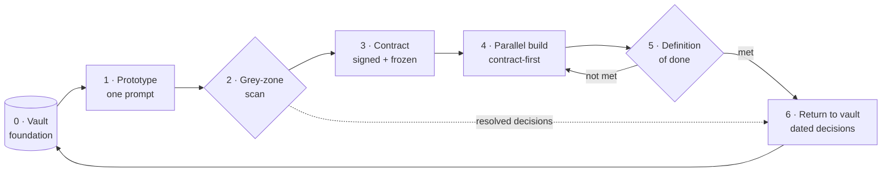
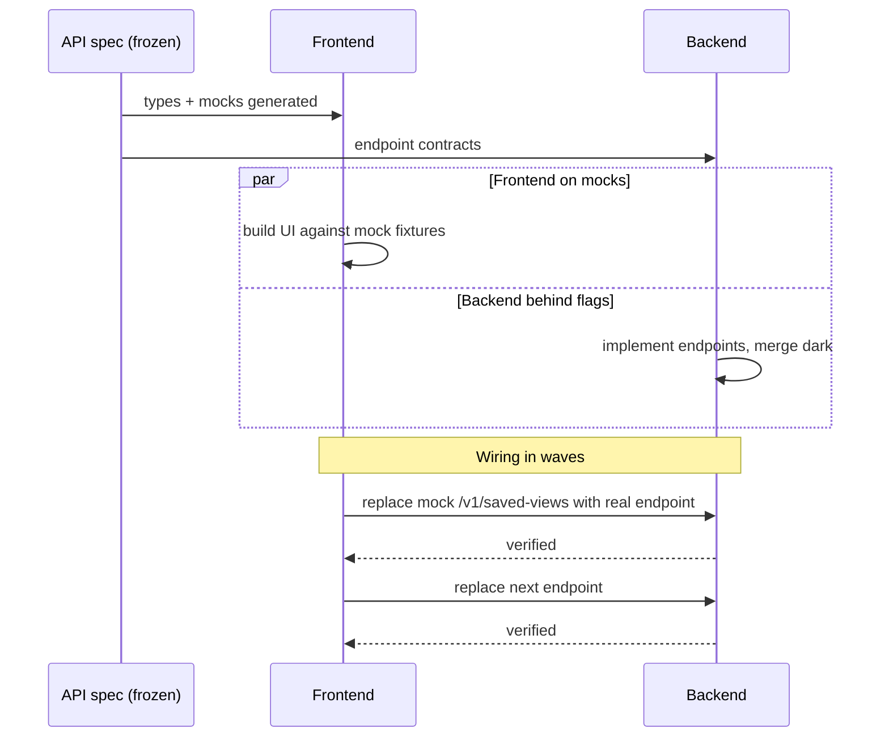

# La chaîne de livraison

*D'un dépôt vide à la production, en sept étapes qui rebouclent sur leur point de départ.*

La chaîne de livraison est le cœur de Mainstay. C'est une boucle : la connaissance nourrit un prototype, le prototype est balayé, un contrat est signé, front et back avancent en parallèle, une definition of done par couche valide le résultat, et les décisions qui ont émergé retournent à la connaissance — de sorte que la fonctionnalité suivante démarre plus riche.



Chaque étape a des entrées, des sorties, une discipline qui la fait fonctionner, et une métrique qu'elle produit. Les métriques sont ce qui permet de distinguer une chaîne saine d'une chaîne malade (voir le [chapitre 12 — Observabilité et métriques](./12-observability-and-metrics.md)).

---

## Étape 0 — Le vault, socle de tout

Avant la première ligne de code de fonctionnalité, le vault existe dans le monorepo : design system, conventions, décisions, contraintes.

| | |
|---|---|
| **Entrées** | Connaissance projet antérieure, design system, conventions maison |
| **Sorties** | Un vault peuplé que l'agent peut lire |
| **Discipline** | La connaissance vit dans le monorepo, versionnée avec le code ([chapitre 02](./02-monorepo.md)) |
| **Métrique** | Couverture du vault — quelle part d'une nouvelle fonctionnalité a déjà sa réponse |

Un vault pauvre produit des agents qui hésitent ; un vault riche produit des agents qui tranchent juste. L'étape 0 n'est pas une phase que l'on termine — c'est le plancher sur lequel toutes les étapes suivantes se tiennent, et l'étape 6 ne cesse de le relever.

---

## Étape 1 — Le prototype, en un seul prompt

Le prototype sort d'une seule génération.

> **Un prompt = un prototype.**

Si l'agent ne livre pas un écran utilisable en une passe, ce n'est pas lui qui a échoué — c'est le brief en amont qui était flou. Le nombre d'itérations est une mesure directe de la qualité du brief. C'est le diagnostic le plus important de toute la chaîne : un écran qui a demandé cinq prompts vous dit que le brief avait cinq trous.

À l'intérieur de cette génération unique, on demande deux à quatre passes internes solides :

1. **Structure** — disposition, zones, hiérarchie des composants.
2. **Implémentation** — contenu réel, états, interactions raccordées.
3. **Polish et responsive** — espacements, typographie, points de rupture.
4. **Vérification cross-viewport** — l'agent contrôle sa propre sortie.

| | |
|---|---|
| **Entrées** | Le brief + le vault |
| **Sorties** | Un écran de prototype fonctionnel et utilisable |
| **Discipline** | Un prompt ; des passes internes ; pas de régénération par morceaux |
| **Métrique** | Itérations par écran (cible : 1) |

Le prompt qui produit le prototype est lui-même un contrat — voir le [chapitre 06 — Le prompt comme contrat](./06-prompt-as-contract.md). Le prompt de prototype de l'exemple fil rouge est dans `examples/walkthrough/01-prototype-prompt.md`.

---

## Étape 2 — La validation par zones grises

On compare le prototype au brief initial, point par point, à chaud. Pour chaque élément observable, une seule question : *le brief le demandait-il explicitement ?* Si oui, on passe. Si non, c'est une **zone grise** — une décision prise par défaut par l'agent.

| | |
|---|---|
| **Entrées** | Le prototype + le brief initial |
| **Sorties** | Un registre des zones grises ; chaque entrée routée vers une décision ou une note de contrat |
| **Discipline** | Balayage systématique — zone par zone, état par état ; rebalayage après chaque passe |
| **Métrique** | Taux de zones grises (zones grises trouvées par écran) |

C'est l'étape que presque personne ne fait, et celle qui rapporte le plus. Le [chapitre 07 — Les zones grises](./07-grey-zones.md) en donne le protocole complet. Le balayage rempli pour l'exemple fil rouge est `examples/walkthrough/02-grey-zone-scan.md`.

---

## Étape 3 — Le contrat

Le prototype validé devient un contrat signable. Le contrat ajoute aux pixels tout ce que les pixels ne montrent pas : endpoints, permissions, états d'erreur, transitions, règles, données de test.

Deux signatures sont requises — **produit et technique**. Sans les deux, on ne fige pas.

La double signature tue un piège précis et coûteux : « validé côté UX, découvert infaisable côté performance deux semaines plus tard ». Le produit signe que le comportement est juste ; la technique signe qu'il est constructible tel que spécifié. Un contrat figé sans la signature de la technique est un contrat qui cache sa propre infaisabilité.

| | |
|---|---|
| **Entrées** | Le prototype validé + le registre des zones grises résolu |
| **Sorties** | Un contrat figé et doublement signé dans `vault/contracts/` |
| **Discipline** | Pas de gel sans les deux signatures ; `status: frozen` posé explicitement |
| **Métrique** | Délai du contrat — du brief au contrat figé |

```yaml
---
type: contract
screen: "saved-views-panel"
version: "1.0"
status: frozen
signed_product: true
signed_engineering: true
frozen_on: 2026-05-18
related_decisions: [DEC-007, DEC-011]
---
```

La structure du contrat est au [chapitre 01](./01-three-pillars.md) ; le contrat rempli pour l'exemple fil rouge est `examples/walkthrough/03-contract.md`.

---

## Étape 4 — L'implémentation parallèle, en contract-first

Front et back avancent **en parallèle**, sur le même contrat.

Le mécanisme est le **contract-first** :

1. La **spec d'API versionnée est figée en premier**. Elle devient la vérité technique partagée. (`examples/walkthrough/04-api-spec.yaml`.)
2. Le **front démarre sur des mocks** dérivés du contrat, avec des types générés depuis la spec — sans attendre une ligne de back. (`examples/walkthrough/05-mocks/`, produits par `tools/spec-to-mocks`.)
3. Le **back avance derrière des feature flags**, fusionnable en production avant que le front ne soit prêt.
4. Les deux sont raccordés par **raccord par vagues**, endpoint par endpoint : un remplacement progressif et vérifiable de chaque mock par son endpoint réel — pas une phase finale risquée.



On ne séquence jamais back puis front. Séquencer sérialise un projet que le contrat a rendu parallélisable.

| | |
|---|---|
| **Entrées** | Le contrat figé + la spec d'API figée |
| **Sorties** | Front et back implémentés, raccordés vague par vague |
| **Discipline** | Spec figée en premier ; front sur mocks ; back derrière flags ; raccord par vagues |
| **Métrique** | Vélocité — endpoints raccordés par unité de temps |

---

## Étape 5 — La definition of done, par couche

« Presque fait » n'existe pas. La definition of done se vérifie par couche.

**Contrat fait :** toutes les sections renseignées, double signature, `status: frozen`.

**Back fait :** code écrit ; tests qui passent ; spec d'API à jour ; intégration vérifiée contre un stub ; performance mesurée sur un volume de données réaliste.

**Front fait :** tous les états implémentés ; tous les endpoints consommés ; cas d'erreur gérés ; permissions respectées ; conforme au pixel par rapport au prototype.

| | |
|---|---|
| **Entrées** | La fonctionnalité implémentée |
| **Sorties** | Une checklist de DoD par couche entièrement cochée |
| **Discipline** | Binaire — une couche est faite ou elle ne l'est pas ; pas de demi-crédit |
| **Métrique** | Taux de réussite de la DoD à la première revue |

La DoD remplie pour l'exemple fil rouge est `examples/walkthrough/07-definition-of-done.md`. Si une couche n'est pas faite, la chaîne reboucle vers l'étape 4 — c'est l'arête `not met` du schéma.

---

## Étape 6 — Le retour au vault

Les décisions qui ont émergé — du balayage des zones grises, de la construction — retournent au vault sous forme de décisions datées (`DEC-XXX`).

| | |
|---|---|
| **Entrées** | Les décisions prises pendant les étapes 2–5 |
| **Sorties** | De nouvelles notes `DEC-XXX` dans `vault/decisions/` ; des concepts mis à jour |
| **Discipline** | Chaque décision historisée avant que la fonctionnalité ne soit considérée close |
| **Métrique** | Décisions capturées par fonctionnalité (un indicateur de l'apprentissage conservé) |

La fonctionnalité suivante démarre avec un contexte plus riche. L'infrastructure devient plus intelligente à chaque cycle. C'est la boucle qui se referme : l'étape 6 nourrit l'étape 0.

Une note de décision pour l'exemple fil rouge (`examples/walkthrough/06-decision-DEC-007.md`) :

```yaml
---
type: decision
id: DEC-007
date: 2026-05-14
status: accepted
supersedes: null
---
```

```markdown
# DEC-007 — Default-view behaviour

## Context      Grey-zone scan on saved-views-panel: the brief did not say
                what happens when a user marks a second view as default.
## Decision     Marking a view as default clears the default flag on any
                other view; exactly zero or one default per user.
## Justification A single default keeps the load behaviour deterministic.
## Consequences Contract §9 gains a rule; API adds POST /v1/saved-views/{id}/default.
```

---

## Pourquoi la boucle compte

Un processus linéaire livre une fonctionnalité. Une boucle livre une fonctionnalité *et* laisse l'infrastructure meilleure qu'elle ne l'a trouvée. Faites tourner la chaîne une fois, le gain est un écran. Faites-la tourner sur l'ensemble d'un projet et l'étape 0 n'est plus jamais vide — chaque fonctionnalité hérite des décisions, des contrats et des conventions de toutes les fonctionnalités qui l'ont précédée. Cette composition est le retour sur la discipline.

## Voir aussi

- [Chapitre 04 — Les sources de vérité](./04-sources-of-truth.md)
- [Chapitre 06 — Le prompt comme contrat](./06-prompt-as-contract.md)
- [Chapitre 07 — Les zones grises](./07-grey-zones.md)
- [Chapitre 12 — Observabilité et métriques](./12-observability-and-metrics.md)
