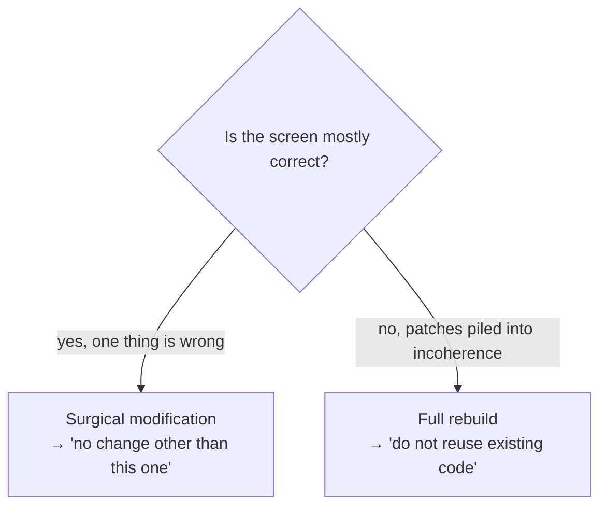

# Le prompt comme contrat

*Un prompt n'est pas une conversation. C'est un contrat passé à un agent — et chaque section ferme une porte.*

## Un prompt est un contrat

Quand vous parlez à un agent de façon informelle, vous négociez. La négociation invite à l'interprétation, et un agent sommé d'interpréter comblera chaque vide par une supposition. Un prompt écrit comme un *contrat* supprime la négociation : il énonce l'opération, les contraintes, les interdits, et la checklist contre laquelle l'agent se vérifie lui-même.

Chaque section d'un prompt bien formé **ferme une porte** par laquelle l'agent pourrait sinon s'égarer. C'est le prisme de tout ce chapitre : lisez chaque section comme une porte, et demandez ce qui passe au travers si elle reste ouverte.

## Anatomie d'un prompt

Un prompt de génération complet a sept sections.

| Section | Ce qu'elle énonce | Porte qu'elle ferme |
|---|---|---|
| **Type d'opération** | Création, ou modification chirurgicale, ou refonte intégrale | L'agent qui devine la *portée* du travail |
| **Passes** | Combien de passes internes, et ce que fait chacune | L'agent qui s'arrête à un premier jet grossier |
| **Contexte** | Où vit l'écran, qui l'utilise | L'agent qui invente un objectif |
| **Spécifications** | Structure, états, contenu — avec des valeurs chiffrées | L'agent qui réinterprète des adjectifs vagues |
| **Rappel du design system** | Couleurs, typo, rayons, espacements — toujours réénoncés | L'agent qui suppose se souvenir du design system |
| **Interdits** | Ce qu'il ne doit pas faire | L'agent qui « améliore » sans qu'on le lui demande |
| **Checklist de validation** | Critères observables que l'agent coche lui-même | L'agent qui se déclare terminé sans vérifier |

Deux sections méritent d'être soulignées.

**Rappel du design system — toujours, jamais supposé connu.** Même si le design system est dans le vault, réénoncez les tokens que l'écran utilise. Un agent qui doit *se rappeler* le design system l'approximera ; un agent qui le *lit* dans le prompt ne le peut pas.

**Des valeurs chiffrées, pas des adjectifs.** « Compact » est interprétable. « Séparateur 1px, titre 600/14px, description 13px, répartition 70/30 » ne l'est pas. Chaque valeur que vous pouvez quantifier, vous devez la quantifier — chaque chiffre est une porte que l'agent ne peut pas rouvrir.

## Deux modes

Un prompt opère dans l'un de deux modes, et énoncer lequel est la première porte fermée.

### Modification chirurgicale

Une *modification chirurgicale* corrige un point précis. Sa caractéristique déterminante est l'interdit final, capital : **« Aucune autre modification que celle-ci. »** Cette ligne empêche l'agent de reconstruire, à son goût, des choses qui marchaient déjà.

Utilisez-la quand l'écran actuel est globalement juste et qu'une chose est fausse.

### Refonte intégrale

Une *refonte intégrale* repart de zéro et **interdit de réutiliser le code existant**. Utilisez-la quand une accumulation de retouches a rendu le code existant incohérent — quand le chemin le moins coûteux est une page blanche, pas une retouche de plus sur une retouche.



Choisir le mauvais mode est en soi une défaillance. Un prompt chirurgical contre du code incohérent produit une retouche de plus sur la pile. Une refonte intégrale contre un écran globalement correct jette du travail validé. Choisissez délibérément.

## Exemple travaillé — une modification chirurgicale

Un véritable prompt de modification chirurgicale. L'écran est générique : un panneau `conditions-list`.

```text
SURGICAL MODIFICATION on "conditions-list"

CURRENT PROBLEM
Individual cards with a drop shadow, a large number in a circle, a title,
a long description, a badge, and a sub-label. Together they read as too
heavy: the screen takes too much vertical height and tires the eye.

TARGET PATTERN
A compact vertical list, no individual cards. Plain horizontal separators.
One row per item, dense and readable.

SPECIFICATIONS
- Single container, no per-item shadow.
- 1px separator between each row.
- Left block (title 600/14px + description 13px on one line): 70%.
- Right block (compact badge + short value): 30%, right-aligned.
- Numbered circles removed.

PROHIBITIONS
- No individual cards with a shadow.
- No multi-line descriptions.
- No change other than this list rework.

VALIDATION CHECKLIST
[ ] Single vertical list with separators
[ ] Numbers removed
[ ] Compact badge on the right, short value beneath it
[ ] Total height reduced versus the previous version
[ ] No regression anywhere else on the screen
```

Trois choses font la force de ce prompt :

1. **Il nomme le problème en termes observables.** « Trop chargé, occupe trop de hauteur » décrit ce qui se *voit*, pas une impression. L'agent et le relecteur peuvent tous deux le vérifier.
2. **Il donne des valeurs chiffrées que l'agent ne peut pas réinterpréter.** `70/30`, `1px`, `600/14px` — il n'y a pas de place pour approximer.
3. **Il referme par un interdit de périmètre et une checklist auto-vérifiable.** Le dernier interdit empêche le débordement ; la checklist force l'agent à confirmer chaque critère, y compris « aucune régression ailleurs ».

La dernière ligne de la checklist — « aucune régression ailleurs » — est le pendant du dernier interdit. L'un interdit le débordement ; l'autre fait que l'agent le cherche.

## Pourquoi chaque section ferme une porte

Parcourez le prompt encore une fois, en demandant ce qui se passe si chaque section *manque* :

- **Pas de type d'opération** → l'agent devine s'il doit retoucher ou reconstruire, et peut reconstruire un écran que vous vouliez retoucher.
- **Pas de passes** → l'agent livre un premier jet grossier et le déclare terminé.
- **Pas de contexte** → l'agent invente à qui s'adresse l'écran et conçoit pour le mauvais utilisateur.
- **Pas de spécifications chiffrées** → « compact » devient ce que vaut le réglage par défaut de l'agent.
- **Pas de rappel du design system** → l'écran dérive du système de quelques pixels et d'une couleur un peu fausse.
- **Pas d'interdits** → l'agent améliore les parties intactes et introduit des régressions.
- **Pas de checklist** → l'agent se déclare terminé sans vérifier, et le relecteur trouve les manques.

Un prompt vague n'est pas un prompt plus rapide. C'est un prompt qui reporte ses sections manquantes en zones grises (voir le [chapitre 07](./07-grey-zones.md)) et en reprise.

## Un gabarit de prompt en mode contrat

Copiez ceci pour toute génération ou modification. Les parties entre crochets sont les seules à remplir.

```text
[CREATION | SURGICAL MODIFICATION | FULL REBUILD] on "<component>"

CONTEXT
[Where the screen lives, who uses it, what it is for.]

PASSES
Run [2-4] passes: [structure / implementation / polish + responsive /
cross-viewport check].

SPECIFICATIONS
[Structure, states, content. Every value numeric: sizes, weights, spacing,
splits, breakpoints. No bare adjectives.]

DESIGN-SYSTEM RECALL
[Colours, typography, radii, spacing tokens used by this screen. Restated
in full — never assumed known.]

PROHIBITIONS
- No invention of labels or values; fetch them from the source.
- No change outside the scope defined above.
- [Mode-specific: surgical → "no change other than this one";
   full rebuild → "do not reuse the existing code".]

VALIDATION CHECKLIST
[ ] [Observable criterion 1]
[ ] [Observable criterion 2]
[ ] No regression anywhere else on the screen
```

Une version copiable vit dans `templates/`. Pour le prompt de prototype qui ouvre la chaîne de livraison, voir le [chapitre 05, étape 1](./05-the-delivery-chain.md) ; le prompt de prototype de l'exemple fil rouge est `examples/walkthrough/01-prototype-prompt.md`.

## Le rapport au contrat du vault

Deux choses, dans Mainstay, s'appellent un « contrat », et ce sont des artefacts différents :

- le **prompt-comme-contrat** — l'instruction passée à l'agent pour une génération, ce chapitre ;
- le **contrat d'écran** — l'artefact du vault figé et doublement signé pour `saved-views-panel`, voir le [chapitre 01](./01-three-pillars.md) et le [chapitre 05, étape 3](./05-the-delivery-chain.md).

Ils sont liés : un bon contrat d'écran rend l'écriture d'un bon prompt presque mécanique, parce que les spécifications, les interdits et les critères d'acceptation sont déjà tranchés. Un prompt écrit sans contrat d'écran derrière lui est un prompt qui improvise le contrat — et l'improvisation, c'est là que naissent les zones grises.

## Voir aussi

- [Chapitre 05 — La chaîne de livraison](./05-the-delivery-chain.md)
- [Chapitre 07 — Les zones grises](./07-grey-zones.md)
- [Chapitre 08 — Protocoles de défaillance](./08-failure-protocols.md)
- [Chapitre 09 — Patterns et anti-patterns](./09-patterns-and-antipatterns.md)
