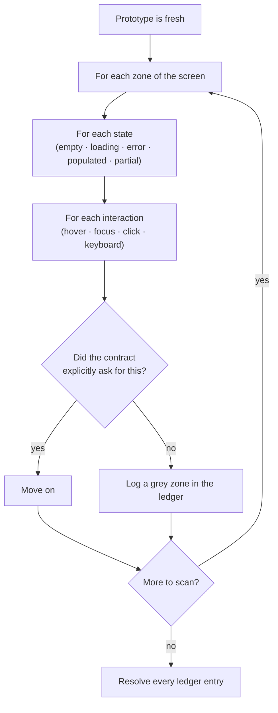
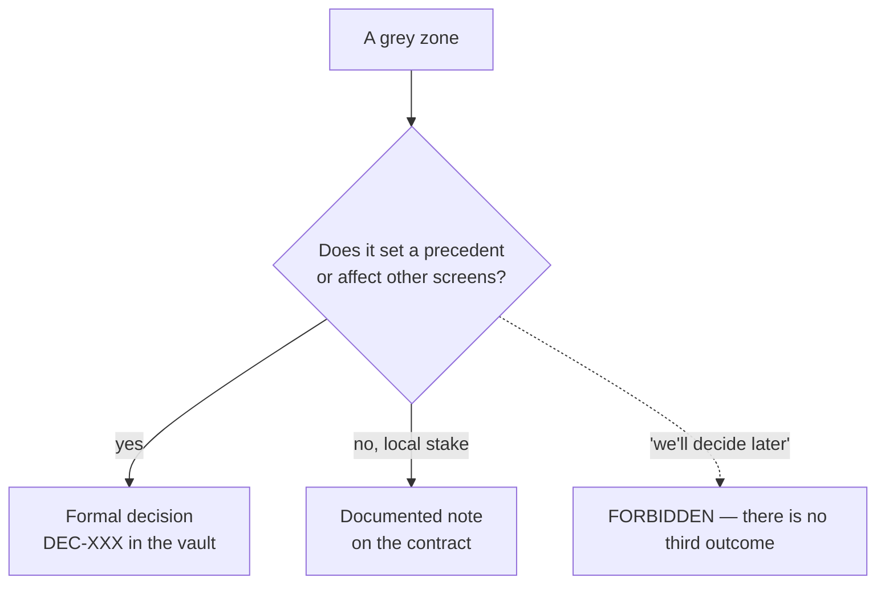

# Les zones grises

*Une zone grise est une décision que l'agent a prise par défaut, dans l'ombre, sans autorité pour la prendre. Les trouver est le cœur de la méthode.*

C'est le cœur de Mainstay, et la partie que presque personne ne fait.

## Définition

Une zone grise, c'est tout ce que l'agent a tranché de lui-même parce que ni le prototype ni le contrat ne le précisaient.

Ce n'est ni une erreur ni une bonne réponse. C'est une décision prise **par défaut, dans l'ombre, par quelqu'un qui n'avait pas autorité pour la prendre.** Exemples :

- un état vide rempli à la façon de l'agent ;
- un comportement de survol inventé ;
- un ordre de tri choisi arbitrairement ;
- un message d'erreur que personne n'a validé ;
- une permission supposée.

Aucun de ces choix n'est « faux ». Chacun est un choix que *quelqu'un avec autorité* — produit, design, technique — aurait dû faire, et n'a pas fait, alors l'agent l'a fait à sa place. Le danger n'est pas le choix. Le danger, c'est que **personne ne sait que le choix a été fait.**

L'orthographe britannique « grey » est employée délibérément et systématiquement dans tout Mainstay — c'est un terme forgé par la méthode, pas de la prose ordinaire. En français, on dit « zone grise ».

## Pourquoi les zones grises sont le mode de défaillance coûteux

Un bug s'annonce : quelque chose est visiblement cassé. Une zone grise se cache : l'écran *a l'air* fini. C'est une décision silencieuse qui fait surface des semaines plus tard, à l'intégration, quand quinze d'entre elles explosent ensemble.

> Quinze zones grises non résolues, ce sont quinze bombes qui explosent ensemble à l'intégration.

La raison pour laquelle elles s'agglomèrent est structurelle. Chaque zone grise est un écart entre ce qui a été spécifié et ce qui a été construit. Les écarts ne bloquent pas la construction — l'agent les a comblés —, donc la construction se poursuit et les écarts s'accumulent. Ils ne sont découverts que lorsque quelque chose d'*externe* (une seconde intégration, un vrai utilisateur, un test de charge) sonde l'hypothèse. À ce moment-là, ils sont nombreux, et ils sont chers.

Tout l'enjeu du protocole des zones grises est de déplacer cette découverte **en avant dans le temps**, vers l'instant où le prototype est à chaud et où une zone grise coûte une phrase à résoudre.

## Le protocole de détection

On compare le produit au brief initial, à chaud. Pour chaque élément observable, exactement une question :

> Le contrat le demandait-il explicitement ?

- **Oui** → on passe.
- **Non** → c'est une zone grise.

Le balayage est **systématique** — zone par zone, état par état, interaction par interaction. « Systématique » n'est pas un ton ; c'est une exigence de couverture. On ne balaie pas les parties qui attirent l'œil. On parcourt une grille.

Une grille de balayage pratique — passez la question sur chaque cellule :

| Dimension | Cellules à parcourir |
|---|---|
| Zones | En-tête, liste/contenu, panneau latéral, pied de page, modales |
| États | Vide, chargement, partiel, peuplé, erreur, succès |
| Interactions | Survol, focus, clic, clavier, glisser, appui long |
| Données | Min, max, débordement, champs manquants, chaînes très longues |
| Permissions | Chaque rôle : ce qui est visible, activé, désactivé, masqué |

## Les deux issues — jamais une troisième

Chaque zone grise se résout en exactement l'une de deux issues.

**Une décision formelle.** Consignée dans le vault, datée, justifiée — elle devient une règle. Utilisez-la quand le choix a des conséquences au-delà de cet écran, ou crée un précédent. Elle devient une `DEC-XXX` (voir le [chapitre 04 — Les sources de vérité](./04-sources-of-truth.md)).

**Une décision documentée notée sur le contrat.** Consignée comme une note dans le contrat lui-même. Utilisez-la quand l'enjeu est local — le choix compte pour cet écran et nulle part ailleurs.

Ce que l'on ne fait jamais, c'est la troisième issue : **« on tranchera plus tard ».** Le report n'est pas une résolution. Une zone grise reportée est une zone grise qui sera redécouverte à l'intégration, avec les autres, au moment où elle est chère.

Les deux issues valides partagent une propriété : après l'une comme l'autre, la zone grise n'est plus un choix silencieux. C'est un choix *visible* — dans le vault ou sur le contrat — que quelqu'un avec autorité peut revoir, accepter ou renverser. C'est l'objectif tout entier : rendre la décision invisible visible.

## Rebalayer après chaque passe

Chaque passe d'itération *crée de nouvelles zones grises*. Quand l'agent peaufine un écran, il prend de nouvelles micro-décisions ; quand il ajoute un état, il décide à quoi cet état ressemble et comment il se comporte.

Donc : **après chaque passe, on rebalaye.** Un seul balayage à la fin manque tout ce que les passes de finition ont introduit. Le balayage n'est pas un jalon que l'on franchit une fois — c'est une étape que l'on répète chaque fois que le prototype change.

## Le registre des zones grises

Suivez les zones grises dans un **registre des zones grises** — une petite table, tenue à côté du contrat pendant les étapes 2–3 de la chaîne de livraison. Chaque zone grise détectée obtient une ligne, et aucune ligne ne peut rester ouverte quand le contrat est figé.

Un registre a ces colonnes :

| ID | Observé | Zone / état | Question | Issue | Résolution |
|---|---|---|---|---|---|

Un exemple rempli, pour la fonctionnalité fil rouge `saved-views-panel`. C'est un **extrait abrégé** — le balayage complet, avec toutes ses lignes, est dans [`../../examples/walkthrough/02-grey-zone-scan.md`](../../examples/walkthrough/02-grey-zone-scan.md) :

| ID | Observé | Zone / état | Question | Issue | Résolution |
|---|---|---|---|---|---|
| GZ-01 | Une seconde vue marquée par défaut ; la première l'est restée aussi | Panneau latéral, peuplé | Qu'arrive-t-il à la précédente par défaut ? | Décision formelle | DEC-007 — exactement une par défaut par utilisateur |
| GZ-02 | Les nouvelles vues sont privées par défaut | Modale de création | Privée ou partagée par défaut ? | Décision formelle | DEC-011 — les nouvelles vues sont privées jusqu'au partage |
| GZ-03 | Enregistrer avec un nom en double écrase silencieusement | Modale de création, erreur | Rejeter, versionner ou écraser ? | Note de contrat | Rejeter avec un « nom déjà utilisé » en ligne |
| GZ-04 | L'état vide affichait une chaîne nue « Aucune vue » | Liste, vide | Que dit et que propose l'état vide ? | Note de contrat | Copie d'état vide + un bouton « Créer une vue » |
| GZ-05 | Liste triée par date de création | Liste, peuplé | Quel est le tri par défaut ? | Note de contrat | Tri par nom, croissant |

Lisez le registre comme une liste de travail : la fonctionnalité n'est pas prête pour l'étape 3 tant que chaque ligne n'a pas une `Issue` et une `Résolution`. GZ-01 et GZ-02 sont devenues des décisions parce que le comportement par défaut et la visibilité sont des précédents que d'autres écrans suivront ; GZ-03 à GZ-05 sont locales à cet écran et vivent comme des notes de contrat.

Le registre rempli pour l'exemple fil rouge est `examples/walkthrough/02-grey-zone-scan.md`. Le registre est aussi une source de métrique — le nombre de lignes par écran est le **taux de zones grises** (voir le [chapitre 12 — Observabilité et métriques](./12-observability-and-metrics.md)). Un taux élevé n'est pas une honte ; cela veut dire que le balayage a fonctionné. Un taux *nul* signifie généralement que le balayage a été sauté.

## D'où viennent les zones grises

La plupart des zones grises remontent à l'une de trois causes en amont :

1. **Un brief vague.** La plus fréquente. La correction est en amont — voir le [chapitre 06 — Le prompt comme contrat](./06-prompt-as-contract.md).
2. **Un agent qui invente pour « améliorer ».** L'agent comble un vide en se voulant utile. Le garde-fou « aucune invention » ferme cette porte (voir le [chapitre 09](./09-patterns-and-antipatterns.md)).
3. **Un état ou un edge case non énoncé.** Le prototype a montré le chemin heureux ; les états vide, erreur et débordement n'ont jamais été spécifiés.

Le balayage des zones grises attrape les trois après coup. Un contrat tranchant et des garde-fous fermes réduisent le nombre qu'il y en a dès le départ. Vous avez besoin des deux : la prévention en amont, la détection en aval.

## Voir aussi

- [Chapitre 04 — Les sources de vérité](./04-sources-of-truth.md)
- [Chapitre 05 — La chaîne de livraison](./05-the-delivery-chain.md)
- [Chapitre 06 — Le prompt comme contrat](./06-prompt-as-contract.md)
- [Chapitre 09 — Patterns et anti-patterns](./09-patterns-and-antipatterns.md)
