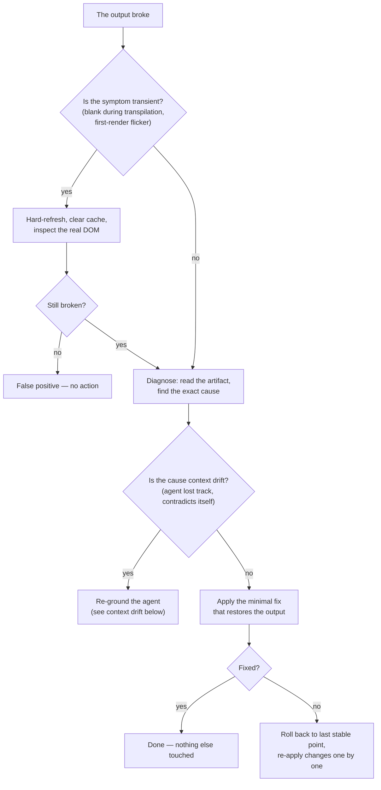
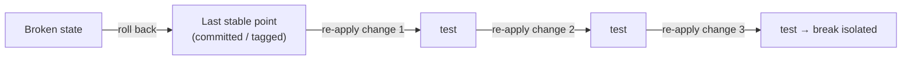

# Protocoles de défaillance

*Une méthode mature se juge quand quelque chose casse. Le réflexe qui compte : action minimale, jamais de régénération destructrice.*

Une méthode mature se juge à l'instant où quelque chose va de travers. Quand la génération casse, quand une page s'affiche blanche, quand le contexte de l'agent a dérivé — l'instinct est de tout effacer et de régénérer. Cet instinct est l'erreur. Il jette du travail validé pour échapper à un problème qu'une petite correction ciblée résoudrait.

Le principe sous chaque protocole de ce chapitre :

> **Action minimale. Jamais de régénération destructrice.**



## Récupération après crash de génération

**Symptôme.** La sortie ne se rend plus, alors même que le contenu semblait cohérent.

La tentation de tout régénérer est l'erreur : on perdrait le travail validé. Suivez plutôt la procédure.

```text
PROCEDURE
1. Current state — read the artifact, identify the cause class
   (syntax, missing import, render loop), find the exact error.
2. Diagnosis — point to the line, the import, or the faulty component.
3. Minimal action — the smallest correction that brings the render back.
   DO NOT regenerate. DO NOT touch the rest.
4. If insufficient — roll back to the last stable point, re-apply the
   changes one by one, testing between each.

PROHIBITIONS
- No full regeneration.
- No change outside the crash perimeter.
- No new feature during recovery.
```

Le quatrième interdit compte autant que le premier. La récupération n'est pas un moment pour glisser aussi une amélioration ; mêler une correction et une fonctionnalité rend les deux impossibles à vérifier. La récupération fait une seule chose : restaurer le dernier état connu bon.

Un exemple travaillé. Une construction de `saved-views-panel` cesse de s'afficher après une édition. Étape 1 : la lecture de l'artefact révèle une boucle de rendu — un setter d'état appelé pendant le rendu. Étape 2 : la ligne fautive est identifiée. Étape 3 : le setter est déplacé dans un effet — une ligne changée, rendu restauré. Pas de régénération, aucun autre changement. Coût total : un diagnostic et une ligne. Le coût d'une régénération aurait été chaque résolution de zone grise intégrée dans cet écran.

## Faux positifs de transpilation

Sur les environnements qui compilent à la volée, une page peut sembler blanche le temps de la transpilation. Avant de conclure « bug » :

1. Rafraîchir en vidant le cache.
2. Inspecter le **DOM réel** — pas le visuel, l'arbre effectivement rendu.
3. Pour les cas lourds, pré-compiler avant exécution, ce qui supprime entièrement le problème.

La leçon se généralise au-delà de la transpilation : **ne jamais réagir à un symptôme transitoire par une action destructrice.** Une page blanche pendant une étape de compilation, un scintillement au premier rendu, un 404 passager pendant qu'un serveur de dev redémarre — ce ne sont pas des défaillances. Confirmez que le symptôme est réel et stable avant d'agir dessus. Une action destructrice prise contre un symptôme qui se serait dissipé seul est une perte pure.

## Dérive de contexte et épuisement de la fenêtre de contexte

Un mode de défaillance propre aux longues sessions d'agent : le contexte de travail de l'agent se remplit ou dérive. Symptômes :

- l'agent contredit une décision qu'il a prise plus tôt dans la même session ;
- il réintroduit du code qu'il a retiré il y a vingt minutes ;
- il « oublie » une contrainte énoncée dans le fichier de contexte ;
- ses éditions deviennent moins précises à mesure que la session s'allonge.

La cause n'est pas le modèle qui échoue — c'est la fenêtre de contexte qui se remplit d'historique de session, repoussant hors de portée effective les faits stables et importants.

**Procédure de récupération :**

```text
CONTEXT-DRIFT RECOVERY
1. Stop. Do not ask the drifting agent to "try again" — it will drift further.
2. Capture state — write the current, verified state to a durable place:
   the contract, the grey-zone ledger, a short handoff note. Not the chat.
3. Re-ground — start a fresh agent context. Load: the context file, the
   relevant contract, and the captured state. Nothing else.
4. Resume — the fresh agent continues from a clean, small, accurate context.

PROHIBITIONS
- No "continue anyway" with the drifted context.
- No relying on the chat history as the record of truth.
```

La prévention structurelle est dans l'architecture : déléguez le travail lourd en lecture à un **sous-agent explorateur** pour que le contexte de l'agent qui agit reste petit et propre (voir le [chapitre 03, §3.5](./03-agent-architecture.md) et le [chapitre 11](./11-multi-agent-orchestration.md)). L'enregistrement durable est le **vault**, jamais la conversation — c'est exactement pour cela que le vault existe. Une session se termine ; un vault persiste.

## Discipline de rollback

Le rollback est un outil, pas une défaite — mais il a des règles.

1. **Toujours avoir un point où revenir.** Avant une itération, l'état validé est archivé (un commit, un tag, un instantané sauvegardé). On ne peut pas revenir à un état que l'on n'a jamais sauvegardé. C'est le pattern *sauvegarde avant itération* du [chapitre 09](./09-patterns-and-antipatterns.md).
2. **Revenir au dernier point stable, pas à zéro.** Le but est l'état connu bon le plus proche, pas un dépôt vide.
3. **Réappliquer en avant, une modification à la fois, en testant entre chaque.** Cela restaure à la fois la progression et isole quelle modification a causé la casse.
4. **Un rollback est consigné.** Notez ce qui a cassé et pourquoi, pour que la prochaine tentative ne le répète pas. Un rollback silencieux n'enseigne rien.



## Action minimale, jamais de régénération destructrice

Chaque protocole ici est un seul principe appliqué à une défaillance différente :

| Défaillance | Instinct destructeur | Action minimale |
|---|---|---|
| Crash de génération | Régénérer tout l'écran | Corriger la seule ligne fautive |
| Page blanche de transpilation | Reconstruire la page | Rafraîchir, inspecter le DOM |
| Dérive de contexte | Pousser plus fort l'agent qui dérive | Capturer l'état, réancrer un contexte neuf |
| Une itération cassée | Tout recommencer | Revenir au dernier point stable |

La régénération destructrice ressemble à du progrès parce qu'elle produit une sortie fraîche. Ce n'est pas du progrès. Elle écarte les résolutions de zones grises, la conformité au contrat et les décisions validées déjà intégrées dans l'artefact. Le geste discipliné est presque toujours plus petit, plus lent à procurer une satisfaction, et bien moins coûteux.

En cas de doute réel entre une petite correction et une régénération, l'égalité revient à la petite correction. Vous pouvez toujours escalader vers une refonte ; vous ne pouvez pas désannuler du travail validé jeté.

## Voir aussi

- [Chapitre 05 — La chaîne de livraison](./05-the-delivery-chain.md)
- [Chapitre 06 — Le prompt comme contrat](./06-prompt-as-contract.md)
- [Chapitre 09 — Patterns et anti-patterns](./09-patterns-and-antipatterns.md)
- [Chapitre 11 — Orchestration multi-agents](./11-multi-agent-orchestration.md)
