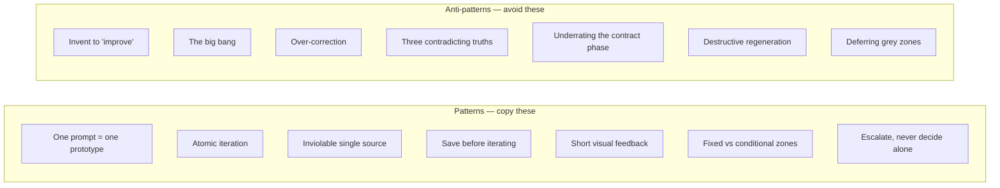

# Patterns et anti-patterns

*Le catalogue. Patterns à copier — ce qu'ils sont, pourquoi ils marchent, comment les appliquer. Anti-patterns à éviter — leur symptôme, leur coût, leur correction.*

Ce chapitre est un catalogue de référence. Les patterns sont décrits selon **Quoi / Pourquoi ça marche / Comment**. Les anti-patterns sont décrits selon **Symptôme / Coût / Correction**. La plupart sont tirés directement de la méthode ; quelques-uns sont des extensions naturelles, cohérentes avec elle, et sont signalés comme telles.

---

## Patterns

### Pattern 1 — Un prompt = un prototype

**Quoi.** Le prototype sort d'une seule génération, avec deux à quatre passes internes. On ne le construit pas en prompts fragmentés.

**Pourquoi ça marche.** Le nombre d'itérations devient une métrique propre et honnête de la qualité du brief. Si un écran demande cinq prompts, le brief avait cinq trous — et maintenant vous le savez. Le prompt fragmenté masque ce signal en répartissant les trous sur plusieurs petites réussites.

**Comment.** Écrivez le prompt de prototype comme un contrat (voir le [chapitre 06](./06-prompt-as-contract.md)) : type d'opération, passes, spécifications avec valeurs chiffrées, rappel du design system, interdits, checklist. Puis générez une fois. Si le résultat est inutilisable, corrigez le *prompt*, pas l'écran.

### Pattern 2 — L'itération atomique

**Quoi.** Une modification par message. Chaque itération change exactement une chose.

**Pourquoi ça marche.** Quand un changement casse quelque chose, la cause est sans ambiguïté — il n'y a qu'un seul candidat. Les changements groupés transforment le débogage en recherche.

**Comment.** Utilisez le mode de prompt « modification chirurgicale ». Un problème nommé, un pattern cible, un interdit de périmètre (« aucune autre modification que celle-ci »). Vérifiez, puis commencez le message suivant.

### Pattern 3 — La source unique inviolable

**Quoi.** Ne jamais inventer un libellé ou une valeur. Toujours aller la chercher à sa source.

**Pourquoi ça marche.** Les libellés et valeurs inventés sont la matière première des zones grises et de la dette de cohérence. Une valeur récupérée à sa source de vérité ne peut pas en diverger.

**Comment.** Quand l'agent a besoin d'une chaîne, d'une limite, d'une couleur ou d'un endpoint, il lit le design system, le contrat ou le code — voir la table d'autorité au [chapitre 04](./04-sources-of-truth.md). Faites de « aucune invention » un interdit permanent dans le fichier de contexte.

### Pattern 4 — Sauvegarder avant d'itérer

**Quoi.** Archiver l'état validé avant toute itération. Ne jamais modifier de façon destructrice.

**Pourquoi ça marche.** Cela garantit un point de rollback. Vous pouvez tenter un changement avec audace parce que l'état connu bon est en sécurité (voir le [chapitre 08](./08-failure-protocols.md), discipline de rollback).

**Comment.** Committez ou taguez l'état validé avant le prompt d'itération. L'itération a alors un endroit où retomber si elle casse.

### Pattern 5 — Le feedback visuel court

**Quoi.** Valider contre une véritable capture d'écran ou une sortie rendue, pas une description.

**Pourquoi ça marche.** Une description de ce qui a été construit est l'*affirmation* de l'agent. Une capture d'écran est une *preuve*. Les zones grises se cachent dans l'écart entre l'affirmation et la preuve.

**Comment.** Après une génération ou une itération, regardez le résultat effectivement rendu, à travers les viewports. Lancez le balayage des zones grises contre ce que vous voyez, pas contre ce que l'agent dit avoir fait ([chapitre 07](./07-grey-zones.md)).

### Pattern 6 — Zones fixes vs zones conditionnelles

**Quoi.** Séparer, explicitement, les parties d'un écran toujours présentes (zones fixes) des parties qui n'apparaissent que sous conditions (zones conditionnelles).

**Pourquoi ça marche.** Les zones conditionnelles sont là où vivent les états et les edge cases — vide, erreur, conditionné par les permissions. Les nommer explicitement les force dans le contrat et dans le balayage des zones grises au lieu d'être découvertes plus tard.

**Comment.** Dans la section architecture du contrat, listez séparément les zones fixes et les zones conditionnelles. Pour chaque zone conditionnelle, énoncez la condition qui l'affiche et l'état qu'elle affiche.

### Pattern 7 — Escalader, ne jamais trancher seul *(extension)*

**Quoi.** Quand un cas n'est dans aucune source, on remonte à la source supérieure, on la complète, on redescend — prototype d'abord, contrat ensuite, code en dernier.

**Pourquoi ça marche.** Cela corrige la *source* du manque, pas le symptôme. Le prochain agent et le prochain relecteur héritent d'une source complète au lieu de deviner à nouveau.

**Comment.** C'est le réflexe d'escalade du [chapitre 04](./04-sources-of-truth.md). Un cas dans aucune source est une zone grise ; résolvez-la via les deux issues du [chapitre 07](./07-grey-zones.md).

---

## Anti-patterns

### Anti-pattern 1 — Inventer pour « améliorer »

**Symptôme.** L'agent ajoute, change ou « peaufine » quelque chose qu'on ne lui a pas demandé, parce qu'il a jugé que le résultat serait meilleur.

**Coût.** La plus grande source de zones grises. Chaque invention est une décision silencieuse que personne avec autorité n'a prise. Elles s'accumulent invisiblement et explosent à l'intégration.

**Correction.** Un interdit permanent « aucune invention » dans le fichier de contexte ; un interdit de périmètre dans chaque prompt chirurgical ; la source unique inviolable (pattern 3). Ce qui ressemble à de la serviabilité est une prise de décision non budgétée.

### Anti-pattern 2 — Le big bang

**Symptôme.** Tout est construit avant que rien ne soit testé ; toutes les pièces sont raccordées à la fin, en une phase finale unique.

**Coût.** Chaque problème d'intégration fait surface en même temps, au pire moment possible, sans isolation. Un raccord big bang, c'est l'instant où quinze zones grises explosent ensemble.

**Correction.** Construction parallèle contract-first avec **raccord par vagues** — endpoint par endpoint, chaque remplacement vérifié ([chapitre 05, étape 4](./05-the-delivery-chain.md)). L'intégration devient une suite de petits pas vérifiés, pas une falaise.

### Anti-pattern 3 — La sur-correction

**Symptôme.** Sommé de changer une chose, l'agent retravaille aussi des choses voisines qui n'étaient pas dans le périmètre et qui étaient déjà correctes.

**Coût.** Des régressions dans du code qui avait un contrat signé et qui fonctionnait. Découvertes en QA, retracées avec difficulté, parce que le diff est plus large que la demande.

**Correction.** Terminez chaque prompt chirurgical par « aucune autre modification que celle-ci » ([chapitre 06](./06-prompt-as-contract.md)) ; terminez la checklist par « aucune régression ailleurs ». L'itération atomique (pattern 2) garde le diff auditable.

### Anti-pattern 4 — Trois vérités contradictoires

**Symptôme.** Une note, un contrat et le code disent chacun quelque chose de différent sur le même fait.

**Coût.** La dette de cohérence — la plus chère des dettes, invisible jusqu'à ce que tout casse en même temps ([chapitre 04](./04-sources-of-truth.md)). Un agent qui lit trois vérités en choisit une au hasard.

**Correction.** La règle d'or de la divergence : la source supérieure gagne et l'inférieure est mise à jour *immédiatement*. Ne jamais laisser deux vérités coexister, pas même le temps d'un après-midi.

### Anti-pattern 5 — Sous-estimer la phase de contrat

**Symptôme.** Le contrat est traité comme de la paperasse — bâclé, à moitié rempli, ou sauté pour « passer au vrai travail ».

**Coût.** La dette la plus chère du projet. Chaque manque dans le contrat devient une zone grise, un aller-retour ou une reprise. Le temps « gagné » sur le contrat est emprunté à un taux punitif.

**Correction.** Traitez le contrat comme l'étape 3 de la chaîne, avec sa propre definition of done : toutes les sections renseignées, double signature, `status: frozen` ([chapitre 05](./05-the-delivery-chain.md)). La phase de contrat *est* le vrai travail.

### Anti-pattern 6 — La régénération destructrice *(extension)*

**Symptôme.** Quand la génération casse, la réponse est d'effacer et de régénérer tout l'artefact.

**Coût.** Chaque résolution de zone grise, chaque conformité au contrat, chaque décision validée intégrée dans cet artefact est écartée. La sortie fraîche *ressemble* à du progrès ; c'est une perte.

**Correction.** Les protocoles de défaillance du [chapitre 08](./08-failure-protocols.md) : action minimale, diagnostiquer la cause exacte, corriger la plus petite chose, revenir au dernier point stable si nécessaire — ne jamais régénérer.

### Anti-pattern 7 — Reporter les zones grises *(extension)*

**Symptôme.** Une zone grise est trouvée et garée : « on tranchera ça plus tard ».

**Coût.** « Plus tard », c'est l'intégration, où elle arrive avec toutes les autres zones reportées. Une zone grise reportée n'est pas résolue — elle est reprogrammée au moment le plus cher.

**Correction.** Chaque zone grise se résout en exactement l'une de deux issues — une décision formelle ou une note de contrat — et jamais une troisième ([chapitre 07](./07-grey-zones.md)). Le registre des zones grises n'est pas clos tant que chaque ligne n'a pas une résolution.

---

## Le catalogue comme checklist

Utilisez ceci comme auto-audit rapide en fin de fonctionnalité.

| Avez-vous... | Pattern / anti-pattern |
|---|---|
| Généré le prototype en un seul prompt ? | P1 |
| Gardé chaque itération à un seul changement ? | P2 |
| Récupéré chaque libellé et valeur à sa source ? | P3 / A1 |
| Archivé l'état validé avant d'itérer ? | P4 |
| Validé contre une sortie effectivement rendue ? | P5 |
| Séparé zones fixes et conditionnelles dans le contrat ? | P6 |
| Escaladé les manques au lieu de rapiécer le code ? | P7 |
| Raccordé l'intégration par vagues, pas en big bang ? | A2 |
| Gardé le diff cantonné à la demande ? | A3 |
| Gardé toutes les sources cohérentes ? | A4 |
| Traité le contrat comme du vrai travail ? | A5 |
| Corrigé la casse de façon minimale, sans régénérer ? | A6 |
| Résolu chaque zone grise maintenant, pas plus tard ? | A7 |

Un « non » quelque part est un mode de défaillance connu avec une correction connue. Le catalogue existe pour qu'aucun d'entre eux ne soit une surprise.

## Voir aussi

- [Chapitre 05 — La chaîne de livraison](./05-the-delivery-chain.md)
- [Chapitre 06 — Le prompt comme contrat](./06-prompt-as-contract.md)
- [Chapitre 07 — Les zones grises](./07-grey-zones.md)
- [Chapitre 08 — Protocoles de défaillance](./08-failure-protocols.md)
