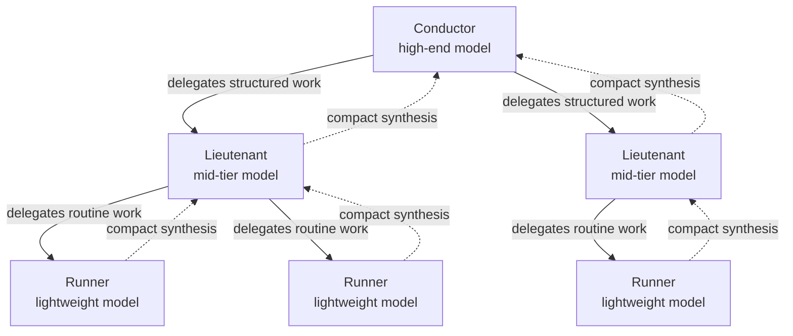
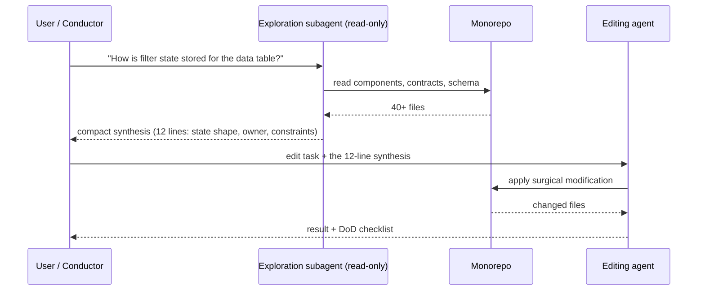

# Orchestration multi-agents

*Un seul modèle pour tout est le réglage par défaut le plus coûteux. Mainstay distribue le travail sur trois niveaux — chef d'orchestre, bras droit, exécutant — et sépare l'exploration de l'édition pour garder le contexte propre et le coût honnête.*

On n'utilise pas le même modèle pour chaque tâche. Un modèle haut de gamme qui décide l'architecture et un modèle léger qui formate un fichier ne sont pas interchangeables : l'un est cher et lent, l'autre est bon marché et rapide, et utiliser le mauvais gaspille de l'argent ou de la qualité. L'orchestration est la discipline qui consiste à router chaque unité de travail vers le bon niveau — et à garder le contexte de chaque agent non pollué.

Ce chapitre couvre les trois niveaux, la séparation explorer/éditer, la façon dont le contexte est passé, un modèle de coût travaillé, et — tout aussi important — quand **ne pas** recourir aux sous-agents.

---

## Les trois niveaux

L'orchestration de Mainstay distribue le travail sur trois rôles. Ils diffèrent en classe de modèle, coût, latence, et ce qu'ils possèdent.



### Chef d'orchestre

Le chef d'orchestre est un modèle haut de gamme, utilisé à la demande. Il possède le travail qui ne peut pas être délégué sans perdre en qualité.

- **Possède :** les décisions d'architecture, la conception des contrats, l'arbitrage des zones grises, la planification du découpage du travail, la résolution des conflits entre sources de vérité.
- **Classe de modèle :** le plus puissant disponible ; le coût est justifié parce que ces décisions façonnent tout l'aval.
- **Profil coût/latence :** coût élevé par token, utilisé avec parcimonie, latence tolérable parce que la décision est rare et lourde de conséquences.
- **Ne fait pas :** appliquer des éditions de routine, lancer des formateurs, écrire du boilerplate. Chaque token que le chef d'orchestre dépense en travail de routine est surpayé.

### Bras droit

Le bras droit est un modèle de milieu de gamme. Il fait le travail structuré où le cadre est déjà posé — typiquement par un contrat ou un plan que le chef d'orchestre a produit.

- **Possède :** implémenter un écran contre un contrat figé, écrire des handlers de back contre une spec d'API, raccorder les endpoints par vagues, produire des tests pour un comportement défini.
- **Classe de modèle :** milieu de gamme — assez fort pour écrire du code correct, assez bon marché pour tourner souvent.
- **Profil coût/latence :** coût modéré, latence modérée, le cheval de trait de la chaîne.
- **Ne fait pas :** décider quoi construire. Si un bras droit rencontre une ambiguïté, il escalade vers le chef d'orchestre au lieu de deviner — deviner produit des zones grises.

### Exécutant

L'exécutant est un modèle léger pour les routines automatisées.

- **Possède :** le formatage, les refactorings mécaniques, le renommage, l'application d'un correctif de lint, l'extraction d'une synthèse à partir de fichiers, la régénération de mocks depuis une spec.
- **Classe de modèle :** le modèle le moins cher qui fait le travail de façon fiable.
- **Profil coût/latence :** coût faible, latence faible, tourne en permanence et souvent en parallèle.
- **Ne fait pas :** le moindre jugement. Un exécutant exécute une instruction entièrement spécifiée ; si l'instruction demande de l'interprétation, c'est le mauvais niveau.

| Niveau | Classe de modèle | Coût relatif | Possède | Escalade quand |
|---|---|---|---|---|
| Chef d'orchestre | Haut de gamme | Élevé | Décisions, architecture, contrats | Jamais — c'est le sommet |
| Bras droit | Milieu de gamme | Moyen | Implémentation structurée | Une ambiguïté non couverte par le contrat |
| Exécutant | Léger | Faible | Routines déterministes | L'instruction exige un jugement |

---

## La séparation explorer/éditer

Le pattern de sous-agent le plus rentable n'est pas « plus d'agents » — c'est de séparer **l'exploration** de **l'édition**.

Lire une grande base de code pour la comprendre brûle du contexte. Un agent qui a lu quarante fichiers pour répondre à une question porte désormais quarante fichiers de bruit dans chaque édition suivante. Sa précision se dégrade. La correction est une division du travail :

- Un **sous-agent d'exploration** tourne en lecture seule. Il parcourt le monorepo, comprend la zone pertinente, et renvoie une **synthèse compacte** — pas les fichiers, la réponse.
- Un **agent d'édition**, dont le contexte n'a jamais été dépensé sur la recherche, applique le changement avec un contexte propre et concentré.

Comme le monorepo héberge code et connaissance au même endroit (voir [Le monorepo](./02-monorepo.md)), la synthèse du sous-agent d'exploration est fiable : il a lu le schéma réel et les décisions réelles dans le même espace.



L'agent d'édition ne voit jamais les quarante fichiers. Il voit douze lignes de vérité distillée et la tâche. Son contexte reste propre.

---

## La passation de contexte : la synthèse compacte

La valeur d'un sous-agent s'effondre s'il renvoie tout ce qu'il a lu. Une passation est une **synthèse**, gouvernée par trois règles.

1. **Répondre, ne pas transcrire.** Renvoyez des conclusions et les quelques faits qui les soutiennent, pas des contenus de fichiers bruts.
2. **Nommer les sources, ne pas les coller.** Citez `vault/contracts/saved-views-panel.md` et `apps/backend/src/...` ; laissez l'agent d'édition les ouvrir seulement s'il le doit.
3. **Faire remonter l'ambiguïté explicitement.** Si l'exploration a trouvé une zone grise, la synthèse le dit — le chef d'orchestre décide, le sous-agent non.

La forme d'une bonne synthèse :

```text
SYNTHESIS — filter state for the data table

WHERE:    apps/frontend/src/table/use-table-state.ts
SHAPE:    { filters: Filter[], sort: SortSpec, columns: string[] }
OWNER:    the table screen; persisted per-user on save
CONSTRAINT: a saved view stores a snapshot, not a live reference
            (see vault/contracts/saved-views-panel.md §3)
GREY ZONE: behaviour when a saved column no longer exists is
           unspecified — needs a decision before editing.
NEXT:     editing the panel is safe; resolve the grey zone first.
```

Douze lignes remplacent quarante fichiers. C'est tout l'enjeu de la passation.

---

## Un modèle de coût (travaillé, illustratif)

Les chiffres ci-dessous sont **illustratifs** — inventés pour l'exemple, ce ne sont pas de vrais prix. Ils montrent la *forme* de l'argument de coût, pas un devis.

Scénario : construire un écran de bout en bout. L'approche naïve utilise le modèle haut de gamme pour tout. L'approche orchestrée route chaque tâche vers son niveau.

**Naïf — le chef d'orchestre fait tout (chiffres illustratifs) :**

| Tâche | Tokens (illustratif) | Niveau utilisé | Coût unitaire (illustratif) | Coût (illustratif) |
|---|---|---|---|---|
| Explorer la base de code | 180 000 | Haut de gamme | 15 $ / 1M | 2,70 $ |
| Concevoir le contrat | 60 000 | Haut de gamme | 15 $ / 1M | 0,90 $ |
| Implémenter l'écran | 240 000 | Haut de gamme | 15 $ / 1M | 3,60 $ |
| Passes de format et lint | 90 000 | Haut de gamme | 15 $ / 1M | 1,35 $ |
| **Total** | **570 000** | — | — | **8,55 $** |

**Orchestré — chaque tâche sur son niveau (chiffres illustratifs) :**

| Tâche | Tokens (illustratif) | Niveau utilisé | Coût unitaire (illustratif) | Coût (illustratif) |
|---|---|---|---|---|
| Explorer la base de code | 180 000 | Exécutant | 0,50 $ / 1M | 0,09 $ |
| Concevoir le contrat | 60 000 | Chef d'orchestre | 15 $ / 1M | 0,90 $ |
| Implémenter l'écran | 240 000 | Bras droit | 3 $ / 1M | 0,72 $ |
| Passes de format et lint | 90 000 | Exécutant | 0,50 $ / 1M | 0,045 $ |
| **Total** | **570 000** | — | — | **1,76 $** |

Dans ce scénario illustratif, l'approche orchestrée coûte environ **5× moins** pour la même sortie, parce que les tokens chers ne sont dépensés que sur les 60 000 tokens de vrai travail de décision. La leçon est durable même si les chiffres sont fictifs : **ajustez le prix du token au jugement requis.**

Une seconde économie est la latence. Les exécutants tournent en parallèle et vite ; le chef d'orchestre est invoqué rarement. Le temps d'horloge de la construction orchestrée est plus bas parce que le travail parallèle bon marché ne fait pas la queue derrière un seul modèle cher.

---

## Quand NE PAS utiliser de sous-agents

Les sous-agents ne sont pas gratuits. Chacun ajoute une passation, et une passation peut perdre de l'information ou ajouter de la latence d'aller-retour. Ne recourez pas à l'orchestration quand :

- **La tâche est petite et autonome.** Un changement sur deux fichiers n'a pas besoin d'un sous-agent d'exploration — l'agent d'édition peut lire deux fichiers à bas coût. La passation coûterait plus qu'elle ne fait gagner.
- **Le contexte est déjà chargé.** Si l'agent vient de construire l'écran et que vous demandez un ajustement, il porte déjà le contexte pertinent. Lancer un sous-agent neuf le jette.
- **Le travail est une seule décision indivisible.** Découper un seul jugement architectural entre plusieurs agents le fragmente. Le chef d'orchestre devrait le faire d'un bloc.
- **La synthèse serait aussi grande que la source.** Si l'exploration ne peut pas comprimer la zone en une synthèse courte, la zone *est* le travail — éditez-la directement.
- **Débogage d'un bug subtil et à état.** Les chasses au bug ont besoin de continuité de contexte. Les passations brisent la chaîne de raisonnement qui trouve la cause.

La règle : utilisez un sous-agent quand le **contexte économisé par la délégation dépasse le contexte dépensé sur la passation**. En dessous de cette ligne, un seul agent est plus rapide, moins cher et plus tranchant.

---

## Voir aussi

- [L'architecture agentique](./03-agent-architecture.md)
- [Le monorepo, socle de la connaissance](./02-monorepo.md)
- [Observabilité et métriques](./12-observability-and-metrics.md)
- [CI/CD et hooks](./14-cicd-and-hooks.md)
