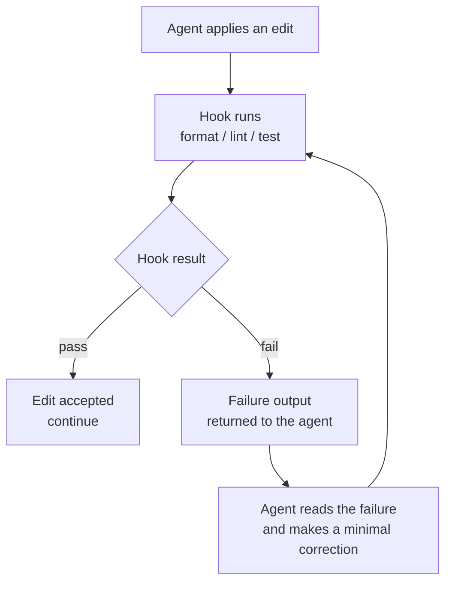

# CI/CD et hooks

*Les hooks transforment une bonne pratique en garantie. La CI transforme les garanties en verrous. Ensemble, ils créent la boucle d'auto-correction : l'agent édite, un hook teste, l'échec revient, l'agent corrige — sans humain dans la boucle interne.*

Un hook est un déclencheur déterministe attaché à un événement du cycle de l'agent. Il ne demande pas son avis au modèle ; il s'exécute. Ce déterminisme est ce qui rend un hook fiable : une bonne pratique qui dépend du fait que l'agent se souvienne de la faire n'est pas une garantie — un hook, oui.

Ce chapitre couvre le hook de synchronisation doc/schéma en entier, les contrôles bloquants en CI, la boucle d'auto-correction, et un exemple de pipeline neutre vis-à-vis du fournisseur. Les hooks exécutables référencés ici vivent dans le dossier `hooks/` de ce dépôt.

---

## Hooks : événements et effets

Un hook est défini par son événement déclencheur et son effet.

| Événement déclencheur | Effet du hook | Pourquoi |
|---|---|---|
| Après chaque édition | Formater et linter les fichiers modifiés | Garde l'arbre cohérent sans que l'agent y pense |
| Avant chaque commit | Lancer la suite de tests | Un commit qui échoue n'entre jamais dans l'historique |
| Après une migration | Vérifier la synchro doc/schéma (voir plus bas) | Le modèle de données canonique ne dérive jamais du code |
| Avant un gel de contrat | Vérifier que les deux signatures sont présentes | Un contrat non signé ne peut pas atteindre `frozen` |
| Sur pull request | Lancer les contrôles bloquants de CI | Les verrous de qualité s'appliquent à chaque changement, agent ou humain |

Les hooks suivent les conventions de code de ce dépôt : `bash` POSIX, `#!/usr/bin/env bash`, `set -euo pipefail`, le bit exécutable posé, et un commentaire d'en-tête nommant l'événement déclencheur.

---

## Le hook de synchronisation doc/schéma, en entier

C'est le hook le plus important d'un monorepo Mainstay, parce qu'il impose la règle structurelle selon laquelle le **code est la source de vérité du schéma** (voir [Le monorepo](./02-monorepo.md)).

Le problème qu'il résout : une migration change le schéma de la base de données. Si le modèle de données canonique dans `apps/backend/docs/database/` n'est pas mis à jour dans le même changement, la documentation ment désormais. Six mois plus tard, un agent lit la doc périmée et construit contre un schéma qui n'existe plus. Le hook rend cela impossible.

Il a deux modes valides. Choisissez-en un par dépôt.

### Mode 1 — Contrôle bloquant

Le hook détecte qu'une migration a touché le schéma et fait échouer la construction tant que la doc canonique n'est pas mise à jour dans le même changement. L'agent (ou l'humain) doit mettre à jour la doc pour continuer.

```bash
#!/usr/bin/env bash
# hooks/doc-schema-sync.sh
# Trigger: pre-commit, and again as a blocking CI check on every PR.
# Effect: if a migration changed the schema but the canonical data-model
#         docs were not updated in the same change, fail.
set -euo pipefail

MIGRATIONS_GLOB="apps/backend/src/migrations/"
DOCS_DIR="apps/backend/docs/database/"

# Files changed in this commit / PR diff.
changed="$(git diff --cached --name-only)"

schema_touched="$(echo "$changed" | grep "^${MIGRATIONS_GLOB}" || true)"
docs_touched="$(echo "$changed"   | grep "^${DOCS_DIR}"        || true)"

if [ -n "$schema_touched" ] && [ -z "$docs_touched" ]; then
  echo "BLOCKED: a migration changed the schema but the canonical"
  echo "data-model docs in ${DOCS_DIR} were not updated."
  echo "Update the canonical docs in this same change, then retry."
  exit 1
fi

echo "doc-schema-sync: OK"
```

### Mode 2 — Régénération automatique

Un mode étendu du même script `hooks/doc-schema-sync.sh` : au lieu d'échouer, le hook régénère la doc canonique depuis le code automatiquement, puis stage le résultat, pour qu'elle ne puisse pas prendre de retard. Utilisez-le quand la doc est entièrement dérivable du schéma.

```bash
#!/usr/bin/env bash
# hooks/doc-schema-sync.sh — regenerate mode
# Trigger: post-migration.
# Effect: regenerate the canonical data-model docs from the code and stage them.
set -euo pipefail

npm run generate:schema-docs        # reads entities/migrations, writes docs
git add apps/backend/docs/database/

echo "doc-schema-sync: canonical docs regenerated and staged"
```

Dans un cas comme dans l'autre, le principe tient : **la connaissance n'est jamais « à faire plus tard » — elle est une condition de la fusion.**

---

## Contrôles bloquants en CI

La CI est là où les garanties deviennent des verrous. Un *contrôle bloquant* fait échouer le pipeline et empêche la fusion. Dans un dépôt Mainstay, les contrôles bloquants ne sont pas seulement « est-ce que ça compile » — ils imposent aussi la méthode.

| Contrôle bloquant | Fait échouer la PR quand... |
|---|---|
| Build | Le projet ne compile pas. |
| Suite de tests | Un test de sortie échoue. |
| Lint / format | L'arbre n'est pas cohérent. |
| Synchro doc/schéma | Une migration a changé le schéma sans mettre à jour la doc canonique. |
| Signatures de contrat | Un contrat est mis en `frozen` sans les deux signatures. |
| Banc d'évaluation | Une tâche de référence, un test de conformité ou une sonde de garde-fou échoue (voir [Tester et évaluer les agents](./13-testing-and-evaluating-agents.md)). |
| Présence du balayage de zones grises | Un nouvel écran fusionne sans artefact de balayage de zones grises complété. |

Les contrôles du banc d'évaluation et du balayage de zones grises sont ce qui fait que la CI impose Mainstay au lieu de simplement imposer la compilation. Sans eux, un agent peut livrer une construction verte qui a ignoré un garde-fou.

---

## La boucle d'auto-correction

La combinaison des hooks et de la CI crée la boucle qui permet à un agent de corriger ses propres erreurs sans humain dans le cycle interne.

L'agent édite. Un hook s'exécute et teste le résultat. Si le test échoue, la sortie d'échec est renvoyée à l'agent. L'agent lit l'échec, fait une correction minimale, et le hook s'exécute à nouveau. La boucle se referme quand le hook passe.



Deux disciplines gardent cette boucle saine :

- **La sortie d'échec du hook doit être actionnable.** Un échec utile nomme le fichier, la ligne et l'attente. Un échec vague (« tests échoués ») ne donne rien à l'agent contre quoi corriger et la boucle tourne dans le vide.
- **La correction doit être minimale.** La boucle sert à corriger l'échec précis, pas à refactorer. Un agent qui « améliore » du code en corrigeant un test introduit de la dérive de contexte — voir [Protocoles de défaillance](./08-failure-protocols.md).

La boucle d'auto-correction est la raison pour laquelle un agent Mainstay peut tourner sans surveillance pendant de longues plages : c'est l'infrastructure, pas un humain, qui attrape et renvoie chaque erreur.

---

## Un exemple de pipeline CI (neutre vis-à-vis du fournisseur, fictif)

La configuration ci-dessous est générique et **fictive** — elle ne vise aucun vrai fournisseur de CI et utilise une syntaxe d'exemple. Adaptez-la à ce que votre CI exécute.

```yaml
# .ci/pipeline.yml  — illustrative, provider-neutral
pipeline:
  triggers:
    - on: pull_request
    - on: push
      branch: main

  env:
    API_BASE_URL: "https://api.example.com"
    API_TOKEN: "<API_TOKEN>"          # injected from CI secrets, never committed

  stages:

    - name: build
      run: npm ci && npm run build
      blocking: true

    - name: lint
      run: npm run lint
      blocking: true

    - name: test
      run: npm run test
      blocking: true

    - name: doc-schema-sync
      run: ./hooks/doc-schema-sync.sh
      blocking: true

    - name: contract-signatures
      run: ./skills/contract-lint/lint.sh
      blocking: true

    - name: grey-zone-scan-present
      run: ./skills/grey-zone-scan/scan.sh
      blocking: true

    - name: eval-harness
      run: npm run eval -- --suite golden,conformance,guardrail,regression
      blocking: true

    - name: metrics
      run: npm run metrics:dashboard      # refreshes the health dashboard
      blocking: false                     # advisory, never blocks a merge
```

Notez la dernière étape : le tableau de bord de métriques de [Observabilité et métriques](./12-observability-and-metrics.md) s'exécute à chaque mouvement de la branche principale mais est **non bloquant** — les métriques informent, elles ne verrouillent pas.

---

## Raccorder la CI à la construction parallèle

La CI protège aussi la construction parallèle contract-first (étape 4 de la chaîne de livraison). Front et back avancent sur le même contrat figé, le back derrière des feature flags. La CI garde cela sûr :

- La spec d'API est un artefact versionné et bloquant — une PR qui change un endpoint sans incrémenter la spec échoue.
- Le back peut fusionner dans `main` avant que le front ne soit prêt parce que les feature flags le gardent éteint ; la CI vérifie que la valeur par défaut du flag est désactivée.
- Le raccord se fait par vagues, endpoint par endpoint ; chaque vague est sa propre PR avec son propre pipeline vert, de sorte que l'intégration est continue et vérifiable plutôt qu'une seule phase finale risquée.

---

## Voir aussi

- [Le monorepo, socle de la connaissance](./02-monorepo.md)
- [L'architecture agentique](./03-agent-architecture.md)
- [Tester et évaluer les agents](./13-testing-and-evaluating-agents.md)
- [Protocoles de défaillance](./08-failure-protocols.md)
