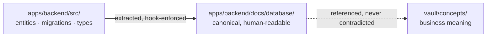
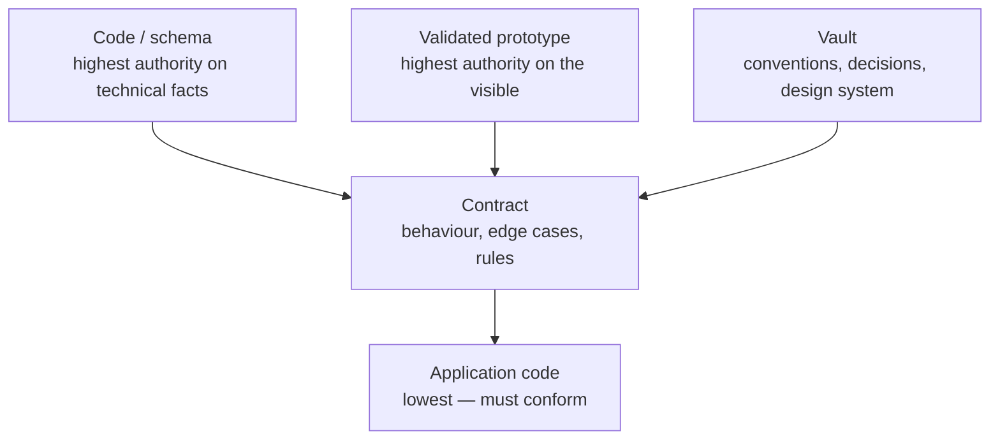
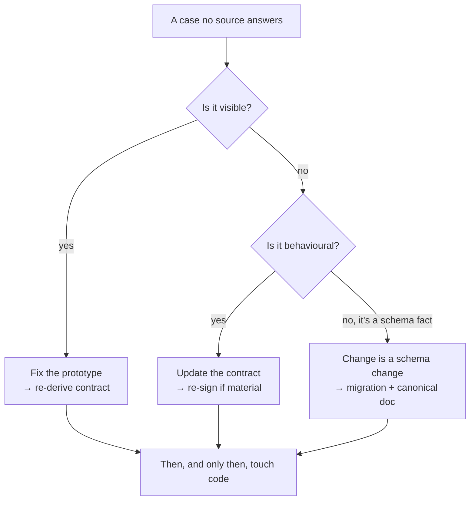

# Le vault et les sources de vérité

*La connaissance vit dans le monorepo, versionnée avec le code. En cas de doute, une seule source répond. Et le vault ne survit aux sessions parallèles que par trois garde-fous — chacun né d'une violation consignée.*

## La première erreur

La première erreur consiste à loger la base de connaissance ailleurs que dans le code : un wiki, un espace de notes, un outil de documentation séparé. Tout ce qui vit à l'extérieur du dépôt dérive du code — mécaniquement et inexorablement. Le code change ; la doc reste ; six mois plus tard, l'agent s'appuie sur une vérité qui ment.

Ce n'est pas un problème de discipline que des rappels suffiraient à régler. C'est structurel. Une page de wiki et un fichier de code n'ont pas de commit partagé, pas de revue partagée, pas de fusion partagée. Rien ne les force à bouger ensemble, donc ils ne le font pas.

Mainstay pose donc une règle structurelle :

> **La connaissance vit dans le monorepo, à côté du code, versionnée avec lui.**

Le code et la base de connaissance partagent un seul dépôt, un seul historique, un seul jeu de revues. Une modification de schéma et sa documentation voyagent dans le même commit, passent dans la même pull request et fusionnent ensemble. La connaissance cesse d'être une copie qui vieillit : elle devient une partie du diff, et le diff ne fusionne pas tant qu'elle n'est pas juste. La discipline n'est plus « pensez à mettre à jour la doc » ; elle est « la doc fait partie du diff ».

C'est ce qui rend le pilier mémoire du [chapitre 01](./01-three-pillars.md) opérationnel. Sans le monorepo, la « mémoire » est une aspiration. Avec lui, la mémoire est un dossier que l'agent peut lire — pas d'aller-retour vers un système externe, pas de risque de page périmée. L'arborescence type, dossier par dossier et commentée, vit dans `examples/monorepo-skeleton/`.

## Le code est la source de vérité du schéma

Le modèle de données canonique ne vit pas dans un schéma dessiné à la main. Il vit dans le code : entités, migrations, types. La représentation lisible du modèle est co-localisée avec le back, dans un dossier de documentation qui en *découle*.

Quand on veut connaître la forme réelle d'une table ou d'un type, on regarde le code — jamais un diagramme qui ment depuis trois mois. Toute autre source qui prétendrait décrire le schéma se range derrière lui.



La flèche qui compte : la doc canonique est *extraite du* code, jamais rédigée indépendamment. Si les deux divergent, le code gagne et la doc est régénérée. Un hook rend les deux physiquement inséparables dans l'historique : une migration qui change le schéma bloque le commit tant que la doc canonique n'a pas été régénérée et indexée avec elle (mise en place complète : [CI/CD et hooks](../reference/cicd-and-hooks.md)).

## Le vault est le miroir navigable, pas une source parallèle

Par-dessus le code, le vault ajoute ce que le code ne porte pas de lui-même : les décisions et leur justification, les contrats d'écrans, les concepts métier, et les liens qui relient tout cela. Le vault **indexe et donne du sens**.

Mais le vault ne contredit jamais le code. Pour tout ce qui est technique, le code gagne. Le vault est la couche de *sens* posée au-dessus de la couche de *vérité* — pas une vérité concurrente.

| Dossier du vault | Contient | Pourquoi cela ne peut pas vivre dans le code |
|---|---|---|
| `decisions/` | Décisions `DEC-XXX`, datées, justifiées | Le code montre le *quoi*, pas le *pourquoi ceci et pas cela* |
| `contracts/` | Un contrat par écran, avec un statut | Comportement, edge cases et critères d'acceptation ne sont pas du code source |
| `concepts/` | Concepts métier et vocabulaire | Le sens du domaine s'étale sur de nombreux fichiers de code |
| `design-system/` | Tokens, composants, conventions de copies | Règles visuelles transverses, référencées partout |

## Les deux flux de connaissance

La base de connaissance se constitue de deux flux, qui s'entretiennent différemment.

**Flux 1 — extrait du code.** Le schéma, les types, les routes. Ce flux doit être *automatisé* : un humain qui l'écrit à la main est un humain qui introduit de la dérive. Le hook de synchronisation le garde honnête.

**Flux 2 — rédigé par les humains et les agents.** Décisions, contrats, concepts. Ils ne peuvent pas être extraits parce qu'ils encodent une intention, pas une structure. Ce flux est rédigé, revu et figé comme n'importe quel autre livrable.

La règle qui garde les deux honnêtes : **la connaissance n'est jamais « à faire plus tard ». Elle est une condition de la livraison.** Le flux 1 est imposé par les hooks ; le flux 2 est imposé par la definition of done ([chapitre 04, étape 6](./04-delivery-chain.md)).

## La table d'autorité

Un agent — et une équipe — ne travaille bien que lorsque « où est la vérité ? » a exactement une réponse. Dès l'instant où deux sources peuvent revendiquer autorité sur le même fait, chaque décision devient une négociation, et l'agent, sommé de négocier, devine. Mainstay supprime la négociation : chaque source a autorité sur un domaine défini, et un comportement défini quand elle rencontre une source supérieure.

| Source | Autorité sur | En cas de divergence |
|---|---|---|
| **Le code (monorepo)** | Schéma de données, types, contrats techniques réels | Fait foi sur tout ce qui est technique et exécuté. Rien ne le surpasse sur le schéma. |
| **Le prototype validé** | Interface, parcours utilisateur, copies, états visibles | Gagne sur tout ce qui se voit. Le contrat le décrit ; il ne le contredit pas. |
| **Le contrat** | Comportement, edge cases, règles, données de test | Gagne sur le code applicatif. Perd contre le prototype et le schéma. |
| **Le vault** | Conventions, décisions, contraintes, design system | Gagne sur les règles transverses. S'incline devant le code sur les faits techniques. |

Lisez la table de deux façons.

**Par domaine.** Chaque ligne possède un domaine. « Quelle est la forme réelle de la table `saved_views` ? » est une question de *code* — on lit `apps/backend/src/`, pas un diagramme. « De quelle couleur est un bouton primaire ? » est une question de *design system* — on lit le vault. « Que se passe-t-il sur un `409` de l'endpoint d'enregistrement ? » est une question de *contrat*.

**Par rang.** La colonne « en cas de divergence » est un ordre de précédence. Le schéma est le plancher — rien ne le surpasse. Le prototype gagne sur tout ce qui est visible. Le contrat se situe entre les deux : il gouverne le comportement et l'emporte sur le code applicatif, mais il ne peut redéfinir ni ce que le prototype montre ni ce qu'est le schéma.



Notez que « le code » apparaît dans deux rôles. En tant que **schéma**, il est l'autorité suprême. En tant que **code applicatif** — la logique qu'un agent écrit contre un contrat —, il est le plus bas, et doit se conformer. La distinction n'est pas une contradiction : le schéma est un fait ; le code applicatif est une tentative de satisfaire un contrat.

## La règle d'or de la divergence

> Si deux sources se contredisent, la source supérieure gagne — **et la source inférieure est immédiatement mise à jour.**

On ne laisse jamais deux vérités coexister. Pas le temps d'un après-midi, pas « jusqu'à la fin du sprint ». Dès l'instant où une divergence est observée, la source inférieure est corrigée pour correspondre à la supérieure, dans le même changement.

La raison, c'est la **dette de cohérence**.

## La dette de cohérence

La dette de cohérence est le coût de deux sources qui divergent. C'est la plus chère de toutes les dettes, pour une raison : **elle est invisible jusqu'au jour où tout casse en même temps.**

Un exemple travaillé et fictif. Le contrat de `saved-views-panel` limite le nom d'une vue enregistrée à 60 caractères. L'agent, en construisant le back, lit une note de concept périmée qui dit 80, et livre une colonne `VARCHAR(80)`. Le front, construit contre le contrat, valide à 60. Pendant des semaines, rien ne casse — personne ne tape un nom de 70 caractères. Puis un utilisateur le fait. Le front le rejette ; une intégration qui écrit directement dans l'API, non ; la base l'accepte ; un rapport qui suppose 60 le tronque. Un seul chiffre, divergent à deux endroits, fait surface en quatre bugs dans quatre systèmes le même après-midi.

La correction était gratuite au moment de la divergence : mettre à jour la note périmée. Elle est devenue chère une fois livrée. **La dette de cohérence ne court pas un intérêt linéaire ; elle s'accumule en silence et se règle d'un seul coup.** C'est pourquoi la règle d'or dit *immédiatement*. Il n'y a pas de « plus tard » bon marché.

## L'historisation avec le frontmatter

Chaque artefact du vault porte un en-tête YAML de frontmatter qui le rend traçable et interrogeable. Les clés sont en anglais (le frontmatter est lu par la machine ; seule la prose est traduite). Deux types d'artefacts comptent le plus.

**Un contrat :**

```yaml
---
type: contract
screen: "saved-views-panel"
version: "1.2"
status: frozen          # draft | review | frozen | obsolete
signed_product: true
signed_engineering: true
frozen_on: 2026-05-18
related_decisions: [DEC-007, DEC-011]
---
```

**Une décision :**

```yaml
---
type: decision
id: DEC-007
date: 2026-05-14
status: accepted        # proposed | accepted | superseded
supersedes: null
---
```

Ce que le frontmatter vous achète :

- **Le statut comme verrou.** Un contrat ne fait autorité que lorsque `status: frozen` et que les deux signatures sont à `true`. Un contrat en `draft` n'engage rien.
- **La traçabilité.** `related_decisions` relie un contrat aux décisions qui l'ont façonné. `supersedes` permet à une décision d'en retirer une plus ancienne sans effacer l'historique — l'ancienne `DEC-XXX` passe en `status: superseded`, elle ne disparaît jamais.
- **L'interrogeabilité.** Comme les clés sont uniformes, un script ou un agent peut demander « tous les contrats `obsolete` » ou « toute décision `proposed` de plus de 30 jours » sans analyser de prose.

Une décision n'est jamais éditée sur place pour signifier autre chose. Elle est remplacée par une nouvelle `DEC-XXX` qui nomme l'ancienne dans `supersedes`. Le vault est un historique en quasi-ajout seul, pas un wiki mutable — c'est ce qui en fait une mémoire fiable d'une session à l'autre et d'un agent à l'autre.

## Les garde-fous du vault sous sessions parallèles

Tout ce qui précède tient sans effort quand une seule session écrit dans le vault. Dès que plusieurs sessions écrivent en parallèle — worktrees, orchestration en flotte ([référence orchestration](../reference/orchestration.md)) —, l'historique en quasi-ajout seul craque à des endroits précis et prévisibles. Trois garde-fous le tiennent. Aucun des trois n'est né d'une théorie : chacun a été écrit *après* la violation qui l'a rendu nécessaire, et les violations sont publiées ici avec les règles.

*Les faits de cette section et de l'encadré qui suit viennent d'un corpus privé : faits datés, compteurs obtenus par commande, vérifiés par audit interne en trois passes contradictoires. Le lecteur ne peut pas les rejouer ; ils sont publiés pour ce qu'ils sont — des violations consignées qui ont fondé des règles, pas des benchmarks.*

### Garde-fou 1 — La numérotation continue, tenue par un registre central

Le mode de défaillance : deux sessions parallèles créent chacune « la prochaine » décision en comptant les fichiers du dossier `decisions/` — et créent le même numéro. Sur une fintech, six numéros de décision portaient chacun deux fichiers sur la branche principale du vault ; un mois plus tard, trois numéros étaient encore disputés entre branches non fusionnées. Sur un e-commerce hérité en production, deux paires de décisions homonymes n'ont jamais été résolues, et un fichier rangé sous la nomenclature d'un autre vault s'est glissé dans le dossier.

La règle qui a suivi, instituée par une décision datée : **le prochain numéro se réserve dans un registre central** — un fichier unique du vault, mis à jour dans le commit qui crée l'artefact. On ne compte plus jamais le dossier. Le registre transforme une course entre sessions en une file : la réservation est visible dans l'historique, et une collision devient un conflit de merge — bruyant, détecté à la fusion — au lieu d'un doublon silencieux découvert des semaines plus tard.

### Garde-fou 2 — Toute collision de numéros s'arbitre par écrit

Quand la collision existe déjà, on ne renumérote jamais en silence : les numéros sont cités partout — contrats, index, messages de commit — et une renumérotation silencieuse transforme chaque citation en mensonge. La collision se résout par un **document d'arbitrage** : qui garde le numéro, qui change, et pourquoi. Le critère observé sur le terrain : les pièces qui se citent mutuellement gardent leurs numéros, et une pièce signée qui change de numéro perd sa signature — elle se re-signe. Sur la même fintech, un document d'arbitrage a statué par écrit sur l'ensemble des numéros disputés d'une vague de branches avant toute fusion.

Le cas que le canon ne couvrait pas : la **collision inter-vaults**. Deux vaults peuvent coexister sur un même poste — un vault d'audit sur la plateforme d'un client, à côté du vault de la plateforme elle-même — avec des séries `DEC` homonymes : quatre numéros y avaient chacun deux sens, et l'un d'eux en avait un troisième dans le code. La convention qui a émergé : **on cite les règles du vault voisin par leur intitulé, jamais par leur numéro nu**, et toute référence croisée porte le nom de sa série. Sur un produit en binôme multi-dépôts, une décision d'architecture a été renumérotée d'un cran parce que son numéro était déjà pris dans le vault du dépôt frère — et la renumérotation est consignée, avec sa raison, dans le document lui-même. C'est la forme correcte : l'arbitrage laisse une trace là où le lecteur trébuchera.

### Garde-fou 3 — L'index se met à jour dans le même commit

L'index du vault (`00-index.md`) obéit à la même logique que la doc de schéma : **il se met à jour dans le même commit que tout fichier qu'il doit lister.** Un index en retard est pire qu'un index absent — l'agent qui le lit croit avoir tout vu, et fait confiance à un périmètre faux.

Deux vaults du corpus ont écrit cette règle noir sur blanc dans leur index. Les deux l'ont violée. Sur l'e-commerce hérité, l'index est resté figé deux mois : six décisions listées quand le dossier en contenait vingt-neuf — en contradiction directe avec la convention écrite dans l'index lui-même. Sur le vault d'audit, une décision créée en cours de chantier était absente de l'index au jour du relevé, la règle du même commit figurant cent lignes plus haut. La leçon n'est pas que la règle est mauvaise ; c'est qu'**une règle d'index écrite mais non outillée cède sous les sessions parallèles**. Elle s'outille comme la doc de schéma : un hook pre-commit qui bloque quand `vault/` change sans que l'index ne soit indexé avec ([CI/CD et hooks](../reference/cicd-and-hooks.md)).

| Garde-fou | Ce qu'il empêche | Violation consignée qui l'a fondé |
|---|---|---|
| Numérotation continue à registre central | Deux sessions créent le même numéro en comptant le dossier | Six numéros en double sur le vault d'une fintech ; deux paires homonymes jamais résolues sur un e-commerce hérité |
| Arbitrage écrit des collisions | La renumérotation silencieuse qui invalide citations et signatures | Séries homonymes entre deux vaults d'un même poste ; renumérotation motivée dans le document lui-même sur un produit multi-dépôts |
| Index mis à jour dans le même commit | Un index qui ment sur le périmètre du vault | Index figé à six décisions pour vingt-neuf fichiers ; décision absente de l'index malgré la règle écrite cent lignes plus haut |

> **Encadré — Le guide vivant : la variante semver pour l'audit et la greffe**
>
> Le vault éclaté — contrats par écran, décisions, concepts — suppose un chantier de construction. Quand le chantier est un **audit** ou une **greffe sur un code que l'on ne possède pas**, il n'y a ni prototype à geler ni écran à contracter : le livrable central est une *compréhension* du système, et elle change tous les jours. Un terrain du corpus — un vault d'audit sur la plateforme d'un client — a remplacé l'éclatement par un document unique : le **guide vivant**.
>
> Sa mécanique tient en quatre traits :
>
> - **Versionné en semver, statut `living`.** Frontmatter `type: guide`, `version` semver dont PATCH, MINOR et MAJOR sont définis en tête du document : correction, ajout de section, changement de compréhension. Le guide observé était en v1.2.10 après une semaine.
> - **Auto-challengeable.** La section 0 embarque le prompt exact permettant à n'importe quelle session de vérifier le guide contre le réel — code, base, comportement observé. Le document organise sa propre contestation au lieu d'attendre de dériver : c'est la règle d'or de la divergence, retournée en protocole.
> - **Le journal de révisions tient lieu de registre.** Chaque bump consigne le correctif, la recette qui le prouve, la sauvegarde et le commit. Sur le terrain d'origine : vingt-six révisions en sept jours, chacune portant les quatre. Le journal fait pour le chantier ce que le registre des mises en production fait pour un produit ([chapitre 09](./09-release-gate-and-registry.md)).
> - **Apparié au code.** Chaque commit de code est suivi du bump du guide, dans la foulée — l'équivalent, pour un chantier d'audit, du commit doc/schéma inséparable.
>
> Un cinquième trait le rend transmissible : un double niveau de lecture — la première partie se lit sans jargon, le reste est technique. Ce que le guide vivant ne remplace pas : dès que le chantier écrit du code qui engage un comportement, le contrat redevient l'artefact. Voir le [profil run & audit](../profiles/run-and-audit.md).

## Le réflexe d'escalade

Le réflexe à ancrer : face à un cas qui n'est dans aucune source, on ne tranche pas seul et on n'invente pas. On remonte à la source supérieure, on la complète, et on redescend.

> Toujours dans cet ordre : **le prototype d'abord, le contrat ensuite, le code en dernier.**

1. **Le prototype d'abord.** Si le manque concerne quelque chose de visible — un état vide absent, un survol non spécifié —, cela relève du prototype, autorité sur le visible. Corrigez-le là, et le contrat et le code héritent d'une image correcte.
2. **Le contrat ensuite.** Si le manque est comportemental — un edge case, une permission, un état d'erreur —, cela relève du contrat. Ajoutez-le, faites-le re-signer si le changement est substantiel.
3. **Le code en dernier.** Ce n'est qu'une fois les sources supérieures correctes que l'on touche au code. Du code écrit pour satisfaire un contrat incomplet est du code que vous réécrirez.



Un cas dans aucune source est, par définition, une **zone grise** — une décision en attente d'être prise. Le réflexe d'escalade est *comment* on en résout une ; les deux issues valides sont traitées au [chapitre 05 — Zones grises et divergences](./05-grey-zones-and-divergence.md). L'anti-pattern que ce réflexe tue : l'agent — ou un ingénieur pressé — qui rapièce le code pour couvrir un manque, en laissant le prototype et le contrat muets. Le prochain agent lira le même vide, et devinera à nouveau. On corrige la source, pas le symptôme.

Le principe du chapitre en une phrase : **la connaissance vit là où vit le code, une seule source répond à chaque question, et les règles du vault qui méritent d'être publiées sont celles qui ont survécu à leurs propres violations.**

## Voir aussi

- [Chapitre 01 — Les trois piliers](./01-three-pillars.md)
- [Chapitre 04 — La chaîne de livraison](./04-delivery-chain.md)
- [Chapitre 05 — Zones grises et divergences](./05-grey-zones-and-divergence.md)
- [Chapitre 10 — La conduite de session](./10-session-conduct.md)
- [Référence — CI/CD et hooks](../reference/cicd-and-hooks.md)
- [Profil — Run & audit](../profiles/run-and-audit.md)
