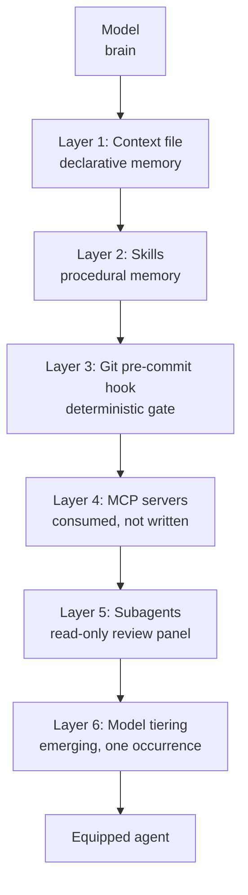
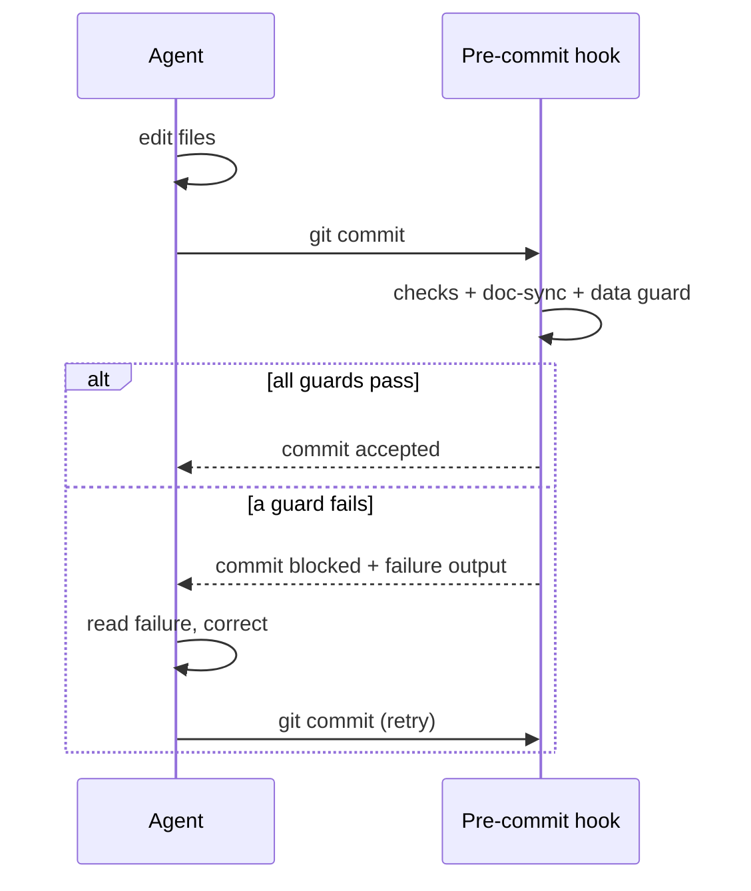
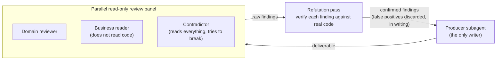

# L'architecture agentique

*Les six couches qui transforment un modèle en agent outillé, passées au verdict du terrain : deux conservées, trois refondues, une émergente.*

Les trois piliers ne sont pas des idées. Ce sont des fichiers, des processus et des points d'extension. Un agent moderne n'est pas un modèle auquel on parle : c'est un modèle entouré d'un harnais technique, et ce harnais vit dans le monorepo décrit au [chapitre 02](./02-vault-and-sources-of-truth.md). Il a six couches.

La première version de ce chapitre décrivait la pile telle qu'elle avait été conçue. Celle-ci la décrit telle qu'elle a été adoptée. Chaque couche porte désormais son verdict : ce que des projets réels en ont fait quand personne ne regardait. Deux couches ont survécu telles quelles. Trois existent sur le terrain sous une autre forme que celle que la v1 enseignait : c'est la forme du terrain qui est documentée ici. La sixième n'a qu'une occurrence.

> **Statut des preuves.** Les verdicts terrain de ce chapitre viennent d'un corpus privé : faits datés, compteurs obtenus par commande, vérifiés par audit interne en trois passes contradictoires. Le lecteur ne peut pas les rejouer ; il peut en revanche vérifier chaque mécanisme décrit ici sur son propre projet.



Les couches s'empilent : chacune ajoute une capacité, et chacune ferme un mode de défaillance précis. Le tableau ci-dessous est le résumé ; les sections qui suivent en sont le détail.

| Couche | Ce que c'est | Défaillance qu'elle évite | Verdict terrain |
|---|---|---|---|
| 1 Fichier de contexte | Mémoire déclarative | L'agent réinvente les conventions | **Conservée** : présente sur tous les terrains |
| 2 Skills | Mémoire procédurale | Réexpliquer une procédure à chaque fois | **Conservée** : copies à l'identique observées |
| 3 Hook git pre-commit | Garde déterministe au commit | Une bonne pratique qui dépend de la mémoire | **Refondue** : la voie réelle est le hook git |
| 4 Serveurs MCP | Accès externe structuré | Des données périmées collées dans les prompts | **Refondue** : on consomme, on n'écrit pas |
| 5 Sous-agents | Panel de relecture read-only | Le producteur qui note sa propre copie | **Refondue** : le pattern réel est le panel |
| 6 Multi-modèles | Modèles ajustés aux rôles | Payer le tarif du jugement pour de la mesure | **Émergent** : une occurrence |

---

## 3.1 La couche mémoire : le fichier de contexte

Un fichier de contexte est chargé automatiquement au début de chaque session de l'agent (par convention `AGENTS.md`, `CLAUDE.md`, ou un index de vault) à la racine du dépôt. C'est le premier pilier rendu opérationnel : la mémoire déclarative.

C'est aussi la couche la plus solide du corpus : chaque terrain observé, sans exception, porte un fichier de contexte racine. Quand une méthode survit à ses auteurs distraits, c'est qu'elle coûte moins cher que son absence.

Deux disciplines décident de son efficacité.

**Le garder maigre.** Tout ce qu'on y met est rechargé à chaque tour et consomme du budget de contexte. N'y écrivez que le transverse et le stable : conventions, commandes, règles d'architecture, interdits permanents. Le détail d'une fonctionnalité vit dans son contrat, pas ici.

**Le stratifier.** Un fichier racine court pointe vers des fichiers spécialisés chargés à la demande. L'agent lit le détail d'un sous-système seulement quand il y travaille.

Un fichier de contexte minimal et stratifié :

```markdown
# Project context

## Commands
- build:  `npm run build`
- test:   `npm test`

## Architecture (cross-cutting only)
- Code is the source of truth for the data schema.
- One feature = one contract in `vault/contracts/`.

## Permanent prohibitions
- Never push without an explicit human go. *(Cause: two unsolicited deploys, 2026-04-02.)*
- Never hand-edit files under `apps/*/src/__generated__/`.

## Going deeper (loaded on demand)
- Backend detail: ./apps/backend/docs/
- Decisions:      ./vault/decisions/
```

Notez la forme des interdits : chacun cite l'incident qui l'a fait naître. Un interdit sans cause est un dogme que la session suivante renégociera ; un interdit daté est une cicatrice que personne ne rouvre. Le gabarit complet est au [chapitre 01](./01-three-pillars.md).

**Quand elle se charge :** au démarrage de la session, à chaque session.
**Défaillance évitée :** l'agent qui réinvente une convention parce qu'il n'a jamais su qu'il en existait une.

---

## 3.2 La couche capacités : les skills

Un skill est un dossier qui encapsule une capacité réutilisable : un fichier d'instructions, parfois des scripts et des gabarits. Le principe clé est la **divulgation progressive** : l'agent ne charge le contenu d'un skill que lorsque la tâche le déclenche. Vous pouvez donc disposer de dizaines de capacités sans saturer le contexte par défaut.

Un skill encode un savoir-faire éprouvé pour ne plus jamais le réexpliquer. C'est de la mémoire *procédurale*, là où le fichier de contexte est de la mémoire *déclarative*.

La couche est vérifiée par l'épreuve la plus exigeante qui soit : la copie. Le skill de balayage des zones grises de ce dépôt a été retrouvé sur un terrain copié à l'identique : un `diff` sans le moindre écart. Les autres skills terrain sont du même genre mais à contenu local : protocoles de livraison maison, procédures éditoriales, commandes de publication. Le pattern est stable : un skill par procédure qu'on en avait assez de réexpliquer.

Un skill minimal est un `SKILL.md` doté d'un frontmatter ; la `description` est le déclencheur, elle mérite plus de soin que le reste :

```markdown
---
name: grey-zone-scan
description: >-
  Run a systematic grey-zone scan of a freshly generated prototype against its
  contract or brief. Use immediately after a prototype generation, and again
  after every iteration pass. Produces a grey-zone ledger.
---

# Grey-Zone Scan

Compare the build to its reference while it is fresh. For every observable
element, ask one question: did the reference specify this explicitly?
Yes → move on. No → record it in the ledger. Zone by zone, state by state,
interaction by interaction. Do not eyeball it: walk the checklist.
```

**Quand il se charge :** quand une tâche correspond à la `description` du skill.
**Défaillance évitée :** réexpliquer une procédure en plusieurs étapes à chaque usage, et la dérive qui vient de l'expliquer un peu différemment chaque fois.

Voir `skills/` dans le dépôt pour les exemplaires complets.

---

## 3.3 La couche garde : le hook git pre-commit

Un hook ne demande rien au modèle. Il s'exécute. C'est ce qui transforme une bonne pratique en *garantie*.

La v1 de ce chapitre plaçait cette garantie dans les hooks de cycle de vie de l'assistant : après chaque édition, avant chaque commit, câblés dans la configuration de l'agent. Le terrain a tranché autrement : aucune configuration d'agent du corpus ne déclare le moindre hook de cycle de vie. La seule matérialisation réelle de cette couche est un **hook git pre-commit**, câblé par `core.hooksPath`, versionné avec le dépôt. C'est donc lui que la méthode documente comme voie principale.

Le déplacement n'est pas un appauvrissement. Le commit est la frontière où le travail devient de l'histoire, et une garde posée à cette frontière a trois propriétés qu'un hook d'assistant n'aura jamais :

- elle est **agnostique de l'outil** : elle tient que le commit vienne de l'agent, d'un humain, ou d'un autre agent que celui prévu ;
- elle est **versionnée avec le code** : clonez le dépôt, câblez une ligne, la garde est là ;
- elle est **incontournable** : on ne « oublie » pas un pre-commit, on le contourne explicitement, et un contournement explicite se voit.

Le câblage tient en une commande, à mettre dans le README du dépôt :

```bash
git config core.hooksPath .githooks
```

Et le pattern terrain est le **dispatcher** : un seul fichier `.githooks/pre-commit` qui appelle chaque garde à tour de rôle. Trois gardes reviennent sur le terrain :

```bash
#!/usr/bin/env bash
# .githooks/pre-commit dispatcher: every guard runs, first failure blocks.
set -euo pipefail

./hooks/run-checks.sh        # tests + lint on staged files
./hooks/doc-schema-sync.sh   # schema changed => canonical docs in same commit
./hooks/no-real-data.sh      # block real domains, emails, dumps in fixtures
```

La première garde est classique. La deuxième applique une règle de méthode : la connaissance et le code voyagent dans le même commit, ou pas du tout (voir `hooks/doc-schema-sync.sh` dans le dépôt). La troisième protège un historique public contre les données réelles : c'est un garde-fou né d'incidents, détaillé au [chapitre 12 : Secrets et PII](./12-secrets-and-pii.md).

La **boucle d'auto-correction** demeure, simplement déplacée au commit : l'agent édite, tente de committer, la garde bloque, l'échec revient à l'agent, l'agent corrige et recommitte.



Les hooks de cycle de vie de l'assistant restent possibles : un formateur post-édition raccourcit la boucle. Traitez-les comme un confort, jamais comme la garantie : rien de critique ne doit dépendre d'un mécanisme qui disparaît quand on change d'outil. La garantie vit au commit.

**Quand elle se charge :** à chaque `git commit`, quel que soit l'auteur.
**Défaillance évitée :** une bonne pratique qui dépend du fait que quelqu'un (humain ou agent) se souvienne de la faire.

La place de ces gardes dans la chaîne complète, y compris côté CI, est au [chapitre CI/CD et hooks](../reference/cicd-and-hooks.md).

---

## 3.4 La couche accès : les serveurs MCP, consommés

Un serveur MCP donne à l'agent un accès structuré à une ressource externe : une base de données, un hébergeur, un outil interne. Au lieu de coller des données dans le prompt, l'agent interroge la source à la demande, à travers un contrat d'outil défini. C'est ce qui le branche au monde réel sans le noyer de contexte.

La v1 enseignait l'écriture d'un serveur maison en TypeScript. Verdict terrain : personne n'en a écrit un. Le seul câblage MCP observé est un fichier `.mcp.json` de projet qui **consomme des serveurs publiés existants**, lancés par `npx` : six serveurs d'un hébergeur, aucune ligne de serveur maison nulle part. L'exemple de serveur que ce dépôt transportait n'a jamais été copié. La méthode en tire la règle :

> **On consomme des serveurs MCP. On n'en écrit pas.** L'écosystème publie déjà des serveurs pour les bases de données, les hébergeurs, les navigateurs, les outils de ticketing. Votre travail est la sélection et le câblage, pas le développement.

Le câblage type :

```json
{
  "mcpServers": {
    "hosting": {
      "command": "npx",
      "args": ["-y", "@example/hosting-mcp"],
      "env": { "HOSTING_API_TOKEN": "${HOSTING_API_TOKEN}" }
    }
  }
}
```

Une règle de sécurité non négociable accompagne ce fichier : il est souvent versionné, donc **aucun token en clair dedans, jamais** : une variable d'environnement, rien d'autre. Le corpus porte un incident réel de token d'accès en clair dans une configuration MCP probablement committée ; le [chapitre 12](./12-secrets-and-pii.md) en fait une garde exécutable.

Écrire un serveur maison redevient légitime dans un cas étroit : la ressource n'a aucun serveur publié, l'accès est sur le chemin critique du projet, et vous acceptez d'en maintenir le code comme n'importe quel code de production. C'est une décision d'investissement, pas un réflexe d'architecture, et elle mérite une décision datée dans le vault.

**Quand elle se charge :** quand l'agent invoque l'un des outils du serveur.
**Défaillance évitée :** les données périmées collées dans un prompt, et le serveur maison mort-né que personne n'utilisera.

---

## 3.5 La couche division du travail : le panel de relecture

Un sous-agent est une instance dédiée à un rôle, avec son propre contexte. La v1 mettait en avant le duo explorateur/éditeur : un lecteur qui synthétise, un éditeur au contexte propre. Ce duo n'a laissé aucune trace sur le terrain. Ce que le terrain a construit, partout où des sous-agents existent, est autre chose et mieux : le **panel de relecture read-only en éventail**.

Le pattern a trois propriétés fixes :

1. **Un seul rôle mute le code.** Le producteur, et personne d'autre, écrit.
2. **Les relecteurs sont read-only et parallèles.** Après une passe de production, un éventail de relecteurs part en parallèle, chacun avec sa lentille : revue technique par domaine, lecture métier qui ne lit pas le code, contradicteur qui lit tout et cherche à casser. Aucun ne peut « corriger en passant » : un relecteur qui édite cesse de relire.
3. **Aucun finding n'est traité sans réfutation.** Les findings bruts du panel passent par une contre-vérification contre le code réel avant d'atteindre le producteur. Les faux positifs sont écartés avec justification écrite ; seuls les findings confirmés déclenchent une correction.



La réfutation n'est pas une politesse : c'est ce qui rend le panel utilisable. Un panel sans réfutation noie le producteur sous des fantômes ; le corpus en donne la mesure sur un chantier (chiffres du corpus privé, voir l'encadré en tête de chapitre) : 45 findings bruts, 32 confirmés, 13 faux positifs écartés avec justification. Sans la passe de réfutation, treize corrections inutiles auraient consommé le budget des dix-neuf vraies.

Le duo explorateur/éditeur reste une économie de contexte raisonnable pour les grandes bases de code, mais c'est une hypothèse, pas un pattern éprouvé. Le panel, lui, est le pattern que le terrain a construit spontanément, sur des projets sans lien entre eux. Quand plusieurs terrains inventent la même structure sans se concerter, la méthode l'écoute.

**Quand elle se charge :** après chaque passe de production, avant toute correction.
**Défaillance évitée :** le producteur qui note sa propre copie, et le flot de faux positifs qui transforme une revue en bruit.

Le protocole complet (rounds, verdicts gradués, règle d'arrêt des deux passes sèches, gel honnête) est au [chapitre 07 : La revue adversariale](./07-adversarial-review.md). La mécanique d'orchestration est dans la [référence Orchestration](../reference/orchestration.md).

---

## 3.6 La couche multi-modèles : un pattern émergent, une occurrence

La v1 présentait un étagement à trois niveaux (chef d'orchestre, bras droit, exécutant) comme une architecture éprouvée. Retrait : aucune trace terrain de cet étagement n'existe dans le corpus. Le défaut observé, partout, est plus simple : **un seul modèle fort pour tout ce qui demande du jugement.**

L'étagement existe sur exactement une occurrence, et elle mérite d'être décrite précisément parce que sa ligne de partage est inattendue. Sur un chantier de reconstruction contre une référence figée, le travail était distribué en quatre rôles :

| Rôle | Charge | Classe de modèle |
|---|---|---|
| **Pilotage produit** | Tient le registre, prépare les gates | Modèle fort |
| **Code** | Seul rôle qui écrit | Modèle fort |
| **Contradicteur** | Conteste tout ; doit motiver même un « rien à signaler » | Modèle fort |
| **Recette** | Mesure mécanique répétable : comparaison pixel, contrastes, parcours clavier | Modèle inférieur |

Un seul rôle descend d'un modèle : la recette. La ligne de partage n'est ni l'importance ni le volume : la recette est décisive, c'est elle qui ferme les paliers. La ligne de partage est **jugement contre mesure** : un rôle descend quand sa réussite se vérifie par une mesure répétable, sans interprétation. Tout ce qui juge reste sur le modèle fort.

La règle d'engagement qui fait tenir la topologie mérite d'être citée :

> **Un palier n'est jamais clos par celui qui l'a construit.**

C'est la même hygiène que le panel de la couche 5, portée au niveau du plan : le constructeur livre, un autre rôle mesure, et la clôture appartient à celui qui mesure, jamais à celui qui a intérêt à ce que ce soit fini.

Statut honnête : **une occurrence n'est pas un canon.** Ce chapitre la publie comme pattern émergent : une topologie observée une fois, cohérente avec le reste de la méthode, à confronter à vos propres chantiers. En attendant d'autres occurrences, le choix sûr reste le défaut du terrain : un modèle fort partout, et ne faire descendre que ce dont la réussite se mesure.

**Quand elle se charge :** à la conception du plan d'exécution, quand les rôles sont castés.
**Défaillance évitée (visée) :** payer le tarif du jugement pour du travail de mesure, sans jamais confier de jugement à un modèle qui n'en a pas les moyens.

---

## Les six couches ensemble

Aucune couche prise seule ne rend un agent fiable. Le fichier de contexte sans garde au commit, c'est de la mémoire sans application. Une garde sans contrat n'impose rien de significatif. MCP sans panel inonde un seul contexte de données externes que personne ne contre-vérifie. L'architecture, c'est la *pile*, et la pile se projette directement sur les trois piliers :

- Les couches 1-2 (fichier de contexte, skills) construisent le pilier **mémoire**.
- La couche 3 (hook pre-commit) et les interdits de la couche 1 construisent le pilier **garde-fous** ; la couche 5 (panel) en est l'extension au moment de la livraison.
- Le pilier **contrat** est en amont des six : c'est ce que les couches servent.

La v2 de cette pile est plus modeste que la v1 : deux couches conservées, trois refondues sur ce que le terrain a réellement construit, une rétrogradée au rang d'observation. Elle est aussi plus dure : chaque couche restante a survécu à des projets réels, ce qui est la seule autorité qu'une méthode puisse revendiquer.

## Voir aussi

- [Chapitre 01 · Les trois piliers](./01-three-pillars.md)
- [Chapitre 02 · Le vault et les sources de vérité](./02-vault-and-sources-of-truth.md)
- [Chapitre 07 · La revue adversariale](./07-adversarial-review.md)
- [Chapitre 12 · Secrets et PII](./12-secrets-and-pii.md)
- [Référence · CI/CD et hooks](../reference/cicd-and-hooks.md)
- [Référence · Orchestration](../reference/orchestration.md)
