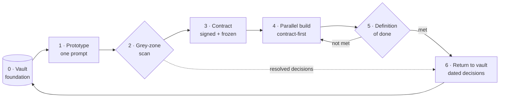
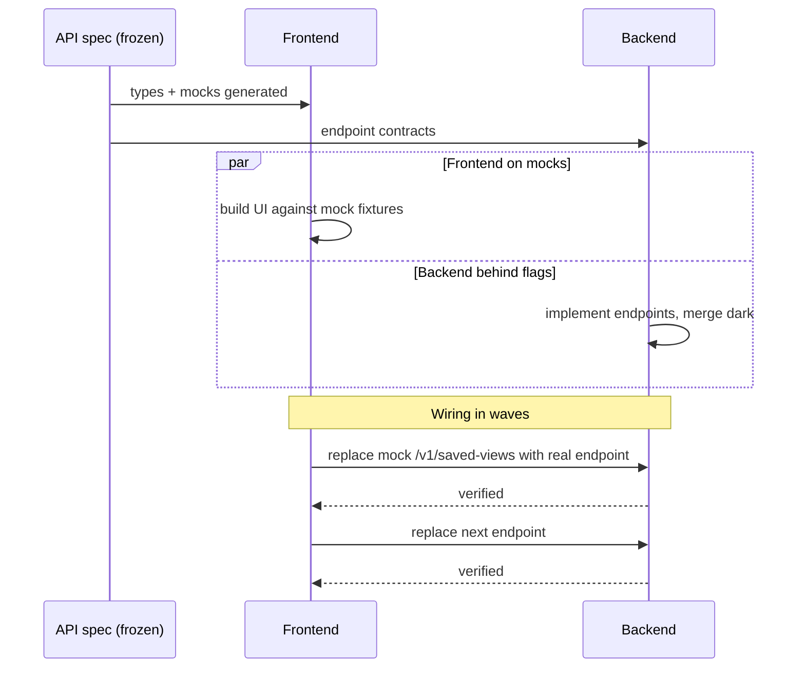

# La chaîne de livraison

*D'un dépôt vide à la production, en sept étapes qui rebouclent sur leur point de départ, avec un interdit dur, et deux variantes assumées par écrit.*

La chaîne de livraison est le cœur de Mainstay. C'est une boucle : la connaissance nourrit un prototype, le prototype est balayé, un contrat est signé, front et back avancent en parallèle, une definition of done par couche valide le résultat, et les décisions qui ont émergé retournent à la connaissance, de sorte que la fonctionnalité suivante démarre plus riche.



Chaque étape a des entrées, des sorties, une discipline qui la fait fonctionner, et une métrique qu'elle peut produire. Un mot honnête sur ces métriques : ce sont des instruments **proposés, non éprouvés** : aucun terrain du corpus ne les a collectées en tant que telles. Elles restent dans les tables parce qu'elles disent où regarder, pas parce qu'elles ont fait leurs preuves (voir la [référence métriques](../reference/metrics.md)).

Ce chapitre déroule les sept étapes, nomme l'interdit qui tient toute la chaîne, puis documente deux situations où la chaîne plie sans casser : le **contrat sans prototype** (outillage interne) et le **design greffé sur l'existant** (triage REEL / GREFFE / NEUF).

---

## Étape 0 : Le vault, socle de tout

Avant la première ligne de code de fonctionnalité, le vault existe dans le monorepo : design system, conventions, décisions, contraintes.

| | |
|---|---|
| **Entrées** | Connaissance projet antérieure, design system, conventions maison |
| **Sorties** | Un vault peuplé que l'agent peut lire |
| **Discipline** | La connaissance vit dans le monorepo, versionnée avec le code ([chapitre 02](./02-vault-and-sources-of-truth.md)) |
| **Métrique** | Couverture du vault : quelle part d'une nouvelle fonctionnalité a déjà sa réponse |

Un vault pauvre produit des agents qui hésitent ; un vault riche produit des agents qui tranchent juste. L'étape 0 n'est pas une phase que l'on termine : c'est le plancher sur lequel toutes les étapes suivantes se tiennent, et l'étape 6 ne cesse de le relever.

---

## Étape 1 : Le prototype, en un seul prompt

Le prototype sort d'une seule génération.

> **Un prompt = un prototype.**

Si l'agent ne livre pas un écran utilisable en une passe, ce n'est pas lui qui a échoué : c'est le brief en amont qui était flou. Le nombre d'itérations est une mesure directe de la qualité du brief. C'est le diagnostic le plus important de toute la chaîne : un écran qui a demandé cinq prompts vous dit que le brief avait cinq trous.

À l'intérieur de cette génération unique, on demande deux à quatre passes internes solides :

1. **Structure** : disposition, zones, hiérarchie des composants.
2. **Implémentation** : contenu réel, états, interactions raccordées.
3. **Polish et responsive** : espacements, typographie, points de rupture.
4. **Vérification cross-viewport** : l'agent contrôle sa propre sortie.

| | |
|---|---|
| **Entrées** | Le brief + le vault |
| **Sorties** | Un écran de prototype fonctionnel et utilisable |
| **Discipline** | Un prompt ; des passes internes ; pas de régénération par morceaux |
| **Métrique** | Itérations par écran (cible : 1) |

Le prompt qui produit le prototype est lui-même un contrat (voir le [chapitre 06 : Le prompt comme contrat](./06-prompt-as-contract.md)). Le prompt de prototype de l'exemple fil rouge est dans `examples/walkthrough/01-prototype-prompt.md`.

---

## Étape 2 : La validation par zones grises

On compare le prototype au brief initial, point par point, à chaud. Pour chaque élément observable, une seule question : *le brief le demandait-il explicitement ?* Si oui, on passe. Si non, c'est une **zone grise** : une décision prise par défaut par l'agent.

| | |
|---|---|
| **Entrées** | Le prototype + le brief initial |
| **Sorties** | Un registre des zones grises ; chaque entrée routée vers une décision ou une note de contrat |
| **Discipline** | Balayage systématique : zone par zone, état par état ; rebalayage après chaque passe |
| **Métrique** | Taux de zones grises (zones grises trouvées par écran) |

C'est l'étape que presque personne ne fait, et celle qui rapporte le plus. Le [chapitre 05 : Les zones grises et la divergence](./05-grey-zones-and-divergence.md) en donne le protocole complet. Le balayage rempli pour l'exemple fil rouge est `examples/walkthrough/02-grey-zone-scan.md`.

---

## Étape 3 : Le contrat

Le prototype validé devient un contrat signable. Le contrat ajoute aux pixels tout ce que les pixels ne montrent pas : endpoints, permissions, états d'erreur, transitions, règles, données de test.

Deux signatures sont requises : **produit et technique**. Sans les deux, on ne fige pas.

La double signature tue un piège précis et coûteux : « validé côté UX, découvert infaisable côté performance deux semaines plus tard ». Le produit signe que le comportement est juste ; la technique signe qu'il est constructible tel que spécifié. Un contrat figé sans la signature de la technique est un contrat qui cache sa propre infaisabilité.

| | |
|---|---|
| **Entrées** | Le prototype validé + le registre des zones grises résolu |
| **Sorties** | Un contrat figé et doublement signé dans `vault/contracts/` |
| **Discipline** | Pas de gel sans les deux signatures ; `status: frozen` posé explicitement |
| **Métrique** | Délai du contrat : du brief au contrat figé |

```yaml
---
type: contract
screen: "saved-views-panel"
version: "1.0"
status: frozen
signed_product: true
signed_engineering: true
frozen_on: 2026-05-18
related_decisions: [DEC-007, DEC-011]
---
```

La structure du contrat est au [chapitre 01](./01-three-pillars.md) ; le contrat rempli pour l'exemple fil rouge est `examples/walkthrough/03-contract.md`.

---

## Étape 4 : L'implémentation parallèle, en contract-first

> **Rien n'est construit tant que le contrat concerné n'est pas figé.**

Cet interdit est dur, et il vient du terrain : sur une fintech à deux signataires comme sur un produit en binôme multi-dépôts, il est écrit dans le fichier de contexte de l'agent : la phase de cadrage n'y est pas négociable, et une construction entamée sans gel s'arrête, quel que soit son avancement. Notez l'adjectif : le contrat *concerné*. L'interdit ne sérialise pas le projet : deux lots avancent en parallèle, chacun derrière son propre gel. Il interdit une seule chose : coder contre une cible qui bouge encore. Tout ce que promet la suite de la chaîne (le parallélisme de cette étape, la DoD binaire de la suivante) repose sur une cible immobile ; construire avant le gel, c'est réintroduire la cible mobile et repayer les quinze bombes à l'intégration.

Front et back avancent donc **en parallèle**, sur le même contrat. Le mécanisme est le **contract-first** :

1. La **spec d'API versionnée est figée en premier**. Elle devient la vérité technique partagée. (`examples/walkthrough/04-api-spec.yaml`.)
2. Le **front démarre sur des mocks** dérivés du contrat, avec des types générés depuis la spec, sans attendre une ligne de back. (`examples/walkthrough/05-mocks/`.)
3. Le **back avance derrière des feature flags**, fusionnable en production avant que le front ne soit prêt.
4. Les deux sont raccordés par **raccord par vagues**, endpoint par endpoint : un remplacement progressif et vérifiable de chaque mock par son endpoint réel, pas une phase finale risquée.



On ne séquence jamais back puis front. Séquencer sérialise un projet que le contrat a rendu parallélisable.

| | |
|---|---|
| **Entrées** | Le contrat figé + la spec d'API figée |
| **Sorties** | Front et back implémentés, raccordés vague par vague |
| **Discipline** | Rien avant le gel ; spec figée en premier ; front sur mocks ; back derrière flags ; raccord par vagues |
| **Métrique** | Vélocité : endpoints raccordés par unité de temps |

---

## Étape 5 : La definition of done, par couche

« Presque fait » n'existe pas. La definition of done se vérifie par couche.

**Contrat fait :** toutes les sections renseignées, double signature, `status: frozen`.

**Back fait :** code écrit ; tests qui passent ; spec d'API à jour ; intégration vérifiée contre un stub ; performance mesurée sur un volume de données réaliste.

**Front fait :** tous les états implémentés ; tous les endpoints consommés ; cas d'erreur gérés ; permissions respectées ; conforme au pixel par rapport au prototype.

| | |
|---|---|
| **Entrées** | La fonctionnalité implémentée |
| **Sorties** | Une checklist de DoD par couche entièrement cochée |
| **Discipline** | Binaire : une couche est faite ou elle ne l'est pas ; pas de demi-crédit |
| **Métrique** | Taux de réussite de la DoD à la première revue |

Chaque case cochée est une affirmation, et une affirmation se prouve : la vérification par couche est affaire de mesure sur le vrai chemin de code, pas de déclaration (voir le [chapitre 08 : La preuve et les sondes](./08-proof-and-probes.md)). Et une DoD entièrement cochée ne vaut **pas** autorisation de mise en production : le go est un rituel distinct, humain et explicite (voir le [chapitre 09 : La gate de mise en production et le registre](./09-release-gate-and-registry.md)).

La DoD remplie pour l'exemple fil rouge est `examples/walkthrough/07-definition-of-done.md`. Si une couche n'est pas faite, la chaîne reboucle vers l'étape 4 : c'est l'arête `not met` du schéma.

---

## Étape 6 : Le retour au vault

Les décisions qui ont émergé (du balayage des zones grises, de la construction) retournent au vault sous forme de décisions datées (`DEC-XXX`).

| | |
|---|---|
| **Entrées** | Les décisions prises pendant les étapes 2-5 |
| **Sorties** | De nouvelles notes `DEC-XXX` dans `vault/decisions/` ; des concepts mis à jour |
| **Discipline** | Chaque décision historisée avant que la fonctionnalité ne soit considérée close |
| **Métrique** | Décisions capturées par fonctionnalité (un indicateur de l'apprentissage conservé) |

La fonctionnalité suivante démarre avec un contexte plus riche. L'infrastructure devient plus intelligente à chaque cycle. C'est la boucle qui se referme : l'étape 6 nourrit l'étape 0.

Une note de décision pour l'exemple fil rouge (`examples/walkthrough/06-decision-DEC-007.md`) :

```yaml
---
type: decision
id: DEC-007
date: 2026-05-14
status: accepted
supersedes: null
---
```

```markdown
# DEC-007: Default-view behaviour

## Context      Grey-zone scan on saved-views-panel: the brief did not say
                what happens when a user marks a second view as default.
## Decision     Marking a view as default clears the default flag on any
                other view; exactly zero or one default per user.
## Justification A single default keeps the load behaviour deterministic.
## Consequences Contract §9 gains a rule; API adds POST /v1/saved-views/{id}/default.
```

---

## La variante assumée : le contrat sans prototype

La chaîne telle que décrite suppose un écran. L'outillage interne n'en mérite pas toujours un : un agent de recette, un générateur, un pipeline que seuls les opérateurs du chantier verront. Pour ces livrables, une fintech du corpus a consigné un **précédent de méthode explicite**, invoqué deux fois : le contrat s'écrit directement, sans prototype.

La variante est une application directe de la variable de dosage : **propriété du code × coût de l'erreur**. Le prototype paie quand quelqu'un doit *voir juste* avant de construire : un client, un utilisateur, un signataire produit qui juge sur pixels. Sur un outil interne, code possédé, dont l'erreur se corrige en re-livrant à soi-même, ce rendement s'effondre ; celui du contrat, lui, reste entier.

Ce qui saute et ce qui tient :

| | |
|---|---|
| **Saute** | L'étape 1 (prototype) et le balayage sur pixels de l'étape 2 |
| **Se déplace** | Le balayage des zones grises se fait sur le texte du contrat, section par section : les silences d'une spec sont des zones grises au même titre que les pixels non demandés |
| **Tient, intégralement** | Le contrat, ses deux signatures, son gel ; et l'interdit de l'étape 4, *plus* fort qu'ailleurs : sans prototype, le contrat est la seule référence qui existe |

Une condition rend la variante légitime, et une seule : **elle est écrite.** Sur le terrain d'origine, le contrat direct sans prototype est consigné comme précédent de méthode, nommé comme tel, opposable aux chantiers suivants. La même économie faite en silence n'est pas une variante : c'est une dérive. La différence entre les deux tient en une ligne datée dans le vault.

---

## Le design greffé sur l'existant : REEL, GREFFE, NEUF

Deuxième situation où la chaîne plie : livrer un module qui doit s'insérer dans un site déjà en production, avec son design déjà établi. Le canon fait du prototype validé la vérité visuelle. Ici, cette hypothèse casse : **la vérité visuelle, c'est le site réel**, et un prototype interne, si beau soit-il, est un candidat à la contamination. Le dispositif qui suit vient d'un terrain du corpus : un vault d'audit posé sur la plateforme d'un client, où chaque écran livré devait sembler natif.

### Le triage

Chaque écran du périmètre est classé dans exactement une de trois classes :

| Classe | Quand | La référence visuelle | Le risque à surveiller |
|---|---|---|---|
| **REEL** | L'écran existe sur le site réel et convient | La capture de l'écran réel | Le « pendant qu'on y est » : l'agent améliore un écran qu'on lui demandait de reprendre tel quel |
| **GREFFE** | Le contenant existe (chrome, navigation, gabarit), le contenu est neuf | La capture du contenant réel + le brief du contenu | Un intérieur qui jure avec son cadre : deux styles dans le même écran |
| **NEUF** | Aucun équivalent n'existe | La charte + le contrat | Un écran qui a l'air de venir d'un autre site |

Le triage précède tout prototype : il décide, écran par écran, *ce qui a le droit d'être dessiné*. Un écran REEL n'entre jamais à l'étape 1 : il n'y a rien à générer, seulement à reprendre. Un écran GREFFE n'y entre que pour son intérieur. Seul le NEUF parcourt la chaîne canonique entière.

### Le registre de bascules

Un classement n'est pas un verdict : c'est une hypothèse de travail, réversible par construction. Les écrans changent de classe à mesure que la compréhension du site réel s'affine, et c'est prévu. La discipline n'est pas d'interdire la bascule ; elle est de la **journaliser**. Le registre des écrans tient, pour chaque bascule, deux pièces : la capture qui l'a motivée, et la phrase du décideur qui l'a tranchée.

Sur le terrain d'origine, un même écran a changé deux fois de classe en deux jours (greffe, neuf, puis greffe à nouveau), chaque bascule tracée avec sa capture et sa citation. Coût de l'aller-retour : nul, précisément parce qu'il était écrit. Une bascule non tracée, en revanche, est une zone grise à l'échelle d'un écran entier : quelqu'un a changé la nature d'un livrable, et personne ne sait ni qui, ni quand, ni pourquoi.

### Le kit de soumission design anti-contamination

Quand le travail de design est confié à un agent design dédié (une session séparée, sans le contexte du chantier), on lui transmet un **paquet de soumission auto-portant** :

1. **Un ordre de mission avec la hiérarchie des sources de vérité**, dans l'ordre : les captures du site réel, puis les briefs par écran, puis les contrats, puis la charte. En cas de conflit, la source la plus haute gagne.
2. **Une étape 0 bloquante** : regarder les captures du vrai site avant toute production. L'agent qui ne peut pas les ouvrir s'arrête : il ne produit pas « de mémoire ».
3. **Des interdits nominatifs** : les valeurs de démonstration proscrites sont listées une à une. Pas « évitez les placeholders » : la liste.
4. **L'exclusion volontaire du prototype interne.** Le proto est retiré du paquet. C'est le geste contre-intuitif du kit, et le plus important : un agent qui voit un prototype le recopie : c'est sa pente naturelle. Sur un design greffé, recopier le proto interne, c'est précisément rater la cible, qui est de se fondre dans le site réel. Le canon fait du prototype la source de vérité ; ici, on organise sa **mise en quarantaine**.

### Quand la hiérarchie pivote : par écrit

Le même terrain porte la fin de l'histoire, et sa leçon. Une fois les prototypes du chantier design finalisés et validés, une règle écrite et datée a inversé la hiérarchie locale : les protos finalisés priment désormais sur le vault, qui s'aligne. Et le même terrain consigne son entorse à l'interdit de ce chapitre : aucun contrat n'y a jamais atteint `status: frozen` : d'abord parce que la passe d'audit interdisait tout gel, ensuite parce que la vérité avait pivoté vers les protos finalisés. La chaîne y a tenu par une autre référence figée : les captures, puis les protos validés.

La leçon n'est pas que la hiérarchie des sources de vérité est sacrée. C'est qu'elle peut pivoter : **par règle datée, jamais par attrition** ([chapitre 02 : Le vault et les sources de vérité](./02-vault-and-sources-of-truth.md)). L'inversion n'était pas le scandale ; le silence l'aurait été.

*Les faits de terrain de ce chapitre (interdits, précédents, bascules) proviennent d'un corpus privé : faits datés, vérifiés par audit interne en trois passes contradictoires, non rejouables par le lecteur (voir la [préface](../00-preface.md)).*

---

## Pourquoi la boucle compte

Un processus linéaire livre une fonctionnalité. Une boucle livre une fonctionnalité *et* laisse l'infrastructure meilleure qu'elle ne l'a trouvée. Faites tourner la chaîne une fois, le gain est un écran. Faites-la tourner sur l'ensemble d'un projet et l'étape 0 n'est plus jamais vide : chaque fonctionnalité hérite des décisions, des contrats et des conventions de toutes les fonctionnalités qui l'ont précédée. Cette composition est le retour sur la discipline.

## Voir aussi

- [Chapitre 02 · Le vault et les sources de vérité](./02-vault-and-sources-of-truth.md)
- [Chapitre 05 · Les zones grises et la divergence](./05-grey-zones-and-divergence.md)
- [Chapitre 06 · Le prompt comme contrat](./06-prompt-as-contract.md)
- [Chapitre 08 · La preuve et les sondes](./08-proof-and-probes.md)
- [Chapitre 09 · La gate de mise en production et le registre](./09-release-gate-and-registry.md)
- [Profil P · Produit en construction](../profiles/product-build.md)
- [Profil R · Run & audit](../profiles/run-and-audit.md)
