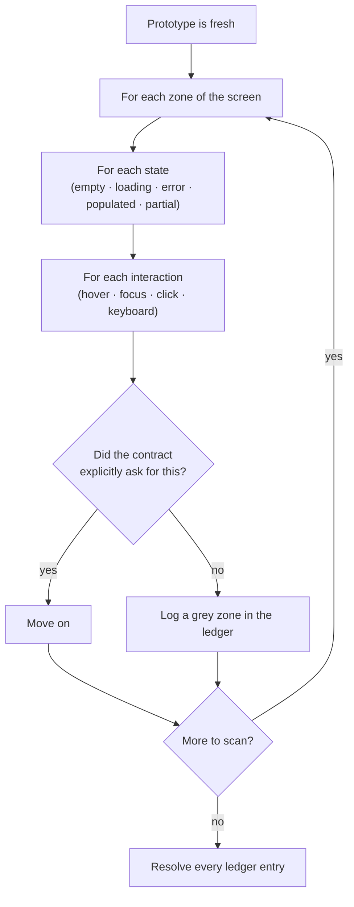
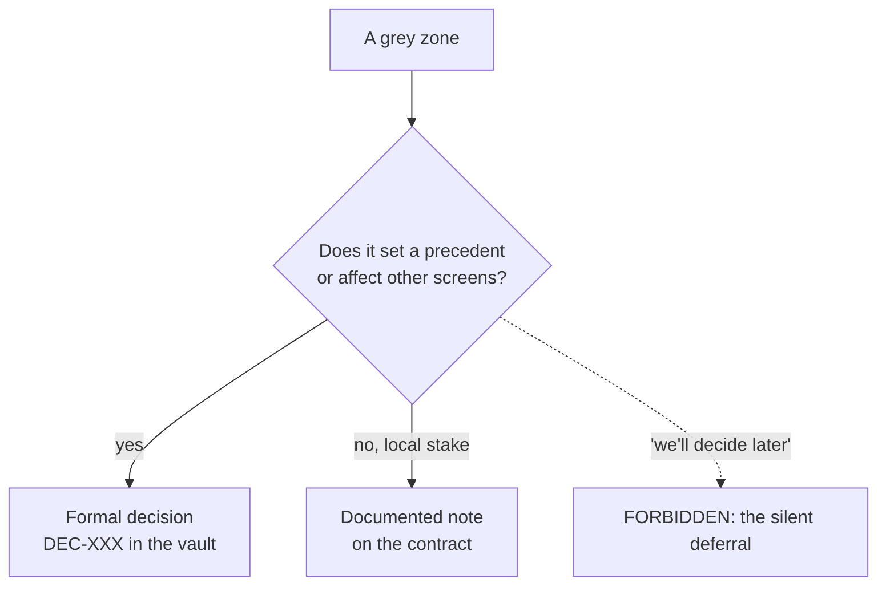

# Zones grises et divergence

*Une zone grise est une décision que l'agent a prise par défaut, dans l'ombre, sans autorité pour la prendre. Les trouver est le cœur de la méthode ; les résoudre est ce que même les registres bien tenus oublient.*

C'est le cœur de Mainstay, et la partie que presque personne ne fait. Ce chapitre donne le protocole de détection et les issues valides, puis ce que le terrain a appris en appliquant le protocole : les formes réelles du registre, l'héritage des zones grises entre dépôts, l'artefact jumeau qui apparaît quand on reconstruit contre une référence figée, et le compteur qui empêche un registre de devenir un cimetière.

> Les faits de terrain cités dans ce chapitre viennent d'un corpus privé : faits datés, compteurs obtenus par commande, vérifiés par audit interne en trois passes contradictoires. Ils ne sont pas rejouables par le lecteur.

## Définition

Une zone grise, c'est tout ce que l'agent a tranché de lui-même parce que ni le prototype ni le contrat ne le précisaient.

Ce n'est ni une erreur ni une bonne réponse. C'est une décision prise **par défaut, dans l'ombre, par quelqu'un qui n'avait pas autorité pour la prendre** : un état vide rempli à la façon de l'agent, un comportement de survol inventé, un ordre de tri choisi arbitrairement, un message d'erreur que personne n'a validé, une permission supposée. Aucun de ces choix n'est « faux ». Chacun est un choix que quelqu'un avec autorité (produit, design, technique) aurait dû faire, et n'a pas fait, alors l'agent l'a fait à sa place. Le danger n'est pas le choix. Le danger, c'est que **personne ne sait que le choix a été fait.**

L'orthographe britannique « grey » est employée délibérément et systématiquement dans tout Mainstay : c'est un terme forgé par la méthode, pas de la prose ordinaire. En français, on dit « zone grise ».

## Pourquoi c'est le mode de défaillance coûteux

Un bug s'annonce : quelque chose est visiblement cassé. Une zone grise se cache : l'écran *a l'air* fini. C'est une décision silencieuse qui fait surface des semaines plus tard, à l'intégration, quand quinze d'entre elles explosent ensemble.

> Quinze zones grises non résolues, ce sont quinze bombes qui explosent ensemble à l'intégration.

L'agglomération est structurelle. Chaque zone grise est un écart entre ce qui a été spécifié et ce qui a été construit. Les écarts ne bloquent pas la construction (l'agent les a comblés), donc la construction se poursuit et les écarts s'accumulent. Ils ne sont découverts que lorsque quelque chose d'*externe* (une seconde intégration, un vrai utilisateur, un test de charge) sonde l'hypothèse. À ce moment-là, ils sont nombreux, et ils sont chers.

Tout l'enjeu du protocole est de déplacer cette découverte **en avant dans le temps**, vers l'instant où le prototype est à chaud et où une zone grise coûte une phrase à résoudre.

## Le protocole de détection

On compare le produit au brief initial, à chaud. Pour chaque élément observable, exactement une question :

> Le contrat le demandait-il explicitement ?

- **Oui** → on passe.
- **Non** → c'est une zone grise.

Le balayage est **systématique** : zone par zone, état par état, interaction par interaction. « Systématique » n'est pas un ton ; c'est une exigence de couverture. On ne balaie pas les parties qui attirent l'œil. On parcourt une grille.



La grille de balayage (passez la question sur chaque cellule) :

| Dimension | Cellules à parcourir |
|---|---|
| Zones | En-tête, liste/contenu, panneau latéral, pied de page, modales |
| États | Vide, chargement, partiel, peuplé, erreur, succès |
| Interactions | Survol, focus, clic, clavier, glisser, appui long |
| Données | Min, max, débordement, champs manquants, chaînes très longues |
| Permissions | Chaque rôle : ce qui est visible, activé, désactivé, masqué |

Et parce que chaque passe d'itération *crée de nouvelles zones grises* (l'agent qui peaufine prend de nouvelles micro-décisions), **on rebalaye après chaque passe**. Un seul balayage à la fin manque tout ce que les passes de finition ont introduit.

## Les deux issues et le sort du report

Chaque zone grise détectée avant le gel du contrat se résout en exactement l'une de deux issues.

**Une décision formelle.** Consignée dans le vault, datée, justifiée : elle devient une règle. Utilisez-la quand le choix crée un précédent ou a des conséquences au-delà de cet écran. Elle devient une `DEC-XXX` (voir le [chapitre 02 : Le vault et les sources de vérité](./02-vault-and-sources-of-truth.md)).

**Une décision documentée notée sur le contrat.** Consignée comme une note dans le contrat lui-même. Utilisez-la quand l'enjeu est local : le choix compte pour cet écran et nulle part ailleurs.



Les deux issues valides partagent une propriété : après l'une comme l'autre, la zone grise n'est plus un choix silencieux. C'est un choix *visible* (dans le vault ou sur le contrat) que quelqu'un avec autorité peut revoir, accepter ou renverser. C'est l'objectif tout entier : rendre la décision invisible visible.

Ce que l'on ne fait jamais, c'est le report *silencieux* : « on tranchera plus tard », sans date, sans propriétaire. La v1 de la méthode en faisait un interdit absolu. Le terrain l'a amendé : il existe une forme de report qui n'est pas silencieuse, et elle est encadrée plus bas, dans le registre d'écarts. Mais avant le gel du contrat, l'amendement ne s'applique pas : un contrat ne se fige pas au-dessus d'une ligne ouverte.

## Le registre des zones grises et ses formes de terrain

Chaque zone grise détectée obtient une ligne dans un **registre des zones grises**, tenu à côté du contrat pendant les étapes 2-3 de la [chaîne de livraison](./04-delivery-chain.md). La forme canonique est une table :

| ID | Observé | Zone / état | Question | Issue | Résolution |
|---|---|---|---|---|---|

Le gabarit est [`templates/grey-zone-ledger.md`](../../../templates/grey-zone-ledger.md) ; un registre rempli pour l'exemple fil rouge (fictif) `saved-views-panel` est [`examples/walkthrough/02-grey-zone-scan.md`](../../../examples/walkthrough/02-grey-zone-scan.md). Lisez-le comme une liste de travail : la fonctionnalité n'est pas prête pour le contrat tant que chaque ligne n'a pas une issue et une résolution. Le nombre de lignes par écran est le taux de zones grises ([métriques](../reference/metrics.md), instrument proposé, non éprouvé) ; un taux élevé n'est pas une honte, cela veut dire que le balayage a fonctionné. Un taux nul signifie généralement que le balayage a été sauté.

Le canon prescrit la table. Le terrain, lui, a produit quatre formes, toutes défendables, chacune avec son coût :

| Forme | Vue sur | Quand elle convient | Ce qu'elle coûte |
|---|---|---|---|
| Table markdown à côté du contrat (forme canonique) | Un e-commerce hérité en production (dix entrées, chacune reliée à un contrat ou une décision) ; un produit en binôme multi-dépôts (vingt-cinq entrées, passes de balayage datées, arbitrages tracés) | La chaîne canonique, un écran à la fois | Rien : c'est la forme par défaut, versionnée avec le code |
| Classeur trié, numérotation par domaine, priorités P0/P1/P2 arbitrées par le PO | Une fintech (treize classeurs de zones grises) | Volume élevé, arbitrage par un PO non technicien, besoin de tri et de filtres | L'artefact sort du git : plus de diff, plus d'historique ; la synchronisation avec le vault devient un rituel à part |
| Famille de registres, un par écran, dans le dossier des contrats | Un vault d'audit sur la plateforme d'un client (quinze registres, 312 entrées comptées par commande) | Chantier à écrans nombreux ; le comptage par commande devient possible | Le volume masque la stagnation (voir le compteur de résolution) |
| Escalade inline « bloquer et demander », sans registre | Une feature pilote sur un SaaS (règle écrite : ne devine pas le schéma de données, demande-le) | Chantier court, une seule tête, code possédé | Sans trace, l'arbitrage se perd : sur ce même terrain, deux fichiers donnaient deux valeurs différentes à un même compteur, et la divergence n'a jamais été arbitrée |

Le format est libre. L'invariant ne l'est pas : **aucun écart entre le brief et le réalisé ne se tranche en silence.** Tout écart passe par un registre, ou par une question qui bloque la construction jusqu'à la réponse. La forme canonique « deux issues seulement » est tenue telle quelle sur trois terrains ; partout ailleurs elle est réincarnée ou amendée *par écrit*, jamais abandonnée par attrition.

## L'héritage nominal entre dépôts

Quand un produit vit dans plusieurs dépôts, les zones grises ne respectent pas les frontières de dépôt : une question sur la strate de données commune concerne tous les dépôts qui la consomment.

Sur un produit en binôme multi-dépôts (deux dépôts possédés, plus un backend tenu par le développeur partenaire et hors de portée), chaque dépôt tient son propre registre, et le registre du second dépôt n'a pas recopié les questions communes : il a **hérité nominalement** cinq entrées du premier, même identifiant, origine citée, statut vivant. Les règles qui en sortent :

- **L'héritage est nominal.** Une zone grise héritée garde son identifiant d'origine et cite son registre source. On ne la renumérote jamais : deux numéros pour une même question, ce sont deux réponses possibles.
- **La résolution appartient au registre d'origine.** Le dépôt héritier lit le statut ; il ne le modifie pas. Une seule autorité de résolution par question, où que la question soit lue.
- **Une zone grise héritée peut geler une phase entière.** Sur ce terrain, une phase du dépôt aval est restée « gelée » tant que quatre entrées héritées n'étaient pas tranchées. C'est le comportement voulu, pas un blocage subi : la construction ne comble pas les vides de l'amont.
- **L'autorité peut être de l'autre côté de la frontière.** Une entrée propre au dépôt aval a été tranchée par le développeur partenaire, parce que la frontière technique concernée relevait de son autorité. Le registre consigne *qui* a tranché, pas seulement quoi.

L'héritage nominal est la version zones-grises d'un principe plus général du multi-dépôts : une vérité par question, des références partout ailleurs (voir le [chapitre 02](./02-vault-and-sources-of-truth.md)).

## Le registre d'écarts : l'artefact jumeau

Tout ce qui précède suppose qu'on construit du neuf contre un brief. Le terrain a rencontré l'autre situation : reconstruire un site contre une **référence figée** : un prototype déclaré vérité, au pixel près. La question du balayage change alors de nature. Ce n'est plus « le contrat le demandait-il ? » ; c'est « la reconstruction fait-elle la même chose que la référence, et sinon, l'écart est-il voulu ? »

Cette situation a produit un artefact jumeau du registre des zones grises : le **registre d'écarts**. Même squelette (des lignes numérotées, une question par ligne, des arbitrages routés vers l'humain qui a autorité), mais un objet différent :

| | Registre des zones grises | Registre d'écarts |
|---|---|---|
| Objet | Des décisions prises dans l'ombre, faute de spec | Des divergences *mesurées* contre une référence figée |
| Question | Le contrat le demandait-il explicitement ? | La référence fait-elle pareil, et l'écart est-il voulu ? |
| Moment | Étapes 2-3, avant le gel du contrat | Toute la reconstruction, la référence étant déjà gelée |
| Issues | Deux : décision formelle ou note de contrat | Quatre statuts : assumé · corrigé · à arbitrer · report daté |

Les quatre statuts :

- **Assumé** : la divergence est conservée et justifiée par écrit. La règle de terrain qui a fondé ce statut : *on ne répare pas ce que la référence ne fait pas.* Une reconstruction n'est pas une occasion d'améliorer en douce ; « mieux que la référence » est un écart comme un autre.
- **Corrigé** : la divergence est réparée, et la correction **re-mesurée dans les mêmes conditions** que la mesure qui l'avait détectée (voir le [chapitre 07 : La revue adversariale](./07-adversarial-review.md)).
- **À arbitrer** : la divergence est routée nominativement vers l'humain qui a autorité et tenue ouverte, visible en tête de registre, tant qu'il n'a pas tranché. Les arbitrages rendus portent la date et le nom du décideur.
- **Report daté** : la divergence est renvoyée à une passe future. C'est l'amendement à l'interdit, et il est encadré :

> **Le report daté : l'amendement à l'interdit**
>
> La v1 de ce chapitre interdisait toute troisième issue : « on tranchera plus tard » n'existait pas. Le terrain a amendé la règle par écrit, et l'amendement est plus précis que l'interdit. Ce qui est interdit, c'est le report *silencieux*. Un report est légitime si, et seulement si, quatre conditions tiennent :
>
> 1. **Daté** : rattaché à une passe future nommée, avec une échéance ; pas « plus tard », une date.
> 2. **Arbitré** : le report lui-même est une décision, prise par quelqu'un qui a autorité, pas un défaut d'attention.
> 3. **Nominatif** : le registre consigne qui a décidé le report et qui le portera.
> 4. **Compté** : la ligne reste dans le registre et dans le compteur de résolution ; un report n'est pas une sortie.
>
> La différence tient en une phrase : un report encadré est une décision de séquencement ; « plus tard » sans date est une absence de décision. Le premier est du pilotage. Le second reste la troisième issue, et il reste interdit.

Sur son terrain d'origine, le registre d'écarts agrège aussi les findings de la revue adversariale, avec leurs mesures avant/après re-jouées, et les mesures de fidélité par vue. Et le verdict de fidélité s'y rend sur la *forme* des zones divergentes, pas sur le pourcentage seul : quelques pixels sur un élément animé sont un faux positif ; un bloc de texte décalé est un vrai écart, même s'il pèse moins de pixels.

Statut épistémique : le registre d'écarts a **une occurrence terrain**. C'est un pattern émergent, publié comme tel : prescrit parce qu'il a résolu un vrai problème une fois, et qu'aucun autre artefact du corpus ne couvre la reconstruction sur référence figée. Ce n'est pas un canon éprouvé.

Quel artefact pour quelle situation :

| Situation | Artefact |
|---|---|
| Construction neuve : brief → prototype → contrat | Registre des zones grises |
| Reconstruction ou migration contre une référence figée | Registre d'écarts |
| Chantier court, une tête, code possédé | Escalade inline : l'agent bloque et demande, la réponse est consignée |

## Le compteur de résolution

Le constat qui fonde cette section : sur un vault d'audit sur la plateforme d'un client, quinze registres tenaient **312 zones grises**, numérotées, décrites, chacune *statuée* : l'issue était désignée (contrat ou décision), le lien posé. Au moment de l'audit interne, **274 étaient encore « open »**, 38 résolues. Un registre entier : vingt entrées, vingt ouvertes, toutes en attente d'une passe ultérieure qui n'a jamais été jouée. (Compteurs obtenus par commande sur le corpus privé ; non rejouables par le lecteur.)

Le registre enregistrait. Il ne résolvait pas.

**Statuer n'est pas résoudre.** Une ligne qui a une issue désignée mais pas de résolution appliquée est toujours une bombe : elle a juste une étiquette. Et c'est le mode de défaillance n°1 du registre, plus fréquent que le balayage sauté : l'enregistrement produit un artefact, du volume, une impression de contrôle, tandis que la résolution coûte un arbitrage à quelqu'un qui a autre chose à faire. Le registre grossit, le chantier avance, et le stock d'ouvertes devient un passif que plus personne ne relit.

La parade est un **compteur de résolution**, en tête de chaque registre de zones grises et de chaque registre d'écarts :

```markdown
<!-- Compteur de résolution : mis à jour à chaque changement d'état, pas en fin de chantier -->
**Ouvertes : 3 · Résolues : 14 · Reports datés : 1** (passe « accessibilité », 2026-09-12)
```

Quatre règles le font fonctionner :

1. **En tête du fichier**, pas dans un tableau de bord externe. Le compteur se lit là où on écrit les lignes ; un compteur ailleurs est un compteur qu'on ne met pas à jour.
2. **Mis à jour au changement d'état.** Une ligne qui passe de « ouverte » à « résolue » met le compteur à jour dans le même geste, pas en fin de chantier, quand plus personne ne sait ce qui a bougé.
3. **Le gel exige « Ouvertes : 0 ».** C'est la règle existante (aucune ligne ouverte sous un contrat figé) rendue vérifiable d'un coup d'œil, et automatisable : un lint de contrat peut échouer si le compteur ne correspond pas aux lignes.
4. **Deux passes sans mouvement déclenchent une passe de résolution dédiée.** Si, sur deux passes consécutives, seule la colonne « ouvertes » bouge, on arrête de balayer et on tranche. Un balayage de plus sur un stock qui ne fond pas n'est pas de la rigueur ; c'est de l'accumulation.

Le compteur a un corollaire : **le registre reste le point d'entrée unique de ses propres zones grises.** Sur un terrain, une entrée a été créée hors table (dans une liste d'attente d'un autre fichier) et le compteur ne la voyait pas : le registre avait fui. Une zone grise sans ligne n'existe pour personne.

## D'où viennent les zones grises

La plupart remontent à l'une de trois causes en amont : un **brief vague** (la plus fréquente ; la correction est au [chapitre 06 : Le prompt comme contrat](./06-prompt-as-contract.md)) ; un **agent qui invente pour « améliorer »** (le garde-fou « aucune invention » ferme cette porte, [chapitre 13](./13-patterns-and-antipatterns.md)) ; un **état ou un edge case non énoncé** (le prototype a montré le chemin heureux ; vide, erreur et débordement n'ont jamais été spécifiés).

Le balayage attrape les trois après coup. Un contrat tranchant et des garde-fous fermes réduisent le nombre de zones grises dès le départ. Vous avez besoin des deux : la prévention en amont, la détection en aval, et le compteur pour que la détection finisse en résolutions.

## Voir aussi

- [Chapitre 02 · Le vault et les sources de vérité](./02-vault-and-sources-of-truth.md)
- [Chapitre 04 · La chaîne de livraison](./04-delivery-chain.md)
- [Chapitre 06 · Le prompt comme contrat](./06-prompt-as-contract.md)
- [Chapitre 07 · La revue adversariale](./07-adversarial-review.md)
- [Chapitre 13 · Patterns et anti-patterns](./13-patterns-and-antipatterns.md)
- [Référence · Métriques](../reference/metrics.md) (instrument proposé, non éprouvé)
