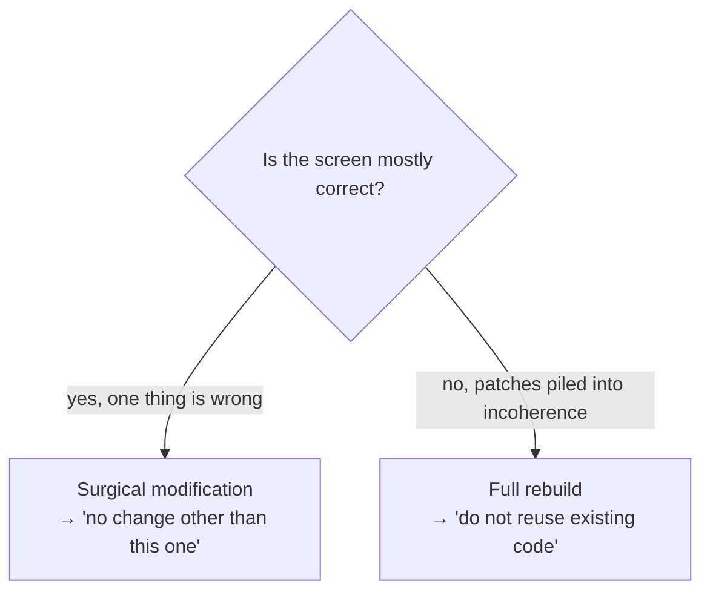

# Le prompt comme contrat

*Un prompt n'est pas une conversation. C'est un contrat passé à un agent — et chaque section ferme une porte.*

La v1 de ce chapitre décrivait un seul genre de prompt : le prompt de génération d'écran. Le terrain l'a pratiqué — et il a forgé deux autres genres, plus fréquents que lui : le **prompt de reprise**, qui redémarre un chantier après une coupure, et le **mega-prompt orchestrateur**, qui installe une session multi-rôles entière avec sa gate de sortie. Ce chapitre donne la grammaire commune aux trois, puis chaque genre, puis deux sections que n'importe lequel des trois peut porter : le **mandat d'initiative** et la **posture**.

> Les faits de terrain cités dans ce chapitre viennent d'un corpus privé : faits datés, compteurs obtenus par commande, vérifiés par audit interne en trois passes contradictoires. Ils ne sont pas rejouables par le lecteur.

## Un prompt est un contrat

Quand vous parlez à un agent de façon informelle, vous négociez. La négociation invite à l'interprétation, et un agent sommé d'interpréter comblera chaque vide par une supposition. Un prompt écrit comme un *contrat* supprime la négociation : il énonce l'opération, les contraintes, les interdits, et la checklist contre laquelle l'agent se vérifie lui-même.

Chaque section d'un prompt bien formé **ferme une porte** par laquelle l'agent pourrait sinon s'égarer. C'est le prisme de tout ce chapitre : lisez chaque section comme une porte, et demandez ce qui passe au travers si elle reste ouverte.

## L'anatomie commune : cinq sections

Les cinq sections que tout prompt-contrat porte, quel que soit son genre. Toutes les cinq sont pratiquées dans chacun des prompts du corpus.

| Section | Ce qu'elle énonce | Porte qu'elle ferme |
|---|---|---|
| **Type d'opération** | Création, modification chirurgicale, refonte, reprise, orchestration | L'agent qui devine la *portée* du travail |
| **Contexte** | Où vit le travail, qui l'utilise, ce qui est déjà acquis | L'agent qui invente un objectif |
| **Spécifications** | Structure, états, contenu — avec des valeurs chiffrées | L'agent qui réinterprète des adjectifs vagues |
| **Interdits** | Ce qu'il ne doit pas faire | L'agent qui « améliore » sans qu'on le lui demande |
| **Checklist de validation** | Critères observables que l'agent coche lui-même | L'agent qui se déclare terminé sans vérifier |

**Des valeurs chiffrées, pas des adjectifs.** « Compact » est interprétable. « Séparateur 1px, titre 600/14px, description 13px, répartition 70/30 » ne l'est pas. Chaque valeur que vous pouvez quantifier, vous devez la quantifier — chaque chiffre est une porte que l'agent ne peut pas rouvrir. Le terrain a poussé la règle un cran plus loin : la meilleure contrainte n'est pas seulement chiffrée, elle est **vérifiable par commande** — on y revient avec le prompt de reprise.

> **Note de version — deux sections retirées.** La v1 prescrivait deux sections de plus : « Passes » (le nombre de passes internes demandées à l'agent) et « Rappel du design system » (les tokens réénoncés dans chaque prompt). Aucun prompt du corpus ne contient ni l'une ni l'autre. Le rappel du design system a été remplacé partout par une règle plus courte et plus dure : **le proto est la vérité** — le prototype validé est la seule vérité visuelle, l'agent ne le réécrit jamais à la main, et les tokens qu'il aurait fallu rappeler vivent dedans, où l'agent les lit au lieu de s'en souvenir. Les passes internes survivent comme discipline de la génération de prototype ([chapitre 04, étape 1](./04-delivery-chain.md)), pas comme section de prompt.

## Genre 1 — Le prompt de génération

Le genre de la v1, conservé parce qu'il est pratiqué : produire ou modifier un artefact en une génération. Il opère dans l'un de deux modes, et énoncer lequel est la première porte fermée.

**Modification chirurgicale.** Elle corrige un point précis. Sa caractéristique déterminante est l'interdit final, capital : **« Aucune autre modification que celle-ci. »** Cette ligne empêche l'agent de reconstruire, à son goût, des choses qui marchaient déjà. Utilisez-la quand l'écran actuel est globalement juste et qu'une chose est fausse.

**Refonte intégrale.** Elle repart de zéro et **interdit de réutiliser le code existant**. Utilisez-la quand une accumulation de retouches a rendu le code existant incohérent — quand le chemin le moins coûteux est une page blanche, pas une retouche de plus sur une retouche.



Choisir le mauvais mode est en soi une défaillance. Un prompt chirurgical contre du code incohérent produit une retouche de plus sur la pile. Une refonte intégrale contre un écran globalement correct jette du travail validé. Choisissez délibérément.

Un exemple travaillé, sur l'écran fil rouge (fictif) :

```text
SURGICAL MODIFICATION on "conditions-list"

CURRENT PROBLEM
Individual cards with a drop shadow, a large number in a circle, a title,
a long description, a badge, and a sub-label. Together they read as too
heavy: the screen takes too much vertical height and tires the eye.

SPECIFICATIONS
- Single container, no per-item shadow.
- 1px separator between each row.
- Left block (title 600/14px + description 13px on one line): 70%.
- Right block (compact badge + short value): 30%, right-aligned.

PROHIBITIONS
- No individual cards with a shadow.
- No multi-line descriptions.
- No change other than this list rework.

VALIDATION CHECKLIST
[ ] Single vertical list with separators
[ ] Compact badge on the right, short value beneath it
[ ] Total height reduced versus the previous version
[ ] No regression anywhere else on the screen
```

Trois choses font sa force : il nomme le problème en termes observables ; il donne des valeurs chiffrées que l'agent ne peut pas réinterpréter (`70/30`, `1px`, `600/14px`) ; il referme par un interdit de périmètre et une checklist auto-vérifiable. La dernière ligne de la checklist — « aucune régression ailleurs » — est le pendant du dernier interdit : l'un interdit le débordement, l'autre fait que l'agent le cherche.

Et si une section manque : pas de type d'opération, l'agent devine s'il doit retoucher ou reconstruire ; pas de contexte, il invente à qui s'adresse l'écran ; pas de spécifications chiffrées, « compact » devient ce que vaut son réglage par défaut ; pas d'interdits, il améliore les parties intactes et introduit des régressions ; pas de checklist, il se déclare terminé sans vérifier. Un prompt vague n'est pas un prompt plus rapide : c'est un prompt qui reporte ses sections manquantes en zones grises ([chapitre 05](./05-grey-zones-and-divergence.md)) et en reprise.

## Genre 2 — Le prompt de reprise

C'est la pratique la plus universelle du corpus — présente sur les terrains les plus outillés comme sur les plus légers, y compris sur un terrain où c'est le *seul* artefact de méthode existant — et c'était, jusqu'à cette version, la moins documentée : le genre n'existait ni dans ce chapitre ni dans les gabarits. Les compteurs du corpus donnent la mesure : vingt-huit artefacts de passation datés à la racine d'un e-commerce hérité en production, vingt-trois sur une fintech, sept sur un produit en binôme multi-dépôts. Sur le terrain le plus ancien, le fichier de contexte de l'agent tient l'onboarding en une seule instruction : lire le handoff.

Une session d'agent meurt : coupure, fin de contexte, fin de journée. La suivante ne repart pas de zéro — elle repart d'un **prompt de reprise** : un fichier versionné qui reconstitue une session opérationnelle en quelques minutes, écrit comme un contrat, pas comme un résumé. Sa règle cardinale : **l'état est mesuré, pas déduit.** Un prompt de reprise qui dit « les tests devraient passer » est un prompt qui ment peut-être ; un prompt qui dit « 42/42 verts, vérifie : `npm test` » ne le peut pas.

| Section | Ce qu'elle énonce | Porte qu'elle ferme |
|---|---|---|
| **Objectif de session** | Ce que cette session doit accomplir, et rien d'autre | La session qui dérive vers ce qui a l'air intéressant |
| **État daté, mesuré** | Commit exact, compteurs obtenus par commande, date | L'agent qui reprend sur un état supposé |
| **Contraintes vérifiables par commande** | Chaque contrainte avec la commande qui la contrôle | La contrainte d'ambiance, invérifiable donc ignorée |
| **Décisions verrouillées** | Les arbitrages rendus, datés — à ne pas rouvrir | L'agent qui re-tranche ce qui a déjà été tranché |
| **Interdiction de deviner** | Les vides connus, avec ordre de bloquer et demander | Le vide comblé par une supposition plausible |
| **Pièges connus** | Les erreurs déjà payées, pour ne pas les repayer | La session qui remarche sur une mine désamorcée |
| **Premières actions ordonnées** | Les premiers gestes, numérotés, vérifications d'abord | Le démarrage improvisé sur un état non contrôlé |

Un exemple rempli, dans l'univers de l'exemple fil rouge (fictif) :

```text
REPRISE — chantier "saved-views" — 2026-05-20

OBJECTIF DE SESSION
Raccorder l'endpoint réel GET /v1/saved-views à la place du mock.
Rien d'autre.

ÉTAT AU 2026-05-19 (mesuré, pas déduit)
- HEAD : 4f2a9c1 — vérifie : git rev-parse --short HEAD
- Tests : 42/42 verts — vérifie : npm test
- Mocks actifs : 3 endpoints sur 4 — vérifie : grep -c "mock:" src/api/config.ts

CONTRAINTES (vérifiables par commande)
- Aucune écriture hors de src/api/ : git status --short ne doit lister
  que des chemins src/api/.
- Aucun push : tout reste local jusqu'au go explicite.

DÉCISIONS VERROUILLÉES (ne pas rouvrir)
- DEC-007 (2026-05-14) : zéro ou une vue par défaut par utilisateur.
- DEC-011 (2026-05-16) : les nouvelles vues sont privées jusqu'au partage.

INTERDICTION DE DEVINER
Le schéma de réponse réel de /v1/saved-views n'est pas dans la spec.
Ne le déduis pas des mocks — demande-le, et bloque en attendant.

PIÈGES CONNUS (déjà payés — ne pas repayer)
- Le mock renvoie created_at en secondes ; l'API réelle en millisecondes.

PREMIÈRES ACTIONS, DANS L'ORDRE
1. git status --short — doit être vide.
2. npm test — doit afficher 42/42.
3. Lis vault/contracts/saved-views-panel.md, section API.
4. Annonce ton plan en cinq lignes maximum, puis attends le go.
```

Chaque section du genre a été observée sur pièces : un prompt de reprise du corpus cite le commit exact de la tête git ; un autre pose une contrainte de périmètre contrôlable d'un seul `git status` ; un autre écrit noir sur blanc de ne pas deviner le schéma de données et de le demander ; le plus long — quatre-vingt-douze lignes, sur un vault d'audit posé sur la plateforme d'un client — impose l'ordre de lecture, liste les pièges connus et termine par la première action concrète de la reprise.

Le prompt de reprise est le jumeau d'entrée du **handoff**, qui est son jumeau de sortie : le handoff consigne l'état en fin de session, le prompt de reprise le transforme en contrat pour la suivante — sur le terrain, les deux fusionnent souvent en un seul fichier. Le rituel complet (quand on l'écrit, comment il périme, le bandeau de péremption) est au [chapitre 10 — La conduite de session](./10-session-conduct.md) ; ce qui relève de ce chapitre est le contrat : un prompt de reprise sans commande de vérification n'est pas un prompt de reprise, c'est un souvenir.

## Genre 3 — Le mega-prompt orchestrateur

Le troisième genre ne cadre pas une génération ni une reprise : il installe une **session entière**, avec son unité de travail, son casting de rôles et sa condition de sortie. Sa devise de terrain : *une session = une page* — une unité de travail nommée, jamais « avance sur le projet ».

Ses blocs :

1. **Les invariants de chantier.** Isolation physique de la session (worktree dédié, port dédié — jamais le checkout principal), le proto comme vérité visuelle, et la règle d'arbitrage des faits : le compilateur et la suite de tests font foi, pas les comptes rendus d'agents.
2. **Le casting des rôles.** Un seul rôle écrit — le producteur. Autour de lui, un panel de relecture read-only en parallèle : recette fonctionnelle et visuelle, relecteur agnostique, relecteur adversarial. C'est le pattern du [chapitre 03, §3.5](./03-agent-architecture.md), embarqué dans le prompt au lieu d'être improvisé en cours de session.
3. **Le pipeline en boucle.** Livraison, panel, contre-vérification de chaque finding contre le code réel (faux positifs écartés par écrit), correction, re-mesure dans les mêmes conditions — jusqu'à convergence. Le protocole complet est au [chapitre 07 — La revue adversariale](./07-adversarial-review.md).
4. **La gate de sortie.** Une checklist dure, à cases cochées : rien ne sort de la session tant que toutes les cases ne sont pas vraies. Et la dernière case n'est jamais un push : la publication est un rituel séparé, humain, au tour courant ([chapitre 09 — La gate de mise en production et le registre des MEP](./09-release-gate-and-registry.md)).

Le squelette :

```text
MEGA-PROMPT — chantier "saved-views" — une session = un écran

INVARIANTS
- Worktree dédié ../wt-saved-views, port 8043. Jamais le checkout principal.
- Le proto validé est la vérité visuelle. Tu ne le réécris jamais à la main.
- Le compilateur et les tests font foi — pas les comptes rendus.

RÔLES
- DEV — seul à écrire. Livre par passes atomiques.
- PO — recette fonctionnelle et visuelle contre le contrat. Read-only.
- RELECTEUR AGNOSTIQUE — relit tout, sans a priori. Read-only.
- RELECTEUR ADVERSARIAL — cherche à casser. Read-only.

PIPELINE
DEV livre → panel en parallèle → chaque finding contre-vérifié sur le
code réel (faux positifs écartés par écrit) → DEV corrige → re-mesure
aux mêmes conditions → boucle jusqu'à convergence.

GATE DE SORTIE — rien ne sort sans toutes les cases
[ ] Checklist du contrat cochée ligne à ligne
[ ] Zéro finding majeur ouvert ; faux positifs justifiés par écrit
[ ] Preuves rejouables consignées (commandes + sorties)
[ ] Registre des zones grises : Ouvertes : 0
[ ] Aucun push — le go de publication est un rituel séparé
```

Statut épistémique : la forme complète — rôles, boucle, gate de sortie dans un seul prompt — a **une occurrence terrain** pleinement formée, sur une fintech du corpus. Le genre, lui, est plus large : un mega-prompt d'amorçage a fondé la méthode sur un produit en binôme multi-dépôts, et un mega-prompt de design a produit le prototype faisant autorité sur un site d'agence reconstruit sur référence figée. Publié comme pattern dominant du terrain pour l'orchestration, pas comme canon éprouvé de longue date.

## Le mandat d'initiative : verrouillé / ouvert

Les interdits ferment des portes. Mais un prompt qui ne ferait *que* fermer stérilise l'agent là où, précisément, on attend de lui des propositions. Le terrain a résolu cette tension par une section explicite — le **mandat d'initiative** — qui découpe le travail en deux zones et impose la forme des propositions :

```text
VERROUILLÉ — tu ne peux pas le changer
- La structure des écrans, les parcours, le contenu des textes.
- Les décisions DEC-007 et DEC-011.

OUVERT — là où je t'attends
- Micro-interactions, transitions, états de survol.
- La respiration verticale des listes longues.

COMMENT RENDRE TES AJOUTS
- Chaque proposition : une ligne, son coût, sa réversibilité.
- Propose, n'applique pas.
```

La porte qu'il ferme est double. Sans mandat, un agent oscille entre deux défaillances symétriques : tout « améliorer » (le débordement que les interdits combattent) ou ne rien oser (l'exécutant littéral qui livre un travail sans jugement là où on en voulait). Le mandat remplace cette oscillation par une frontière écrite — et la clause « propose, n'applique pas » garantit qu'une initiative reste une *proposition* soumise à l'autorité, jamais une décision prise dans l'ombre : c'est la même logique que les zones grises, appliquée en amont.

Statut épistémique : une occurrence terrain, dans le mega-prompt de design d'un site d'agence reconstruit sur référence figée. Pattern émergent, publié parce qu'il ferme une porte qu'aucune autre section ne ferme.

## La posture : le contrat sur la relation humaine

La dernière section observée sur le terrain ne parle ni du code ni de l'écran : elle parle de *l'humain*. Trois terrains du corpus — un vault d'audit, une fintech, un site d'agence — codifient dans le prompt la manière de travailler avec le pilote : comment il communique, ce que ses phrases veulent dire, et ce qui reste dans sa main.

Ce qu'une section de posture énonce :

- **Comment l'humain communique.** Vite, souvent en dictée vocale : le texte peut porter des fautes de transcription. L'agent décode l'intention ; en cas de doute réel, il demande — il ne corrige pas en silence ce qu'il croit avoir compris.
- **Le régime de vérité.** L'état des tests s'annonce brut, échecs compris. « Ça devrait marcher » est interdit de séjour ; la complaisance est une défaillance, pas une politesse.
- **La sémantique des validations.** Valider une recette ou une préprod ne vaut jamais go de production. Le go est une phrase explicite, prononcée au tour courant — jamais inférée d'un enthousiasme ([chapitre 09](./09-release-gate-and-registry.md)).
- **Les gestes réservés.** Comptes, secrets, paiements, envois vers des tiers : l'agent prépare, l'humain exécute. La liste est nommée dans le prompt, pas supposée connue.

La porte qu'elle ferme est la plus sournoise du chapitre : **l'agent qui interprète la manière de l'humain comme une autorisation.** Un pilote rapide et enthousiaste produit des messages qui *ressemblent* à des feux verts. Sans section de posture, l'agent finit par en traiter un comme tel — et c'est ainsi qu'une préprod validée devient une prod déployée que personne n'a autorisée. Les registres du corpus portent des mises en production non sollicitées, consignées comme telles ; ces entorses ont fondé la règle du go explicite. La posture est cette règle, écrite à l'endroit exact où l'agent la lira à chaque session.

## Quel genre pour quelle situation

| Situation | Genre | Le réflexe |
|---|---|---|
| Produire ou modifier un artefact précis | Prompt de génération | Choisir le mode — chirurgical ou refonte — avant tout |
| Redémarrer un chantier après une coupure | Prompt de reprise | État mesuré par commande, jamais déduit |
| Confier une unité de travail à une session multi-rôles | Mega-prompt orchestrateur | Nommer l'unité, verrouiller la gate de sortie |
| L'agent doit proposer sans déborder | Section mandat d'initiative | Verrouillé / ouvert / propose, n'applique pas |
| La session implique un pilote humain (toutes) | Section posture | La sémantique des validations, écrite |

Les gabarits copiables des quatre — prompt de génération, modification chirurgicale, prompt de reprise, mega-prompt orchestrateur — vivent dans [`templates/`](../../../templates/), tous à données fictives. Le prompt de prototype qui ouvre la chaîne de livraison est au [chapitre 04, étape 1](./04-delivery-chain.md) ; celui de l'exemple fil rouge est `examples/walkthrough/01-prototype-prompt.md`.

## Le rapport au contrat du vault

Deux choses, dans Mainstay, s'appellent un « contrat », et ce sont des artefacts différents :

- le **prompt-comme-contrat** — l'instruction passée à l'agent, ce chapitre ;
- le **contrat d'écran** — l'artefact du vault figé et doublement signé, voir le [chapitre 01](./01-three-pillars.md) et le [chapitre 04, étape 3](./04-delivery-chain.md).

Ils sont liés : un bon contrat d'écran rend l'écriture d'un bon prompt presque mécanique, parce que les spécifications, les interdits et les critères d'acceptation sont déjà tranchés. Un prompt écrit sans contrat d'écran derrière lui est un prompt qui improvise le contrat — et l'improvisation, c'est là que naissent les zones grises.

Le prompt de reprise entretient le même rapport avec le vault entier : il ne le remplace pas, il en **ordonne la lecture** — quels fichiers lire, dans quel ordre, avant le premier geste. Un prompt de reprise qui recopie le vault se périme à la première décision nouvelle ; un prompt qui pointe vers lui reste vrai tant que le vault l'est.

## Voir aussi

- [Chapitre 04 — La chaîne de livraison](./04-delivery-chain.md)
- [Chapitre 05 — Les zones grises et la divergence](./05-grey-zones-and-divergence.md)
- [Chapitre 07 — La revue adversariale](./07-adversarial-review.md)
- [Chapitre 09 — La gate de mise en production et le registre des MEP](./09-release-gate-and-registry.md)
- [Chapitre 10 — La conduite de session](./10-session-conduct.md)
- [Chapitre 13 — Patterns et anti-patterns](./13-patterns-and-antipatterns.md)
