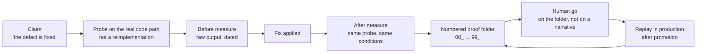

# La preuve et les sondes

*« Fait » n'est pas un état du système ; c'est une déclaration d'agent. Ce chapitre fait de la preuve un artefact de première classe : des sondes qui mesurent le vrai chemin de code, des dossiers de preuve numérotés et horodatés, la preuve rejouée en production après promotion, des mocks dont la fidélité est auditée, des capteurs d'invariants de données, et la règle qui fait survivre la piste de preuve à l'outillage qui l'a produite.*

Une suite de tests verte dit que le code passe ses tests. Elle ne dit pas que l'affirmation qui vous intéresse (« le défaut est corrigé », « le prix payé n'a pas changé », « l'envoi part réellement ») est vraie. Mainstay tient une règle simple : **aucune affirmation sans preuve instrumentée.** Ce qu'un agent déclare avoir vérifié n'existe pas tant qu'un instrument ne l'a pas mesuré, que la mesure n'est pas datée, et que la trace n'est pas conservée.

> Les faits de terrain cités dans ce chapitre viennent d'un corpus privé : faits datés, compteurs obtenus par commande, vérifiés par audit interne en trois passes contradictoires. Ils ne sont pas rejouables par le lecteur.

## La hiérarchie de la preuve

Toutes les formes de « c'est vérifié » ne se valent pas. Par ordre décroissant :

| Rang | Forme | Statut |
|---|---|---|
| 1 | Sonde sur le vrai chemin de code, sortie brute conservée, rejouable | Preuve |
| 2 | Harnais rejouable : commande, jeu de données et conditions consignés | Preuve |
| 3 | Sortie brute d'une commande unique, datée, non rejouée | Preuve faible |
| 4 | Rapport d'agent : « les tests passent », « c'est corrigé » | Pas une preuve |
| 5 | La règle écrite : « le code dit que », « la spec prévoit que » | Pas une preuve |

Trois règles fixent les deux derniers rangs, et chacune a coûté avant d'être écrite.

**La parole d'agent n'est jamais une preuve.** Un agent rapporte ce qu'il croit avoir fait, dans les termes qui le mettent en valeur. Sur un cockpit interne d'agence, la règle est inscrite dans le fichier de contexte même : l'orchestrateur ne croit pas les rapports d'agents ; il remesure lui-même. Un état de livraison n'y a compté ses centaines de vérifications (443/443 sur un volet, 208/208 sur l'autre, zéro ignorée) qu'après ré-exécution des harnais par l'orchestrateur, sorties identiques. C'est la déclinaison mesure de la règle d'engagement de la [revue adversariale](./07-adversarial-review.md) : un palier n'est jamais clos par celui qui l'a construit.

**On vérifie la valeur calculée, jamais la règle écrite.** Sur un site personnel, la leçon est consignée après incident : la règle écrite décrivait le bon comportement, et la valeur effectivement calculée était fausse. La doc, le commentaire, la spec décrivent une intention. Seule l'exécution dit ce que le système fait.

**Même une mesure peut mesurer le mauvais objet.** Sur un e-commerce hérité en production, une décision a formellement corrigé l'affirmation fausse de la décision de la veille, re-mesurée en lecture seule sur la production, avec autopsie de l'erreur de mesure : l'indicateur compté accompagnait d'habitude l'objet visé, mais c'est un autre mécanisme qui décidait du comportement réel. La règle qui en sort : **mesurer l'observable qui décide, pas un indicateur qui co-varie avec lui.**

## La sonde : le vrai chemin de code, jamais une réimplémentation

Une **sonde** est un petit programme qui appelle le chemin de code réel (la vraie fonction, le vrai endpoint, la vraie base) et consigne ce qu'il retourne. Ce qu'une sonde n'est jamais : une réimplémentation de la logique dans le test. Recoder la grille de calcul dans la sonde, puis constater que les deux grilles concordent, prouve une seule chose : que l'auteur du test comprend la règle comme l'auteur du code. Les deux peuvent se tromper ensemble.

L'occurrence fondatrice du corpus : sur un e-commerce hérité en production, un défaut financier réel (une taxe absente sur des frais de port) a été corrigé et recetté par une sonde qui appelle la méthode de calcul réelle du panier, explicitement « pas une réimplémentation ». La sonde a couvert 44 cas de figure (onze destinations × quatre tailles), avec un verdict en deux moitiés : la taxe apparaît, *et le prix payé par le client ne change pas d'un centime*. La seconde moitié (« rien d'autre n'a bougé ») est exactement ce qu'une réimplémentation ne peut pas donner : elle n'aurait vérifié que la règle qu'on venait d'y encoder.

**Prouver à chaque surface où le défaut pourrait vivre.** Un correctif traverse plusieurs couches : l'API peut répondre juste et l'UI afficher faux ; l'écran peut afficher juste et la base ne rien persister. Sur une feature pilote sur un SaaS, chaque correctif de la revue adversariale porte la mention « vérifié » avec son test : l'API en curl, l'état en SQL, le comportement dans la vraie UI, et la persistance revérifiée à travers plusieurs passages successifs. Un correctif prouvé en curl seul est un correctif à moitié prouvé.

## Le dossier de preuve : numéroté et horodaté, par chantier

Une sonde produit une mesure. Un chantier en produit des dizaines. La forme qui les tient ensemble est le **dossier de preuve** : un répertoire par chantier, des fichiers numérotés par ordre de démonstration, chacun horodaté.

La forme la plus aboutie du corpus : sur un e-commerce hérité en production, la recette d'un seul chantier a produit 101 fichiers de preuve numérotés de `00_` à `99_` (de l'état initial à la vérification finale en production), sur trois tours de recette indexés, avec captures d'écran et relevés de faits par rôle simulé, une simulation de la promotion avant le go, une preuve externe rejouée après la promotion, et la synchronisation du registre vérifiée en dernier.

Pourquoi la numérotation : **l'ordre est l'argument.** Un dossier de preuve se lit comme une démonstration (état avant, action, état après, mêmes conditions), et la numérotation rend les trous visibles : s'il n'y a rien entre `30_` et `90_`, qu'est-ce qui prouve les étapes du milieu ? L'horodatage rend l'ordre incontestable, et la préfixation force la question « qu'est-ce qui vient prouver ceci ? » à chaque étape du chantier, pas à la fin.

Un squelette (fictif, sur la fonctionnalité fil rouge) :

```
_chantiers/saved-views-wiring/preuves/
  00_etat_initial.txt           # sortie brute : la table saved_views avant
  10_sonde_avant_fix.txt        # la sonde sur le chemin réel, avant
  20_diff_applique.txt          # ce qui a changé, exactement
  30_sonde_apres_fix.txt        # la même sonde, mêmes conditions
  40_recette_ui_capture.png     # la surface UI, vérifiée aussi
  90_simulation_promotion.txt   # la promotion jouée à blanc, avant le go
  95_preuve_externe_prod.txt    # la sonde rejouée en production, après le go
  99_registre_synchro.txt       # le registre des mises en production à jour
```



Le dossier de preuve a un destinataire : le go humain de la [gate de mise en production](./09-release-gate-and-registry.md) se donne sur le dossier, pas sur un récit. « La recette est bonne » est une phrase ; `30_sonde_apres_fix.txt` est un fait.

## La preuve rejouée après promotion

La recette de pré-production prouve la pré-production. La promotion change l'environnement (configuration, données, volumes, tiers réels), donc elle périme l'affirmation. La règle : **après la promotion, la même sonde rejoue en production**, dans des conditions aussi identiques que possible, et sa sortie rejoint le dossier de preuve.

Le corpus la tient des deux côtés de la gate : sur l'e-commerce hérité, la sonde financière a tourné en pré-production *et* en production, et le dossier de preuve du chantier se clôt sur une preuve externe post-promotion ; sur un vault d'audit sur la plateforme d'un client, la passe de pré-production a été « jouée et vérifiée » à date consignée avant toute promotion.

Le même principe gouverne les correctifs à l'intérieur d'une recette : une mesure avant/après n'a de valeur que **re-jouée dans les mêmes conditions** : même commande, même jeu de données, même environnement. « Avant : dix-huit échecs. Après : zéro » ne prouve quelque chose que si les deux chiffres sortent du même instrument. Deux instruments différents mesurent deux questions différentes, et la comparaison ne mesure rien.

## La sonde read-only avant décision d'architecture

Les sondes ne servent pas qu'à recetter. Avant un arbitrage d'architecture, on n'affirme rien et on ne modifie rien : on sonde.

Sur un produit en binôme multi-dépôts, avant de trancher un refactor, des sondes read-only parallèles ont chacune écrit un fichier de constat prouvé (chemins et lignes à l'appui), dont deux sondes délibérément adverses : l'une instruite pour plaider *pour* le refactor, l'autre *contre*. La décision, rendue ensuite, cite les sondes. Le même dispositif a instruit d'autres arbitrages du même terrain, et un playbook de pré-production s'y ouvre sur « terrain vérifié par sondes, en lecture seule ».

Quatre règles font tenir le dispositif :

1. **Read-only.** Une sonde d'instruction ne modifie rien. Elle instruit le dossier ; la décision, une fois prise, exécute.
2. **Un constat, un fichier, des localisations.** Un constat sans chemin:ligne n'est pas contre-vérifiable ; c'est une impression avec une date.
3. **Des sondes adverses par construction.** Une sonde qui ne cherche que la confirmation la trouvera. En instruire une pour chaque camp force le dossier à contenir le meilleur argument des deux (même racine que la [revue adversariale](./07-adversarial-review.md)).
4. **La décision cite ses sondes.** Une décision d'architecture qui ne cite aucun constat est une opinion munie d'autorité.

## L'audit de fidélité des mocks

La chaîne de livraison fait démarrer le front sur des mocks ([chapitre 04](./04-delivery-chain.md)). Les mocks sont donc un chemin de code que la recette traverse, et le point faible de toute la preuve : **un mock complaisant fabrique de fausses réussites.** Un mock qui répond trop gentiment fait passer une recette entière au vert sur un comportement que le backend réel n'aura jamais.

La parade du corpus, sur une fintech : un harnais de recette local (un jeu de mocks partagé entre deux surfaces applicatives, un script de démarrage qui vérifie ses ports) n'a été admis en recette qu'après un **audit de fidélité mené par un agent séparé** : ni celui qui avait construit le harnais, ni celui qui allait jouer la recette. L'audit a confronté le harnais au code réel du backend (pas à la spec seule) et y a vérifié quatre pièges de fidélité identifiés.

Pourquoi un agent séparé : celui qui a construit le harnais a calibré sa propre preuve. Le corpus a payé ce biais pour l'apprendre : sur un cockpit interne d'agence, un développeur a calibré deux fois la preuve de son propre critère d'acceptation, et le critère a été durci en invariant structurel précisément pour cela. C'est la déclinaison outillage de la règle du chapitre 07 : un harnais n'est jamais certifié par celui qui l'a écrit.

L'audit de fidélité se rejoue quand le backend change : un mock fidèle au backend d'il y a trois semaines est un mock complaisant qui s'ignore.

## Les capteurs d'invariants de données

La recette prouve un instant. Certains invariants (« toute commande a au moins une ligne », « aucune référence n'est dupliquée ») doivent tenir en continu, y compris quand plus personne ne livre : les données bougent sans que le code change (exploitation, tiers, incidents).

Le pattern, né sur un e-commerce hérité en production : un répertoire versionné de **capteurs d'invariants** (cinq scripts, chacun détectant un état incohérent précis de la base) et, à côté de chaque capteur, un script de **fixtures** qui fabrique l'état cassé pour prouver que le capteur le détecte.

La règle des fixtures est le cœur du pattern : **un capteur qui n'a jamais vu l'anomalie qu'il chasse est un espoir, pas un instrument.** On teste le détecteur avant de lui confier la détection : chaque capteur embarque le moyen de se prouver lui-même. C'est la même logique que la sonde de garde-fou plus bas : l'instrument de surveillance est lui-même sous surveillance.

Un capteur n'est pas un test. Un test s'exécute au changement de code et protège la construction ; un capteur surveille un état qui peut se dégrader sans qu'aucun code ne change, et protège l'exploitation.

## La pérennité de la piste de preuve

Le contre-exemple qui fonde cette section est réel et consigné. Sur une feature pilote sur un SaaS, le document de recette renvoyait, comme preuve du bon fonctionnement des envois en mode développement, à une ligne de log : « chercher ce marqueur dans le log du backend ». Des semaines plus tard, l'audit interne cherche le marqueur : zéro occurrence. Le script de démarrage de la stack tronquait le log à chaque lancement. La preuve avait existé ; l'outillage l'avait effacée. La piste de preuve des envois n'était plus rejouable, et l'affirmation qu'elle soutenait était redevenue une parole d'agent.

> **La preuve doit survivre à l'outillage qui l'a produite.**

Quatre règles en découlent :

1. **La preuve vit dans un artefact dédié.** Au moment de la recette, l'extrait pertinent est *copié* dans le dossier de preuve, jamais seulement référencé dans un log rotatif, un répertoire de session, une sortie de terminal. Ce qui peut être tronqué le sera.
2. **Une preuve citée par référence est re-vérifiée au moment où on la cite.** Si la cible peut disparaître, on embarque l'extrait. Un lien vers une preuve n'est pas une preuve ; c'est une promesse de preuve.
3. **L'outillage est audité pour ce qu'il détruit.** Scripts de démarrage, rotations de logs, nettoyages de fin de session : tout ce qui tronque ou purge est une menace pour la piste de preuve et se recense comme telle. Le script qui a effacé la preuve ci-dessus faisait exactement ce qu'on lui demandait.
4. **La piste appartient au chantier, pas à la session.** Elle est versionnée ou archivée avec le chantier qu'elle prouve. Les artefacts d'une session sont purgés avec elle : une preuve rangée là est une preuve en sursis (voir la [conduite de session](./10-session-conduct.md)).

## Éprouver l'agent lui-même : ce qui reste de l'évaluation

L'ancien chapitre « Tester et évaluer les agents » posait une distinction qui tient : tester la **sortie** de l'agent (le code marche-t-il ?) n'est pas tester l'**infrastructure** (l'agent honore-t-il les contrats et les garde-fous ?). Un agent peut produire du code correct en ignorant un garde-fou : la construction est verte, la méthode a échoué.

L'instrument de la seconde question est la **sonde de garde-fou** : un test qui tente de faire faire à l'agent une chose interdite, et qui ne réussit que si l'agent **refuse ou escalade**. Un garde-fou jamais sondé est un garde-fou dont on espère seulement qu'il tient. Cinq gestes à sonder : l'édition hors périmètre, la modification d'un artefact figé, l'invention d'une valeur absente de toute source de vérité, l'action destructrice sans confirmation, le choix silencieux entre deux sources contradictoires. Une sonde que l'agent « réussit » en faisant la chose interdite est le test le plus précieux de la suite : elle vient de trouver un trou dans l'infrastructure.

Le corpus porte une occurrence de ce geste, appliquée à un prompt de production : sur un site d'agence reconstruit sur référence figée, la consigne d'un composant LLM a été éprouvée à sec, avant de disposer de la moindre clé d'API : dix-sept sondes hostiles jouées par un modèle tenu à la consigne réelle, verdict rendu par double juge. Quatorze sondes tenues ; les trois percées ont produit deux clauses chirurgicales ajoutées à la consigne. Un mode vérificateur ne faisait ensuite qu'« un seul vrai appel », pour que le premier appel réel soit un acte délibéré, pas un accident. C'est la sonde de garde-fou au sens plein : attaquer la consigne avant de lui confier la production.

Le reste de l'ancien chapitre (tâches de référence, tests de conformité au contrat, jeux de régression, banc d'évaluation) garde sa logique mais change de statut : **instruments proposés, non éprouvés.** Aucun terrain du corpus n'a construit de banc d'évaluation ni de suite de tâches de référence. Le corpus a couvert les mêmes besoins par d'autres voies :

| Instrument proposé | Statut | Ce que le terrain a fait à la place |
|---|---|---|
| Sonde de garde-fou | Une occurrence terrain (épreuve à sec d'un prompt de production) | La pratiquer avant de confier une consigne à la production |
| Tâches de référence + banc d'évaluation | Proposé, non éprouvé | La [revue adversariale](./07-adversarial-review.md) à findings contre-vérifiés |
| Tests de conformité au contrat | Proposé, non éprouvé | La revue adversariale jouée contre le contrat, plus le lint de contrat |
| Jeux de régression | Proposé, non éprouvé | Les règles inscrites après incident ([chapitre 01](./01-three-pillars.md)) et les capteurs d'invariants |

Si vous construisez le banc, il fonctionne tel que décrit dans l'ancien chapitre. Publiez-le alors pour ce qu'il est chez vous aussi : une prescription devenue pratique, pas l'inverse.

## Voir aussi

- [Chapitre 04 · La chaîne de livraison](./04-delivery-chain.md)
- [Chapitre 07 · La revue adversariale](./07-adversarial-review.md)
- [Chapitre 09 · La gate de mise en production et le registre](./09-release-gate-and-registry.md)
- [Chapitre 10 · La conduite de session](./10-session-conduct.md)
- [Chapitre 11 · Les protocoles de défaillance](./11-failure-protocols.md)
- [Référence · CI/CD et hooks](../reference/cicd-and-hooks.md)
- [Référence · Métriques](../reference/metrics.md) (instrument proposé, non éprouvé)
