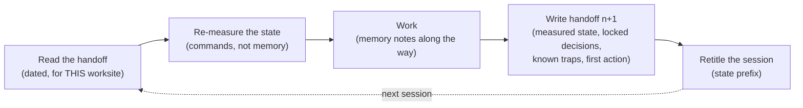

# La conduite de session

*Une session d'agent naît, travaille et meurt en quelques heures. Ce qui lui survit — un handoff daté, des fiches mémoire, un titre d'état — est la seule mémoire que la suivante aura.*

La chaîne de livraison décrit le travail à l'échelle de la fonctionnalité. Mais l'unité réelle du travail avec un agent, celle qui s'ouvre et se ferme tous les jours, c'est la **session** : une fenêtre de contexte bornée, qui commence vide et se termine pleine — puis disparaît. Ce chapitre décrit les rituels qui font qu'une session ne meurt pas avec son contexte : le handoff daté et son jumeau le prompt de reprise, le bandeau de péremption, la désambiguïsation du chantier, les titres d'état, les fiches mémoire, et la boucle autonome qui travaille sans interrompre.

C'est la pratique la plus universelle du corpus — présente du chantier solo compressé à la flotte de sessions parallèles — et c'était la moins documentée de la v1, qui expédiait la passation en une ligne : « une courte note de handoff ». Le terrain en a fait le genre documentaire le plus produit de tout le corpus : vingt-huit fichiers de handoff à la racine d'un seul dépôt, vingt-trois sur un autre, sept sur chacun de deux autres — comptés par commande. Sur un terrain, la chaîne « handoff » apparaît dans plus de la moitié des transcripts de session archivés (224 sur 414).

> Les faits de terrain cités dans ce chapitre viennent d'un corpus privé : faits datés, compteurs obtenus par commande, vérifiés par audit interne en trois passes contradictoires. Ils ne sont pas rejouables par le lecteur.

## La session, unité réelle du travail

Quand une session se termine, tout ce qui n'a pas été écrit est perdu. La session suivante ne s'en souviendra pas — elle le *redéduira* : de l'état du dépôt, des noms de fichiers, de ce qui ressemble à une intention. Et la déduction invente. Un agent qui déduit l'état d'un chantier prend exactement le même genre de décisions silencieuses qu'un agent qui comble un brief flou ([chapitre 05 — Zones grises et divergence](./05-grey-zones-and-divergence.md)) : il choisit une interprétation plausible, sans autorité, et personne ne sait qu'un choix a été fait.

La parade est un couloir : **chaque session s'ouvre par une lecture et se ferme par une écriture.** Elle s'ouvre en lisant le handoff de la précédente et en re-mesurant ce qu'il affirme ; elle se ferme en écrivant le handoff de la suivante, en déposant ses fiches mémoire, et en retitrant sa propre trace.



La boucle est le miroir, à petite échelle, de la chaîne de livraison : une session hérite d'un état, le fait avancer, et laisse la suivante démarrer plus riche. Le reste du chapitre décrit chaque arête.

## Le handoff daté

Le handoff est l'artefact de sortie d'une session : un fichier daté, par chantier, versionné avec le code. La convention de terrain tient en deux niveaux : un `HANDOFF.md` racine qui sert d'onboarding permanent — lisible en moins d'une minute, il dit où sont les chantiers vivants — et un handoff daté par chantier, nommé avec sa date et son chantier (`handoffs/2026-05-19-saved-views.md`).

Quatre sections sont obligatoires. Ce sont celles que le corpus reproduit partout, chacune parce que son absence a coûté :

| Section | Ce qu'elle contient | Ce qu'elle évite |
|---|---|---|
| **État exact — mesuré, pas déduit** | Chaque affirmation d'état accompagnée de la commande qui l'a produite, exécutée au moment de l'écriture | Le handoff qui « croit se souvenir » — crédible, daté, et faux |
| **Décisions verrouillées** | Les décisions à ne pas rouvrir, avec leur identifiant et leur date | La session suivante qui re-délibère ce qui est tranché |
| **Pièges connus** | Les erreurs déjà payées sur ce chantier, avec leur cause | Repayer le même piège à chaque reprise |
| **Première action, ordonnée** | La séquence exacte par laquelle la reprise commence, résultats attendus inclus | Le successeur qui choisit lui-même par où commencer |

Le terrain y ajoute deux sections qui ont fait leurs preuves : **ce qui n'est pas committé, et pourquoi** — un handoff du corpus consigne explicitement les fichiers laissés hors commit et la raison ; sans cette ligne, un successeur « nettoie » ou committe l'inverse de l'intention — et un rappel final des **garde-fous transverses** du chantier (pas de push sans go explicite, périmètre gelé), parce que le handoff est souvent le seul document que la session suivante lira en entier.

Un handoff rempli pour l'exemple fil rouge (fictif) `saved-views-panel` :

```markdown
# Handoff — saved-views-panel — 2026-05-19

> Chantier : saved-views-panel, raccord par vagues. Dépôt : app principale.
> Remplace : handoffs/2026-05-18-saved-views.md (bandeau de péremption posé).

## État au 2026-05-19, 18 h 40 (mesuré, pas déduit)
- HEAD : 4f2a9c1 — `git rev-parse --short HEAD`
- Tests : 42/42 verts — `npm test`, exécuté à 18 h 35
- Raccordé : POST /v1/saved-views (vague 1) ; les 3 autres endpoints
  sur mock — `grep -c "mock:" src/api/config.ts` → 3
- NON committé : les brouillons de types dans src/api/drafts/ —
  volontaire, le schéma réel de GET n'est pas confirmé.

## Décisions verrouillées (ne pas rouvrir)
- DEC-007 (2026-05-14) : zéro ou une vue par défaut par utilisateur.
- DEC-011 (2026-05-16) : les nouvelles vues sont privées jusqu'au partage.

## Pièges connus (payés — ne pas repayer)
- Le mock horodate `created_at` en secondes, l'API réelle en
  millisecondes : le tri par date passait sur mock et cassait en réel.

## Première action de la reprise
1. `git status --short` — attendu : vide.
2. `npm test` — attendu : 42/42.
3. Lis vault/contracts/saved-views-panel.md §API, annonce ton plan.

## Garde-fous transverses
Pas de push sans go explicite. Aucune écriture hors de src/api/.
```

Le prompt de reprise du [chapitre 06](./06-prompt-as-contract.md) est dérivé de ce handoff : mêmes mesures, mêmes décisions, même piège — transformés en contrat pour la session entrante.

## « Mesuré, pas déduit »

C'est la règle qui fait tenir tout le reste, et elle mérite sa section. Un handoff du corpus intitule sa section d'état « État vérifié le [date] — mesuré, pas déduit », et chaque ligne est le résultat d'une commande passée le jour même : codes HTTP des pages publiques, services actifs, séries de tests complètes. Un autre, sur un chantier à plusieurs agents, consigne que les compteurs de tests ont été *re-mesurés par l'orchestrateur lui-même* plutôt que repris des rapports d'agents. Un troisième cite le commit exact de la tête git.

La discipline a deux faces :

- **À l'écriture** : aucune affirmation d'état sans la commande qui l'a produite, exécutée au moment d'écrire. « Les tests devraient passer » n'existe pas dans un handoff. `npm test` → 42/42, exécuté à 18 h 35, existe.
- **À la lecture** : la première action de toute reprise re-joue les commandes du handoff et compare aux résultats attendus. **Si une commande contredit le handoff, on s'arrête** : le handoff est périmé, et la reprise commence par le constater, pas par travailler dessus.

Un état déduit dans un handoff est une zone grise sur votre propre chantier : une affirmation plausible que personne n'a vérifiée, léguée à quelqu'un qui la traitera comme un fait.

## Le périmètre gelé, vérifiable par commande

Le même principe s'applique aux limites du chantier. « Ne touche pas aux deux autres dépôts » est une consigne ; elle s'oublie, se contourne, se réinterprète. Le terrain l'a durcie en la rendant exécutable :

> Périmètre gelé : aucune écriture hors du dépôt de travail.
> **Vérifiable : `git status --porcelain` doit rester vide dans les deux autres dépôts — à tout moment, par n'importe qui.**

La différence n'est pas cosmétique. Un périmètre en prose est un engagement ; un périmètre avec commande est un **fait contrôlable** — par l'agent en cours de session, par le pilote à tout instant, par le successeur à la reprise, et par un audit longtemps après. Sur le terrain d'origine, le compte-rendu de clôture écrit « zéro fichier touché » *avec* sa commande de preuve — et des semaines plus tard, un audit interne a rejoué la commande : dépôts intacts, un seul commit d'initialisation. Le gel avait survécu à sa session.

La règle générale : **tout gel — de périmètre, de branche, de version — se déclare avec la commande qui le vérifie et le résultat attendu.** Hors git, la commande change (un comptage de fichiers, une somme de contrôle, un diff contre un tag), la règle non. Un gel sans commande est une opinion.

## Le bandeau de péremption

Un handoff périme vite — c'est sa nature : il photographie un état que la session suivante a précisément pour mission de changer. Un handoff périmé est pire qu'aucun handoff, parce qu'il est *crédible* : mesuré, daté, précis — et faux. La v1 traitait la divergence des documents en général ; la conduite de session a sa règle courte :

> **Périmé = marqué périmé.** Un handoff dépassé reçoit un bandeau en première ligne ; il n'est ni réécrit ni supprimé.

```markdown
> ⚠️ PÉRIMÉ — bandeau posé le 2026-05-19. L'état ci-dessous décrit le
> chantier avant le raccord de la vague 1.
> État à jour : handoffs/2026-05-19-saved-views.md
```

Trois éléments, jamais moins : la date du bandeau, le verdict, le pointeur vers la source à jour. Sur le terrain, un handoff a reçu son bandeau *le lendemain* de son écriture — c'est le rythme normal, pas un échec ; un compte-rendu technique porte un bandeau daté renvoyant vers le journal à jour, l'ancien état conservé en toutes lettres comme historique. On ne supprime pas : l'historique des handoffs est la chronologie du chantier, et c'est lui qu'on relit quand on cherche quand un piège est apparu. Le même mécanisme, appliqué aux specs et aux plans, est au [chapitre 11 — Les protocoles de défaillance](./11-failure-protocols.md).

## La désambiguïsation du chantier

Le garde-fou de cette section cite son incident, comme le veut le gabarit du [chapitre 01](./01-three-pillars.md).

L'incident, daté au corpus : le 20 juillet 2026, une session d'équipe multi-agents complète a été lancée **sur le mauvais chantier**. La consigne disait de lire « le handoff » — sans chemin. Deux chantiers voisins avaient chacun leur fichier du même nom. La session a lu le mauvais, et a exécuté avec application un plan destiné à un autre projet. Rien dans le handoff lui-même n'était faux ; c'est la *désignation* qui était ambiguë.

La règle née de l'incident, le lendemain :

1. **Un handoff se désigne par chemin complet**, jamais par nom de fichier. « Lis le handoff » est interdit ; « lis tel fichier, de tel chantier » est la forme valide.
2. **La première ligne d'un handoff nomme son chantier.** Un handoff qui ne dit pas à quel chantier il appartient est ambigu par construction — l'exemple fil rouge ci-dessus ouvre sur `Chantier : saved-views-panel`.
3. **Avant d'agir, croiser le vocabulaire.** Chaque chantier a un lexique : l'un parle en paliers et en gates, l'autre en tickets et en mises en production, le troisième en décisions et en lots. Si le vocabulaire du handoff ne correspond pas au chantier annoncé, on s'arrête et on demande — c'est le prix d'une phrase contre celui d'une session entière.

Plus il y a de sessions parallèles, plus l'ambiguïté de cible devient le mode de défaillance dominant : en flotte, la désignation explicite du chantier est un préalable de tout brief ([référence — Orchestration](../reference/orchestration.md)).

## Les titres de session en kanban

Un outil de sessions garde la liste des sessions et leurs titres. Le terrain a transformé cette liste en tableau de bord, au coût d'une convention : **le titre commence par un préfixe d'état.**

| Préfixe | Sens | Le geste qui le pose |
|---|---|---|
| `CLOSED` | Chantier clos, handoff écrit | On retitre en fermant, *après* le handoff — le titre reprend souvent son nom |
| `PAUSE` | Suspendu, reprise prévue | On retitre en suspendant, avec le motif dans le titre |
| `STAND BY` | En attente d'un tiers ou d'une décision | Idem — le titre dit ce qu'on attend |
| `LATER` | Repoussé volontairement, sans échéance | Décision de report, pas un oubli |
| `A FAIRE` | Backlog : session ouverte pour mémoire, travail non commencé | On crée la session comme pense-bête |
| *(aucun)* | En cours | L'absence de préfixe est un état en soi |

La liste des sessions, triée, se lit alors comme un kanban : ce qui est clos, ce qui attend, ce qui est vivant — sans ouvrir une seule session. Sur le magasin de sessions vivant d'un terrain, interrogé par commande un jour donné, dix-sept des deux cents titres retournés portaient `CLOSED` ; les états suspendus y côtoyaient les backlogs, chacun lisible d'un coup d'œil.

Deux règles font tenir la convention. **On retitre en fermant** : le retitrage fait partie du rituel de clôture, au même titre que le handoff — une session fermée sans préfixe est une session qui a l'air vivante. Et **le titre porte le chantier**, pas une généralité : « CLOSED Raccord vague 1 — saved-views », jamais « avance sur le projet » — c'est la même règle qu'au [chapitre 06](./06-prompt-as-contract.md) : une session = une unité de travail nommée.

## Les fiches mémoire normées

Le vault mémorise le *produit* : décisions, contrats, conventions ([chapitre 02](./02-vault-and-sources-of-truth.md)). Mais une part de ce qu'une session apprend ne concerne pas le produit — elle concerne la *conduite* : un piège d'outillage, une règle de collaboration avec le pilote, un protocole qui a échoué et la correction. Le terrain range cela dans des **fiches mémoire**, à côté des sessions, sous une forme normée :

> **Une fiche = un fait + pourquoi + comment l'appliquer.**

```markdown
---
type: memory
date: 2026-05-19
origine: session « CLOSED Raccord vague 1 — saved-views »
---
# Le mock horodate en secondes, l'API réelle en millisecondes

**Fait.** Le tri par date passait tous les tests sur mock et cassait
en réel.
**Pourquoi.** Les fixtures du mock ont été écrites à la main ; la spec
ne précise pas l'unité des timestamps.
**Comment l'appliquer.** À chaque raccord d'endpoint, comparer une
réponse réelle à la fixture champ par champ avant de retirer le mock.
```

Une fiche sans « comment l'appliquer » est une anecdote ; une fiche sans « pourquoi » est un dogme. Le frontmatter date la fiche et la rattache à sa session d'origine — c'est le pendant conduite du supersede des décisions : on saura toujours d'où une règle vient.

Les fiches s'accumulent — un terrain du corpus en portait environ soixante-dix-huit — et c'est l'**index** qui les rend utilisables : un fichier d'index, une ligne par fiche, groupées par sections (règles dures, pièges, protocoles). L'onboarding lit l'index, pas les fiches. Et l'index se **compacte périodiquement** : quand il devient trop long pour être lu en début de session, les lignes sont regroupées et resserrées — les fiches, elles, ne bougent pas. La compaction du corpus, datée, porte la mention qui fait la règle : *rien n'est perdu* — on compacte l'index, jamais la mémoire.

Le routage entre les deux mémoires est simple : **un fait qui contraint le produit monte au vault en décision ; un fait qui contraint la conduite des sessions reste en fiche.** Les fiches sont aussi le registre des récidives : sur un terrain, la troisième violation d'une règle de mise en production a été comptée par écrit *dans la fiche de la règle* — c'est cette comptabilité qui a déclenché le durcissement ([chapitre 09](./09-release-gate-and-registry.md)).

## La boucle autonome « jusqu'à parfait »

Le dernier rituel gouverne la session déléguée : un chantier confié à l'agent avec l'instruction de **boucler jusqu'à convergence sans solliciter le pilote**. La boucle enchaîne les rôles de la méthode — développement, recette PO, revue adversariale, relecture agnostique, arbitrage — et recommence tant que les passes trouvent ([chapitre 07 — La revue adversariale](./07-adversarial-review.md)). Le pilote ne revient que deux fois : pour la recette finale, et pour le go.

Le problème que ce rituel résout est précis : une boucle qui s'interrompt à chaque arbitrage n'est pas autonome — elle transfère au pilote, en pleine journée, des micro-décisions hors contexte. Et une boucle qui tranche tout en silence fabrique des zones grises. L'invention de terrain tient le milieu :

> Les arbitrages rencontrés en cours de boucle sont présentés en fin de course comme des **décisions à confirmer** — tranchées, justifiées, avec recommandation — et non comme des questions ouvertes.

La différence est de nature. Une question interrompt et transfère le travail d'arbitrage ; une décision à confirmer *conserve* le travail fait — la boucle a choisi, appliqué son choix, continué — et laisse au pilote le pouvoir de renverser : confirmation en bloc, veto ligne à ligne. Chaque décision à confirmer porte le choix, la justification, et ce qu'il en coûterait de le renverser.

Les bornes de la boucle sont absolues :

| La boucle tranche seule | Elle présente en « décisions à confirmer » | Elle ne franchit jamais |
|---|---|---|
| Les choix déjà couverts par le contrat et le vault | Les arbitrages nouveaux : zone grise locale, priorité entre deux correctifs, écart mineur de périmètre | Le go de mise en production, un push, tout envoi vers un tiers ([chapitre 09](./09-release-gate-and-registry.md)) |
| Les corrections issues des revues, re-testées | Toute entorse *proposée* à une convention établie | Une décision verrouillée, un périmètre gelé |

Et une exception, qui est un retour à la règle générale : si la boucle rencontre une zone grise **bloquante** — qui empêche toute voie de continuer sans une autorité qu'elle n'a pas — elle s'arrête et demande. « Jusqu'à parfait » n'a jamais voulu dire « en devinant » : l'interdiction de deviner prime l'interdiction d'interrompre.

À la clôture, la boucle rejoint le couloir commun : handoff daté, décisions à confirmer en tête, fiches mémoire déposées, titre préfixé. Une session autonome se termine exactement comme les autres — elle a seulement demandé moins souvent.

## Voir aussi

- [Chapitre 01 — Les trois piliers](./01-three-pillars.md)
- [Chapitre 02 — Le vault et les sources de vérité](./02-vault-and-sources-of-truth.md)
- [Chapitre 06 — Le prompt comme contrat](./06-prompt-as-contract.md)
- [Chapitre 07 — La revue adversariale](./07-adversarial-review.md)
- [Chapitre 09 — La gate de mise en production et le registre](./09-release-gate-and-registry.md)
- [Chapitre 11 — Les protocoles de défaillance](./11-failure-protocols.md)
- [Référence — Orchestration](../reference/orchestration.md)
