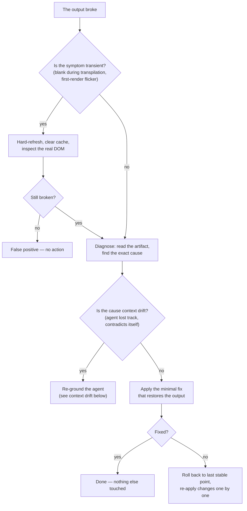
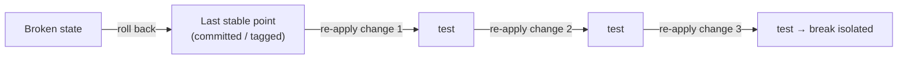

# Les protocoles de défaillance

*Une méthode mature se juge quand quelque chose casse. Le réflexe qui compte : action minimale, jamais de régénération destructrice — et quand c'est un document qui a cessé d'être vrai, on le marque, on ne le réécrit pas.*

Une méthode mature se juge à l'instant où quelque chose va de travers. Quand la génération casse, quand une page s'affiche blanche, quand le contexte de l'agent a dérivé, quand un registre ne dit plus la vérité — l'instinct est de tout effacer et de repartir de zéro. Cet instinct est l'erreur. Il jette du travail validé pour échapper à un problème qu'une petite correction ciblée résoudrait, et il efface l'histoire dont la prochaine défaillance aurait eu besoin.

Le principe sous chaque protocole de ce chapitre :

> **Action minimale. Jamais de régénération destructrice.**

Ce chapitre couvre deux familles de défaillances. Les quatre premières sont des défaillances de *production* : la sortie casse, le symptôme est transitoire, le contexte dérive, une itération part de travers. Les deux dernières sont des défaillances de *vérité* : les artefacts qui décrivent l'état du monde — registres, handoffs, récapitulatifs — cessent de dire vrai. Le même principe gouverne les deux : la plus petite action qui restaure la vérité, jamais la destruction de ce qui était juste.

> **Statut des preuves.** Les faits de terrain cités dans ce chapitre viennent d'un corpus privé : faits datés, compteurs obtenus par commande, vérifiés par audit interne en trois passes contradictoires. Le lecteur ne peut pas les rejouer ; il peut en revanche appliquer chaque protocole sur son propre projet.



## Récupération après crash de génération

**Symptôme.** La sortie ne se rend plus, alors même que le contenu semblait cohérent.

La tentation de tout régénérer est l'erreur : on perdrait le travail validé. Suivez plutôt la procédure.

```text
PROCEDURE
1. Current state — read the artifact, identify the cause class
   (syntax, missing import, render loop), find the exact error.
2. Diagnosis — point to the line, the import, or the faulty component.
3. Minimal action — the smallest correction that brings the render back.
   DO NOT regenerate. DO NOT touch the rest.
4. If insufficient — roll back to the last stable point, re-apply the
   changes one by one, testing between each.

PROHIBITIONS
- No full regeneration.
- No change outside the crash perimeter.
- No new feature during recovery.
```

Le quatrième interdit compte autant que le premier. La récupération n'est pas un moment pour glisser aussi une amélioration ; mêler une correction et une fonctionnalité rend les deux impossibles à vérifier. La récupération fait une seule chose : restaurer le dernier état connu bon.

Un exemple travaillé, sur l'exemple fil rouge (fictif) de la documentation. Une construction de `saved-views-panel` cesse de s'afficher après une édition. Étape 1 : la lecture de l'artefact révèle une boucle de rendu — un setter d'état appelé pendant le rendu. Étape 2 : la ligne fautive est identifiée. Étape 3 : le setter est déplacé dans un effet — une ligne changée, rendu restauré. Pas de régénération, aucun autre changement. Coût total : un diagnostic et une ligne. Le coût d'une régénération aurait été chaque résolution de zone grise intégrée dans cet écran.

## Faux positifs et symptômes transitoires

Sur les environnements qui compilent à la volée, une page peut sembler blanche le temps de la transpilation. Avant de conclure « bug » :

1. Rafraîchir en vidant le cache.
2. Inspecter le **DOM réel** — pas le visuel, l'arbre effectivement rendu.
3. Pour les cas lourds, pré-compiler avant exécution, ce qui supprime entièrement le problème.

La leçon se généralise au-delà de la transpilation : **ne jamais réagir à un symptôme transitoire par une action destructrice.** Une page blanche pendant une étape de compilation, un scintillement au premier rendu, un 404 passager pendant qu'un serveur de dev redémarre — ce ne sont pas des défaillances. Confirmez que le symptôme est réel et stable avant d'agir dessus. Une action destructrice prise contre un symptôme qui se serait dissipé seul est une perte pure.

## Dérive de contexte et épuisement de la fenêtre de contexte

Un mode de défaillance propre aux longues sessions d'agent : le contexte de travail de l'agent se remplit ou dérive. Symptômes :

- l'agent contredit une décision qu'il a prise plus tôt dans la même session ;
- il réintroduit du code qu'il a retiré il y a vingt minutes ;
- il « oublie » une contrainte énoncée dans le fichier de contexte ;
- ses éditions deviennent moins précises à mesure que la session s'allonge.

La cause n'est pas le modèle qui échoue — c'est la fenêtre de contexte qui se remplit d'historique de session, repoussant hors de portée effective les faits stables et importants.

**Procédure de récupération :**

```text
CONTEXT-DRIFT RECOVERY
1. Stop. Do not ask the drifting agent to "try again" — it will drift further.
2. Capture state — write the current, verified state to a durable place:
   the contract, the divergence ledger, a dated handoff. Not the chat.
3. Re-ground — start a fresh agent context. Load: the context file, the
   relevant contract, and the captured state. Nothing else.
4. Resume — the fresh agent continues from a clean, small, accurate context.

PROHIBITIONS
- No "continue anyway" with the drifted context.
- No relying on the chat history as the record of truth.
```

L'artefact de capture a un nom et un gabarit : c'est le handoff daté du [chapitre 10 — La conduite de session](./10-session-conduct.md), avec sa règle « état mesuré, pas déduit ». La prévention structurelle est dans l'architecture : déléguez le travail lourd en lecture à des sous-agents pour que le contexte de l'agent qui agit reste petit et propre (voir le [chapitre 03 — L'architecture agentique](./03-agent-architecture.md)). L'enregistrement durable est le **vault**, jamais la conversation — c'est exactement pour cela que le vault existe. Une session se termine ; un vault persiste.

## Discipline de rollback

Le rollback est un outil, pas une défaite — mais il a des règles.

1. **Toujours avoir un point où revenir.** Avant une itération, l'état validé est archivé (un commit, un tag, une sauvegarde nommée et horodatée — y compris là où git est absent, le backup daté fait alors office de versionnage). On ne peut pas revenir à un état que l'on n'a jamais sauvegardé. C'est le pattern *sauvegarde avant itération* du [chapitre 13](./13-patterns-and-antipatterns.md).
2. **Revenir au dernier point stable, pas à zéro.** Le but est l'état connu bon le plus proche, pas un dépôt vide.
3. **Réappliquer en avant, une modification à la fois, en testant entre chaque.** Cela restaure la progression et isole quelle modification a causé la casse.
4. **Un rollback est consigné.** Notez ce qui a cassé et pourquoi, pour que la prochaine tentative ne le répète pas. Un rollback silencieux n'enseigne rien.



## La réconciliation contre l'état réel

Les protocoles précédents traitent le code qui casse. Celui-ci traite un mal plus discret : **l'artefact comptable qui ne dit plus vrai.** Un registre des MEP, un index de vault, un fichier d'état de chantier — tout artefact qui affirme « voici ce qui existe » peut dériver de ce qui existe réellement. Le mode de dérive est connu : des sessions parallèles font avancer la comptabilité chacune de leur côté, un numéro est pris deux fois, une entrée est écrite de mémoire. L'artefact reste plausible — c'est précisément ce qui le rend dangereux. Un registre visiblement cassé alerte ; un registre plausible et faux fait prendre de mauvaises décisions avec assurance.

Le corpus porte le cas fondateur. Sur un e-commerce hérité en production, après un épisode de sessions parallèles, le registre des mises en production a été réconcilié contre l'état réel du serveur : une version majeure promue en production n'avait *jamais* été consignée par la session qui l'avait promue ; des mises en production taguées n'avaient pas d'entrée ; des correctifs portaient des numéros devenus faux. La réconciliation a tout réaligné d'après ce que la production faisait effectivement — la note datée dans l'en-tête du registre le dit en quatre mots : **« vérifié serveur, pas mémoire »** — et les corrections ont été consignées comme corrections, visibles, jamais gommées.

Le protocole :

```text
RECONCILIATION
1. Trigger — periodically, and after ANY episode of parallel sessions.
2. Query the real state — by command, on the live system: version served,
   tags present, artifacts deployed, files actually tracked.
   Never from memory, never from the chat.
3. Diff — compare the record to the real state, line by line.
4. Correct by dated annotation — every divergence becomes a dated
   correction note IN the record. The wrong entry is marked wrong and
   corrected beside itself, never silently rewritten.
5. Fix the cause — a number collision or a missing entry under parallel
   sessions is a coordination bug; treat it (lock the number before
   bumping, one writer per record).
```

Deux points portent tout le protocole. **L'état réel s'obtient par commande** — une requête sur le système vivant, pas un souvenir de ce qu'on a déployé. Et **la correction est une annotation datée, jamais une réécriture** : une entrée fausse marquée fausse enseigne quelque chose (quand la comptabilité a dérivé, sous quelles conditions) ; une entrée réécrite en silence prétend que la dérive n'a jamais eu lieu — et garantit qu'on ne la préviendra pas. Le dispositif complet du registre, avec ses règles de tenue, est au [chapitre 09 — La gate de mise en production et le registre](./09-release-gate-and-registry.md) ; ce qui appartient au présent chapitre, c'est le réflexe : **quand un artefact comptable est suspect, on ne le corrige pas de mémoire — on interroge le réel, et on annote.**

## Le marquage — bandeau de péremption, bandeau d'obsolescence

Dernière famille de défaillance : le document qui a cessé d'être vrai. Un handoff décrit l'état d'un chantier ; le chantier avance ; le handoff décrit maintenant un état qui n'existe plus. Un récapitulatif technique décrit un modèle de données ; le modèle est remplacé ; le récapitulatif enseigne désormais le faux. Aucun code n'a cassé — mais le prochain lecteur, humain ou agent, va charger ce document et agir sur un monde disparu.

L'instinct destructeur a ici deux visages : **supprimer** le document (on perd l'historique — pourquoi les choses ont été crues, dans quel ordre elles ont changé) ou **le réécrire** (on ment sur ce qui a été écrit à l'époque, et on paie une réécriture complète pour un problème qu'une ligne résout). La méthode fait la troisième chose, la plus petite :

> **On marque. Une ligne datée en tête du document — c'est la ligne qui évite le mensonge documentaire.**

Deux variantes, pour deux situations :

**Le bandeau de péremption.** Le document était vrai et le temps l'a périmé. Le cas type est le handoff : sur un produit en binôme multi-dépôts, un handoff de chantier daté a reçu, dès le lendemain, un bandeau en troisième ligne disant qu'il était périmé. Un jour de validité, marqué le jour même — le document reste lisible comme archive, et plus personne ne peut le prendre pour l'état courant.

```markdown
> ⚠️ PÉRIMÉ — 2026-05-22. Ce handoff décrivait l'état au 2026-05-21 ;
> le chantier a avancé depuis. État courant : handoff-2026-05-24.md.
```

**Le bandeau d'obsolescence daté.** Le document décrit un état remplacé par un autre. Sur une feature pilote d'un SaaS, un récapitulatif technique exhaustif porte en tête un bandeau daté indiquant qu'il décrit le modèle initial de démonstration, avec renvoi vers la source à jour. Le document n'est ni supprimé ni réécrit : il est historisé sur place. C'est la règle de divergence du [chapitre 05](./05-grey-zones-and-divergence.md) appliquée aux documents — **marquage plutôt que réécriture** — et le même geste que le statut `superseded` d'une décision : on ne réécrit pas le fond, on amende par ajout daté.

```markdown
> ⚠️ 2026-06-02 — Ce document décrit le modèle initial (démo).
> Source à jour : concepts/data-model.md.
```

Le contre-exemple est documenté aussi. Sur un autre terrain, un document d'étude a conservé des chiffres d'activité que le vault avait déclarés faux — par décision datée, le jour même. Aucun mécanisme de péremption ne l'a marqué : le document faux est resté en circulation à côté de la décision qui le réfutait, deux vérités contradictoires dans le même dépôt. C'est exactement ce que le bandeau coûte une ligne d'empêcher.

La règle courte, celle qui doit devenir un réflexe de fin de session : **périmé = marqué périmé.** Un bandeau porte trois choses : la date du marquage, le statut, le pointeur vers la source à jour. Rien d'autre. Si vous hésitez entre marquer et réécrire, marquez — c'est l'action minimale, et elle est réversible : on peut toujours réécrire un document marqué ; on ne peut pas restaurer ce qu'une réécriture silencieuse a fait disparaître.

## Action minimale, jamais de régénération destructrice

Chaque protocole de ce chapitre est un seul principe appliqué à une défaillance différente :

| Défaillance | Instinct destructeur | Action minimale |
|---|---|---|
| Crash de génération | Régénérer tout l'écran | Corriger la seule ligne fautive |
| Page blanche de transpilation | Reconstruire la page | Rafraîchir, inspecter le DOM |
| Dérive de contexte | Pousser plus fort l'agent qui dérive | Capturer l'état, réancrer un contexte neuf |
| Une itération cassée | Tout recommencer | Revenir au dernier point stable |
| Un registre qui a dérivé | Le réécrire de mémoire | Réconcilier contre le réel, corriger par annotation datée |
| Un document qui ne dit plus vrai | Le supprimer ou le réécrire | Une ligne de bandeau datée, avec pointeur vers la source à jour |

La régénération destructrice ressemble à du progrès parce qu'elle produit une sortie fraîche. Ce n'est pas du progrès. Sur le code, elle écarte les résolutions de zones grises, la conformité au contrat et les décisions validées déjà intégrées dans l'artefact. Sur les documents, elle efface l'histoire — ce qui a été cru, quand, et pourquoi c'est devenu faux — c'est-à-dire exactement la matière dont les garde-fous sont faits : dans cette méthode, chaque interdit majeur cite l'incident qui l'a créé ([chapitre 01](./01-three-pillars.md)), et un incident effacé ne fonde plus rien.

En cas de doute réel entre une petite correction et une régénération, l'égalité revient à la petite correction. Vous pouvez toujours escalader vers une refonte ; vous ne pouvez pas désannuler du travail validé jeté.

## Voir aussi

- [Chapitre 04 — La chaîne de livraison](./04-delivery-chain.md)
- [Chapitre 05 — Zones grises et divergence](./05-grey-zones-and-divergence.md) — la règle de divergence dont le marquage est l'application documentaire
- [Chapitre 09 — La gate de mise en production et le registre](./09-release-gate-and-registry.md) — le registre des MEP, premier terrain de la réconciliation
- [Chapitre 10 — La conduite de session](./10-session-conduct.md) — handoffs datés, « état mesuré, pas déduit »
- [Chapitre 13 — Patterns et anti-patterns](./13-patterns-and-antipatterns.md) — sauvegarde avant itération, régénération destructrice
