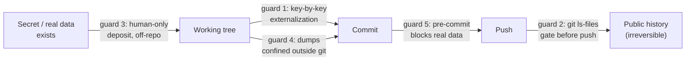

# Secrets et PII

*Un agent lit tout, colle vite et committe encore plus vite. Ce chapitre a été écrit par quatre incidents réels, et il tient en trois lois : un secret exposé est compromis, seul ce qu'une commande vérifie est vrai, et un finding différé sans échéance est réputé ouvert.*

La livraison pilotée par agents change la surface d'exposition des secrets et des données personnelles : pas parce que l'agent serait malveillant, mais par la mécanique même qui le rend productif. Un agent lit des fichiers entiers d'un coup, y compris ceux qu'un humain n'aurait jamais ouverts. Il colle des valeurs dans des configurations pour « faire marcher » un test. Il committe par lots, vite, souvent ; et un historique git poussé est public pour toujours. Il travaille sur des données réalistes, et les données les plus réalistes sont les vraies. Aucun de ces gestes n'est une faute ; chacun est un chemin de fuite que le travail avec agent multiplie.

Ce chapitre ne sort pas d'un principe. Il sort de quatre incidents réels du corpus (aucun n'était une attaque, tous étaient de la routine) et des garde-fous que le terrain a construits en réponse. C'est le gabarit de toute la méthode ([chapitre 01](./01-three-pillars.md)) : chaque interdit cite l'incident qui l'a créé.

> **Statut des preuves.** Les incidents et les faits de ce chapitre viennent d'un corpus privé : faits datés, compteurs obtenus par commande, vérifiés par audit interne en trois passes contradictoires. Le lecteur ne peut pas les rejouer ; il peut en revanche exécuter chaque garde décrite ici sur son propre dépôt, aujourd'hui.

## Les quatre incidents

Quatre catégories, quatre chemins de fuite distincts. Les terrains ne sont pas identifiés ; les mécanismes, eux, sont intégralement transposables.

| Incident | Le chemin de fuite | Ce qu'il enseigne |
|---|---|---|
| **Une clé d'API dans un historique git poussé.** La clé d'un service d'emailing, en clair dans des commits déjà poussés, trouvée par une revue adversariale, pas par son auteur. | La vitesse de commit de l'agent : la clé est entrée « pour tester » et l'historique l'a gardée. | Effacer le fichier ne suffit plus ; l'historique poussé est irréversible. Seule la rotation remédie. |
| **Une clé passée en clair dans un chat.** Une clé d'API collée dans la conversation avec l'agent, consignée le jour même « à révoquer », sans qu'aucune trace écrite ne confirme ensuite la révocation. | Le canal de travail lui-même : le chat est un support tiers, hors de votre contrôle. | Le chat n'est jamais un endroit pour une valeur secrète ; et « à révoquer » sans confirmation écrite n'est pas une remédiation. |
| **Un secret par défaut committé.** Un secret de signature d'authentification laissé à sa valeur par défaut et versionné avec le code. | Le défaut silencieux : personne n'a collé de secret ; personne n'en a généré non plus. | Une valeur par défaut est un secret connu de tous. L'externalisation se vérifie clé par clé, y compris pour les clés « auxquelles on n'a pas touché ». |
| **Un token d'hébergeur dans une configuration versionnée.** Un token d'API d'hébergeur en clair dans un fichier de configuration MCP, probablement committé, relevé en passant, lors d'un audit qui cherchait autre chose. | L'outillage de l'agent : les fichiers qui outillent l'agent (configuration MCP, fichiers de contexte) sont versionnés par conception. | Tout fichier versionné est un fichier publiable. Configuration = variables d'environnement, jamais de valeur en clair ([chapitre 03](./03-agent-architecture.md)). |

Le point commun est plus instructif que les différences : **aucun de ces secrets n'a été volé.** Ils ont été déposés (par commodité, par défaut, par vitesse) dans des endroits qui ont une mémoire. Le dispositif de ce chapitre ne cherche donc pas à repousser un attaquant ; il cherche à rendre le dépôt accidentel impossible, ou au pire détectable avant le push.

Trois lois en découlent, qui gouvernent tout le reste :

1. **Un secret exposé est un secret compromis.** Dans un historique poussé, dans un chat, dans une valeur par défaut publiée : peu importe que « personne n'ait probablement regardé ». La seule remédiation est la rotation ou la révocation. La suppression du fichier est un geste cosmétique.
2. **Seul ce qu'une commande vérifie est vrai.** « Je crois que le dump n'est pas versionné » ne vaut rien ; `git ls-files` fait foi. Chaque garde de ce chapitre se termine par une commande dont on lit la sortie.
3. **Différé n'est pas soldé.** Un finding sécurité peut légitimement être différé ; mais un différé sans échéance ni confirmation est un risque ouvert qui a cessé d'être visible. La règle de suivi, en fin de chapitre, est le garde-fou le plus important de ce chapitre.

## Garde 1 : L'externalisation des secrets, clé par clé

L'externalisation ne se décrète pas en bloc (« les secrets sont dans l'environnement ») ; elle se vérifie **clé par clé**, sur une table de correspondance explicite. Chaque clé de configuration sensible a sa variable d'environnement, sa règle de génération, et son comportement en absence :

```text
SECRETS MAP (example, fictional)
mailer.api.key      → MAILER_API_KEY      prod env only, never in repo
auth.token.secret   → AUTH_TOKEN_SECRET   generated per environment;
                                          the default value is forbidden
demo.access.token   → DEMO_ACCESS_TOKEN   empty in prod = feature disabled
```

Trois détails que le terrain a payés pour apprendre :

- **La ligne « valeur par défaut interdite » existe à cause de l'incident 3.** L'externalisation naïve vérifie les clés qu'on a remplies ; c'est la clé restée à son défaut qui fuit.
- **Une clé absente doit dégrader proprement.** Le pattern du token de démonstration (une variable vide en production désactive la fonction) vaut pour toute clé optionnelle : l'absence est un état prévu, pas un crash qui pousse quelqu'un à committer « juste une valeur pour dépanner ».
- **La table se contrôle par commande.** Après externalisation, on vérifie qu'aucune valeur en clair ne subsiste dans les fichiers suivis :

```bash
# no clear-text values left behind for any mapped key
git grep -nE "(api\.key|token\.secret|password)\s*[:=]\s*[^$ ]" -- \
  ':!*.md' && echo "CLEAR-TEXT VALUE FOUND: stop" || echo "clean"
```

## Garde 2 : La gate anti-PII avant tout push

Avant tout push, une question, posée à git et non à la mémoire : **que suis-tu réellement ?** La forme terrain est une checklist bloquante dans le playbook de push, dont le cœur tient en une commande :

```bash
# what does git actually track that looks like data or env?
git ls-files | grep -iE 'snapshot|dump|\.env|\.sql$'
# expected: nothing, or ONLY the known, reviewed migration files
```

La subtilité est dans le choix de la commande. `ls` répond « ce qui est sur le disque » ; `.gitignore` répond « ce que je crois exclure » ; **`git ls-files` répond « ce qui partira au prochain push »** : c'est la seule des trois questions qui compte. Sur le terrain d'origine, cette commande fait partie d'un playbook rejoué à chaque push, et sa sortie attendue est écrite dans le playbook lui-même : rien, hors les migrations connues et revues.

La gate appartient au même geste que la gate de mise en production ([chapitre 09](./09-release-gate-and-registry.md)) : le push est un geste irréversible, il a donc une checklist bloquante, et la checklist se termine par des commandes dont on lit la sortie, pas par des cases que l'on coche de mémoire.

## Garde 3 : Les clés sont déposées par l'humain, seul

La règle terrain est brutale et simple :

> **L'agent ne manipule, n'écrit, ne colle jamais une clé. Le dépôt d'un secret est un geste humain.**

C'est un cas particulier d'un invariant plus large de la méthode ; certains gestes sont réservés à l'humain et nommés explicitement : comptes, paiements, envois, secrets. L'agent prépare tout *autour* du secret : l'emplacement attendu, le format, la procédure de dépôt, le contrôle qui confirme que la clé est en place et fonctionne. La valeur elle-même ne transite jamais par lui, donc jamais par un chat, un prompt, un fichier généré ou un historique de session.

Le terrain a poussé le pattern jusqu'à son ergonomie : des scripts de dépôt en double-clic, écrits par l'agent, exécutés par l'humain : le script demande la clé, la range au bon endroit hors dépôt, et vérifie. L'humain n'a pas besoin d'être développeur ; l'agent n'a pas besoin de voir la valeur. C'est la réponse structurelle à l'incident 2 : une clé collée dans le chat est un accident *rendu impossible* quand le circuit de dépôt existe et que la règle est écrite dans le fichier de contexte.

## Garde 4 : Les données de production sont confinées hors git

Travailler sur des données réalistes est légitime ; c'est même une exigence de la definition of done. Le corpus l'a fait avec un dump de production contenant des centaines d'adresses e-mail réelles, sans jamais le versionner, grâce à un confinement à trois étages :

1. **Le dump vit hors de tout dépôt git.** Un répertoire dédié, à la racine de l'espace de travail mais hors de portée de tout `git add`, vérifié par commande : le fichier n'apparaît dans le `git ls-files` d'aucun dépôt.
2. **Le dump s'importe dans une base scratch**, distincte de la base applicative. Le code de l'application ne pointe jamais vers les données réelles par accident : il faudrait le décider.
3. **La production se lit en lecture seule.** Quand l'application doit lire la base d'origine, c'est par une datasource séparée, déclarée immuable côté code : l'agent peut lire, l'écriture est structurellement impossible.

Et le contre-point honnête, publié parce qu'il enseigne : la consigne « supprimer le dump quand il ne sert plus » existait par écrit ; et des semaines plus tard, le dump était toujours sur le disque. Le confinement a tenu (rien n'a jamais été versionné) ; la purge, elle, est restée un résiduel ouvert. C'est la démonstration en conditions réelles de la loi 3 : une consigne sans échéance ni confirmation n'est pas exécutée, elle est seulement écrite. Les playbooks du terrain ont pour cela une section dédiée, au nom exact : séparer le **« neutralisé (testable) »** du **« résiduel non nul »** : ce qui est réglé et prouvable par commande, et ce qui reste ouvert et doit le dire.

## Garde 5 : Le pre-commit anti-données-réelles

Dernière ligne de défense, automatique celle-là : un hook git pre-commit qui **bloque le commit** si le contenu suivi contient des données réelles : le domaine réel d'un tiers, de vraies adresses dans des fixtures, un motif de dump. C'est la voie d'implémentation canonique de la couche hooks ([chapitre 03](./03-agent-architecture.md) et [référence CI/CD et hooks](../reference/cicd-and-hooks.md)) : un dispatcher `core.hooksPath`, versionné avec le projet, qui s'exécute quel que soit l'auteur du commit : humain, agent, ou agent en flotte.

Le corollaire est une règle de données : **les fixtures sont fictives, obligatoirement.** Un jeu de test qui embarque de vraies valeurs « parce que c'était plus rapide » transforme chaque commit en fuite potentielle ; la garde pre-commit est ce qui transforme cette règle d'intention en règle mécanique. Née sur un terrain dont l'historique est public, elle vaut partout : un dépôt privé n'est qu'un dépôt public dont la fuite n'a pas encore eu lieu : un changement de visibilité, un fork, un partage de trop.

Les cinq gardes se placent chacune sur un point du chemin de fuite :



## La règle de suivi : un finding différé est réputé ouvert

Les gardes précédentes empêchent la fuite suivante. Cette règle-ci gouverne la fuite déjà trouvée ; et c'est elle que le corpus a le plus chèrement établie.

Différer une remédiation est parfois légitime : la rotation d'une clé peut exiger une coordination, un accès que seul un tiers détient, un moment sans trafic. La défaillance n'est pas le report. La défaillance, documentée dans le corpus, est le report *sans structure* : un finding critique (la clé dans l'historique poussé, incident 1) différé sur décision explicite, remédiation déléguée… puis plus aucune trace. Pas d'échéance, pas de confirmation de rotation, pas de purge vérifiée : plus de sept semaines de risque ouvert dont plus personne n'était comptable. Même schéma sur l'incident 2 : « à révoquer » consigné le jour même, révocation jamais confirmée par écrit. Dans les deux cas, la consignation initiale était exemplaire ; c'est le *suivi* qui n'existait pas.

D'où la règle, au format des interdits de la méthode :

> **Un finding sécurité différé porte trois choses : une échéance datée, un responsable nommé, et une clôture par confirmation écrite du geste effectué, vérifiée par commande quand c'est possible. Sans les trois, le finding est réputé OUVERT.**

« Réputé ouvert » est une inversion de la charge de la preuve, et elle est volontaire : ce n'est pas à l'auditeur de prouver que le risque persiste, c'est au différé de prouver qu'il a été soldé. Concrètement :

- un finding réputé ouvert **apparaît dans chaque état des lieux** (handoff, prompt de reprise, revue de chantier) jusqu'à sa clôture ; il ne peut pas glisser hors de vue par simple passage du temps ;
- sa **sévérité ne se négocie pas avec l'âge** : un finding critique différé ne devient pas mineur parce qu'il a sept semaines (c'est même l'inverse) ;
- sa clôture est un **fait vérifiable**, pas une déclaration : « clé tournée le [date], ancienne clé testée refusée, confirmation de [nom] », le même standard de preuve que tout le reste de la méthode ([chapitre 08 : Preuves et sondes](./08-proof-and-probes.md)) ;
- l'échéance dépassée sans clôture est une **escalade automatique** vers l'humain qui a décidé le report : la décision de différer est renégociée, jamais reconduite en silence.

La revue adversariale ([chapitre 07](./07-adversarial-review.md)) fournit l'entrée de ce circuit : c'est elle qui trouve les findings que l'auteur ne voit plus ; l'incident 1 a été découvert ainsi. Mais une revue qui trouve sans circuit de suivi produit exactement le pire des deux mondes : un risque documenté *et* ouvert. Trouver n'est pas remédier ; consigner n'est pas clore.

## Ce qui se module, et ce qui ne se module pas

Comme partout dans la méthode, le dosage suit la propriété du code et le coût de l'erreur, ni la taille du chantier, ni sa durée. Un chantier solo sans production peut ne tenir que la table des secrets et la gate `git ls-files` ; une production d'autrui portant des données clients exige les cinq gardes et le circuit de suivi complet ([profil run & audit](../profiles/run-and-audit.md)).

Trois choses ne se modulent jamais, à aucune échelle du corpus :

1. **Aucune valeur secrète ne transite par l'agent** : ni chat, ni prompt, ni fichier versionné.
2. **La vérification se fait par commande**, jamais de mémoire.
3. **Un finding différé sans échéance ni confirmation est réputé ouvert**, et se comporte comme tel.

## Voir aussi

- [Chapitre 01 · Les trois piliers](./01-three-pillars.md) · le gabarit « interdit (cause : incident daté) »
- [Chapitre 03 · L'architecture agentique](./03-agent-architecture.md) · configuration MCP : variables d'environnement, jamais de token en clair
- [Chapitre 07 · La revue adversariale](./07-adversarial-review.md) · d'où viennent les findings sécurité
- [Chapitre 08 · Preuves et sondes](./08-proof-and-probes.md) · le standard de preuve des clôtures
- [Chapitre 09 · La gate de mise en production et le registre](./09-release-gate-and-registry.md) · la checklist bloquante avant geste irréversible
- [Référence · CI/CD et hooks](../reference/cicd-and-hooks.md) · le pre-commit `core.hooksPath` comme voie d'implémentation
- [Profil : Run & audit](../profiles/run-and-audit.md) · le dispositif complet sur la production d'autrui
