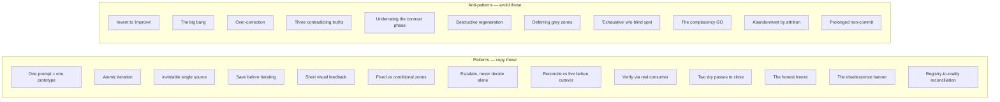

# Patterns et anti-patterns

*Le catalogue. Patterns à copier — ce qu'ils sont, pourquoi ils marchent, comment les appliquer. Anti-patterns à éviter — leur symptôme, leur coût, leur correction.*

Ce chapitre est un catalogue de référence. Les patterns sont décrits selon **Quoi / Pourquoi ça marche / Comment**. Les anti-patterns sont décrits selon **Symptôme / Coût / Correction**. La plupart sont tirés directement de la méthode ; quelques-uns sont des extensions naturelles, signalées *(extension)* ; les entrées marquées *(terrain)* viennent du corpus d'application de la méthode — une dizaine de chantiers réels, anonymisés. Les chiffres qu'elles portent ont un statut épistémique précis : corpus privé, faits datés, compteurs obtenus par commande, vérifiés par audit interne en trois passes contradictoires — non rejouables par le lecteur. Quand une pratique a des entorses documentées, elles sont publiées avec elle : ce sont les violations qui ont fondé les règles.

---

## Patterns

### Pattern 1 — Un prompt = un prototype

**Quoi.** Le prototype sort d'une seule génération, avec deux à quatre passes internes. On ne le construit pas en prompts fragmentés.

**Pourquoi ça marche.** Le nombre d'itérations devient une métrique propre et honnête de la qualité du brief. Si un écran demande cinq prompts, le brief avait cinq trous — et maintenant vous le savez. Le prompt fragmenté masque ce signal en répartissant les trous sur plusieurs petites réussites.

**Comment.** Écrivez le prompt de prototype comme un contrat (voir le [chapitre 06](./06-prompt-as-contract.md)) : type d'opération, spécifications avec valeurs chiffrées, interdits, checklist — et le prototype validé comme seule vérité visuelle. Puis générez une fois. Si le résultat est inutilisable, corrigez le *prompt*, pas l'écran.

### Pattern 2 — L'itération atomique

**Quoi.** Une modification par message. Chaque itération change exactement une chose.

**Pourquoi ça marche.** Quand un changement casse quelque chose, la cause est sans ambiguïté — il n'y a qu'un seul candidat. Les changements groupés transforment le débogage en recherche.

**Comment.** Utilisez le mode de prompt « modification chirurgicale ». Un problème nommé, un pattern cible, un interdit de périmètre (« aucune autre modification que celle-ci »). Vérifiez, puis commencez le message suivant.

### Pattern 3 — La source unique inviolable

**Quoi.** Ne jamais inventer un libellé ou une valeur. Toujours aller la chercher à sa source.

**Pourquoi ça marche.** Les libellés et valeurs inventés sont la matière première des zones grises et de la dette de cohérence. Une valeur récupérée à sa source de vérité ne peut pas en diverger.

**Comment.** Quand l'agent a besoin d'une chaîne, d'une limite, d'une couleur ou d'un endpoint, il lit le design system, le contrat ou le code — voir la table d'autorité au [chapitre 02](./02-vault-and-sources-of-truth.md). Faites de « aucune invention » un interdit permanent dans le fichier de contexte.

### Pattern 4 — Sauvegarder avant d'itérer

**Quoi.** Archiver l'état validé avant toute itération. Ne jamais modifier de façon destructrice.

**Pourquoi ça marche.** Cela garantit un point de rollback. Vous pouvez tenter un changement avec audace parce que l'état connu bon est en sécurité (voir le [chapitre 11](./11-failure-protocols.md), discipline de rollback).

**Comment.** Committez ou taguez l'état validé avant le prompt d'itération. L'itération a alors un endroit où retomber si elle casse. Là où git est absent, un backup nommé et daté fait office de versionnage — c'est la variante dégradée documentée, pas une dispense.

### Pattern 5 — Le feedback visuel court

**Quoi.** Valider contre une véritable capture d'écran ou une sortie rendue, pas une description.

**Pourquoi ça marche.** Une description de ce qui a été construit est l'*affirmation* de l'agent. Une capture d'écran est une *preuve*. Les zones grises se cachent dans l'écart entre l'affirmation et la preuve.

**Comment.** Après une génération ou une itération, regardez le résultat effectivement rendu, à travers les viewports. Lancez le balayage des zones grises contre ce que vous voyez, pas contre ce que l'agent dit avoir fait ([chapitre 05](./05-grey-zones-and-divergence.md)).

### Pattern 6 — Zones fixes vs zones conditionnelles

**Quoi.** Séparer, explicitement, les parties d'un écran toujours présentes (zones fixes) des parties qui n'apparaissent que sous conditions (zones conditionnelles).

**Pourquoi ça marche.** Les zones conditionnelles sont là où vivent les états et les edge cases — vide, erreur, conditionné par les permissions. Les nommer explicitement les force dans le contrat et dans le balayage des zones grises au lieu d'être découvertes plus tard.

**Comment.** Dans la section architecture du contrat, listez séparément les zones fixes et les zones conditionnelles. Pour chaque zone conditionnelle, énoncez la condition qui l'affiche et l'état qu'elle affiche.

### Pattern 7 — Escalader, ne jamais trancher seul *(extension)*

**Quoi.** Quand un cas n'est dans aucune source, on remonte à la source supérieure, on la complète, on redescend — prototype d'abord, contrat ensuite, code en dernier.

**Pourquoi ça marche.** Cela corrige la *source* du manque, pas le symptôme. Le prochain agent et le prochain relecteur héritent d'une source complète au lieu de deviner à nouveau.

**Comment.** C'est le réflexe d'escalade du [chapitre 02](./02-vault-and-sources-of-truth.md). Un cas dans aucune source est une zone grise ; résolvez-la via les issues du [chapitre 05](./05-grey-zones-and-divergence.md).

### Pattern 8 — Réconcilier contre la source live avant le cutover *(extension)*

**Quoi.** Avant qu'une migration ou une consolidation ne passe en production, ne pas faire confiance au snapshot migré. Tirer les vraies valeurs de la (des) source(s) live, et quand plusieurs sources se contredisent, trancher par un **ordre de priorité déclaré** — pas en devinant, pas en moyennant.

**Pourquoi ça marche.** Un snapshot pris pendant une migration *ment* : il porte des valeurs placeholder, des champs périmés et des trous silencieux qui ressemblent exactement à de la vraie donnée. S'y fier livre un état faux d'une manière qu'aucune capture d'écran ne révèle. Tirer de la source live transforme l'hypothèse en preuve ; une priorité déclarée fait de « qui gagne quand les sources divergent » une règle, pas une improvisation.

**Comment.** Tirez les champs faisant autorité (`clé + état + valeur`) de chaque source live, en lecture seule. Matchez par une clé stable. Tranchez les conflits par la table d'autorité du [chapitre 02](./02-vault-and-sources-of-truth.md) — une source est la référence, les autres comblent les trous, et une source marquée non fiable n'est *jamais* l'autorité. Écrivez dans la copie de staging avec un backup, puis **conditionnez le cutover à un contrôle de certification en lecture seule** qui renvoie un unique GO / NO-GO. Le cutover n'a pas lieu sur une affirmation verte ; il a lieu sur une preuve verte (pattern 5, appliqué à la donnée).

### Pattern 9 — Vérifier par le vrai consommateur, pas par un proxy commode *(extension)*

**Quoi.** Quand le résultat d'une vérification contredit la réalité observée, rejoue la vérif via le *client exact* et le chemin qu'emprunte le vrai système — pas l'outil le plus à portée de main.

**Pourquoi ça marche.** Un outil proxy peut échouer là où le vrai client réussit. Un CLI `mysql` a refusé un mot de passe que le driver PHP de l'application acceptait sur le même socket ; se fier au CLI aurait annulé un changement qui marchait. L'« échec » du proxy était un faux négatif, pas une preuve.

**Comment.** Calque la vérif sur le vrai consommateur : connecte-toi comme l'app, requête comme un navigateur. Quand le proxy et la réalité divergent, le vrai consommateur fait foi — et un feu vert de proxy n'est pas une preuve verte (pattern 5).

### Pattern 10 — La règle d'arrêt « deux passes sèches » *(terrain)*

**Quoi.** Une boucle de relecture ne se ferme ni à la fatigue, ni à l'intuition que « ça a l'air bon » : elle se ferme quand **deux passes complètes consécutives ne produisent plus aucun finding nouveau**. Une passe sans finding est une *passe sèche* ; il en faut deux d'affilée.

**Pourquoi ça marche.** Un critère d'arrêt subjectif sélectionne exactement le moment où le relecteur baisse la garde — c'est-à-dire le pire moment pour s'arrêter. Une seule passe sèche peut être un coup de chance ou une passe paresseuse ; la seconde la confirme. La fermeture devient un fait mesuré, pas un ressenti. Terrain : une fintech du corpus a clos un palier après six rounds de relecture, la clôture prononcée sur deux passes sèches consécutives.

**Comment.** Comptez les findings nouveaux par passe, dans le journal de boucle. Tant que le compte n'est pas à zéro deux fois de suite, la boucle continue — ou se gèle honnêtement (pattern 11). Le protocole complet est au [chapitre 07 — La revue adversariale](./07-adversarial-review.md).

### Pattern 11 — Le gel honnête *(terrain)*

**Quoi.** Quand la boucle de relecture ne converge pas — le compte de findings majeurs monte au lieu de descendre — on **gèle le lot par écrit** : verdict « gelé », état exact consigné, condition de reprise. On ne prononce pas de GO.

**Pourquoi ça marche.** La non-convergence est une information : le périmètre était trop grand, le brief trop flou, ou le chantier pas mûr. Un gel documenté se reprend proprement ; un GO arraché se paie en production. Terrain : sur un cockpit interne d'agence, une passe a fait passer les findings d'un lot de 13 à 21 — ce n'est pas de la convergence — et le lot a été gelé par écrit, commit à l'appui, au lieu d'être validé.

**Comment.** Fixez le critère de convergence *avant* la boucle (par exemple : zéro majeur + une tentative de réfutation réelle qui échoue). Si une passe fait monter le compte, gelez : une entrée datée qui dit ce qui est su, ce qui reste ouvert, et ce qui doit changer avant reprise. Le gel est un verdict de première classe, au même titre que GO et NO-GO ([chapitre 07](./07-adversarial-review.md)).

### Pattern 12 — Le bandeau d'obsolescence *(terrain)*

**Quoi.** Un artefact périmé n'est ni supprimé ni réécrit : il reçoit **en tête un bandeau daté** — « périmé depuis le JJ/MM, remplacé par X » — et reste lisible comme historique.

**Pourquoi ça marche.** La suppression détruit l'historique ; la réécriture silencieuse fabrique une fausse vérité — l'artefact a l'air à jour, et un agent s'y fiera. Le bandeau coûte une ligne et rend l'état explicite : qui tombe dessus sait qu'il ne doit pas s'y fier, et sait où aller. C'est le pendant documentaire du supersede des décisions : on ne réécrit pas, on remplace en gardant la trace. Terrain : sur plusieurs chantiers du corpus, handoffs et comptes-rendus périmés portent un bandeau de péremption daté, l'ancien état conservé comme historique.

**Comment.** Dès qu'un artefact est remplacé ou invalidé, ajoutez la ligne en tête : date, statut, pointeur vers le remplaçant. Règle courte : *périmé = marqué périmé*. Voir les [chapitres 10 — Conduite de session](./10-session-conduct.md) et [11 — Protocoles de défaillance](./11-failure-protocols.md).

### Pattern 13 — La réconciliation registre↔réel *(terrain)*

**Quoi.** Tout registre — mises en production, décisions, artefacts — est périodiquement **confronté à l'état réel qu'il prétend décrire** : tags git, serveur, disque. Chaque écart est traité : entrée manquante ajoutée et marquée rétroactive, ou anomalie ouverte.

**Pourquoi ça marche.** Un registre n'est protégé par aucun test : il peut mentir par omission sans que rien n'échoue. Terrain : sur un produit en binôme multi-dépôts, le registre des mises en production déclarait « aucune mise en production à ce jour » alors que le dépôt portait 11 tags — la règle avait été instituée, puis plus tenue, et rien ne l'a signalé. À l'autre extrême, le registre tenu à plein du corpus aligne 239 entrées sur 193 tags, sous une règle d'or d'une ligne : pas de mise en production sans entrée au registre, pas d'entrée sans mise en production. La différence entre les deux n'est pas la discipline d'écriture — c'est la réconciliation.

**Comment.** Une commande ou un script compare le registre au réel : nombre d'entrées contre nombre de tags, version affichée contre version déployée, fichiers listés contre fichiers sur disque. Faites-en un rituel de fin de MEP et un contrôle périodique. Le dispositif complet est au [chapitre 09 — Gate de mise en production et registre](./09-release-gate-and-registry.md).

---

## Anti-patterns

### Anti-pattern 1 — Inventer pour « améliorer »

**Symptôme.** L'agent ajoute, change ou « peaufine » quelque chose qu'on ne lui a pas demandé, parce qu'il a jugé que le résultat serait meilleur.

**Coût.** La plus grande source de zones grises. Chaque invention est une décision silencieuse que personne avec autorité n'a prise. Elles s'accumulent invisiblement et explosent à l'intégration.

**Correction.** Un interdit permanent « aucune invention » dans le fichier de contexte ; un interdit de périmètre dans chaque prompt chirurgical ; la source unique inviolable (pattern 3). Ce qui ressemble à de la serviabilité est une prise de décision non budgétée.

### Anti-pattern 2 — Le big bang

**Symptôme.** Tout est construit avant que rien ne soit testé ; toutes les pièces sont raccordées à la fin, en une phase finale unique.

**Coût.** Chaque problème d'intégration fait surface en même temps, au pire moment possible, sans isolation. Un raccord big bang, c'est l'instant où quinze zones grises explosent ensemble.

**Correction.** Construction parallèle contract-first avec **raccord par vagues** — endpoint par endpoint, chaque remplacement vérifié ([chapitre 04, étape 4](./04-delivery-chain.md)). L'intégration devient une suite de petits pas vérifiés, pas une falaise.

### Anti-pattern 3 — La sur-correction

**Symptôme.** Sommé de changer une chose, l'agent retravaille aussi des choses voisines qui n'étaient pas dans le périmètre et qui étaient déjà correctes.

**Coût.** Des régressions dans du code qui avait un contrat signé et qui fonctionnait. Découvertes en QA, retracées avec difficulté, parce que le diff est plus large que la demande.

**Correction.** Terminez chaque prompt chirurgical par « aucune autre modification que celle-ci » ([chapitre 06](./06-prompt-as-contract.md)) ; terminez la checklist par « aucune régression ailleurs ». L'itération atomique (pattern 2) garde le diff auditable.

### Anti-pattern 4 — Trois vérités contradictoires

**Symptôme.** Une note, un contrat et le code disent chacun quelque chose de différent sur le même fait.

**Coût.** La dette de cohérence — la plus chère des dettes, invisible jusqu'à ce que tout casse en même temps ([chapitre 02](./02-vault-and-sources-of-truth.md)). Un agent qui lit trois vérités en choisit une au hasard.

**Correction.** La règle d'or de la divergence : la source supérieure gagne et l'inférieure est mise à jour *immédiatement*. Ne jamais laisser deux vérités coexister, pas même le temps d'un après-midi.

### Anti-pattern 5 — Sous-estimer la phase de contrat

**Symptôme.** Le contrat est traité comme de la paperasse — bâclé, à moitié rempli, ou sauté pour « passer au vrai travail ».

**Coût.** La dette la plus chère du projet. Chaque manque dans le contrat devient une zone grise, un aller-retour ou une reprise. Le temps « gagné » sur le contrat est emprunté à un taux punitif.

**Correction.** Traitez le contrat comme l'étape 3 de la chaîne, avec sa propre definition of done : toutes les sections renseignées, double signature, `status: frozen` ([chapitre 04](./04-delivery-chain.md)). La phase de contrat *est* le vrai travail.

### Anti-pattern 6 — La régénération destructrice *(extension)*

**Symptôme.** Quand la génération casse, la réponse est d'effacer et de régénérer tout l'artefact.

**Coût.** Chaque résolution de zone grise, chaque conformité au contrat, chaque décision validée intégrée dans cet artefact est écartée. La sortie fraîche *ressemble* à du progrès ; c'est une perte.

**Correction.** Les protocoles de défaillance du [chapitre 11](./11-failure-protocols.md) : action minimale, diagnostiquer la cause exacte, corriger la plus petite chose, revenir au dernier point stable si nécessaire — ne jamais régénérer.

### Anti-pattern 7 — Reporter les zones grises *(extension)*

**Symptôme.** Une zone grise est trouvée et garée : « on tranchera ça plus tard ».

**Coût.** « Plus tard », c'est l'intégration, où elle arrive avec toutes les autres zones reportées. Une zone grise reportée n'est pas résolue — elle est reprogrammée au moment le plus cher.

**Correction.** Chaque zone grise se résout en une décision formelle ou une note de contrat ([chapitre 05](./05-grey-zones-and-divergence.md)). Le seul report admis est le **report daté** du registre d'écarts — planifié, visible, porteur d'une échéance — jamais le « plus tard » sans date. Le registre n'est pas clos tant que chaque ligne n'a pas une résolution ou une échéance.

### Anti-pattern 8 — Prétendre « exhaustif » sans nommer l'angle mort *(extension)*

**Symptôme.** Annoncer une couverture totale — « c'était la seule », « tout est clean » — alors que la méthode n'a regardé que la surface facile : noms de premier niveau, quelques slugs devinés, un seul serveur.

**Coût.** Un vrai défaut ou une exposition survit derrière la fausse confiance et ressort au pire moment. Un balayage « exhaustif » limité aux fichiers de premier niveau et aux noms devinés a raté **22 Go de dumps de la base clients téléchargeables publiquement** — trouvés seulement quand une recherche récursive par contenu a enfin été lancée.

**Correction.** Énonce la *méthode* et ses limites avec toute affirmation de couverture (« grep des HTML de premier niveau ; sous-dossiers, autres extensions et autres serveurs non couverts »). Préfère la recherche récursive par contenu au devinage de noms. Et traite le « t'es sûr ? » d'un interlocuteur comme un cadeau qui rattrape le trou, pas comme une attaque à parer.

### Anti-pattern 9 — Le GO de complaisance *(terrain)*

**Symptôme.** La boucle de recette est longue, le calendrier presse, et le verdict passe à GO « pour avancer » — alors que la dernière passe trouvait encore des majeurs, ou que celui qui prononce le GO est celui qui a construit.

**Coût.** Les findings restants partent en production, redevenus invisibles. Et le dommage dépasse ce chantier : si un GO peut être arraché, plus aucun GO ne prouve quoi que ce soit — le verdict cesse d'être une information.

**Correction.** Une règle d'arrêt objective (pattern 10), le gel honnête quand la convergence ne vient pas (pattern 11), et la règle de séparation du [chapitre 07](./07-adversarial-review.md) : un palier n'est jamais clos par celui qui l'a construit.

### Anti-pattern 10 — L'abandon par attrition *(terrain)*

**Symptôme.** Un rituel de la méthode cesse d'être tenu sans que personne l'ait décidé : le registre ne reçoit plus d'entrées, l'index n'est plus mis à jour, les décisions ne sont plus numérotées. Personne ne l'a choisi — c'est arrivé.

**Coût.** Le pire des deux mondes : le coût du dispositif a été payé, sa valeur est perdue — et le dispositif à moitié mort *ment*. Terrain : un registre de mises en production resté vide affirmait qu'il ne s'était rien passé, quand le dépôt portait 11 tags (pattern 13).

**Correction.** La **dé-escalade écrite** : un rituel qu'on abandonne l'est par une décision datée qui dit pourquoi et sur quel périmètre. Terrain : une règle de versionnage a été déclarée par écrit non applicable à un chantier sans production — avec interdiction d'en re-signaler l'absence comme dette. La modulation écrite est conforme ; la non-tenue silencieuse ne l'est jamais. La variable de dosage est toujours la même : propriété du code × coût de l'erreur — ni la taille, ni la durée.

### Anti-pattern 11 — Le non-commit prolongé *(terrain)*

**Symptôme.** Le travail continue, les fichiers changent, et rien n'est commité depuis des jours ou des semaines. Aucune décision ne l'a acté.

**Coût.** Plus de point de rollback (pattern 4 cassé), plus de diff auditable, une passation qui repose sur la parole. Terrain : 85 chemins non commités sur un cockpit interne d'agence — sur décision du responsable, jamais actée par une décision datée ; 123 fichiers non commités sur un vault d'audit, couvrant la fin entière du chantier.

**Correction.** Règle courte : **non-commit prolongé = décision datée ou anomalie.** Soit une décision datée acte le choix, son périmètre et sa sortie ; soit c'est une anomalie à corriger séance tenante. Là où git est absent, le backup nommé et daté tient lieu de versionnage (pattern 4) — c'est la variante dégradée documentée, pas l'absence silencieuse.

---

## Le catalogue comme checklist

Utilisez ceci comme auto-audit rapide en fin de fonctionnalité.

| Avez-vous... | Pattern / anti-pattern |
|---|---|
| Généré le prototype en un seul prompt ? | P1 |
| Gardé chaque itération à un seul changement ? | P2 |
| Récupéré chaque libellé et valeur à sa source ? | P3 / A1 |
| Archivé l'état validé avant d'itérer ? | P4 |
| Validé contre une sortie effectivement rendue ? | P5 |
| Séparé zones fixes et conditionnelles dans le contrat ? | P6 |
| Escaladé les manques au lieu de rapiécer le code ? | P7 |
| Réconcilié contre la source live (pas le snapshot) avant le cutover ? | P8 |
| Vérifié par le vrai consommateur quand un check contredit la réalité ? | P9 |
| Fermé la boucle de relecture sur deux passes sèches, pas sur la fatigue ? | P10 / A9 |
| Gelé par écrit quand la convergence ne venait pas ? | P11 / A9 |
| Marqué le périmé d'un bandeau daté au lieu de le réécrire ? | P12 |
| Réconcilié chaque registre avec l'état réel qu'il décrit ? | P13 / A10 |
| Raccordé l'intégration par vagues, pas en big bang ? | A2 |
| Gardé le diff cantonné à la demande ? | A3 |
| Gardé toutes les sources cohérentes ? | A4 |
| Traité le contrat comme du vrai travail ? | A5 |
| Corrigé la casse de façon minimale, sans régénérer ? | A6 |
| Résolu chaque zone grise maintenant — ou reportée avec date ? | A7 |
| Nommé l'angle mort de la méthode au lieu de clamer « exhaustif » ? | A8 |
| Acté par décision datée tout rituel abandonné ? | A10 |
| Traité le non-commit prolongé comme décision ou anomalie ? | A11 |

Un « non » quelque part est un mode de défaillance connu avec une correction connue. Le catalogue existe pour qu'aucun d'entre eux ne soit une surprise.

## Voir aussi

- [Chapitre 04 — La chaîne de livraison](./04-delivery-chain.md)
- [Chapitre 05 — Zones grises et divergences](./05-grey-zones-and-divergence.md)
- [Chapitre 06 — Le prompt comme contrat](./06-prompt-as-contract.md)
- [Chapitre 07 — La revue adversariale](./07-adversarial-review.md)
- [Chapitre 09 — Gate de mise en production et registre](./09-release-gate-and-registry.md)
- [Chapitre 10 — Conduite de session](./10-session-conduct.md)
- [Chapitre 11 — Protocoles de défaillance](./11-failure-protocols.md)
