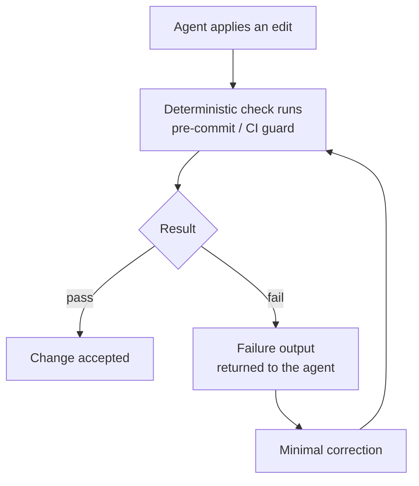

# CI/CD et hooks

*Un hook transforme une bonne pratique en garantie. Sur le terrain, la garantie qui a réellement été construite est le hook git `pre-commit`, et le seul contrôle de méthode réellement passé en CI est une garde statique de décision. Ce chapitre assume les deux, et marque le reste pour ce qu'il est : prescriptif, non éprouvé.*

Un hook est un déclencheur déterministe attaché à un événement du cycle de travail. Il ne demande pas son avis au modèle ; il s'exécute. Ce déterminisme est ce qui rend un hook fiable : une bonne pratique qui dépend du fait que l'agent se souvienne de la faire n'est pas une garantie ; un hook, oui.

Les versions antérieures de ce chapitre décrivaient une famille de hooks attachés au cycle de vie de l'agent : formater après chaque édition, tester avant chaque commit, rappeler le balayage des zones grises. La confrontation au terrain a rendu un verdict net : **aucun de ces hooks d'agent n'a été adopté sur aucun terrain** ; aucun fichier de configuration d'agent du corpus ne porte de clé de hooks. Ce que le terrain a construit à la place est plus simple et plus robuste : le hook git `pre-commit`, câblé par `core.hooksPath`, et une garde statique en CI. Ce chapitre est réécrit autour de ce qui existe.

---

## La voie principale : le hook git `pre-commit`

La seule implémentation de la couche hooks observée sur le terrain est un **hook git `pre-commit` versionné dans le dépôt** et câblé par configuration :

```bash
# hooks/README.md : câblage, une fois par clone
git config core.hooksPath .githooks
```

Le choix du `pre-commit` git plutôt que d'un hook de runtime d'agent a trois vertus, et elles expliquent probablement pourquoi c'est lui qui a survécu au contact du terrain :

- **Il est agnostique de l'outil.** Il s'applique à l'agent, à l'humain, à n'importe quel agent futur : quiconque committe passe dessous. Un hook de runtime ne couvre que le runtime qui le connaît.
- **Il est versionné avec le code.** Le dossier `.githooks/` voyage dans le dépôt ; le hook est relu, amendé et historisé comme tout le reste.
- **Il garde le bon événement.** Le commit est la frontière où un état devient de l'historique. C'est là qu'un interdit doit mordre : pas à chaque édition, où il gêne, ni en CI seulement, où il arrive après coup.

Un `pre-commit` observé enchaîne des **blocs numérotés**, chacun gardant un interdit précis, chacun traçable à la décision qui l'a fondé :

```bash
#!/usr/bin/env bash
# .githooks/pre-commit: illustrative structure, modelled on a field hook
set -euo pipefail

# Bloc 1, doc/schéma : une migration sans mise à jour de la doc canonique bloque.
./hooks/doc-schema-sync.sh

# Bloc 2, garde anti-données-réelles (fondée par une décision datée) :
# aucun fichier stagé ne doit contenir de données de production.
staged="$(git diff --cached --name-only)"
if echo "$staged" | grep -qE '(prod-snapshot|\.dump$|customer-export)'; then
  echo "BLOCKED: real-data artefact staged. Production data never enters git."
  exit 1
fi

echo "pre-commit: OK"
```

Le bloc anti-données-réelles vient d'un produit en binôme multi-dépôts, où il implémente une décision d'architecture : les extraits de production vivent hors de tout dépôt git, et le hook rend l'interdit mécanique ([chapitre 12 · Secrets et PII](../core/12-secrets-and-pii.md)). C'est le patron à copier : **chaque bloc du hook cite la règle qu'il garde, et la règle cite l'incident qui l'a fondée** ([chapitre 01](../core/01-three-pillars.md)).

---

## Le hook de synchronisation doc/schéma

C'est le hook conservé de la première version de la méthode : le seul dont le terrain a repris le principe, en l'adaptant à son périmètre. Il impose la règle structurelle : le **code est la source de vérité du schéma** ([chapitre 02](../core/02-vault-and-sources-of-truth.md)). Une migration qui change le schéma sans mise à jour de la doc canonique dans le même changement produit une documentation qui ment ; le hook rend cela impossible.

Deux modes valides ; choisissez-en un par dépôt :

**Mode 1, contrôle bloquant :**

```bash
#!/usr/bin/env bash
# hooks/doc-schema-sync.sh
# Trigger: pre-commit (via .githooks/), and optionally as a CI check.
set -euo pipefail

MIGRATIONS_GLOB="apps/backend/src/migrations/"
DOCS_DIR="apps/backend/docs/database/"

changed="$(git diff --cached --name-only)"
schema_touched="$(echo "$changed" | grep "^${MIGRATIONS_GLOB}" || true)"
docs_touched="$(echo "$changed"   | grep "^${DOCS_DIR}"        || true)"

if [ -n "$schema_touched" ] && [ -z "$docs_touched" ]; then
  echo "BLOCKED: a migration changed the schema but the canonical"
  echo "data-model docs in ${DOCS_DIR} were not updated."
  exit 1
fi
echo "doc-schema-sync: OK"
```

**Mode 2, régénération automatique :** au lieu d'échouer, le hook régénère la doc canonique depuis le code et la stage. À utiliser quand la doc est entièrement dérivable du schéma.

Statut terrain, consigné honnêtement : l'exemplaire adopté tourne aujourd'hui en **rail préparé**. Le hook est câblé et s'exécute, mais sort en avertissement, pas en blocage, le temps que le périmètre gardé se stabilise. C'est une adoption réelle mais partielle : le rail existe, le train du blocage n'est pas encore passé dessus. Un rail préparé qui reste éternellement non bloquant devient un mensonge de garantie : datez la bascule ou dé-escaladez par écrit ([chapitre 09](../core/09-release-gate-and-registry.md)).

---

## La garde statique de décision : le seul contrôle méthode observé en CI

Un seul contrôle relevant de la méthode (et pas de la simple compilation) a été observé **réellement câblé en CI** sur le terrain : une **garde statique qui implémente une décision du vault**.

Le cas observé, sur un vault d'audit sur la plateforme d'un client : une décision datée interdit une classe d'écritures (toute écriture en base hors du canal sanctionné). Un job de CI exécute un script qui parcourt l'arbre (`grep` outillé, rien de plus) et fait échouer le pipeline si le motif interdit apparaît. Le workflow note lui-même qu'il est appelable à la main depuis le serveur si la CI n'est pas active : la garde survit à son infrastructure.

```yaml
# .ci/pipeline.yml: extract, provider-neutral, illustrative
- name: decision-guard
  run: ./tools/ci/decision-guard.sh    # implements DEC-XXX: no writes outside the sanctioned channel
  blocking: true
```

```bash
#!/usr/bin/env bash
# tools/ci/decision-guard.sh: static guard for a vault decision
set -euo pipefail
violations="$(grep -rnE 'INSERT INTO|UPDATE .+ SET' src/ --include='*.php' \
              | grep -v 'src/sanctioned-channel/' || true)"
if [ -n "$violations" ]; then
  echo "BLOCKED by DEC-XXX: raw writes outside the sanctioned channel:"
  echo "$violations"
  exit 1
fi
echo "decision-guard: OK"
```

Le pattern générique mérite un nom : **la garde statique de décision**. Une décision du vault énonce un interdit ; un script déterministe le vérifie sur l'arbre entier ; la CI le rend bloquant. C'est la forme la plus économique du garde-fou : pas de modèle, pas de jugement, un grep qui cite sa décision. Toute décision formulable en motif textuel est candidate : écritures hors canal, import interdit, secret en clair, chemin de fichier proscrit.

---

## Les contrôles prescriptifs, non éprouvés

La première version de ce chapitre prescrivait d'autres contrôles bloquants. Aucun n'a été observé en CI sur aucun terrain. Ils restent publiés (le raisonnement qui les fonde tient), mais avec leur statut réel :

| Contrôle | Ferait échouer la PR quand... | Statut |
|---|---|---|
| Build / tests / lint | Le projet ne compile pas, un test échoue, l'arbre est incohérent | Standard, éprouvé partout (pas spécifique à la méthode) |
| Garde statique de décision | Un motif interdit par une décision apparaît dans l'arbre | **Éprouvé : une occurrence terrain** |
| Synchro doc/schéma | Une migration change le schéma sans la doc canonique | Adopté en pre-commit, en rail préparé non bloquant |
| Signatures de contrat | Un contrat passe `frozen` sans les deux signatures | **Prescriptif, non éprouvé** |
| Présence du balayage de zones grises | Un écran fusionne sans registre de balayage complété | **Prescriptif, non éprouvé** |
| Banc d'évaluation | Une tâche de référence ou une sonde de garde-fou échoue | **Prescriptif, non éprouvé** ([chapitre 08](../core/08-proof-and-probes.md)) |
| Hooks de cycle agent (format après édition, tests avant commit via runtime) | Sans objet | **Dépréciés comme voie principale** : aucune adoption terrain ; le pre-commit git les remplace |

La ligne de partage est instructive. Ce qui a été adopté partage deux propriétés : **déterministe** (un grep, un diff de chemins, jamais un jugement) et **posé sur une frontière naturelle** (le commit, la PR). Ce qui n'a pas été adopté demandait soit un outillage dédié (le banc d'évaluation), soit une convention que le terrain n'avait pas encore stabilisée (le frontmatter de signature). Si vous adoptez les contrôles prescriptifs, adoptez-les dans cet ordre de coût : garde statique d'abord, signatures ensuite, banc d'évaluation en dernier.

---

## La boucle d'auto-correction

Là où un contrôle déterministe existe, une boucle devient possible : l'agent édite, le contrôle s'exécute, l'échec revient à l'agent avec sa sortie, l'agent applique une correction minimale, le contrôle repasse. La boucle se referme quand le contrôle passe, sans humain dans le cycle interne.



Le siège réel de cette boucle, sur le terrain, est le `pre-commit` : l'agent committe, le hook bloque, la sortie du hook nomme le fichier et l'interdit, l'agent corrige et recommitte. Deux disciplines la gardent saine :

- **La sortie d'échec doit être actionnable.** Un échec utile nomme le fichier, la ligne et l'attente, et la décision qu'il applique. « BLOCKED by DEC-XXX » donne à l'agent la règle à relire, pas seulement le symptôme.
- **La correction doit être minimale.** La boucle corrige l'échec précis, elle ne refactore pas. Un agent qui « améliore » du code en corrigeant un blocage introduit de la dérive ; voir [Protocoles de défaillance](../core/11-failure-protocols.md).

---

## Un exemple de pipeline (neutre, fictif)

La configuration ci-dessous est générique et **fictive** : aucune syntaxe de fournisseur réel. Les étapes éprouvées d'abord, les prescriptives en commentaire assumé :

```yaml
# .ci/pipeline.yml: illustrative, provider-neutral
pipeline:
  triggers:
    - on: pull_request
    - on: push
      branch: main

  stages:
    - name: build
      run: npm ci && npm run build
      blocking: true

    - name: lint
      run: npm run lint
      blocking: true

    - name: test
      run: npm run test
      blocking: true

    - name: decision-guard                  # the one method check proven in CI
      run: ./tools/ci/decision-guard.sh
      blocking: true

    - name: doc-schema-sync                 # adopted at pre-commit; run again here
      run: ./hooks/doc-schema-sync.sh
      blocking: true

    # --- prescriptive, not field-proven; adopt knowingly, in this order ---
    # - name: contract-signatures
    #   run: ./skills/contract-lint/lint.sh
    #   blocking: true
    # - name: eval-harness
    #   run: npm run eval -- --suite golden,conformance,guardrail,regression
    #   blocking: true

    - name: metrics                          # proposed instrument, advisory only
      run: npm run metrics:dashboard
      blocking: false
```

L'étape de métriques renvoie à un [instrument proposé, non éprouvé](./metrics.md) : elle informe, elle ne verrouille jamais.

---

## Ce que la CI ne garde pas : la MEP

Un pipeline vert n'est pas un go. La frontière la plus importante du cycle (la mise en production) n'est gardée par aucun hook et par aucune CI : elle est gardée par un **go humain explicite au tour courant**, consigné dans le registre des MEP. C'est un choix de conception, pas un manque : automatiser cette gate-là reviendrait à déduire l'autorisation de la validation, ce que la méthode interdit précisément. Voir [chapitre 09 · La gate de MEP et le registre](../core/09-release-gate-and-registry.md).

---

## Voir aussi

- [Chapitre 02 · Le vault et les sources de vérité](../core/02-vault-and-sources-of-truth.md)
- [Chapitre 08 · La preuve et les sondes](../core/08-proof-and-probes.md)
- [Chapitre 09 · La gate de MEP et le registre](../core/09-release-gate-and-registry.md)
- [Chapitre 12 · Secrets et PII](../core/12-secrets-and-pii.md)
- [Référence · Métriques](./metrics.md)
