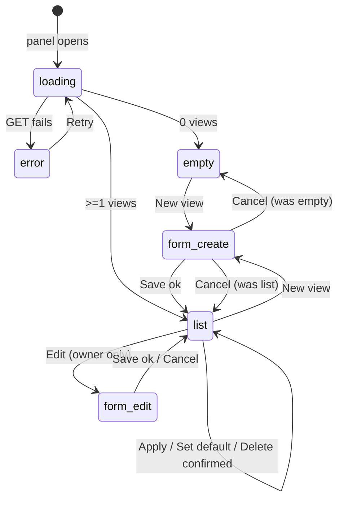

# Contract · `saved-views-panel`

> Step 3 of the delivery chain. The validated prototype becomes a signable
> **contract**: it adds to the pixels everything they cannot show. Endpoints,
> permissions, error states, transitions, rules, test data. Two signatures,
> product and engineering. Without both, it is not frozen. This contract is
> frozen and is the source of truth for the `saved-views-panel` build.

---

## 1. Context and persona

The Saved Views panel lives in the toolbar of a generic data-table screen. It
lets a workspace member save a named combination of **filters + sort + visible
columns**, recall it in one click, mark one as their default, and keep it
private or share it with their workspace.

- **Primary persona:** a workspace member who works the same table daily and
  reconfigures it the same handful of ways.
- **Secondary persona:** a teammate who applies a colleague's shared view but
  does not own it.
- **Concept note:** [`00-vault-entry.md`](./00-vault-entry.md) (`CON-saved-views`).

## 2. Visual source of truth

The validated prototype produced by
[`01-prototype-prompt.md`](./01-prototype-prompt.md) is the visual source of
truth. For anything that is *seen* (layout, copy, spacing, states), the
prototype wins over this contract and over the code.

The validated prototype is archived under
`vault/design-system/prototypes/saved-views-panel/` and was generated from
[`01-prototype-prompt.md`](./01-prototype-prompt.md).

## 3. Architecture: fixed vs conditional zones

| Zone | Type | Description |
|---|---|---|
| Toolbar "Views" button | Fixed | Always present; opens/closes the panel. |
| Panel header | Fixed | Title "Saved views" + "New view" button, always shown when the panel is open. |
| Panel body | Conditional | Shows exactly one of: loading / empty / error / list / create-edit form. |
| View row | Conditional | Rendered once per visible view in the list state. |
| "Default" badge | Conditional | Shown only on the calling user's default view (DEC-007). |
| "Shared" badge | Conditional | Shown only on workspace-shared views (DEC-011). |
| 3-dot menu | Conditional | Action set depends on ownership (see §8). |

## 4. States and transitions

States of the panel body:

| State | Entered when | Shows |
|---|---|---|
| `loading` | Panel opens; `GET /v1/saved-views` in flight | 3 skeleton rows |
| `error` | `GET /v1/saved-views` fails | "Could not load saved views." + "Retry" |
| `empty` | List loaded, zero views | "No saved views yet" + "New view" |
| `list` | List loaded, one or more views | One row per view |
| `form-create` | "New view" clicked | Create form (§5) |
| `form-edit` | "Edit" clicked on an owned view | Edit form, pre-filled (§5) |

Transitions:



**First-load behaviour (DEC-007):** when the screen opens, the user's default
view is applied to the table automatically if they have one; otherwise no view
is applied and the raw table is shown.

## 5. Components and exact copy

All copy below is frozen. Use it verbatim; do not invent strings.

| Component | Copy / spec |
|---|---|
| Toolbar button | `Views` |
| Panel title | `Saved views` (16px, weight 600) |
| Primary button | `New view` |
| View row name | The view's `name`; truncate with ellipsis past 320px panel width |
| Default badge | `DEFAULT` (11px, uppercase) |
| Shared badge | `SHARED` (11px) |
| 3-dot menu items | `Apply`, `Set as default`, `Edit`, `Delete` (subject to §8) |
| Empty state | `No saved views yet` |
| Error state | `Could not load saved views.` + link `Retry` |
| Loading state | 3 skeleton rows |
| Form · Name field | Label `Name`, text input, `maxlength=60`, required |
| Form · visibility | Radio pair: `Private` (pre-selected, DEC-011) / `Shared with workspace` |
| Form · buttons | `Cancel`, `Save` |
| Form · name blank error | `Enter a name.` |
| Form · duplicate name error | `A view with this name already exists.` |
| Delete confirmation | Inline prompt `Delete this view?` + `Confirm` / `Cancel` |

Layout values (frozen): panel width 320px; row height 44px; padding 12px;
separator 1px; panel radius 8px; input/button radius 4px; badge 11px text,
2px/6px padding, 4px radius. Spacing on the 4px scale only.

## 6. Endpoints

Base URL: `https://api.example.com`. Auth: every request carries
`Authorization: Bearer <API_TOKEN>`. Full machine-readable spec:
[`04-api-spec.yaml`](./04-api-spec.yaml). Schemas and mocks:
[`05-mocks/`](./05-mocks/).

### 6.1 `GET /v1/saved-views` · list visible views

- **Request:** no body.
- **Response 200:** `SavedViewList` (`{ items: SavedView[], total: number }`).
  Returns the caller's private views plus all workspace-shared views, sorted
  by `name` ascending. `is_default` is resolved for the calling user (DEC-007).
- **Response 401:** `Error` with `code: "unauthorized"`.

### 6.2 `POST /v1/saved-views` · create a view

- **Request body:** `SavedViewCreate`:
  ```json
  {
    "name": "Open items this week",
    "visibility": "private",
    "config": {
      "filters": [{ "column": "status", "operator": "eq", "value": "open" }],
      "sort": { "column": "updated_at", "direction": "desc" },
      "visible_columns": ["name", "status", "owner", "updated_at"]
    }
  }
  ```
  `visibility` is optional; omitted means `private` (DEC-011). A created view
  is never `is_default: true`.
- **Response 201:** `SavedView`.
- **Response 400:** `Error` with `code: "validation_failed"`: blank name,
  name over 60 chars, or a name that duplicates one of the caller's views.
- **Response 401:** `Error` with `code: "unauthorized"`.

### 6.3 `GET /v1/saved-views/{id}` · read one view

- **Response 200:** `SavedView`.
- **Response 404:** `Error` with `code: "not_found"`: id unknown or not
  visible to the caller.

### 6.4 `PATCH /v1/saved-views/{id}` · update name / config / visibility

- **Request body:** `SavedViewCreate`. The `is_default` field is not accepted
  here; use §6.6.
- **Response 200:** `SavedView`.
- **Response 400:** `Error` `validation_failed`.
- **Response 403:** `Error` `forbidden`: caller is not the owner (DEC-011).
- **Response 404:** `Error` `not_found`.

### 6.5 `DELETE /v1/saved-views/{id}` · delete a view

- **Response 204:** no body.
- **Response 403:** `Error` `forbidden`: caller is not the owner.
- **Response 404:** `Error` `not_found`.

### 6.6 `POST /v1/saved-views/{id}/default` · set as caller's default

- **Request:** no body.
- **Response 200:** `SavedView` with `is_default: true`. Per DEC-007 this is a
  per-user action; the caller's previous default is unset automatically. A
  caller may set a shared view they do not own as their default.
- **Response 404:** `Error` `not_found`.

### 6.7 Return-code summary

| Code | Meaning | `Error.code` |
|---|---|---|
| 200 / 201 / 204 | Success | none |
| 400 | Validation failed | `validation_failed` |
| 401 | Missing/invalid auth | `unauthorized` |
| 403 | Not the owner | `forbidden` |
| 404 | Not found / not visible | `not_found` |

## 7. Edge cases

| # | Case | Required behaviour |
|---|---|---|
| 1 | Delete pressed | Show inline `Delete this view?` confirmation; only `Confirm` sends `DELETE`. |
| 2 | Deleting the calling user's default view | After 204, that user has no default; next open shows the raw table (DEC-007). |
| 3 | Non-owner opens a shared view's menu | Menu shows only `Apply` and `Set as default`; no `Edit`/`Delete` (DEC-011). |
| 4 | Duplicate name on create/edit | Server returns 400 `validation_failed`; form shows `A view with this name already exists.` |
| 5 | Blank name submitted | Client-side block + message `Enter a name.`; no request sent. |
| 6 | `GET` list fails | `error` state with `Retry`; `Retry` re-issues `GET` and returns to `loading`. |
| 7 | Applying a view whose columns no longer exist | Unknown column keys are ignored; known filters/sort/columns still apply. |
| 8 | Long view name | Truncate with ellipsis in the row; full name shown in the edit form. |
| 9 | Concurrent edit (view changed by owner elsewhere) | `PATCH` uses last-write-wins; no conflict dialog in v1.0. |

## 8. Permissions

| Action | Owner | Non-owner (shared view) | Non-owner (private view) |
|---|---|---|---|
| See the view in the list | Yes | Yes | No |
| Apply the view | Yes | Yes | No |
| Set as own default | Yes | Yes | No |
| Edit (name/config/visibility) | Yes | No (403) | No (404) |
| Delete | Yes | No (403) | No (404) |

A private view is invisible to non-owners, so a non-owner request against one
returns `404`, not `403`: its existence is not disclosed.

## 9. Business rules

1. **Unique names per user.** A view's `name` is unique within its owner's
   views, case-insensitive. A duplicate is rejected with `validation_failed`.
   (Grey-zone scan row 5.)
2. **Name length.** 1-60 characters after trimming whitespace.
3. **Private by default.** A created view is `private` unless `visibility` is
   explicitly `workspace` (DEC-011).
4. **Per-user default.** At most one default view per user. Setting a new one
   unsets the previous (DEC-007).
5. **Default on delete.** Deleting the default view clears that user's
   default; it does not promote another view. (Grey-zone scan row 7.)
6. **Read-only sharing.** Only the owner edits, deletes, or changes the
   visibility of a view (DEC-011).
7. **Filters combine with AND.** `config.filters` clauses are all applied
   together.

## 10. Test data

Two fixture views for development and acceptance, both consistent with
[`05-mocks/`](./05-mocks/):

```json
[
  {
    "id": "11111111-1111-4111-8111-111111111111",
    "name": "Open items this week",
    "visibility": "private",
    "is_default": true,
    "owner_id": "aaaaaaaa-aaaa-4aaa-8aaa-aaaaaaaaaaaa",
    "config": {
      "filters": [{ "column": "status", "operator": "eq", "value": "open" }],
      "sort": { "column": "updated_at", "direction": "desc" },
      "visible_columns": ["name", "status", "owner", "updated_at"]
    },
    "created_at": "2026-05-12T08:00:00Z",
    "updated_at": "2026-05-12T08:00:00Z"
  },
  {
    "id": "22222222-2222-4222-8222-222222222222",
    "name": "Team backlog",
    "visibility": "workspace",
    "is_default": false,
    "owner_id": "bbbbbbbb-bbbb-4bbb-8bbb-bbbbbbbbbbbb",
    "config": {
      "filters": [{ "column": "priority", "operator": "gt", "value": "2" }],
      "sort": { "column": "priority", "direction": "asc" },
      "visible_columns": ["name", "priority", "owner"]
    },
    "created_at": "2026-05-13T10:30:00Z",
    "updated_at": "2026-05-13T10:30:00Z"
  }
]
```

- View 1 is owned by user `aaaa…` and is that user's default.
- View 2 is workspace-shared and owned by user `bbbb…`; for user `aaaa…` it is
  applyable but read-only.
- Token placeholder for all calls: `<API_TOKEN>`.

## 11. Acceptance criteria

- [x] The "Views" toolbar button opens and closes the 320px panel.
- [x] All five body states render: loading, error, empty, list, form.
- [x] A view row is a single 44px line with 1px separators, name, badges, menu.
- [x] `DEFAULT` badge appears only on the calling user's default view.
- [x] `SHARED` badge appears only on workspace-shared views.
- [x] Create form defaults visibility to `Private` (DEC-011).
- [x] Blank name is blocked client-side with `Enter a name.`
- [x] Duplicate name returns 400 and shows the duplicate-name message.
- [x] Delete shows the inline `Delete this view?` confirmation before sending.
- [x] On open, the user's default view is applied; otherwise the raw table
      shows (DEC-007).
- [x] Non-owners of a shared view see only `Apply` and `Set as default`.
- [x] `PATCH`/`DELETE` by a non-owner return 403; private views return 404.
- [x] All six endpoints in §6 are consumed; all return codes in §6.7 handled.
- [x] Layout matches the prototype at 360px, 768px and 1280px.

## 12. Signatures

- [x] **Product**: signed 2026-05-18. Copy, states, and visibility model
      reviewed against the concept note and DEC-007 / DEC-011.
- [x] **Engineering**: signed 2026-05-18. Endpoints, permissions, and the
      per-user default model reviewed as feasible against the frozen API spec.

Both signatures present: this contract is **frozen** as of `2026-05-18`.

## See also

- Concept: [`00-vault-entry.md`](./00-vault-entry.md)
- Grey-zone scan: [`02-grey-zone-scan.md`](./02-grey-zone-scan.md)
- API spec: [`04-api-spec.yaml`](./04-api-spec.yaml)
- Definition of done: [`07-definition-of-done.md`](./07-definition-of-done.md)
