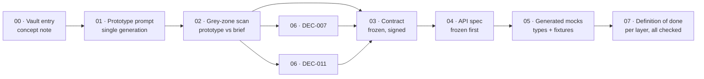

# Walkthrough — "Saved Views", end to end

This directory follows one fictional feature through the **whole Mainstay
delivery chain**, from a concept note in the vault to a fully checked
definition of done. Every artifact is real, runnable, and consistent with
every other: the same endpoints, the same field names, the same decision IDs,
the same screen id `saved-views-panel`.

Read it in order. Each step is a real artifact *and* a lesson.

## The feature

**Saved Views** on a generic data-table screen. A user saves a named
combination of filters + sort + visible columns, can mark one as their
default, and can keep a view private or share it with their workspace.

## The chain



## The story, step by step

### [`00-vault-entry.md`](./00-vault-entry.md) — the vault entry

Before a single pixel exists, the vault already holds a **concept note** for
Saved Views. It says *what the feature is and why it matters* — never how it
looks or how it is built. It deliberately leaves behavioural questions open.
**Teaches:** the delivery chain starts from a populated vault; a concept note
is intent, not specification.

### [`01-prototype-prompt.md`](./01-prototype-prompt.md) — the prototype prompt

One prompt produces the whole prototype in a **single generation**. The prompt
is itself a contract: context, passes, numeric specs, design-system recall,
explicit prohibitions, a self-check checklist. **Teaches:** the prompt anatomy,
and why the iteration count measures the brief's quality, not the agent's.

### [`02-grey-zone-scan.md`](./02-grey-zone-scan.md) — the grey-zone scan

The validated prototype is compared to the brief, item by item. Eight grey
zones surface — choices the agent made because nothing told it what to do.
Each gets exactly one of two outcomes: a formal decision or a contract note.
**Teaches:** the heart of the method — systematic detection, never "decide
later". Rows 1–4 here produce **DEC-007** and **DEC-011**.

### [`03-contract.md`](./03-contract.md) — the contract

The validated prototype becomes a **frozen, signed contract**: all 12 sections
filled, both signatures present. It adds to the pixels everything they cannot
show — endpoints, permissions, edge cases, business rules, test data,
acceptance criteria. **Teaches:** what a complete contract contains, and why
double signature kills the "looked fine, infeasible later" trap.

### [`04-api-spec.yaml`](./04-api-spec.yaml) — the API spec

The OpenAPI 3 spec for the six endpoints is **frozen first**, before any
implementation. It becomes the shared technical source of truth. **Teaches:**
contract-first — freeze the interface so front and back can build in parallel.

### [`05-mocks/`](./05-mocks/) — the generated mocks

[`tools/spec-to-mocks`](../../tools/spec-to-mocks/) reads the frozen spec and
emits TypeScript types, a typed endpoints list, and JSON fixtures. The front
builds against these without waiting for the back. **Teaches:** how the front
starts on day one — generated, never hand-maintained.

### [`06-decision-DEC-007.md`](./06-decision-DEC-007.md) and [`06-decision-DEC-011.md`](./06-decision-DEC-011.md) — the decisions

The two grey zones that needed formal decisions become **dated, justified
decision records** in the vault: DEC-007 (default view is per-user) and
DEC-011 (private by default, read-only when shared). **Teaches:** a grey zone
with cross-cutting stakes becomes a reusable rule, not a buried comment.

### [`07-definition-of-done.md`](./07-definition-of-done.md) — the definition of done

The per-layer DoD: contract done, back done, front done — every item a
specific, checked criterion for this feature. **Teaches:** "almost done" does
not exist; *done* is every criterion verified, and the cycle closes by
returning the decisions to the vault.

## Consistency map

These facts are identical across every artifact above — that is the point:

| Fact | Value |
|---|---|
| Screen id | `saved-views-panel` |
| Decisions | `DEC-007`, `DEC-011` |
| Base URL | `https://api.example.com` |
| Endpoints | `GET/POST /v1/saved-views`, `GET/PATCH/DELETE /v1/saved-views/{id}`, `POST /v1/saved-views/{id}/default` |
| Schemas | `SavedView`, `SavedViewCreate`, `SavedViewList`, `Error` (+ `ViewConfig`, `FilterClause`, `SortClause`) |
| Contract frozen | `2026-05-18` (after both decisions: 2026-05-14, 2026-05-15) |

## Reproduce the mocks

```sh
cd tools/spec-to-mocks && npm install
node generate.mjs --spec ../../examples/walkthrough/04-api-spec.yaml \
                  --out  ../../examples/walkthrough/05-mocks
```
